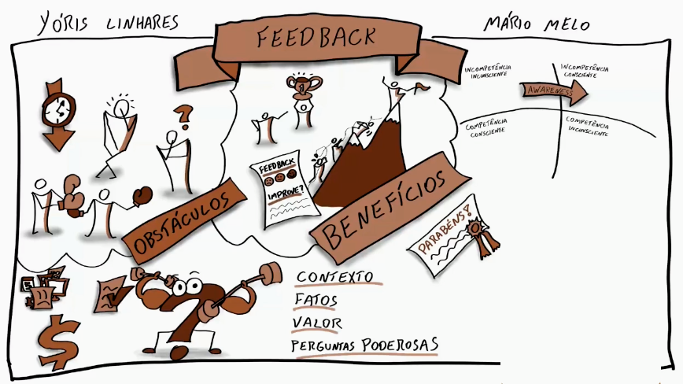

# Agilidade

- [Agilidade](#agilidade)
  - [Origem e Por Que Usar?](#origem-e-por-que-usar)
  - [Agilidade para Além do TI](#agilidade-para-além-do-ti)
    - [SCRUM](#scrum)
  - [Método Waterfall](#método-waterfall)
  - [Priorização, Fluxo e Feedback](#priorização-fluxo-e-feedback)
  - [Manifesto Ágil](#manifesto-ágil)
  - [Gestão Tradicional](#gestão-tradicional)
  - [Conceito VUCA e Motivação](#conceito-vuca-e-motivação)
  - [Liderança e Delegação](#liderança-e-delegação)
    - [Delegation Poker](#delegation-poker)
  - [Feedback na Gestão Ágil e Conhecimento](#feedback-na-gestão-ágil-e-conhecimento)
    - [Melhorias](#melhorias)
  - [Identificando Complexidade](#identificando-complexidade)
    - [CYNEFIN](#cynefin)
  - [Estrutura Organizacional](#estrutura-organizacional)
    - [Raio-X de uma Empresa Ágil](#raio-x-de-uma-empresa-ágil)
  - [Equipe Ágil](#equipe-ágil)
    - [Auto Organização](#auto-organização)
  - [Tipos de Equipe](#tipos-de-equipe)
  - [Scrum Team](#scrum-team)
    - [Project Owner](#project-owner)
    - [Development Team](#development-team)
    - [Scrum Master](#scrum-master)
  - [Times Kanban](#times-kanban)

## Origem e Por Que Usar?

Surgiu da necessidade de se adaptar de forma rápida as constantes mudanças que ocorrem durante o processo de desenvolvimento. Não se pode dizer ao cliente que algo só irá ser implementado ou discutido um ano após a mudança ocorrer.

Ele se opõem ao método Waterfall (que é composto por elementos sequenciais, ou seja, o fluxo do projeto proposto inicialmente não deve ser alterado conforme as fases avançam) já permite mudanças de acordo com as necessidades do projeto.

O Business Agility se refere à capacidade de uma organização se adaptar de maneira ágil e eficaz às mudanças do mercado, às necessidades dos clientes e às evoluções tecnológicas. 

A complexidade e dinamismo do mercado moderno torna necessário que as empresas sejam mais ágeis. A capacidade de agilidade da empresa influência diretamente na sua capacidade de responder as mudanças do mercado e, consequentemente, na sua entrega de valor.

A partir do momento em que é construído esse diferencial competitivo de "resposta a mudanças", a empresa tem a possibilidade de se adaptar a qualquer nova estratégia que surgir. Esse diferencial competitivo passa a ser fundamental para o sucesso da organização.

A entrega contínua de valor é essencial para a agilidade e está diretamente conectada a três grupos importantes para o sucesso da empresa:

- Valor para cliente;
- Valor para colaboradores e colaboradoras;
- Valor para parceiros e parceiras da empresa.

## Agilidade para Além do TI

Agilidade → entregar valor continuamente, antecipando mudanças e se adaptando. Reduzir os custos de mudanças e incertezas. 

De maneira geral, a agilidade é uma abordagem flexível, colaborativa e orientada a resultados. Envolve:

- Ciclos rápidos ↓
  - A agilidade valoriza a realização de ciclos de trabalho curtos e rápidos, nos quais as tarefas são completadas em intervalos regulares.
- Feedback constante ↓
  - Essa é uma das características fundamentais da abordagem ágil. Isso permite que as equipes obtenham informações regulares sobre o trabalho realizado, possibilitando ajustes rápidos e alinhados às expectativas de clientes.
- Ciclos iterativos ↓
  - A abordagem ágil é caracterizada por ciclos iterativos nos quais o trabalho é repetido e refinado ao longo do tempo. Cada iteração leva a melhorias incrementais e ajuda a equipe a se adaptar às necessidades em constante evolução do projeto.

O foco do business agility é sempre na geração de valor. 

Empresas ágeis essencialmente começam a buscar uma diferente forma de se organizar, descobrindo qual é a sua menor unidade de valor para o negócio e começando a formar times em volta dessas menores unidades. 

Consequentemente, esses times passam a ter um comprometimento, uma preocupação e a organizar suas atividades com foco realmente na geração de valor.

### SCRUM

* Planning → Entrega de valor constante, contextos complexos.
* Process → Equipe multidisciplinar, auto-organização.
* Review → Cerimônias, papéis

É preciso analisar informações, reconhecer e valorizar a organização.

Análise de problemas e contextos:

  - Contexto externo
    - Mercado
    - Mudanças globais
  - Contexto interno
    - Feedback de clientes
    - Relação entre colaboradores

Importante investir em uma comunicação transparente com toda a companhia.

É possível que os problemas se encaixem em uma das seguintes categorias:

- Problemas simples → Com retorno de conhecimento prévio, solução assertiva e linear
  - Não pedem frameworks ágeis
- Problemas complexos → Com diversos retornos possíveis, sem se saber ao certo qual seria o melhor/de maior valor
  - Pedem frameworks ágeis
  - Cultura de experimentação

Análise de frequência de tomada de decisão:

- Se há maior frequência significa que os produtos, processos ou serviços perdem valor rapidamente
- Se há menor frequência significa que o produto ou serviço consegue produzir valor em um período de tempo muito maior

Análise da estrutura organizacional:

- Se existe hierarquia ↓
  - Não é eliminatório, mas significa que é necessário investir em estratégias diferentes que estimulem a interação entre os colaboradores
- Se existe silos ↓
  - Estruturado em departamentos, demarcação bem limitada. Fator limitante, limita a interação e atrapalha o método  

É necessário seguir os seguintes passos:

- Estudar e conhecer frameworks
- Estimular interação
- Dissolver silos

A partir disso é possível começar a implementação com:

- Metas compartilhadas
- Pensar em soluções cada um dentro da sua área de conhecimento
- Consolidar processos em conjunto

Com todo esse processo finalizado, se pode, finalmente, montar um time que irá cuidar de um processo completo, do início ou fim.

Dentro do SCRUM também existem algumas reuniões, nas quais:

- Retrospectiva ↓
  - Análise de melhorias necessárias
    - Equipe
    - Comunicação
    - Processos
    - Ferramentas...
- Planejamento ↓
  - Demandas prioritárias são divididas entre o time
- Sprint ↓
  - Período para trabalhar as demandas estabelecidas
- Review ↓
  - Apresentação das entregas de valores realizadas

## Método Waterfall

Começa com os requisitos, a análise dos mesmos e a tomada de uma decisão imutável. Há a demora no feedback, o que faz com que o tempo de reação para resolver os problemas seja tardio.

Há a demora para compreender o erro cometido e a demora para aprender a não cometê-lo novamente. 

O método Waterfall prioriza etapas, um fluxo linear sem espaço para mudanças, quando isso é alinhado com o feedback tardio e as grandes expectativas, a probabilidade de frustrações é maior.

Ele favorece os problemas de comunicação (o famoso telefone sem fio), com necessidade de muitos documentos e protocolos, muitos hand-offs entre os times e, com isso, a validação de tudo aquilo que foi construído durante o processo de desenvolvimento de um projeto só acontece no final.

## Priorização, Fluxo e Feedback

No meio de tantas mudanças e tantas demandas é necessário priorizar um processo para que a entrega de valor seja mais ágil. A priorização vem da análise do que é mais importante ou urgente dentro do contexto de gestão e desenvolvimento.

Essa prática envolve a definição da sequência em que as tarefas, funcionalidades ou requisitos serão abordados ao longo do ciclo de desenvolvimento. 

A priorização desempenha um papel vital ao assegurar que os esforços se concentrem nas áreas mais significativas e benéficas do projeto, otimizando assim o valor proporcionado aos clientes.

Para facilitar a visualização das tarefas, dar clareza para os processos de decisão e facilitar a estruturação de uma cadeia de priorização eficiente, foram cridas matrizes de priorização.

Uma delas é a Matriz de Eisenhower.

**Matriz de Eisenhower ↓**

As tarefas devem ser divididas em 2 eixos, de importância e urgência, e distribuídas em quadrantes, de valores de 1 a 4 baseado em sua prioridade.

Cada quadrante corresponde em:

- **Crises →** De muita importância e muita urgência  
  - não há tempo a perder, coloque no topo das suas tarefas
- **Metas e Planejamentos →**  De muita importância, mas pouca urgência  
  - programe-se para fazer, e tente reservar um tempo para isso
- **Interrupções →** De pouca importância, mas muita urgência 
  - delegue ou faça apenas o que não for atrapalhar seu trabalho
- **Distrações →** De pouca importância e pouca urgência
  - ignore

A priorização muda o fluxo do trabalho. O desenvolvimento é concentrado na análise e entrega de valor de uma etapa por vez, vindo de maior prioridade para baixo.

Ao invés do fluxo ser linear com uma entrega total no final do processo, segue pelas funcionalidades do que é mais importante para que possa manter uma entrega mais constante, eficiente e que atenda as necessidades mais urgentes.

Delinear um fluxo de tarefas contribui para a entrega incremental e iterativa de valor aos clientes.

Por causa priorização e do fluxo ágil, a entrega de valor é mais constante e gera feedbacks de maior frequência. O feedback entra mais cedo no processo, e pode mudar completamente o planejamento inicial.

Com feedback se há a possível mudança de prioridades, o que afeta o fluxo e, quando há um novo feedback, o ciclo recomeça. 

## Manifesto Ágil

O Manifesto foi escrito em 2001, por 17 pessoas com um vasto conhecimento na área de desenvolvimento de software. 

Eles observaram que existia uma interseção entre as coisas que praticavam. Alguns dos métodos e frameworks utilizados na Agilidade já existiam antes de o Manifesto Ágil ser escrito, como o SCRUM.

O Manifesto Ágil consiste em quatro valores principais e doze princípios que resumem a essência da mentalidade ágil. O manifesto se tornou um guia fundamental para equipes que buscam adotar práticas ágeis em seus projetos. E continua sendo um guia para equipes que desejam implementar o ágil em seus trabalhos.

Valores ↓

1. Indivíduos e interações sobre processos e ferramentas
2. Software em funcionamento sobre documentação compreensível
3. Colaboração com os clientes sobre negociação de contrato
4. Responder às mudanças sobre seguir um plano fixo

Princípios ↓

## Gestão Tradicional

É um trabalho simples e especializado. Dividido entre pensadores e executores. Um trabalho mecânico, com estrutura de linha de produção.

O feedback chega de forma tardia e somente o pensador o recebe, os executores só recebem ordens. Além disso, as recompensações e punições também são individualizadas, causando insatisfação e possíveis conflitos.

A falta de autonomia e engajamento dentro desse tipo de gestão também diminui a motivação dos colaboradores.

A gestão 3.0 é personalizada para as necessidades dos colaboradores e projetos. Se compreende que o individuo tem conhecimentos, competências, curvas e ideias próprias, tudo deve ser respeitado para alcançar o máximo de seu potencial.

A liderança situacional surgem nas situações onde algum colaborador possui maior experiência ou competência em algo e "toma" a frente para guiar os outros colaboradores no projeto.

## Conceito VUCA e Motivação

Desde a era do artesanato (1850-1900), passando pela era da indústria (1900-1970/80), até a era atual, caracterizada como um ambiente VUCA, onde o mercado tornou-se altamente dinâmico e interconectado. 

O mundo de hoje é:

- Volátil
	- algo é dado como certo hoje pode não ser mais certo amanhã
- Incerto
	- temos muitas dúvidas sobre como resolver os problemas
- Complexo
	- a solução para os problemas não são lineares
- Ambíguo
	- soluções que funcionam em um contexto não funcionam em outro similar

Com mudanças repentinas e um futuro sempre incerto, as conexões e negócios se tornam cada vez mais complexos, com situações e resoluções ambíguas.

Os negócios tradicionais, como jornais impressos e locadoras de filmes, foram afetados drasticamente por esse novo contexto, com empresas como Google, Facebook e Amazon emergindo como principais concorrentes. 

É necessário manter práticas emergentes onde se tem: contexto no qual surge um problema, e as pessoas dentro deste contexto estruturam soluções emergentes. Não há receita ou figura exterior que traz a solução.

Quanto mais cedo e rápido se tem o feedback, com mais agilidade se pode resolver possíveis problemas e contornar situações.

Muito da motivação é perdido em meio a falta de confiança, quanto mais etapas ficam no meio da realização das tarefas pelo colaborador por causa de burocracias, menos ele se sente motivado.

Motivação se mantêm com 3 pilares, todos ligados a confiança:

- Autonomia
	- posso fazer as coisas da maneira que eu acredito ser a melhor
- Propósito
	- tudo o que eu faço tem um propósito final claro pra mim e que eu concorde
- Maestria
	- empresa dá espaço pra que eu me torne melhor naquilo que gosto de fazer

Altos níveis de confiança e autonomia são a base de gestões ágeis e de uma equipe motivada. Quando o executor também é pensador, se torna necessário o acesso as informações para que possa estruturar decisões bem fundamentadas.

Colaboradores privados não conseguem criar soluções emergentes. Transparência é a base de uma gestão ágil.

## Liderança e Delegação

Na gestão ágil se entende que a liderança é emergente e situacional. Ela surgente ante a uma situação onde uma pessoa com certa experiência ou conhecimento recebe a confiança e autonomia para lidar com um problema.

Quando temos mais de uma pessoa que possa desempenhar esse papel, surge então a colaboração, o que torna uma liderança desnecessária, por isso a mesma é considerada emergente, algo que surgi da necessidade, mas não é constante, e situacional, que depende de um contexto específico.

Cada projeto possui um contexto e necessidade diferente, tornando a liderança algo trocado sempre que preciso, de acordo com o que a equipe necessita.

A liderança emergente e situacional permite que qualquer pessoa da equipe assuma um papel de liderança, dependendo do contexto e das necessidades específicas do momento.

Esta forma de gestão permite uma maior diversidade de abordagens para resolver problemas e também favorece a motivação do indivíduo.

Em uma gestão tradicional (hierárquica) as pessoas que estão em um nível hierárquico superior elas tendem a ter bastante informações, mas é abstrato, uma visão do todo. Enquanto os executores tem uma visão limitada, mas informações precisas, específicas.

### Delegation Poker

Na gestão 3.0 se estabelece 7 níveis de delegação para a tomada de decisões dentro de uma organização, sendo o uso de cada nível dependente da situação. Esses níveis são chamados de **Delegation Poker**.

O Delegation Poker é uma ferramenta do Management 3.0 que nos auxilia a mapear como uma decisão é tomada em determinada circunstância na empresa.

<!--  -->

É interessante organizar e apresentar esses níveis em uma tabela, chamada de **Delegation Board**. Essa tabela possibilita a visão e acompanhamento do nível de delegação de cada tarefa, em cada situação. Dessa forma, é mais fácil entender o que funciona melhor e quando.

## Feedback na Gestão Ágil e Conhecimento

Após uma tomada de decisão é necessário o compartilhamento do feedback da situação: tudo que deu certo, tudo que deu errado, o que poderia ser melhor, a resolução e as consequências.

O feedback é importante para manter o funcionamento sempre aprimorado e motivar os envolvidos. Todo o feedback deve ser acompanhado de um retorno, para maximizar sua implementação.

Além disso, é necessário que a comunicação seja respeitosa e agregadora.

Uma das coisas que o feedback proporciona é uma geração de conhecimento dentro da empresa, o conhecimento é o maior valor que as empresas tem hoje. É o que se vende e o que se compra no mercado moderno.

Esse conhecimento pode ser dividido em categorias, como conhecimento específico de um determinado segmento, conhecimento sobre ferramentas e processos da empresa, e as habilidades interpessoais, como as pessoas se relacionam umas com as outras, dentro e fora da empresa.

Na gestão tradicional, com especialistas, há a tendência de gerar silos de conhecimento. Se tem algumas pessoas que dominam determinado assunto e outras pessoas que dominam outro tipo de assunto. Se uma delas é perdida, acaba gerando um buraco de conhecimento que a pessoa que domina outro assunto não consegue suprir.

Por isso a gestão ágil prefere um trabalho menos individualizado e mais dividido por equipes, ter pessoas mais generalistas e menos especialistas, ajuda também a proporcionar o crescimento do conhecimento dentro da empresa.

O profissional moderno trabalha dentro de um perfil T. Ele tem algumas habilidades principais e algumas habilidades acessório, que ele conhece, domina, mas não tanto. É possível traçar e sobrepor esse  com o de outras pessoas e, caso exista a interseção do conhecimento, se consegue favorecer a colaboração, também aumentando o conhecimento das pessoas nessas áreas acessório.

Quando os profissionais tem esse perfil T mais horizontal, eles já dominam outras habilidades além da principal, fica um pouco mais fácil de se disseminar o conhecimento, de existir colaboração. Aumenta um pouco a zona de interseção onde as pessoas podem atuar juntas. E o feedback é uma ótima forma de ampliar um pouco esse perfil T dos colaboradores.

### Melhorias

As melhorias existem. Podem ser aplicadas de 3 formas diferentes ↓

Um princípio fundamental para que o kaizen ocorra, essa melhoria contínua, é a transparência. Outro ponto fundamental é que para termos continuidade nas mudanças, elas precisam ser pequenas.

A ideia do kaizen é a melhoria contínua, e para ser contínua, as mudanças tem que ocorrer em doses homeopáticas. O que acontece quando trabalhamos com mudanças e aprimoramentos no nosso trabalho é que precisamos ter um certo ritmo. A intensidade dessa mudança, do trabalho executado precisa ser saudável. 

Quando não temos melhorias acontecendo no trabalho, o que acontece é que ficamos desmotivados. No ambiente onde tudo continua sempre igual as pessoas ficam desmotivadas. Um ambiente onde tudo muda o tempo todo, e muda bruscamente, é um ambiente de muito estresse.

Temos que ficar no ponto intermediário, onde existem desafios, melhorias, mas que são alcançáveis. Se conseguimos ficar nesse nível intermediário, conseguimos manter um nível de motivação ideal para que as melhorias aconteçam de forma natural.

O aprendizado está muito relacionado com falhas, tentativas. Eu tento fazer algo. Se deu certo, aprendi, se deu errado também aprendo alguma coisa. Se eu sou punido ao errar, deixo de experimentar e não aprendemos.

O processo de aprendizado através de erros, práticas e experimentos:
- Erros são conhecidos por não funcionar.
- Práticas tradicionais podem falhar e revelar aprendizados.
- Experimentos seguros maximizam aprendizado e melhorias.

Há muito do que se aprender com os erros e práticas, mas é necessário incentivar a experimentação para alcançar aprendizados além do esperado.

## Identificando Complexidade

Antes de implementar uma empresa ágil é preciso identificar se o nível de complexidade, de incerteza no negócio realmente justifica um investimento em business agility. Há muitas formas de fazer essa avaliação, uma delas é avaliar o tipo de informação com que se trabalha.

A pergunta que fica que é determinante para identificar o nível de complexidade é: **o quão perecível é a informação?**

Ela é uma informação que mantêm seu valor por um período curto ou longo? Ela deixa de ser verdadeira ou é substituída em um curto período de tempo ou é estável? Em que contexto essa informação se encaixa?

Quanto mais volátil, mais complexo é o negócio. Níveis altos de complexidade clamam pelo modelo de business agility. 

Outra forma de avaliação é descobrir se o trabalho é feito mais com problemas intelectivos ou subjetivos. 

Intelectivo é o tipo de problema que tem uma resposta certa, somente há aquela resposta para o mesmo. Talvez seja preciso investigar, talvez a resposta não seja conhecida, mas ela existem.

As questões subjetivas são aquelas que possuem várias possibilidades, não há uma resposta correta. Só é possível avaliar se aquela resposta foi correta ou não após experimentar.

Mais problemas subjetivos, maior o nível de complexidade. Mais problemas intelectivos, menor o nível de complexidade.

### CYNEFIN

Por fim, deve se avaliar se a maioria dos problemas encontrado possui uma resposta correta, e essa resposta é conhecida. A informação lá, a resposta é muito rápida. Ou, se entende que a maioria dos problemas possui algumas possibilidades de respostas, mas elas são conhecidas.

Ou se é preciso investigar, se existe espaço para experimentação. Existem também situações onde a resolução é urgente, deve ser resolvido imediatamente. Depois se analisa se foi a melhor solução ou não.

Uma forma de avaliar e identificar os problemas até chegar na natureza deles é usando o modelo **CYNEFIN**. Cada um de SEUS domínios trazem formas de lidar com as situações dentro da empresa, conforme o enquadramento do contexto dentro desses domínios.

- Simples: a decisão é identificada de forma rápida e fácil, pois a relação entre causa e efeito é evidente. Nesse contexto é possível:
  -  Sentir;
  -  Categorizar;
  -  Responder.
- Complicado: as decisões são 100% entendidas, podendo ser previstas, com tempo e conhecimento especializado. Sendo assim, neste ambiente recomenda-se:
  -  Sentir;
  -  Analisar;
  -  Responder.
- Complexo: as decisões são descobertas parcialmente, após conhecer o problema. Não é possível prever uma decisão, como no domínio "Complicado''. A partir disso, para este contexto, o framework Cynefin sugere:
  -  Sondar;
  -  Sentir — aprender com a sondagem;
  -  Responder.
- Caótico: não há decisões previsíveis, mesmo conhecendo o problema. Caracteriza-se pela imprevisibilidade de causa–efeito ou problema–decisão. Na falta de constantes e padrões, indica-se:
  -  Agir;
  -  Sentir;
  -  Responder.
- Desordem: não se tem compreensão assertiva do contexto, problema e da(s) possível(is) solução(ões).Por essas características, a desordem está localizada no centro da estrutura, entre os quadrantes dos demais domínios.

O framework é fluído, ou seja, acompanha as percepções da realidade. Por exemplo: A situação X hoje se enquadra no domínio complexo, mas amanhã pode se encaixar no domínio simples.

## Estrutura Organizacional

Principais modelos organizacionais no mercado:

- Estrutura hierárquica
- Estrutura funcional
- Estrutura matricial
- Estrutura em rede
- Estrutura em projetos

A estrutura tradicional hierárquica funciona bem em ambientes estáveis, onde a informação não é perecível, os procedimentos são claros, todos entendem, seguem e repetem. Em contrapartida, em ambientes com tomadas de decisões frequentes, envolvendo sempre fatores e informações novas, ou algo que não foi vivido antes, a estrutura hierárquica se torna inadequada.

Essa estrutura se torna lenta demais, burocrática demais e leva a tomada de decisões erradas, porque está se seguindo a decisão que está prevista em um processo, definida em um papel.

Um modelo que lembra um pouco e que ainda tem alguma herança do modelo hierárquico, mas que já funciona de forma um pouco mais descentralizada é o que apresenta posições no mesmo nível, uma quantidade pequena de níveis. A tomada de decisão é mais colaborativa, acontece de forma mais rápida, já que se tem uma quantidade reduzida de camadas.

É como se o modelo hierárquico fosse achatado para diminuir a distância entre o topo e a base, colocando vários papeis no mesmo topo. Já trabalha de melhor com o business agility, mas a funcionalidade vai diminuindo a par com o tamanho da estrutura, quanto mais níveis, mais lento.

Outro modelo que é quase uma evolução desse ciclo, é aquele em que se tem uma estrutura mais achatada, com poucos níveis, mas para acelerar algumas iniciativas na empresa que precisam realmente de um dinamismo auto organizado, bem mais rápido, se repete aquela estrutura, mas cria unidades separadas em que sua atuação ou poder vão sobrepor o da estrutura organizacional para acelerar justamente o processo de tomada de decisão. 

Isso é muito comum em empresas “produtizadas”, empresas que tem uma estrutura organizada por produtos. Sobrepondo a estrutura organizacional, são formados vários grupos dedicados a um produto, a uma família de produtos ou algo do gênero. Esse efeito de auto-organização sobrepondo a hierarquia já mais achatada. 

Indo além, há empresas que são totalmente flat, empresas que tentam realmente elevar um nível de auto-organização dos seus grupos, equipes, times, mas sem mais ter uma estrutura hierárquica por trás. É um movimento completo de auto-organização em volta de produtos ou iniciativas da empresa, que auto organizam sem mais precisar sobrepor uma hierarquia, independentemente de ser uma hierarquia grande ou mais achatada.

Por fim, temos a holocracia. Existe o efeito da auto-organização como na estrutura anterior mas já com uma estrutura mais sólida por trás.

Quanto mais leve a estrutura, mais fácil a agilidade dos negócios. Então, uma holocracia ou uma estrutura completamente flat vão favorecer a business agility, mas elas não garantem o sucesso da mesma.

O mais importante é a estratégia, os processos e colaboração.

O que vai determinar se uma empresa é ágil ou não é a sua habilidade para reagir à mudanças e para isso, ela pode ter qualquer estrutura. Cada uma delas traz vantagens e desvantagens, ou seja, nenhuma é perfeita e possui seus efeitos colaterais.

Escolher qual metodologia usar na em uma empresa requer um estudo e análise cuidadosa dos impactos nas pessoas e a cultura organizacional.

### Raio-X de uma Empresa Ágil

Silos emergem na empresa quando se começa a organizar a estrutura por departamentos ou áreas muito fortes, que detém responsabilidade dos seus próprios processos, a sua própria forma de funcionar.

Muitos departamentos acabam funcionando quase como inimigos. Eles têm seus próprios objetivos, processos, e obviamente não é um ambiente em que se tem um bom nível de business agility. 

Um caminho para melhorar esse cenário e aumentar a agilidade desse contexto é criar processos mais adequados para cada uma dessas áreas, os silos vão continuar existindo, mas o modo como se relacionam vai mudar.

Três ações que são essenciais: 

- Simplificar o processo de comunicação entre essas áreas. 
- Depois, aumentar o compromisso, criar responsabilidade para ambos nesses pontos de comunicação. 
- Terceiro, ter sempre metas compartilhadas. Fazer com que uma área não consiga ser bem-sucedida caso a outra não seja.

O foco do Business Agility é reduzir burocracias, mas para quebrar silos entre áreas, é preciso que as áreas envolvidas estejam realmente comprometidas. Isso pode ser feito justamente através da simplificação de processos que vão reduzir burocracias e fazendo com que ambas as áreas compartilhem metas de resultados e sejam cobradas por essas metas.

Implementar a agilidade em uma empresa envolve uma série de processos e etapas que visam promover a adaptação rápida, a inovação e a entrega de valor aos clientes. 

O ciclo segue como ↓

**Entender, Problematizar, Pesquisar, Conectar, Praticar, Compartilhar (e repete)**

## Equipe Ágil

Para entender uma equipe ágil é primeiro necessário relembrar um pouco sobre o funcionamento de uma equipe tradicional, não ágil. Ela funciona de forma faseada, quando o trabalho é dividido em categorias e se tem um time de especialistas para cada etapa.

A problemática nesse tipo de equipe é: A pessoa responsável pela análise termina o trabalho dela ali. Se lá na frente o produto tem um problema, é difícil fazer o rastreamento para entender a causa do problema. É como um grande telefone sem fio, as coisas perdem a comunicação. A pessoa na ponta da linha de montagem tem pouco contato com quem iniciou.

O interessante é que cada um faz um trabalho diferente, com resultados diferentes, mas essas peças individualmente não têm valor. Só tem valor todas juntas.

A primeira característica de uma equipe ágil é que é geralmente multidisciplinar trabalhando juntas para resolver o problema, ao invés de ter pessoas trabalhando em cada etapa.

Uma equipe ágil é um grupo de pessoas com todos os conhecimentos necessários para produzir algo.

Outro ponto interessante sobre as equipes ágeis é que casam muito com a resolução de problemas encontrados em equipes faseadas, as 5 disfunções de um time.

### Auto Organização

O primeiro passo para a auto organização é determinar um objetivo compartilhado, ter uma visão, um entendimento claro do que a equipe busca, suas problemáticas e qual é o objetivo final.

A partir desse direcionamento se pode começar a estruturar uma equipe com auto organização.

É importante delimitar o problema e entender as restrições para estruturar o objetivo compartilhado e um intervalo de tempo. 

- **Objetivo compartilhado ↓** 
  - defina o objetivo no qual todos da equipe participarão do desenvolvimento do projeto de forma compartilhada.
- **Timebox ↓**
  - espaço de tempo necessário para que a auto organização funcione.
- **Restrições ↓** 
  - o que não deve ser feito no desenvolvimento do projeto.

Sabendo para onde o time precisa ir (os objetivos), até quando ele precisa chegar (timebox) e quais os limites que ele possui (restrições) o time pode se auto organizar para conseguir alcançar esse objetivo.

O ponto forte da auto-organização é que ela favorece inovação. As pessoas têm liberdade de pensamento.

## Tipos de Equipe

As equipes irão se auto organizar para resolver um problema.

Existem equipes que se auto organizam em torno de funcionalidades. Elas pensam em uma funcionalidade, como avaliação, e pensam como funciona, como exibir, o que fazer.

Quando a organização é feita dessa maneira, uma característica interessante é que faz muito sentido essa equipe ser multidisciplinar, pela necessidade de atender qualquer solicitação para que possa ser tratada dentro da equipe.

Outro tipo de equipe mais comum são as equipes divididas por componentes. Elas funcionam muito bem para otimizações locais. Quando falo em componente, vou ter um pedaço do software que talvez não faça sentido sozinho. É mais crítico mexer nele, porque pode ser usado em várias funcionalidades.

Outro problema ao trabalhar dessa forma é a sincronização. Uma única funcionalidade chega e é preciso começar a dividir entre equipes, porque se cada equipe só trabalha com um componente, uma funcionalidade pode pedir que vários componentes sejam alterados.

No final, também tem o trabalho de sincronização. Cada um vai mexer em um componente e se tem que garantir que eles funcionam em conjunto, se encaixam.

Outro ponto afetado é o feedback, a métrica para ele se torna mais complicada, é difícil avaliar a causa e a consequência.

Por fim, a última equipe mais comum é a baseada na jornada do cliente. É parecido com a equipe de funcionalidade, mas seu foco é em um grupo de clientes. É uma etapa mais macro se comparada à funcionalidade, a jornada é como uma equipe que cuida de um conjunto de funcionalidades que fazem sentido entre elas. 

É óbvio que existem interseções, mas elas podem se diferir em algum ponto. Isso faz com que o foco não seja na funcionalidade isolada, mas em qual cliente passa por esse caminho e como fazer para que seja o mais agradável o possível.

Assim como as equipes de funcionalidade, as equipes de jornada do cliente também conseguem coletar um feedback mais preciso. É possível avaliar se as alterações feitas no caminho estão surtindo resultados positivos ou negativos.

De forma resumida:

- Funcionalidades ↓
  - Essa equipe se organiza em torno de uma funcionalidade e se preocupa em maximizar o valor na entrega ao usuário para uma melhor experiência possível. A equipe precisa ser multidisciplinar, já que ela precisa trabalhar em diversos pontos no código.
- Componente ↓
  - Essa equipe funciona muito bem para fazer otimizações locais, porém pode ser crítico mexer em um componente já que ele é usado em diversas funcionalidades, além de garantir a sincronização dos componentes que foram alterados.
- Jornada do cliente ↓
  - Essa equipe foca em grupos de clientes que possui comportamentos ou necessidades semelhantes.

## Scrum Team

A equipe SCRUM foi criada pensando em algumas particularidades, é preciso garantir que se tenha eficácia, eficiência e qualidade.

- **Eficácia ↓**
  - Está relacionada a fazer a coisa certa. O produto certo é garantir que todo o esforço feito é feito para corrigir um problema que realmente existe.
  - O product owner é uma pessoa com a responsabilidade de entender o cliente, saber priorizar o que é mais importante, para poder garantir a eficácia da equipe scrum.
- **Qualidade ↓**
  - O dev team tem como responsabilidade a qualidade.
  - É o pessoal que vai saber pegar o produto certo e vai desenvolver da maneira correta, com a melhor tecnologia, melhores práticas. São pessoas responsáveis por isso.
  - Isso quer dizer que eles vão tentar identificar o que precisa ser feito para aumentar a qualidade, e não que alguém vai contar para eles.
- **Eficiência ↓**
  - Está relacionada a fazer as coisas no tempo correto.
  - O scrum master vai ajudar a equipe a ficar menor travada. Ele vai remover impedimentos, tirar coisas do caminho.

Um time ágil é organizado de forma que possua pessoas que fiquem responsáveis por garantir que o produto a ser desenvolvido esteja alinhado com o que o mercado espera, que a qualidade e tecnologias empregadas estão sendo as adequadas e também por pessoas responsáveis por garantir que a equipe opere de uma forma eficiente, sem pedras no caminho.

### Project Owner

Ele precisa estar focado no produto, e não no projeto. Ele está mais preocupado com o resultado do produto, de maximizar o valor de negócio, do que com o projeto em si.

Para isso funcionar é preciso pensar em três níveis: operacional, tático e estratégico. O product owner é uma pessoa que atua em diversos níveis, diversos intervalos de tempo.

- **A parte estratégica ↓**
  - É responsável por definir uma visão do produto, é ele quem cria o produto com um objetivo.
- **Da estratégia parte para a tática ↓** 
  - Fazer a priorização de forma inteligente, que maximiza o valor do negócio, é preciso conhecer bem o negócio.
- **Por fim, o nível operacional ↓** 
  - Participar de reuniões, esclarecer dúvidas, coletar feedback do cliente. As atividades do dia a dia.

O project owner também atua  em intervalos de tempo. Ele atua na sprint atual, na que passou e na futura.

Ele vai ser dono do produto porque ele precisa ter liberdade de falar não. Às vezes o cliente quer uma coisa, a diretoria quer algo que pode não bater com o produto e não encaixar na priorização. Quando isso acontece, o product owner precisa saber falar não. Ele precisa conseguir falar e saber falar de forma agradável.

Existem casos em que o product owner vai ter que falar "não, nunca" ou "não agora", e em outros ele vai falar "sim". O "não, nunca" tem que ser acompanhado de uma justificativa, porque é definitivo. O "não agora" significa que é uma boa ideia, mas tem coisas mais importantes. E o "sim" é quando tem algo urgente.

### Development Team

É a equipe de pessoas responsáveis pelo desenvolvimento → Construir, validar e integrar o incremento de um produto.

A primeira característica é que não pode ser uma equipe muito grande. Um dos motivos são os relacionamentos entre as pessoas, quanto maior a equipe, mais complexos se tornam os relacionamentos entre todos. 

É impossível para o scrum master observar como as pessoas se relacionam com muita gente. O scrum recomenda para o dev team 10 pessoas ou menos. Existe certa preferência por números impares para facilitar o consenso.

Também não se reconhece títulos dentro da equipe, não há um líder, um designer, etc. A premissa por trás disso é que todos estão dentro do mesmo barco.

Outro ponto importante é que deve ser uma equipe capaz de levar a ideia ao resultado, devem conseguir realizar todas as tarefas envolvidas com o desenvolvimento, do rascunho ao que foi definido como produto final.

Ao montar essa equipe é preciso ter em mente o perfil de cada colaborador. Um pode se destacar mais em uma área que outro, mas é preciso sobreposição para evitar buracos caso o time perca um integrante no meio do processo.

um Development Team é composto por pessoas que podem ser:

- **Especialista ↓** 
  - alguém com profundidade de conhecimento em algum assunto;
- **Generalista ↓** 
  - pessoa que sabe um pouco de cada coisa, mas não tem nenhum conteúdo muito aprofundado;
- **T-shaped ↓** 
  - alguém com especialidade em algo, mas com um conhecimento generalizado em outras coisas;

### Scrum Master

Ele tem algumas características interessantes que falam do trabalho que ele ou ela executa e das características que a pessoa precisa ter para exercer bem o papel.

A primeira é a de líder servidor, ele é quem detém um conhecimento muito bom sobre o scrum e a forma de trabalhar, e é uma pessoa voluntaria, disposta a abrir mão do tempo dela para que o tempo dos outros renda mais. 

Ele está sempre disponível para a equipe. Se enxergar como uma liderança, mas que está disposto a servir, não a comandar. Essa é uma característica fundamental e a mais importante.

Ele também é quem vai fazer perguntas, tentar levar as pessoas a chegar à solução. Embora o scrum master tenha um conhecimento grande sobre scrum, muitas vezes ele vai precisar se abster de dar respostas e fomentar a criação de soluções dentro da organização. A melhor forma de fazer isso é através de perguntas. 

Qual a origem do problema? O que aconteceu? O que poderia ter sido feito? São perguntas que vão levar a organização a pensar e criar a própria solução.

Um scrum master também é um ótimo professor, porque muitas vezes ele detém o conhecimento e vai precisar repassar. É uma pessoa que precisa saber muito bem fazer isso, essa passagem de conhecimento. Não é algo tão trivial, não basta saber o conteúdo, é preciso saber transmitir.

Ele também precisa remover impedimentos. São vários tipos de impedimentos, como falta de apoio da organização, a equipe pode querer fazer uma melhoria em termos técnicos e precisar de uma ferramenta que a organização não provê. O scrum master vai tentar transmitir para a organização os benefícios de ter a ferramenta. Vai tirar essa barreira do caminho do time.

É preciso ter social skills. Essas habilidades sociais são fundamentais também porque o scrum master é um agente de mudança. Ele vai tentar mudar uma situação.

Resumindo suas características principais:

- **Líder servidor ↓** 
  - Tem como principal objetivo fazer com que as outras pessoas tenham sucesso.
- **Coach ↓** 
  - Uma pessoa que consegue fazer perguntas que gerem reflexão.
- **Facilitador ↓** 
  - Consegue organizar o trabalho.
- **Professor ↓** 
  - Consegue ensinar para a equipe.
- **Remove impedimentos.**
- **Expert em scrum.**
- **Possui Social Skills ↓** 
  - Capacidade de conseguir conversar e interagir com outras pessoas.
- **Agente de mudanças ↓** 
  - Tem o objetivo de melhorar a organização, não apenas o scrum team.

## Times Kanban

O kanban tem uma premissa muito clara, independente do quadro ou método. Ele se trata de visualizar o fluxo do trabalho, sua primeira etapa sendo para entender melhor o que pode ser feito.

As tarefas são distribuídas ao longo do fluxo, desde a fase inicial, do desenvolvimento à tarefa entregue. Dependendo de como é organizado o time, várias pessoas pode ficar responsáveis por uma coluna, uma etapa.

A partir dessa visualização começa a se entender quanto de trabalho está em andamento e  qual pessoa atua em qual área. Com isso em mente, pode-se seguir para a segunda etapa, que é limitar o trabalho em andamento.

.png>)

A ideia de limitar é que se deve terminar mais e começar menos, ou seja, o foco é entregar mais antes de trazer uma nova tarefa para a etapa de andamento.

Com a delimitação é então possível a auto organização da equipe, que vai trabalhar nas tarefas que mais fazem sentido no momento e entregar uma antes de prosseguir para a próxima. O ponto principal é exatamente a questão de fomentar a multidisciplinaridade e auto-organização.

Mas é preciso tomar cuidado para que esse fluxo não se torne um Waterfall disfarçado.

