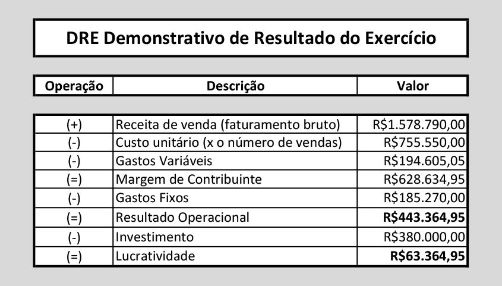

# Empreendedorismo

- [Empreendedorismo](#empreendedorismo)
  - [Lean para Startups](#lean-para-startups)
    - [Benefícios, Recomendações, Erros e Medos](#benefícios-recomendações-erros-e-medos)
    - [Definição](#definição)
    - [Estágios do MVP](#estágios-do-mvp)
    - [Pivô](#pivô)
  - [Pilares do Empreendedorismo](#pilares-do-empreendedorismo)
    - [Ideias vs. Oportunidades](#ideias-vs-oportunidades)
      - [Atratividade de Mercado](#atratividade-de-mercado)
    - [Proposta de valor e BMC](#proposta-de-valor-e-bmc)
      - [Tecnologias, Operações e Margens](#tecnologias-operações-e-margens)
    - [Plano de Negócios](#plano-de-negócios)
  - [Abrindo Uma Empresa](#abrindo-uma-empresa)
    - [Modelo de Negócios](#modelo-de-negócios)
    - [Tipos Societários](#tipos-societários)
      - [Individuais](#individuais)
      - [Sociedades](#sociedades)
    - [Contrato Social e Ato Constitutivo](#contrato-social-e-ato-constitutivo)
    - [Gestão Financeira](#gestão-financeira)
      - [Controle de Gastos](#controle-de-gastos)
    - [Junta Comercial](#junta-comercial)

## Lean para Startups

A Startup enxuta tem como objetivo reduzir o tempo gasto para criar um negócio, ou criar um produto inovador para um público alvo. Desenvolvo produtos e mercados.

Early Adopters são os primeiros usuários que experimentam o produto. A partir da experiência e o feedback desses usuários, se tem as informações para modelar ou descontinuar o produto.

Early Adopters

- Primeiros usuários
- Para quem a ferramenta vai ser modelada
- Principal cliente no desenho do negócio

É importante defini-los antes de lançar o produto, com isso se fará o teste e se pode direcionar o desenvolvimento para sua base inicial até a expansão para outras bases.

Para explorar essa base inicial existem um grupo de técnicas, elas ajudam a estruturar as informações de forma que agreguem o desenvolvimento do produto.

Outro conceito importante é a validação, é preciso validar as hipóteses. É isso que é a startup enxuta, um sistema de validação de hipóteses.

Ao encontrar o early adopter é preciso validar seus interesses com o produto, suas expectativas e pretensões, assim se constrói uma hipótese. É preciso definir uma métrica, oferecê-la e medir as respostas.

É assim que funciona o ciclo de validação: Construir, Medir e Aprender.

Com esses 2 se constrói o Mínimo Produto Viável (MPV). Ele é o conhecimento sobre o público, é o mínimo sobre o que os usuários com certeza querem para o produto. Ele é vendável depois desse ciclo de validação, se encontra uma solução precificada:

- É conhecimento
- Não precisa ser um produto final
- Passa por estágios
- É construído a partir do processo de validação

### Benefícios, Recomendações, Erros e Medos

Lean startups ajudam: 

- A economizar tempo.
- Empreender mais e melhor.
- Construir produtos que tenham mercado.
- Validação é o segredo.

Recomendações:

- Respostas rápidas.
- Ter firmeza e confiança.
- Fazer, fazer e repetir o ciclo quantas vezes for necessário.

Erros e mitos:

- Somente funciona para empresas de TI ou pequenas empresas.
- Não é porquê é lean que tem financiamento.

### Definição

No processo é importante ter em mente o foco em um público alvo, um problema e uma solução. Assim se constrói um negócio, um produto.

É preciso de definições claras. Definir com clareza quem é o cliente, qual sua dor e como a solução funciona.

O MVP precisa ser armazenado, todas as suas evoluções. Se trabalha com o repositório de validações, documentando cada passo que seja necessário para se ter uma linha linear da evolução do produto.

- Quais eram as primeiras e próximas features do MVP;
- Quem foi o primeiro e próximo Early Adopters e o que aceitaram ou não como preço e solução.

> LEAN é um processo para estabelecimento de um cliente, um problema, uma solução, riscos e premissas gerais relacionados ao problema e a solução.

### Estágios do MVP

MVP não necessariamente é o produto final, ele é o conhecimento validado.

Estágios:

1. Exploração do problema
	1. Detalhar o perfil do público alvo
	2. Elaborar a persona
	3. Entrevista exploratória
	4. Validar a solução
	
Entrevistas, formulários e landing pages pode ser usadas nessa etapa. Um teste A/B pode ser usado para comparar o desempenho de duas ou mais versões de uma página ou elemento específico.

	
2. Estruturação do produto vendável
	1. Precificação top-down
	2. Inovação
	3. Beta
3. Recepção
	1. Validar o modelo de negócios
	2. Simular o funcionamento do produto
	
### Pivô

Pivôs são mudanças na essência da solução que impactam o modelo de negócios. É uma mudança no produto que se está vendendo, na forma como vai vender. Não é só no sistema em si.

Se vender o produto e perceber que não se pode vender caro, mas se consegue vender barato, isso significa que é preciso trabalhar com volume e não com o preço. Assim se é preciso "pivotar" o modelo e solução, iniciando assim um novo ciclo iterativo.

Se "pivotou" há um novo MPV na área. Existem algumas formas de pivô: 

- Zoom-in e zoom-out
	- Comprimem ou expandem o negócio
- Segmentação do cliente, plataforma em produto ou produto em plataforma
	- Oferecer o mesmo produtos com diversas opções

A geração de receita é o como o negócio ganha dinheiro: cartão de crédito, por meio de uma loja virtual, por meio de vendedores ou de distribuidores, etc. Se deve definir como vender, por onde ou quem, qual o tamanho do público e o quanto estão dispostos a pagar, e em qual modelo.

É preciso garantir que produto for para o mercado ele possui o canal adequado de cobrança de acordo com o modelo de negócio.

Também é importante definir como se quer expandir o negócio, qual o modelo de crescimento a ser seguido.

## Pilares do Empreendedorismo

O empreendedor tem consciência que não sabe de tudo, e assume que está sempre aprendendo sobre o mercado e seus clientes.

A abordagem de empreender dentro de uma empresa já estabelecida é conhecida como intra-empreendedorismo. O risco é muito menor e as oportunidades geralmente são mais restritas ao core-business da organização, além de agradar a muitos interessados.

Fundadores:

- O empreendedor
- Time da fundação
- Experiência e know-how
- Gestão, habilidades e competências
- Atitudes e mentalidade

Oportunidade:

- Encontrar e definir
- Necessidade real
- Tamanho
- Crescimento
- Timing
- Forças
- Lucratividade e potencial de retorno
- Encontrar os pioneiros

Recursos:

- Financeiros
- Tecnologia e P&D
- Produção
- Pessoas
- Sistemas
- Conselheiros/Consultores
- Controles

O guia do empreendedor:

- As metas estão bem definidas?
- A estratégia está correta?
- A estratégia pode ser executada?

É preciso ter visão, coragem e competência.

### Ideias vs. Oportunidades

Uma Oportunidade é uma Ideia de Negócio Factível que resolve uma Dor Real de Potenciais Clientes num Mercado Atrativo. A oportunidade tem atratividade de mercado e alto potencial de crescimento e lucratividade no momento atual.

Há 2 correntes de pensamento:

> Investir em pessoas, elas trarão as grandes oportunidades.

> Investir em mercados, procurar oportunidades e dores, a gestão pode ser alterada se for necessário.

Fórmulas essenciais:

> Valor Potencial = Problema x Solução Elegante x Empreendedor

> Ideia + Execução

> Atratividade de Mercado > Nicho

> Tamanho do mercado (o quanto de valor gera anualmente) > pouca movimentação

> Tamanho da dor (se é necessário) > "legal de se ter"

> Compradores qualificados (preparados) > não estar preparado para comprar

> Vendedores qualificados > difícil encontrar pessoas qualificadas para vencer o produto

> Homogeneidade de compradores (mesma necessidade) > customização muito grande do produto

> Sem barreiras institucionais > grande regulamentação

#### Atratividade de Mercado

> Fácil de divulgar (ads)

> Margem - Custos e Preços

> Escalabilidade e Implementação

- Dá pra escalar?
- Qual a relação entre despesa e receita a medida que se ganha escala?
- Negócios altamente escaláveis são aqueles que podem atingir grandes quantidades de clientes, e ao passo que se aumenta a receita, não se aumenta a despesa com a mesma intensidade. 

> Timing

- É a hora certa?

> Competitividade

- Como o mercado tem se virado até agora?
- Quais os concorrentes substitutos?

> Time

- Acesso as pessoas certas

> Diferenciação

- Por que o produto é diferente dos concorrentes?

### Proposta de valor e BMC

> Necessidade

- Qual é a necessidade que o produto/serviço resolve?

> Posicionamento

- Baixo custo ou diferenciação?

> Segmentos de Clientes

- Idades
- Classe social
- Gênero
- Tribo
- Interesses
- etc

> Mercado Novo ou Existente?

> Há Complementos?

Produtos ou serviços complementares são aqueles que podem ser vendidos em conjunto com o produto ou serviço original, melhorando a experiência do cliente, e gerando novas fontes de receita para o negócio.

> Qual é o MVP?

> Como Precificar?

> Quais os custos de mudanças?

Muitas vezes o custo de mudança de um produto para ou outro, ou de um prestador de serviço para outro, pode ser muito alto, e acaba inviabilizando o negócio.

#### Tecnologias, Operações e Margens

> Atividades

O que é necessário para desenvolver o produto?

- Marketing & Branding
- Vendas
- Emissão
- Entrega
- RH
- Jurídico
- Contabilidade
- Software Development
- etc

> Terceirização

InHouse vs. Outsourcing

Não há fórmula mágica, mas geralmente, recomenda-se terceirizar aquilo que não é um diferencial na sua empresa e manter em casa aquilo que faz a solução única no mercado.

> Possui propriedade intelectual?

Algo que seja patenteável?

> Canais de Venda

Onde e como o produto/serviço poderá ser comprado?

- Sites
- Aplicativos
- Lojas
- Agências
- Por telefone ou mensagem
- etc

> Como Gerar Demanda?

Como atrair clientes para o negócio?

- Outdoors
- Rádio
- TV
- Podcast
- Google Adsense
- Social Media Ads
- Revistas
- Eventos
- Freemium
- Viralização
- etc

> Qual é o CLV esperado?

Customer Lifetime Value

- Possui UpSell? (suporte, implementação, consultoria)
- Qual o custo de aquisição?
- Qual o custo de retenção?

> Margem?

- Qual é a margem de contribuição?
- Quais são os custos fixos?
- Qual o breakeven (ponto de equilíbrio)?

> Ritmo de Crescimento

O mercado está estagnado ou crescendo, e em que ritmo?

> Capital de Giro

Qual a necessidade e capital de giro do negócio?

### Plano de Negócios

O plano de negócios pode ser muito útil porque faz o empreendedor colocar certas coisas no papel, e fazer contas importantes para aumentar as chances de sucesso de negócio. Muito embora, as previsões de 5 anos, muito provavelmente, não vão acontecer na mesma forma que planejado, o exercício será útil para traçar um plano de ação que poderá mudar e ser revisto ao longo do tempo.

9 elementos de um bom plano de negócios:

> Sumário Executivo

É a chance de chamar a atenção do investidor

- Conceito do Negócio
- UVP (Unique Value Proposition)
- Quanto investimento será necessário?
- Clientes e Mercado

> Produto ou Serviço

- Funcionalidades
- Público-alvo
- Fontes de Receita
- Estado Atual do Desenvolvimento
- Já existe Prova (em outro país ou mercado)
- Como manter o cliente leal?

> Time

- Quem são os fundadores?
- Criticidade de cada um para o sucesso
- Divisão de responsabilidades

> Mercado

- Tamanho Mercado
- Potencial de Crescimento
- Concorrentes
- Pontos Fortes e Fracos

> Marketing e Vendas

- Como promover?
- Como distribuir?
- Como precificar? (segmento, plano, por...)

> Organização

- Formação de times
- Plano de contratação
- Terceirização
- Parceiros
- Canais de Vendas

> Cronograma

- Responsáveis
- Prazos
- Milestones
- ... para os próximos 5 anos (o que traz muitas críticas)

> Riscos

- Melhor e Pior Cenário
- Principais Riscos
- Como Mitigar os Riscos

> Finanças

Para os próximos 5 anos:

- DRE (Demonstrativo de Resultado)
- Fluxo de Caixa
- Valuation
- Balanço
- Fontes de Financiamento

## Abrindo Uma Empresa

### Modelo de Negócios

O modelo de negócios está muito relacionado a o que, custos e como entregaremos um produto. No entanto, isso não se relaciona à execução deste modelo, que tem mais a ver com o plano de negócios.

O modelo é esta estrutura inicial e básica, e o plano de negócios implica em como chegaremos lá.

- Como?
	- Parcerias, atividades e recursos principais.
- O que? 
	- Proposta de valor.
- Para quem? 
	- Relacionamento com clientes, segmentos de clientes, canais.
- Quanto? 
	- Estrutura de custos, fontes de receita.
	
O que é preciso em um modelo de negócios?

- Qual o produto/serviços e o diferencial dele?
- Quem compra o produto ou serviço?
- Quem são os fornecedores e parceiros?
- Como o produto/serviço é cobrado?
- Onde é gasto o dinheiro adquirido?
- Que recursos são precisos para fazer o negócio rolar?
- Como é feita a entrega do produto ou serviço?

> Produto, diferenciais, clientes, valor, parceiros, entrega, preço, recursos e custos.

O plano de negócios vai pegar todas essas informações e fazer uma planejamento mais detalhado em cima delas.

Sebrae Canvas é uma ferramenta gratuita que pode ser usada para estruturar um modelo de negócio de qualidade.

Objeto social: é o coração do contrato social.

Exemplo de objeto social:

>    "A empresa X tem como objeto a produção de cursos de gestão de projetos, para venda online, por meio de plataforma própria, disponível na internet em sítio específico. Os treinamentos serão produzidos na modalidade gravada, com acesso estritamente online, pelo período determinado em cada produto e/ou oferta. Os cursos são vendidos de forma isolada ou em conjunto, pacotes, que podem ser determinados de acordo com as necessidades do negócio e a demanda.

>    A venda é feita por telefone e e-mail, utilizando para comunicação com o aluno diferentes canais pagos. A produção é própria, feita em estúdios terceirizados, com venda em plataforma proprietária da empresa."

Exemplo de objeto social: (tradução)

>	"A empresa X tem como objeto a exploração do ramo de treinamento e desenvolvimento profissional e gerencial por meio da produção de treinamentos para comercialização online."

A partir dele é possível chegar no propósito econômico. Com o objeto, se pode determinar a classificação da atividade econômica da empresa.

Da mesma forma, o objeto irá ajudar a determinar os tributos que a empresa pagará. Este é o enquadramento tributário.

O modelo de negócios também ajuda a determinar a Classificação Nacional de Atividade Econômica (CNAE). Exemplo, uma empresa do ramo de comércio de software pode comprar e vender software, mas não produzir.

O objeto define a empresa, mas também limita.

O CNAE não representa o modelo de negócios, mas sim a principal atividade econômica da empresa - que pode ser derivada de um modelo bem estabelecido.

E o E-Commerce? Ainda não tem enquadramentos específicos.

Contrato social: é o acordo entre sócios que vincula tudo e define as regras.

O que precisa ter?

- Tipo de empresa
- Cotas, sócios e responsabilidades
	- Responsabilidade limitada e também a responsabilidade de trabalho, se for convencionada entre os sócios
	- As cotas de cada sócio devem ser apontadas no contrato social
- Gestão financeira
	- É adequado ao menos determinar como o lucro será sacado e em que período será feito o balanço da empresa
- Cláusulas de entrada e saída
	+ O cabeçalho apresenta o título do contrato e a identificação das partes
	- Se um sócio cometer deslizes, ele precisa ser expulso da sociedade
	- Se um novo sócio quiser entrar, deverão ser seguidas as regras estipuladas no contrato
- Regras gerais
- Fecho
	- É onde as partes assinam e onde vai estar determinado o foro ou então a cláusula de arbitragem

### Tipos Societários

Antes de tudo, sobre empresas:

O objetivo principal das empresas é lucro. Em uma sociedade é preciso reciprocidade e confiança entre sócios.

As empresas podem ser individuais e não personificadas, registradas ou apenas documentadas.

#### Individuais

> MEI - Microempreendedor Individual

Para profissões não regulamentadas, com faturamento de até certo teto.

Perde seguro desemprego, mas paga importo fixo e pode fazer o registro online.

Até um colaborador.

> EI - Empresário Individual

Tudo que é dele é da empresa. Precisa abrir na Junta Comercial.

> EIRELI - Empresa Individual de Responsabilidade Limitada

Libera o empresário de comprometer seus bens. Também passa pela Junta.

Precisa de 100 salários mínimos.

#### Sociedades

> Sociedades Simples

Voltados para empresas sem fim produtivo, podem fazer registro em cartório comercial.

Exemplos: consultórios, associados.

> LTDA - Sociedade Limitada

Fins produtivos e mercantis com mais de um sócio. Exige contrato social e registro na Junta.

> Sociedade Anônima

A responsabilidade do sócio é limitada pela sua ação. Pode ser aberta ou fechada. O seu contrato é o Estatuto Social.

> Outros tipos

- Conta de Participação
- Sociedade em Comandita
- Registro de Profissional Autônomo

### Contrato Social e Ato Constitutivo

Um empresário antes encontra a oportunidade, determina como atender uma demanda, testa seu mercado, encontra os sócios adequados e só então formaliza a empresa com estes sócios por meio de um contrato social pensado para garantir a sustentabilidade do negócio e sua capacidade de liderar este empreendimento.

> Certificado de Condição de Microempreendedor Individual

M.E.I

> Registro de Empresário Individual

EIRELI

> Ato Constitutivo de EIRELI

> Contrato Social de Sociedade Simples

> Contrato Social de Empresa Limitada

> Estatuto Social Para Sociedade Anônima

 - Ato Constitutivo
 	- É uma declaração legal para abertura da empresa individual
 - Estatuto Social
	- Serve para sociedades anônimas
 - Contrato Social
	- Para sociedades simples ou limitadas
	
### Gestão Financeira

> Lucro

Distribuído ao fim de um período específico. 

> Pró-Labore

É o salário dos sócios. Paga imposto.

> Atividade

É o freela dos sócios. O sócio recebe pela atividade executada.

Lucro é aquilo que sacamos, como sócios, ao fim de um período determinado em contrato. Não pagamos imposto além daqueles já pagos. Pró-labore é o salário do empreendedor e nele fica retido o imposto de renda. Por fim, pagamento por atividade é quando um sócio realiza um esforço pela empresa e recebe por ele de forma isolada.

#### Controle de Gastos

O uso de aplicativos é essencial para manter um controle de gastos simples. É imprescindível separar as contas, empresa é empresa, individual é individual.

É preciso integrar a NF-e ao controle de gastos. Quanto maior a movimentação, mais complicado e trabalhoso será fazer a gestão de forma manual.

Especifique o pró-labore.

> Crie um regra do saque do lucro

> Crie reservas

### Junta Comercial

A Junta Comercial é onde se faz o primeiro registro da empresa. Presencialmente ou virtualmente.

O que é preciso fazer?

- Elaborar o contrato social
- Juntar as documentações necessárias dos sócios
- Pesquisar nome para a empresa
- Pagar tacas da Junta
- Providenciar registros, CNPJ e alvarás