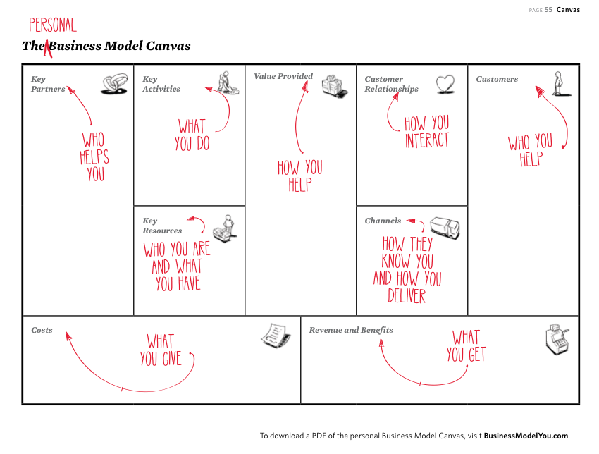

# Pitch

- [Pitch](#pitch)
  - [Técnicas](#técnicas)
    - [Business Model You](#business-model-you)
  - [Transformando o BMY em Pitch](#transformando-o-bmy-em-pitch)

## Técnicas 

Os primeiros segundos de qualquer apresentação são muito importantes. Se chamar a atenção do público eles irão prestar mais atenção no discurso para obter mais informações. Agora, se não chamar a atenção, eles não vão querer mais prestar atenção e irão ignorar automaticamente as informações passadas.

é necessário que a apresentação seja:

- Rápida, sem enrolação
- Impactante, destacando o seu melhor
- Faça sentido, que seja pertinente ao cargo/situação

Como fazer?

- Quem é você?
- Qual a sua história?
- Como você pode agregar valor para a empresa?

**Atenção**, se for gravação cuidado com:

- Plano de fundo
- Som
- Texto
- Aparência

Responda essas perguntas antes de criar um pitch:

1. Qual o objetivo final dessa apresentação?
2. Para quem você vai realizar essa apresentação?
3. Em alguma ocasião você teve que se apresentar para alguém? Como você se saiu?

### Business Model You

É uma forma de organizar sua apresentação profissional com base em um modelo já conhecido, o Business Model Canvas. Só que ao invés de ser sobre um modelo de negócio, é sobre a trajetória individual do colaborador.

> Quem te ajudou a ser quem você é hoje?

Quem te inspirou, te direcionou na vida

- Família
- Professores
- Colegas de trabalho / chefe

>  O que sabe fazer?

**Hard Skills** 

> O que você é e o que você tem?

Soft Skills

> Como você contribui para quem irá te contratar? **Mais impactante**

Estrelinhas, como eram os projetos/clientes

> Como você interage?

Habilidades de atuação em equipe

> Como as pessoas te conhecem? **Mais impactante**

Se as pessoas pudessem te definir no máximo em 3 palavras, quais seriam?

> Quem você ajuda?

Família, dependentes, 

Dica: escrever o BMY, descansar, deixar sem mexer por um dia. Em outro momento, revisar. Revisar o que é verdade, se algo a mais pode ser acrescentado, se tem o que aprimorar.

## Transformando o BMY em Pitch

Usando as repostas dadas no BMY, se pode estruturar um texto cru para se usar de base. A partir dele, é possível molda-lo para que se adapte ao formato de um pitch. 

Neste ponto é: montar um rascunho, testar, aprimorar, repetir até que se chegue na apresentação final, que seja rápida, impactante e coerente à vaga.

É importante que o pitch esteja em ordem cronológica e que contenha **palavras chave**. Se pode grifar o que é mais relevante/importante, que é o que se deve manter, é a parte chave da apresentação.

Priorização e coerência formam um pitch de sucesso.