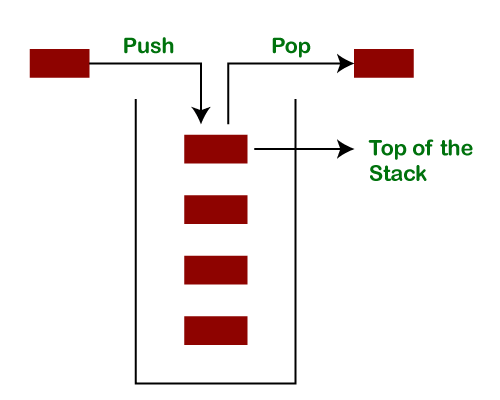
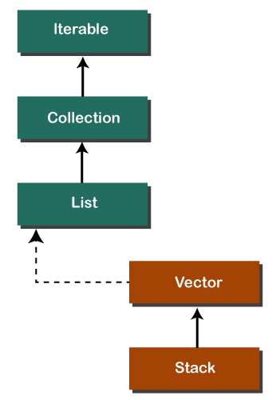
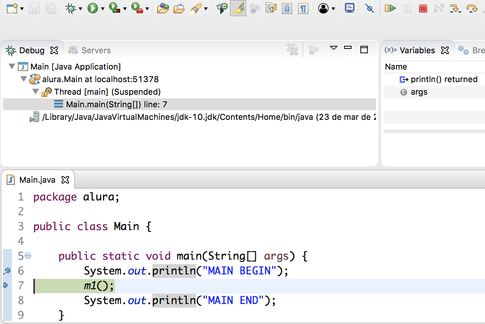

# Java Exceções

- [Java Exceções](#java-exceções)
  - [Pilha de Execução](#pilha-de-execução)
    - [A Classe Stack](#a-classe-stack)
    - [Para que a JVM usa um Stack?](#para-que-a-jvm-usa-um-stack)
  - [Depuração](#depuração)
  - [Exceções](#exceções)
    - [Classificação](#classificação)
    - [Hierarquia de Exceção](#hierarquia-de-exceção)
  - [Tratamento de Exceções](#tratamento-de-exceções)
    - [Try / Catch](#try--catch)
      - [Variação do Catch](#variação-do-catch)
      - [Try With Resources](#try-with-resources)
    - [Finally](#finally)
      - [Observações](#observações)
    - [Throw / Throws](#throw--throws)
  - [Criando Exceções](#criando-exceções)
  - [Por Que Usar Exceções?](#por-que-usar-exceções)


## Pilha de Execução

A pilha de execução ou stack é uma estrutura de dados linear usada para armazenar uma coleção de objetos. Ela trabalha com o formato **Last-In-First-Out** **(LIFO)**, literalmente "último a entrar, primeiro a sair".

É considerada uma estrutura de dados simples, de fácil implementação. 

A lógica segue como uma pilha de objetos "reais" (físicos) onde o primeiro item da pilha é, normalmente, o último item a ser retirado dela. Dessa forma, em sua estrutura só se pode acessar apenas um item de dados - o último inserido na pilha.

Para processar o penúltimo item inserido - ou qualquer item anterior - é preciso remover todos os que estão acima dele na lista. Quando acabam os métodos da pilha, o Java entende que o processo foi encerrado. 

Os métodos mais importantes dessa estrutura são: `push` e `pop`. A operação `push` insere um elemento no stack, enquanto a operação `pop` remove.




Se o stack não tiver qualquer elemento é conhecido como uma pilha vazia (empty stack). Quando está vazio seu topo tem o valor de -1.


Quando elementos são acrescentados a pilha, o valor do topo aumenta em 1.


E quando um elemento é removido, o valor do topo diminui em 1.


| Valor do Topo | Significado                |
|---------------|----------------------------|
| -1            | A pilha está vazia         |
| 0             | A pilha tem 1 elemento     |
| N - 1         | A pilha está cheia         |
| N             | A pilha está transbordando |

### A Classe Stack

Java Collection é um framework que oferece uma arquitetura para armazenar e manipular um grupo de objetos. Das operações que pode executar dispõem: pesquisar, ordenar, inserir, manipular e deletar.

Esse framework disponibiliza diversas interfaces (`Set`, `List`, `Queue`, `Deque`) e classes (`ArrayList`, `Vector`, `LinkedList`, `PriorityQueue`, `HashSet`, `LinkedHashSet`, `TreeSet`).

`Stack` é uma classe que que estende da classe `Vector`. Também implementa as interfaces `List`, `Collection`, `Iterable`, `Cloneable`, `Serializable`. Ela representa uma pilha LIFO de objetos.

Antes de usa-la é necessário importar o pacote `java.util`.



Contem somente o construtor padrão.

```java
Stack stk = new Stack();

// ou

Stack <type> stk = new Stack <>(); // type denomina o tipo como int, string, etc
```

Além dos seus métodos próprios também herda métodos das classes `class jaa.util.Vector`, `class java.lang.Object` e da interface `java.util.Collection`.

| Método           | Modificador e Tipo | Descrição                                                                  |
|------------------|--------------------|----------------------------------------------------------------------------|
| `empty`          | boolean            | verifica se está vazio ou não                                              |
| `push(E item)`   | E                  | insere um elemento ao topo da pilha                                        |
| `pop()`          | E                  | remove um elemento do topo da pilha e retorna o mesmo como valor da função |
| `peek()`         | E                  | "olha" para o elemento do topo da pilha sem remover                        |
| `search(Object)` | int                | procura um objeto específico e retorna sua posição                         |

### Para que a JVM usa um Stack?

Por 2 motivos principais:

- **Saber qual método está sendo executado ↓**

Uma pilha Java faz parte da JVM e armazena os métodos que estão sendo executados. Além do bloco de código a pilha guarda as variáveis e as referências desse bloco. Assim a JVM organiza a execução e sabe exatamente qual método está sendo executado que é sempre o método no topo da pilha. A JVM também sabe quais outros precisam ser executados ainda, que são justamente os métodos abaixo.

- **Organizar a execução dos métodos ↓**

Uma pilha Java faz parte da JVM e armazena os métodos que estão sendo executados. Além do bloco de código a pilha guarda as variáveis e as referências desse bloco. Assim a JVM organiza a execução e sabe exatamente qual método está sendo executado que é sempre o método no topo da pilha. A JVM também sabe quais outros precisam ser executados ainda, que são justamente os métodos abaixo.

## Depuração

Ponte de Depuração ou Breakpoint pausa a execução em um ponto específico, caso o projeto seja executado em modo Debug. Ao debugar o programa,  possível ver as mudanças em tempo real, em uma velocidade possível de ser acompanhada.

```java
package alura;

public class Main {

    public static void main(String[] args) {
        System.out.println("MAIN BEGIN");
        m1();
        System.out.println("MAIN END");
    }
}
```



Por meio da depuração é possível ver o Java executando os comandos linha por linha. Tornando possível acompanhar o processo e encontrar erros mais facilmente.


## Exceções

Exceções (ou evento excepcional) são problemas que ocorrem na compilação do código. Quando ocorre, o fluxo normal do programa é interrompido e o programa/aplicativo é encerrado de forma anormal, o que não é recomendado, portanto, essas exceções devem ser tratadas. Ela altera o fluxo de execução, pois faz parte dele.

Pode acontecer por vários motivos, como:

- Um usuário inseriu dados inválidos
- Um arquivo que precisa ser aberto não foi encontrado
- Consultar um banco de dados que não está disponível
- Tentar escrever algo em um arquivo sobre o qual não se tem permissão de escrita
- Conectar em servidor inexistente
- Uma conexão de rede foi perdida no meio das comunicações ou o JVM ficou sem memória
- Manipular um objeto que está com o valor nulo
- Dividir um número por zero
- Tentar manipular um tipo de dado como se fosse outro
- Utilizar um método ou classe não existentes
  
Algumas exceções são causadas por erros do usuário, outras por erros do programador e outras por recursos físicos que falharam por algum motivo.


Toda a exceção em Java possui um nome identificador. Exceções não tratadas caem na pilha de execução procurando por alguém que saiba lidar com ela.


Para tratar uma exceção é preciso sinalizar para a máquina virtual que isso pode acontece. Em seguida, é preciso sinalizar a captura do problema.

```java
try {
    int a = i / 0;
} catch (ArithmeticException ex) {
    System.out.println("ArithmeticException");
}
```

### Classificação

Na linguagem Java existem 2 tipos de exceção:

- **Implícitas** → que não precisam de tratamento e demonstram serem contornáveis. Esse tipo origina-se da subclasse `Error` ou `RunTimeException`.
- **Explícitas** → que precisam ser tratadas e que apresentam condições incontornáveis. Esse tipo origina do modelo throw e necessita ser declarado pelos métodos. É originado da subclasse `Exception` ou `IOException`.

E 3 categorias:

- **Checked exceptions** → é uma exceção que é verificada (notificada) pelo compilador em tempo de compilação; também são chamadas de exceções de tempo de compilação. Elas não podem ser simplesmente ignoradas, o programador deve cuidar (manipular) essas exceções.

Usualmente são geradas pela palavra chave `throw`. Como ela é prevista já em tempo de compilação, se faz necessária a utilização do bloco `try / catch` ou da palavra chave `throws`.

A princípio, todas as classes filhas de Exception são do tipo checked, exceto pelas subclasses de `java.lang.RuntimeException`.

```java
import java.io.File;
import java.io.FileReader;

public class FilenotFound_Demo {

   public static void main(String args[]) {		
      File file = new File("E://file.txt");
      FileReader fr = new FileReader(file); 
   }
}
```

```sh
C:\>javac FilenotFound_Demo.java
FilenotFound_Demo.java:8: error: unreported exception FileNotFoundException; must be caught or declared to be thrown
      FileReader fr = new FileReader(file);
                      ^
1 error
```

- **Unchecked exceptions** → é uma exceção que ocorre no momento da execução; também são chamados de Runtime Exceptions. Isso inclui bugs de programação, como erros de lógica ou uso impróprio de uma API. Elas são ignoradas no momento da compilação.

Um dos fatores que tornam a `RuntimeException` e suas classes filhas tão específicas em relação as demais subclasses de `Exception` é que elas são exceções não diretamente previstas por acontecer em tempo de execução.

```java
public class Unchecked_Demo {
   
   public static void main(String args[]) {
      int num[] = {1, 2, 3, 4};
      System.out.println(num[5]);
   }
}
```

```sh
Exception in thread "main" java.lang.ArrayIndexOutOfBoundsException: 5
	at Exceptions.Unchecked_Demo.main(Unchecked_Demo.java:8)
```

- **Errors** → Não são exceções de forma alguma, mas problemas que surgem além do controle do usuário ou do programador. Os erros são normalmente ignorados em seu código porque você raramente pode fazer algo sobre um erro.

`Errors` são um tipo especial de `Exception` que representam erros da JVM, tais como estouro de memória, entre outros. Para este tipo de erro normalmente não é feito tratamento, pois sempre quando um `java.lang.Error` ocorre a execução do programa é interrompida.


### Hierarquia de Exceção

Todas as classes de exceção são subtipos da classe `java.lang.Exception`, e a mesma é uma subclasse da classe `Throwable`. Além dela, há outra subclasse chamada `Error`, que também se deriva da mesma origem.


- **Exception (java.lang.Exception)** → É a raiz das classes originárias da classe `Throwable`, onde mostra as situações em que a aplicação pode querer capturar e realizar um tratamento para conseguir realizar o processamento.
- **Error (java.lang.Error)** → Também é raiz das classes originárias da classe `Throwable`, indicando as situações em que a aplicação não deve tentar tratar, como ocorrências que não deveriam acontecer.


O “Erro” é algo que não pode mais ser tratado, ao contrário da “Exceção” que trata seus erros, pois todas as subclasses de `Exception` (menos as subclasses `RuntimeException`) são exceções e devem ser tratadas.

Os erros da classe `Error` ou `RuntimeException` são erros e não precisam de tratamento, por esse motivo é usado o **try/catch** e/ou propagação com **throw/throws**.


## Tratamento de Exceções

Uma maneira de tentar contornar esses imprevistos é realizar o tratamento dos locais no código que podem vir a lançar possíveis exceções, como por exemplo, campo de consulta a banco de dados, locais em que há divisões, consulta a arquivos de propriedades ou arquivos dentro do próprio computador.

Praticamente, o uso dos blocos try/catch se dá em métodos que envolvem alguma manipulação de dados.

Para tratar as exceções em Java são utilizados os comandos `try` e `catch`.

```java
try
{
  //trecho de código que pode vir a lançar uma exceção
}
catch(tipo_excecao_1 e)
{
  //ação a ser tomada
}
catch(tipo_excecao_2 e)
{
  //ação a ser tomada
}
catch(tipo_excecao_n e)
{
  //ação a ser tomada
}
```

Onde:

- `try{ … }` → são introduzidas todas as linhas de código que podem vir a lançar uma exceção.
- `catch(tipo_excecao e) { … }` → é descrita a ação que ocorrerá quando a exceção for capturada.

### Try / Catch

Como a exceção é lançada por toda a cadeia de classes do sistema, a qualquer momento é possível se “pegar” essa exceção e dar a ela o tratamento adequado.

Para se fazer este tratamento, é necessário pontuar que um determinado trecho de código que será observado e que uma possível exceção será tratada de uma determinada maneira.

O bloco `try` tenta processar o código que está dentro, sendo que se uma exceção acontecer, a execução do código pula para a primeira captura do erro no bloco `catch`. Serve para indicar que o código está tentando realizar algo arriscado no sistema.

O bloco `catch` trata a exceção lançada. Caso a exceção não seja esperada, a execução do código pula para o próximo catch, se existir. Portanto, se nenhum do bloco catch conseguir capturar a exceção, dependendo o tipo que for, é causada a interrupção ao sistema, lançando a exceção do erro.

```java
package material.excecao;

import java.util.Scanner;

/**
 * Classe que demonstra o uso do try / catch.
 */
public class ExemploTryCatch {
  public static void main(String[] args) {
    Scanner s = new Scanner(System.in);
    try {
      System.out.print("Digite um valor inteiro..:");
      int numero1 = s.nextInt();
      System.out.print("Digite um valor inteiro..:");
      int numero2 = s.nextInt();

      System.out.println(numero1+ " + " + numero2 + " = " + (numero1+numero2));
    } catch (Exception ex) {
      System.out.println("ERRO - Valor digitado não é um numero inteiro!");
    }
  }
}
```

Caso não tenha erro:

```sh
C:\>javac material\excecao\ExemploTryCatch.java
C:\>java material.excecao.ExemploTryCatch
Digite um valor inteiro..:5
Digite um valor inteiro..:3
5 + 3 = 8
```

Caso tenha erro:

```sh
C:\>javac material\excecao\ExemploTryCatch.java
C:\>java material.excecao.ExemploTryCatch
Digite um valor inteiro..:10
Digite um valor inteiro..:abc
ERRO - Valor digitado não é um numero inteiro!
```

#### Variação do Catch

A variável `ex` é uma referência que, com ela, se pode dizer que exceções também são objetos. Então, podemos usar a referência para chamar algum método público da classe.

```java
try {
    int a = i / 0;
} catch (ArithmeticException ex) {
    System.out.println("ArithmeticException");
}
```

É possível chamar o método `getMessage()`, com o qual consegue-se pegar a informação apresentada no console, por exemplo, a mensagem `/ by zero`.

Da mesma forma que a exceção se lembra da mensagem, ela também se lembra por onde passou e deixou seu rastro. Para mostrá-lo, usaremos o método `printStackTrace()`.

Dessa forma, fica entendido que `ex` é uma referência e o tipo da referência é o nome da classe da exceção. Parte do tratamento dela é saber trabalhar com a referência. Normalmente, não precisamos saber muito sobre `ex`. Basta sabermos que `getMessage()` é um método importante para descobrir a mensagem original e que o `printStackTrace()` pode ser útil também.

Por fim, é possível utilizar um pipe dentro de um mesmo `catch` para tratar mais de uma exceção, isso é chamado de **multi catch**:

```java
catch(ArithmeticException | NullPointerException ex){
    System.out.prinln("Exception: ")
}
```

#### Try With Resources

Também conhecido como **automatic resource managements** foi um mecanismo de manipulação de execução que foi introduzido no Java 7, ele fecha automaticamente os recursos usados no bloco try/catch.

Para usar esta instrução, é simplesmente preciso declarar os recursos necessários entre parênteses, e o recurso criado será fechado automaticamente no final do bloco.

```java
try(FileReader fr = new FileReader("file path")) {
   // use the resource
   } catch () {
      // body of catch 
   }
```

```java
import java.io.FileReader;
import java.io.IOException;

public class Try_withDemo {

   public static void main(String args[]) {
      try(FileReader fr = new FileReader("E://file.txt")) {
         char [] a = new char[50];
         fr.read(a);   // reads the content of the array
         for(char c : a)
         System.out.print(c);   // prints the characters one by one
      } catch (IOException e) {
         e.printStackTrace();
      }
   }
}
```

Os pontos a seguir devem ser mantidos em mente:

- Para usar uma classe com a instrução try-with-resources, ela deve implementar a interface `AutoCloseable` e o método `close()` dele é chamado automaticamente em tempo de execução.
- É possível declarar mais de uma classe na instrução try-with-resources.
- Enquanto se declara várias classes no bloco try da instrução try-with-resources, essas classes são fechadas na ordem inversa.
- Exceto a declaração de recursos entre parênteses, tudo é igual ao bloco try / catch normal de um bloco try.
- O recurso declarado em try é instanciado logo antes do início do bloco try.
- O recurso declarado no bloco try é declarado implicitamente como final.

### Finally

O bloco `finally` sempre finaliza a sequência de comandos do sistema, independente de ocasionar algum erro no sistema. Esse bloco é opcional, não sendo obrigatório sua inserção na sequência **try/catch**. 

```java
try
{
  //trecho de código que pode vir a lançar uma exceção
}
catch(tipo_exceçao_1 e)
{
  //ação a ser tomada
}
catch(tipo_exceçao_2 e)
{
  //ação a ser tomada
}
catch(tipo_exceçao _n e)
{
  //ação a ser tomada
}
finally
{
  //ação a ser tomada
}
```

É usado em ações que sempre precisam ser executadas independente se gerar erro. Um exemplo é o fechamento da conexão de um banco de dados.

```java
package material.excecao;

import java.util.Scanner;

/**
 * Classe que demonstra o uso do bloco finally.
 */
public class ExemploFinally {
  public static void main(String[] args) {
    Scanner s = new Scanner(System.in);
    try {
      int dividendo, divisor;
      System.out.print("Digite o valor do dividendo: ");
      dividendo = s.nextInt();
      System.out.print("Digite o valor do divisor: ");
      divisor = s.nextInt();

      if(divisor == 0) {
        throw new Exception("Nao eh permitido fazer uma divisao por zero!");
      }

      System.out.println(dividendo+" / "+divisor+" = "+(dividendo / divisor));
    } catch (Exception ex) {
      System.out.println("Erro: " + ex.getMessage());
    } finally {
      System.out.println("Bloco Finally.");
    }
  }
}
```

Caso não tenha erro:

```sh
C:\>javac material\excecao\ExemploFinally.java
C:\>java material.excecao.ExemploFinally
Digite o valor do dividendo: 7
Digite o valor do divisor: 2
7 / 2 = 3
Bloco Finally
```

Caso tenha erro:

```sh
C:\>javac material\excecao\ExemploFinally.java
C:\>java material.excecao.ExemploFinally
Digite o valor do dividendo: 6
Digite o valor do divisor: 0
ERRO: Nao eh permitido fazer uma divisao por zero!
Bloco Finally
```

O bloco `finally` é muito utilizado quando queremos liberar algum recurso, como: uma conexão com o banco de dados, um arquivo de dados, etc.

#### Observações

- Uma cláusula catch não pode existir sem uma instrução try.
- Não é obrigatório ter cláusulas finally sempre que um bloco try / catch estiver presente.
- O bloco try não pode estar presente sem a cláusula catch ou a cláusula finally.
- Nenhum código pode estar presente entre os blocos try, catch e finally.

### Throw / Throws

As cláusulas `throw/throws` podem ser entendidas como ações que propagam exceções, ou seja, em alguns momentos existem exceções que não podem ser tratadas no mesmo método que gerou a exceção. Nesses casos, é necessário propagar a exceção para um nível acima na pilha.

No caso de que algum método precise lançar uma exceção, mas não háo desejo de tratá-la e quer retornar para o objeto que fez a chamada ao método que lançou, basta utilizar a palavra chave `throws` no final da assinatura do método. Dessa forma, `throws` declara as exceções que podem ser lançadas em determinado método.

Quando é utilizado é preciso também informar qual ou quais exceções podem ser lançadas.

```java
package material.excecao;

import java.util.Scanner;

/**
 * Classe utilizada para demonstrar o uso da palavra chave throws,
 * deixando para quem chamar o método tratar alguma possivel exceção.
 */
public class ExemploThrows {
  public static void main(String[] args) {
    Scanner s = new Scanner(System.in);
    try {
      ExemploThrows et = new ExemploThrows();

      System.out.print("Digite o valor do dividendo: ");
      double dividendo = s.nextDouble();

      System.out.print("Digite o valor do divisor: ");
      double divisor = s.nextDouble();

      double resultado = et.dividir(dividendo, divisor);

      System.out.println("O resultado da divisao eh: " + resultado);
    } catch (Exception ex) {
      System.out.println(ex.getMessage());
    }
  }

  public double dividir(double dividendo, double divisor) throws Exception {
    if(divisor == 0) {
      throw new Exception("Nao e permitido fazer uma divisao por zero!");
    }

    return dividendo / divisor;
  }
}
```

Caso não ocorra erros:

```sh
C:\>javac material\excecao\ExemploThrows.java
C:\>java material.excecao.ExemploThrows
Digite o valor do dividendo: 7
Digite o valor do divisor: 2
O resultado da divisao eh: 3.5
```

Se for digitado zero no valor do divisor será lançado uma exceção pelo método dividir(), esta exceção será tratada pelo método `main()`:

```sh
C:\>javac material\excecao\ExemploThrows.java
C:\>java material.excecao.ExemploThrows
Digite o valor do dividendo: 5
Digite o valor do divisor: 0
Nao e permitido fazer uma divisao por zero!
```

Enquanto isso, a cláusula `throw` cria um novo objeto da exceção que é lançada.

```java
throw new << Excecao desejada >>();
```

Isso seria no caso de ser necessário que o próprio programador envie uma exceção em alguma situação especifica, como em uma situação de login em que o usuário digita incorretamente sua senha.

```java
package material.excecao;

import java.util.Scanner;

/**
 * Classe utilizada para demonstrar o uso da palavra chave throw,
 * utilizada quando queremos lançar uma exceção.
 */
public class ExemploThrow {
  public static final String SENHASECRETA = "123456";

  public static void main(String[] args) {
    try {
      Scanner s = new Scanner(System.in);
      System.out.print("Digite a senha: ");
      String senha = s.nextLine();
      if(!senha.equals(SENHASECRETA)) {
        throw new Exception("Senha invalida!!!");
      }
      System.out.println("Senha correta!!!\nBem vindo(a)!!!");
    } catch (Exception ex) {
      System.out.println(ex.getMessage());
    }
  }
}
```

Quando utilizada, se pode tentar tratar a exceção no bloco `try / catch` ou lançar essa exceção nesse método - caso seja do tipo checked. Também é necessário o uso da palavra reservada `new`, visto que a exceção é um novo objeto que deve ser criado na memória. Isso se faz necessário para que a exceção possa ser lançada por toda a pilha de execução até que seja devidamente tratada ou acarrete no término da aplicação.

```sh
C:\>javac material\excecao\ExemploThrow.java
C:\>java material.excecao.ExemploThrow
Digite a senha: abc
Senha invalida!!!

C:\>javac material\excecao\ExemploThrow.java
C:\>java material.excecao.ExemploThrow
Digite a senha: 123456
Senha correta!!!
Bem vindo(a)!!!
```

Ou seja, de forma reduzida: O `throws` é usado para adiar o tratamento de uma exceção verificada e `throw` é usado para invocar uma exceção explicitamente.

## Criando Exceções

Assim como qualquer outro objeto, é possível criar exceções, ms antes é preciso manter os seguintes pontos em mente:

- Todas as exceções devem ser filhos de `Throwable`.
- Para escrever uma exceção verificada que é automaticamente aplicada pela regra de tratamento ou declaração, é preciso estender a classe de exceção.
- Para escrever uma exceção de tempo de execução, é preciso estender a classe `RuntimeException`.

```java
class MyException extends Exception {
}
```

Normalmente isso é feito para garantir que os métodos funcionem corretamente, dessa forma se pode lançar exceções com mensagens de fácil entendimento pelo usuários, ou que possa facilitar o entendimento do problema para quem estiver tentando chamar seu método possa tratar o erro.

```java
public class SemLetraBException extends Exception {
  @Override
  public String getMessage(){
    return "Não existe letra B em sua frase";
  }
}
```

```java
public class TesteExcecao {
  public static void main(String args[]) throws SemLetraBException
  {
    String frase = "Sou um teste!";
    if(!frase.contains("b") || !frase.contains("B"))
    throw new SemLetraBException();
  }
}
```

```sh
Exception in thread "main" SemLetraBException: Não existe letra B ou b em
sua frase at TesteExcecao.main(TesteExcecao.java:8)
```

## Por Que Usar Exceções?

- Exceções tem um nome e, caso esse nome seja expressivo, documenta o problema que está ocorrendo.

- Exceções podem ter uma mensagem, ou seja, o problema e o estado das variáveis podem ser descritos na mensagem.

- Exceções mudam o fluxo de execução, ou seja, evitam que o problema siga o fluxo "normal" quando algo excepcional acontece.

- Exceções podem ser tratadas, ou seja, podemos voltar para a execução "normal" caso o "problema" esteja resolvido.