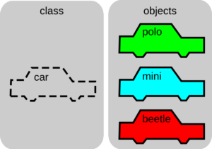
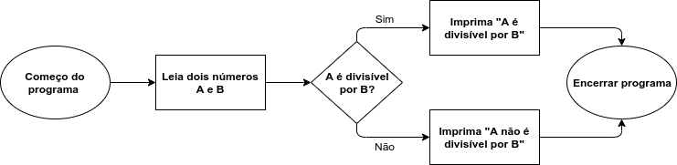
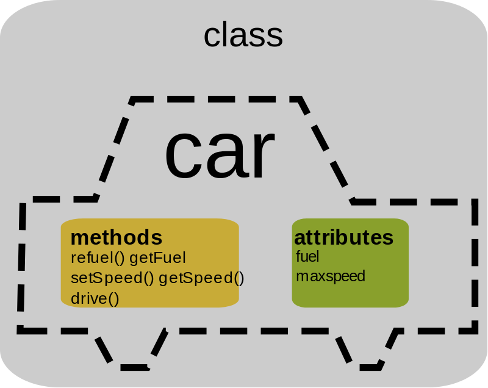
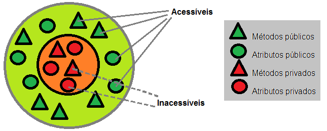
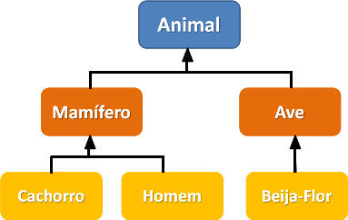
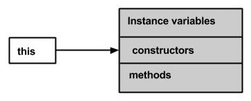

# Java e Orientação a Objetos

- [Java e Orientação a Objetos](#java-e-orientação-a-objetos)
  - [O que é Java?](#o-que-é-java)
  - [Conceitos, Regras e Convenções](#conceitos-regras-e-convenções)
    - [Nomeação](#nomeação)
    - [Sintaxe Básica](#sintaxe-básica)
    - [Identificadores](#identificadores)
    - [Palavras-chave](#palavras-chave)
    - [Regras de Declaração do Arquivo Fonte](#regras-de-declaração-do-arquivo-fonte)
    - [Pacote e Declarações de Importação](#pacote-e-declarações-de-importação)
  - [Objetos, Classes e Construtores](#objetos-classes-e-construtores)
    - [Classe](#classe)
    - [Objetos](#objetos)
    - [Construtores](#construtores)
      - [Reaproveitamento](#reaproveitamento)
  - [Modificadores](#modificadores)
    - [Referências](#referências)
  - [Variáveis](#variáveis)
    - [Data Types](#data-types)
      - [Conversões / Castings](#conversões--castings)
    - [Variáveis Locais](#variáveis-locais)
    - [Variáveis de Instância/Não Estáticas](#variáveis-de-instâncianão-estáticas)
    - [Variáveis de Classe/Estáticas](#variáveis-de-classeestáticas)
    - [Enums](#enums)
  - [Operadores](#operadores)
    - [Aritméticos](#aritméticos)
    - [Atribuição](#atribuição)
    - [Comparação](#comparação)
    - [Lógico](#lógico)
  - [Estruturas de Controle: Condicionais e Loops](#estruturas-de-controle-condicionais-e-loops)
  - [Arrays](#arrays)
    - [Acessando Elementos](#acessando-elementos)
    - [Alterando um Elemento](#alterando-um-elemento)
    - [Looping](#looping)
    - [Array Multidimensional](#array-multidimensional)
  - [Paradigma Procedural Vs. Objetos](#paradigma-procedural-vs-objetos)
  - [Principais Características de OOP](#principais-características-de-oop)
    - [Encapsulamento](#encapsulamento)
      - [Get e Set](#get-e-set)
      - [Por Que Encapsular?](#por-que-encapsular)
    - [Herança](#herança)
      - [Relacionamento IS-A](#relacionamento-is-a)
      - [Instância](#instância)
      - [Relação HAS-A](#relação-has-a)
      - [Tipos de Herança](#tipos-de-herança)
    - [Abstração](#abstração)
    - [Interface](#interface)
      - [Estendendo Interfaces](#estendendo-interfaces)
      - [Interfaces de Marcação](#interfaces-de-marcação)
      - [Notas Sobre Interfaces](#notas-sobre-interfaces)
      - [Por Que e Quando Usar?](#por-que-e-quando-usar)
    - [Polimorfismo](#polimorfismo)
    - [Substituição](#substituição)
      - [Regras para Substituição de Métodos](#regras-para-substituição-de-métodos)
    - [Pacotes](#pacotes)
      - [Criando um Pacote](#criando-um-pacote)
    - [Design Patters e SOLID](#design-patters-e-solid)
  - [Métodos](#métodos)
    - [Parâmetros e Argumentos](#parâmetros-e-argumentos)
    - [Valores de Retorno](#valores-de-retorno)
    - [Sobrecarga de um Método](#sobrecarga-de-um-método)
    - [Escopo](#escopo)
    - [Recursão](#recursão)
      - [Condição de Parada](#condição-de-parada)
    - [This](#this)
    - [Var-Args](#var-args)
    - [Finalize()](#finalize)

## O que é Java?

| Linguagem      | Plataforma  |
| -------------- | ----------- |
| O.O            | Portável    |
| Bibliotecas    | Fácil       |
| Parece com C++ | Segura      |
| Vários SOs     | Onipresente |


Com o surgimento de diferentes navegadores e sistemas operacionais, nasceu o seguinte incômodo: para escrever um código para um SO, utiliza-se uma linguagem, que por sua vez é compilado por um executável.

Isso significa que ele só funciona neste sistema operacional, com determinadas DLLs na máquina, e assim por diante. O executável e o código fonte ficavam atrelados a uma plataforma específica, um conjunto de sistema operacional, hardware e outros detalhes.

Uma tentativa para resolver este problema foi com um código de fonte único, que serviria como um intermediário que soubesse traduzir ou instruir o sistema operacional acerca dos comandos a serem enviados e recebidos.

Este intermediário foi o **JVM** → **J**ava **V**irtual **M**achine, que não é meramente um interpretador por conta de alguns detalhes internos que vão além da interpretação.

O código, então, seria a linguagem Java, e o código "executável", quando compilado, geraria um formato chamado bytecode Java, de extensão `.class`, lido pela Máquina Virtual Java, que passaria a informação aos sistemas operacionais.

```bytecode
Compiled from "Onibus.java"
class Teste {

    public static void main(java.lang.String);
      Code:
      0: new              #2  // class Onibus
      3: dup
      4: invokespecial    #3 Onibus."<init>":()V
      7: astore_1
      8: aload_1
      9: ldc              #4 // String Jabaquara...
     11: putfield         #5
       // Field Onibus.linha:Ljava/lang/String;
     14: return 
}
```

```java
public class Onibus {
  String nome;
  String linha;
}

class Teste {
  public static void main(String args) {
    Onibus o = new Onibus();
    o.linha = "Jabaquara-Liberdade";
  }
}
```

JRE → Java Runtime Environment. Ambiente de execução. `JRE = JVM + bibliotecas`.

JDK → Java Developer Kit. Ferramentas de desenvolvimento junto com o ambiente de execução. `JDK = JRE + ferramentas de desenvolvimento`.

Sobre compilação e execução:

1. Durante a compilação acontece uma verificação sintática do código fonte.

2. Na compilação e execução podem aparecer erros.

3. A JVM lê e executa o Bytecode.

4. O compilador gera o Bytecode caso não tenha nenhum erro sintático no código fonte.

```
javac Programa.java

java Programa
```

## Conceitos, Regras e Convenções

> Um programa Java pode ser definido como uma coleção de objetos que se comunicam por meio da chamada dos métodos uns dos outros.

É uma linguagem orientada a objetos, ou seja, em Java tudo é um objeto.

**Plataforma Java →**Consiste em duas partes principais – o ambiente de tempo de execução Java (JRE) e o kit de desenvolvimento Java (JDK). O JRE é necessário para executar aplicativos Java, enquanto o JDK é necessário para desenvolver aplicativos Java.

**Package →**  São o mecanismo usado para agrupar classes relacionadas em Java. Eles são usados para organizar melhor o código e evitar conflitos de nome.

**Object →** É uma instância de uma classe, tem estados e comportamentos. A criação de um objeto envolve a alocação de memória para esse objeto.

**Class →**  É a unidade básica de programação em Java. Ela é usada como um modelo para criar objetos, pode ser definida como um template/blueprint que descreve o comportamento/estado que o objeto de seu tipo suporta. Cada classe contém atributos (variáveis) e métodos (funções).

**Methods →** É basicamente um comportamento. É nos métodos onde as lógicas são escritas, os dados são manipulados e todas as ações são executadas. Uma classe pode conter muitos métodos.

**Instance Variables →** Cada objeto tem seu conjunto único de variáveis ​​de instância. O estado de um objeto é criado pelos valores atribuídos a essas variáveis ​​de instância.

**Inherence →** A herança é um recurso em Java que permite que uma classe (chamada de classe filha ou subclass) herde propriedades e comportamentos de outra classe (chamada de classe pai ou superclass). Basicamente, se você precisar criar uma nova classe e já houver uma classe que tenha parte do código de que você precisa, é possível derivar sua nova classe do código já existente. Isso ajuda a economizar tempo e esforço do desenvolvedor na criação de classes.

**Interface →** Pode ser definida como um contrato entre objetos sobre como se comunicarem entre si. Desempenham um papel vital quando se trata do conceito de herança. Define os métodos que uma classe derivada (subclasse) deve usar, mas a _impl_ementação dos métodos depende totalmente da subclasse.

**Polymorphism →** É uma característica que permite que um objeto se comporte de várias maneiras. Isso é realizado usando métodos com o mesmo nome, mas com diferentes parâmetros.


### Nomeação

| Identificador     | Regra                                                                                                                          | Exemplo                             |
| ----------------- | ------------------------------------------------------------------------------------------------------------------------------ | ----------------------------------- |
| Packages          | Lowercase com separação de "." e prefixos de domínio top-level como "com", "edu" e "gov"                                       | `com.apple.quicktime.v2`            |
| Classes           | CamelCase, simples e descritivas. Substantivo                                                                                  | `class ImageSprite;`                |
| Interfaces        | Capitalizado como classes. Adjetivos                                                                                           | `interface Storing;`                |
| Methods           | Mixed case. Verbos                                                                                                             | `getBackground();`                  |
| Variables         | Mnemonic, mixed case. Nunca começar com caracteres especiais. Nomear com um único caractere somente para variáveis temporárias | `int i;`, `float myWidth;`          |
| Constants         | Uppercase com separação de "_"                                                                                                 | `"static final int MIN_WIDTH = 4;"` |
| Program File Name | Deve corresponder exatamente ao nome da classe, exceto nos casos que não há uma classe pública no arquivo                      | `programa.java`                     |

### Sintaxe Básica

Um par de chaves define o escopo de cada classe e as instruções sempre terminam em ponto e vírgula ";".

**Case Sensitivity →** Diferencia maiúsculas de minúsculas, ou seja, **System** != **system**.

**public static void main(String args[]) →** O processamento do programa Java começa a partir do método `main ()`, que é uma parte obrigatória de todo programa Java.

> `main` → função/método que da entrada a uma aplicação.

Comentários podem ser de uma ou várias linhas, de forma semelhante a C, C++ e JavaScript.

```java
public class MyFirstJavaProgram {

   /* This is my first java program.
    * This will print 'Hello World' as the output
    * This is an example of multi-line comments.
    */

   public static void main(String []args) {
      // This is an example of single line comment
      /* This is also an example of single line comment. */
      System.out.println("Hello World"); // Hello Word
   }
}
```

### Identificadores

Todos os componentes Java requerem nomes, esses nomes usados ​​para classes, variáveis ​​e métodos são chamados de identifiers. A preferência é por nomes descritivos e não abreviados. Nomes de um caractere só podem ser usados, mas é de convenção que sejam temporários.

- Todos os identificadores devem começar com uma letra (A a Z ou a a z), caractere de moeda ($) ou um sublinhado (_).
- Após o primeiro caractere, os identificadores podem ter qualquer combinação de caracteres.
- Uma palavra-chave não pode ser usada como identificador.
- Mais importante ainda, os identificadores diferenciam maiúsculas de minúsculas.
- Exemplos de identificadores legais: idade, $ salary, _value, __1_value.
- Exemplos de identificadores ilegais: 123abc, -salary.

### Palavras-chave

Essas palavras reservadas não podem ser usadas como constantes ou variáveis ​​ou quaisquer outros nomes de identificador.

| Keyword      | Descrição                                                                                                                 |
| ------------ | ------------------------------------------------------------------------------------------------------------------------- |
| abstract     |                                                                                                                           |
| assert       | para debugging                                                                                                            |
| boolean      | data type que somente armazena valores true e false                                                                       |
| break        | quebra para fora de um loop ou de um bloco switch                                                                         |
| byte         | data type que armazena números inteiros  de -128 a 127                                                                    |
| case         | marca um bloco de código em declarações switch                                                                            |
| catch        | exceções catches geradas por declarações by                                                                               |
| char         | data type que é usada para armazenar um único caractere                                                                   |
| class        | define uma classe                                                                                                         |
| const        | define uma constante. **fora de uso**, use final                                                                          |
| default      | especifica o bloco de código default em uma declaração switch                                                             |
| do           | usado junto com while para criar um do-while loop                                                                         |
| double       | data type que pode armazenar números inteiros de 1.7e−308 a 1.7e+308                                                      |
| else         | usado em declarações condicionais                                                                                         |
| enum         | declara um tipo enumerado (imutável)                                                                                      |
| exports      | exporta um pacote com um módulo                                                                                           |
| extends      | estende uma classe (indica que aquela classe é herdada de outra)                                                          |
| final        | non-access modifier usado para classes, atributos e métodos, o que os faz imutáveis (impossíveis de herdar e sobrepor)    |
| finally      | usado com exceções, um bloco de código que vai executar não importa se há uma exceção ou não                              |
| float        | data type pode armazenar números inteiros de 3.4e−038 a 3.4e+038                                                          |
| for          | cria um for loop                                                                                                          |
| goto         | fora de uso não tem função                                                                                                |
| if           | cria uma declaração if                                                                                                    |
| _impl_ements | _impl_ementa uma interface                                                                                                |
| import       | usado para importar um pacote, classe ou interface                                                                        |
| instanceof   | checa se um objeto é uma instância de uma classe especifica ou uma interface                                              |
| int          | data type que pode armazenar números inteiros de -2147483648 a 2147483647                                                 |
| interface    | usado para declarar um tipo especial de classe que contem somente métodos abstratos                                       |
| long         | data type que pode armazenar números inteiros de -9223372036854775808 a 9223372036854775808                               |
| module       | declara um módulo                                                                                                         |
| native       | especifica que um método não é _impl_ementado no mesmo arquivo fonte java (mas em outra linguagem)                        |
| new          | cria novos objetos                                                                                                        |
| package      | declara um pacote                                                                                                         |
| private      | access modifier usado para atributos, métodos e construtores, fazendo deles acessíveis somente dentro da classe declarada |
| protected    | access modifier usado para atributos, métodos e construtores, fazendo deles acessíveis no mesmo pacote e subclasses       |
| public       | access modifier usado para atributos, métodos e construtores, fazendo deles acessíveis para qualquer outra classe         |
| requires     | especifica bibliotecas exigidas dentro do módulo                                                                          |
| return       | termina a execução de um método, e pode ser usado para retornar um valor de um método                                     |
| short        | data type que pode armazenar números inteiros de -32768 a 32767                                                           |
| static       | non-access modifier usado por métodos e atributos. Podem ser acessados sem criar o objeto de uma classe                   |
| strictfp     | restringe a precisão e o arredondamento de cálculos de pontos flutuantes                                                  |
| super        | refere para objetos de superclasses                                                                                       |
| switch       | seleciona um de vários blocos de códigos para ser executado                                                               |
| synchronized | non-access modifier, qual especifica que métodos podem somente ser acessadas por um thread por vez                        |
| this         | refere para o objeto atual em um método ou construtor                                                                     |
| throw        | cria um erro customizado                                                                                                  |
| throws       | indica qual exceções podem ser jogadas por um método                                                                      |
| transient    | non-access modifier, qual especifica que um atributo não é parte de um estado persistente de um objeto                    |
| try          | cria uma declaração try...catch                                                                                           |
| var          | declara uma variável                                                                                                      |
| void         | especifica que um método não deve ter um valor retornado                                                                  |
| volatile     | indica que um atributo não é thread-locally, e é sempre lido da "main memory"                                             |
| while        | cria um while loop                                                                                                        |

### Regras de Declaração do Arquivo Fonte

Essas regras são essenciais ao declarar classes, instruções de importação e instruções de pacote em um arquivo de origem.

- Só pode haver uma classe pública por arquivo de origem.
- Um arquivo de origem pode ter várias classes não públicas.
- O nome da classe pública deve ser o nome do arquivo de origem também, que deve ser anexado por `.java` no fim. Por exemplo: o nome da classe é `public class Employee {}` então o arquivo de origem deve ser como `Employee.java`.
- Se a classe for definida dentro de um pacote, a instrução do pacote deve ser a primeira instrução no arquivo de origem.
- Se houver instruções de importação, elas deverão ser escritas entre a instrução do pacote e a declaração da classe. Se não houver instruções de pacote, a instrução de importação deve ser a primeira linha no arquivo de origem.
- As instruções de importação e pacote implicarão em todas as classes presentes no arquivo de origem. Não é possível declarar instruções de importação e / ou pacote diferentes para classes diferentes no arquivo de origem.

### Pacote e Declarações de Importação

É uma forma de categorizar as classes e interfaces, sendo um grupo de classes relacionadas, pense em um pacote como uma pasta em um diretório. Ao desenvolver aplicativos Java, centenas de classes e interfaces serão escritas, portanto, categorizar essas classes é uma obrigação e torna a vida muito mais fácil. São usados para evitar conflitos de nomeação e escrever um código e fácil manutenção.

São divididos em duas categorias:

- Built-in (pacotes Java API)
- User-defined (criados pelo usuário)

Se um nome totalmente qualificado, que inclui o pacote e o nome da classe, for fornecido, o compilador pode localizar facilmente o código-fonte ou as classes. A instrução de importação é uma maneira de fornecer a localização adequada para o compilador encontrar essa classe específica.

```java
import package.name.Class;   // Import a single class
import package.name.*;   // Import the whole package
```

Alguns dos pacotes existentes em Java são:

- `java.lang` → agrupa as classes fundamentais
- `java.io` → classes para funções de entrada e saída são agrupadas neste pacote

```java
import java.io*;
```

Ao criar um pacote, é preciso escolher um nome para o pacote e incluir um package juntamente com esse nome no topo de cada arquivo de origem que contém as classes, interfaces, enumerações e tipos de anotação que você deseja incluir no pacote.

A instrução do pacote deve ser a primeira linha no arquivo de origem. Pode haver apenas uma instrução de pacote em cada arquivo de origem e se aplica a todos os tipos no arquivo.

```java
package mypack;
class MyPackageClass {
  public static void main(String[] args) {
    System.out.println("This is my package!");
  }
}
```

Se uma instrução de pacote não for usada, a classe, as interfaces, as enumerações e os tipos de anotação serão colocados no pacote padrão atual.

Para compilar os programas Java com instruções de pacote, você deve usar a opção -d conforme mostrado abaixo.

```
javac -d Destination_folder file_name.java

C:\Users\Your Name>javac -d . MyPackageClass.java
```

## Objetos, Classes e Construtores

Java é uma linguagem orientada a objetos, por isso possui recursos dos conceitos de Programação Orientada a Objetos, como:

- Polimorfismo
- Herança
- Encapsulamento
- Abstração
- Classes
- Objetos
- Instância
- Método
- Passagem de mensagens

Uma classe é um conjunto de características e comportamentos que definem o conjunto de objetos pertencentes à essa classe, ou seja, a classe é um template para o objeto, que por fim, é a instância de uma classe. 

| Classe | Objeto  |
| ------ | ------- |
| Fruta  | Maça    |
| Fruta  | Laranja |
| Fruta  | Banana  |
| Carro  | Impala  |
| Carro  | Camaro  |
| Carro  | Fusca   |

No entanto, a classe em si é um conceito abstrato, como um molde, que se torna concreto e palpável através da criação de um objeto. Chamamos essa criação de ***instanciação da classe***, como se estivéssemos usando esse molde (classe) para criar um objeto.



```java
public class Carro {
    Double velocidade;
    String modelo;

    public Carro(String modelo) {
        this.modelo = modelo;
        this.velocidade = 0;
    }

    public void acelerar() {
        /* código do carro para acelerar */
    }

    public void frear() {
        /* código do carro para frear */
    }

    public void acenderFarol() {
        /* código do carro para acender o farol */
    }
}
```

### Classe

Uma classe é um template/blueprint a partir do qual objetos são criados. É uma entidade lógica, não pode ser física. Funciona como um grupo de objetos que possuem propriedades em comum.

Uma classe em Java contem:

- Domínio
- Métodos
- Construtores
- Blocos
- Classes aninhadas e interface

```java
public class Main {
  int x = 5;
}
```


```java
class <NomeDaClasse> {
   field;
   method;
}
```

```java
class Student{  
 int id;  
 String name;  
}

class TestStudent2{  
 public static void main(String args[]){  
  Student s1 = new Student();  
  s1.id =  101;  
  s1.name = "Sonoo";  
  System.out.println(s1.id+" "+s1.name); //101 Sonoo
 }  
}  
```

Pode conter qualquer um dos tipos de variáveis:

- Locais → Variáveis ​​definidas dentro de métodos, construtores ou blocos são chamadas de variáveis ​​locais. A variável será declarada e inicializada dentro do método e a variável será destruída quando o método for concluído.
- De instância → Variáveis ​​de instância são variáveis ​​dentro de uma classe, mas fora de qualquer método. Essas variáveis ​​são inicializadas quando a classe é instanciada. Variáveis ​​de instância podem ser acessadas de dentro de qualquer método, construtor ou blocos daquela classe particular.
- De classe → Variáveis ​​de classe são variáveis ​​declaradas dentro de uma classe, fora de qualquer método, com a palavra-chave estática.

Uma classe pode ter vários métodos para acessar o valor de vários tipos de métodos.

### Objetos

Eles têm estados e comportamentos. Um objeto é uma instância de uma classe, ou seja, a classe é um template/blueprint na qual os objetos são criados. Então, um objeto é a instância (resultado) de uma classe. Sua criação envolve a alocação de memória para esse objeto.

Um exemplo: Um gato tem estados - cor, nome, raça; e também comportamento - miar, comer, espreitar. Ao comparar os objetos de software com objetos reais, pode se observar muitas semelhanças. Eles também possuem um estado e um comportamento - o estado de um objeto de software é armazenado em campos e o comportamento é mostrado por meio de métodos.

Um objeto tem 3 características:

- Estado → representa o dado (valor) de um objeto
- Comportamento → representa o comportamento (funcionalidade) de um objeto como: deposito, pagamento, transferência...
- Identidade → a identidade de um objeto é tipicamente implementado via um ID único. O valor de um ID não é visível para um user externo. No entanto, é usado internamente pelo JVM para identificar cada objeto unicamente


Dessa forma, no desenvolvimento de software, os métodos operam no estado interno de um objeto e a comunicação objeto a objeto é feita por meio de métodos.

```java
public class Main {
  int x = 5;

  public static void main(String[] args) {
    Main myObj1 = new Main();  // Object 1
    Main myObj2 = new Main();  // Object 2
    System.out.println(myObj1.x);
    System.out.println(myObj2.x);
  }
}
```

### Construtores

Um construtor em Java é um método especial que é usado para inicializar objetos. Ele tem o mesmo nome de sua classe e é sintaticamente semelhante a um método. No entanto, os construtores não têm um tipo de retorno explícito. Pode ser usado para definir valores iniciais para atributos de objetos.

```java
class ClassName {
   ClassName() {
   }
}
```

Cada classe possui um construtor. Se não escrevemos explicitamente um construtor para uma classe, o compilador Java construirá um construtor padrão para esta classe. Cada vez que um novo objeto é criado, pelo menos um construtor será chamado. A regra principal dos construtores é que eles devem ter o mesmo nome da classe. Uma classe pode ter mais de um construtor.


```java
public class Puppy {
   public Puppy() {
   }

   public Puppy(String name) {
      // This constructor has one parameter, name.
   }
}
```

O Java permite 2 tipos de construtores:

- Sem argumento
  - Não aceitam nenhum parâmetro, usando esses construtores, as variáveis ​​de instância de um método serão inicializadas com valores fixos para todos os objetos.

```java
Public class MyClass {
   Int num;
   MyClass() {
      num = 100;
   }
}

public class ConsDemo {
   public static void main(String args[]) {
      MyClass t1 = new MyClass();
      MyClass t2 = new MyClass();
      System.out.println(t1.num + " " + t2.num); // 100 100
   }
}
```

- Parametrizados
  - Aceitam um ou mais parâmetros. Os parâmetros são adicionados a um construtor da mesma forma que são adicionados a um método, basta declará-los dentro dos parênteses após o nome do construtor.

```java
// A simple constructor.
class MyClass {
   int x;
   
   // Following is the constructor
   MyClass(int i ) {
      x = i;
   }
}

public class ConsDemo {
   public static void main(String args[]) {
      MyClass t1 = new MyClass( 10 );
      MyClass t2 = new MyClass( 20 );
      System.out.println(t1.x + " " + t2.x); // 10 20
   }
}
```

#### Reaproveitamento

Em algumas situações é necessário reaproveitar algum código em outro para evitar duplicações e facilitar a manutenção. A maneira de se fazer isto é chamando o construtor dentro de outro usando `this`.

```java
// A simple constructor.
class MyClass {
   int x;
   int y;
   
   // Following is the constructor
   public MyClass(int i, int n ) {
      x = i;
      y = n;
   }

   public myClass(int i) {
    this(9, y)
   }
}

public class ConsDemo {
   public static void main(String args[]) {
      MyClass t1 = new MyClass( 10, 15 );
      MyClass t2 = new MyClass( 20 );
      System.out.println(t1.x + " " + t2.x); // 10 9
   }
}
```

## Modificadores

São palavras-chave que se adiciona a essas definições para alterar seus significados, para modificar o acesso de classes, atributos, métodos, etc.

```java
public class className {
   // ...
}

private boolean myFlag;
static final double weeks = 9.5;
protected static final int BOXWIDTH = 42;

public static void main(String[] arguments) {
   // body of method
}
```

É possível modificar classes, métodos, etc. Existem duas categorias de modificadores:

- **Access Modifiers →** Controla o level de acesso. Padrão, público, protegido, privado.

   - Visível para o pacote, o padrão. Nenhum modificador é necessário.
   - Visível apenas para a classe (particular).
   - Visível para o mundo (público).
   - Visível para o pacote e todas as subclasses (protegidas).

Para classes:

| Modificador | Descrição                                                                                                  |
| ----------- | ---------------------------------------------------------------------------------------------------------- |
| `public`    | a classe é acessível para qualquer outra                                                                   |
| default     | a classe é somente acessível por classes no mesmo pacote. É usado quando um modificador não é especificado |

Para atributos, métodos e construtores:

| Modificador | Descrição                                                                                                   |
| ----------- | ----------------------------------------------------------------------------------------------------------- |
| `public`    | o código é acessível para qualquer outra                                                                    |
| default     | o código é somente acessível por classes no mesmo pacote. É usado quando um modificador não é especificado. |
| `private`   | o código é somente acessível dentro da classe declarada                                                     |
| `protected` | o código é acessível no mesmo pacote e subclasses                                                           |

- **Non-access Modifiers →** Não controla o level de acesso, mas fornece outras funcionalidades. Final, abstrato, strictfp.
   - O modificador estático para criar métodos e variáveis ​​de classe.
   - O modificador final para finalizar as implementações de classes, métodos e variáveis.
   - O modificador abstrato para criar classes e métodos abstratos.
   - Os modificadores sincronizados e voláteis , que são usados ​​para threads.

Para classes:

| Modificador | Descrição                                                                                                                         |
| ----------- | --------------------------------------------------------------------------------------------------------------------------------- |
| `final`     | a classe não pode ser herdada por outras classes                                                                                  |
| `abstract`  | a classe não pode ser usada para criar objetos (para acessar uma classe abstrata, é preciso que ela seja herdada de outra classe) |

Para atributos e métodos:

| Modificador    | Descrição                                                                                                    |
| -------------- | ------------------------------------------------------------------------------------------------------------ |
| `final`        | Atributos e métodos não podem ser sobrepostos/modificados                                                    |
| `abstract`     | Só pode ser utilizado numa classe abstrata e só pode ser utilizado em métodos. O método não tem um corpo     |
| `static`       | os atributos e métodos pertencem a classe, e não a um objeto                                                 |
| `transient`    | os atributos e métodos são ignorados ao serializar o objeto que os contém                                    |
| `synchronized` | os métodos só podem ser acessados por um thread de cada vez                                                  |
| `volatile`     | o valor de um atributo não é armazenado em cache localmente no thread e é sempre lido da "memória principal" |

### Referências

## Variáveis

São usadas para armazenar dados. Cada variável em Java possui um tipo específico, que determina o tamanho e o layout da memória da variável; a faixa de valores que podem ser armazenados nessa memória; e o conjunto de operações que podem ser aplicadas à variável. Podem ser do tipo primitivo (int, double, boolean, etc.) ou do tipo de objeto (String, Scanner, etc.). 

Uma variável deve ser declarada antes de ser usada. Para declarar uma variável é sempre necessário começar pelo seu tipo acompanhado do nome. Seu valor pode ser atribuído na mesma linha ou após.

```java
data type variable [= value][, variable [= value]...];
```

Podem ser: locais, de classe (estáticas) ou de instância (não estáticas).

```java
int x;
x = 10;
double y = 20.5;
String name = “Daniel";

int; // resulta em erro
x = 2; // resulta em erro
```

```java
// Declarando múltiplas variáveis de mesmo tipo
int x = 5, y = 6, z = 7;

// Declarando múltiplas variáveis de mesmo tipo e valor
int x, y, z;
x = y = z = 50;
```

### Data Types

Estão divididos em 2 grupos:

- Primitivos → Incluindo `byte`, `short`, `int`, `long`, `float`, `double`, `boolean` e `char`.
- Não-primitivos → Como `String`, `Arrays` e `Classes`.

Os data-types primitivos especificam tamanho e tipo de valor das variáveis, e não possuem nenhum método adicional.

| Data-type | Size    | Descrição                                                                     | Valor Default   |
| --------- | ------- | ----------------------------------------------------------------------------- | --------------- |
| `byte`    | 1 byte  | armazena números inteiros  de -128 a 127                                      | 0               |
| `short`   | 2 bytes | pode armazenar números inteiros de -32768 a 32767                             | 0               |
| `int`     | 4 bytes | pode armazenar números inteiros de -2147483648 a 2147483647                   | 0               |
| `long`    | 8 bytes | pode armazenar números inteiros de -9223372036854775808 a 9223372036854775808 | 0L              |
| `float`   | 4 bytes | pode armazenar números inteiros de 3.4e−038 a 3.4e+038                        | 0.0f            |
| `double`  | 8 bytes | pode armazenar números inteiros de 1.7e−308 a 1.7e+308                        | 0.0d            |
| `boolean` | 1 bit   | armazena valores true e false                                                 | false           |
| `char`    | 2 bytes | usada para armazenar um único caractere/letra ou valor ASCII                  | \u0000′ or null |

```java
int idade = 21;
float preco = 17.50f; // precisão de 6/7 decimais
double altura = 1.65d; // precisão até 15 decimais
char inicial = 'O';
boolean testeLogico = true;
long grande = 15000000000L;
```

- Tipos inteiros armazenam números inteiros, positivos ou negativos, sem decimais. Eles são: `byte`, `short`, `int` e `long`.
- Tipos de pontos flutuantes representam números com partes fracionadas, contendo um ou mais decimais. Eles são: `float` e `double`.

Os mais usados são `int` e `double`.

Números flutuantes podem ser um número científico com um "e" para indicar a elevação na décima potência.

```java
float f1 = 35e3f
double d1 = 12E4d
```

- `char` armazena um único caractere, que deve estar entre aspas simples. Alternativamente, um valor ASCII também pode ser usado.
- `String` armazena uma sequência de caracteres (texto). Valores string devem estar entre aspas duplas.

```java
char letra = 'S';
char ascii =  65;

String frase = "programação em java"
```

Os tipos não-primitivos são chamados de tipos de referência porque se referem a objetos. Suas principais diferença para os primitivos é:

- Tipos primitivos são pré-definidos no Java. Tipos não-primitivos são criados pelo programador e não são definidos pelo Java (exceto por `String`).
- Podem ser usados para chamar métodos para performar certas operações, enquanto primitivos não podem.
- Primitivos sempre tem um valor, enquanto não-primitivos podem ser `null`.
- Primitivos começam com letras minúsculas, não-primitivos começam com letras maiúsculas.
- O tamanho dos tipos primitivos depende do data type, enquanto os não-primitivos tem todos os mesmos tamanhos.
- O valor padrão de todos os tipos de referência é `null`.

Exemplos de tipos não-primitivos são: `String`, `Arrays`, `Interface`, etc.

Data types primitivos armazenam valores, não são referências, ou seja:

```java
int valorInicial = 7;
int valorSecundario = 11;
System.out.println(valorSecundario); // 11

valorSecundario = valorInicial;
System.out.println(valorSecundario); // 7

valorInicial = 13;
System.out.println(valorSecundario); // 7
```

#### Conversões / Castings

Casting é quando se atribui um valor de uma dado primitivo para outro. Em Java, há 2 tipos de casting:

- **Widening Casting (automático) →** converte um tipo menor para um tipo maior.
  - `byte` → `short` → `char` → `int` → `long` → `float` → `double`
- **Narrowing Casting (manual) →** converte um tipo maior para um tipo menor.
  - `double` → `float` → `long` → `int` → `char` → `short` → `byte`

```java
// Widening, automático. tipoMaior = varDoTipoMenor
int inteiro = 9;
double flutuante = inteiro; // automático: int para double
System.out.println(flutuante) // 9.0

// Narrowing, manual. tipoMenor var = (tipoMaior) var
double salario = 1270.50;
int convertido = (int) salario; // manual: double para int
System.out.println(valor) // 1270

char caractere = 66;
System.out.println(caractere); // B
caractere = (char) (caractere + 1);
System.out.println(caractere); // C
```

| De/Para  | `byte` | `short` | `char` | `int`   | `long`  | `float` | `double` |
| -------- | ------ | ------- | ------ | ------- | ------- | ------- | -------- |
| `byte`   | ---    | _impl_. | (char) | _impl_. | _impl_. | _impl_. | _impl_.  |
| `short`  | (byte) | ---     | (char) | _impl_. | _impl_. | _impl_. | _impl_.  |
| `char`   | (byte) | (short) | ---    | _impl_. | _impl_. | _impl_. | _impl_.  |
| `int`    | (byte) | (short) | (char) | ---     | _impl_. | _impl_. | _impl_.  |
| `long`   | (byte) | (short) | (char) | (int)   | ---     | _impl_. | _impl_.  |
| `float`  | (byte) | (short) | (char) | (int)   | (long)  | ---     | _impl_.  |
| `double` | (byte) | (short) | (char) | (int)   | (long)  | (float) | ---      |

### Variáveis Locais

- São declaradas em métodos, construtores ou blocos.
- São criadas quando o método, construtor ou bloco é inserido e a variável será destruída assim que sair do método, construtor ou bloco.
- Os modificadores de acesso não podem ser usados para variáveis locais.
- São visíveis apenas dentro do método declarado, construtor ou bloco.
- São implementadas no nível da pilha internamente.
- Não há valor padrão para variáveis locais, então elas devem ter um valor inicial atribuído antes do primeiro uso.

```java
public class Test {
   public void pupAge() {
      int age = 0;
      age = age + 7;
      System.out.println("Puppy age is : " + age);
   }

   public static void main(String args[]) {
      Test test = new Test();
      test.pupAge(); // Puppy age is: 7 
   }
}
```

### Variáveis de Instância/Não Estáticas

- São declaradas em uma classe, mas fora de um método, construtor ou qualquer bloco.
- Quando um espaço é alocado para um objeto no heap, um slot para cada valor de variável de instância é criado.
- São criadas quando um objeto é criado com o uso da keyword `new` e destruídas quando o objeto é destruído.
- Contêm valores que devem ser referenciados por mais de um método, construtor ou bloco, ou partes essenciais do estado de um objeto que devem estar presentes em toda a classe.
- Podem ser declaradas em nível de classe antes ou depois do uso.
- Modificadores de acesso podem ser fornecidos para variáveis de instância.
- São visíveis para todos os métodos, construtores e bloco da classe. Normalmente, é recomendável tornar essas variáveis privadas (nível de acesso). No entanto, a visibilidade para subclasses pode ser dada para essas variáveis com o uso de modificadores de acesso.
- Têm valores padrão. Para números, o valor padrão é 0, para booleanos é falso e para referências de objetos é nulo. Os valores podem ser atribuídos durante a declaração ou no construtor.
- Podem ser acessadas diretamente chamando o nome da variável dentro da classe. No entanto, nos métodos estáticos (quando as variáveis ​​de instância têm acessibilidade), eles devem ser chamados usando o nome totalmente qualificado.

```java
import java.io.*;
public class Employee {

   // this instance variable is visible for any child class.
   public String name;

   // salary  variable is visible in Employee class only.
   private double salary;

   // The name variable is assigned in the constructor.
   public Employee (String empName) {
      name = empName;
   }

   // The salary variable is assigned a value.
   public void setSalary(double empSal) {
      salary = empSal;
   }

   // This method prints the employee details.
   public void printEmp() {
      System.out.println("name  : " + name );
      System.out.println("salary :" + salary);
   }

   public static void main(String args[]) {
      Employee empOne = new Employee("Ransika");
      empOne.setSalary(1000);
      empOne.printEmp(); // name  : Ransika /// salary :1000.0
   }
}
```

### Variáveis de Classe/Estáticas

- São declaradas com a keyword `static` em uma classe, mas fora de um método, construtor ou bloco.
- Haveria apenas uma cópia de cada variável de classe por classe, independentemente de quantos objetos são criados a partir dela.
- Raramente são usadas além de serem declaradas como constantes. Constantes são variáveis ​​declaradas como públicas / privadas, finais e estáticas. Variáveis ​​constantes nunca mudam de seu valor inicial.
- São armazenadas na memória estática. É raro usar variáveis ​​estáticas que não sejam declaradas finais e usadas como constantes públicas ou privadas.
- São criadas quando o programa é iniciado e destruídas quando o programa é interrompido.
- A visibilidade é semelhante às variáveis ​​de instância. No entanto, a maioria das variáveis ​​estáticas são declaradas públicas, pois devem estar disponíveis para os usuários da classe.
- Os valores padrão são iguais às variáveis ​​de instância. Para números, o valor padrão é 0; para os booleanos, é falso; e para referências de objeto, é nulo. Os valores podem ser atribuídos durante a declaração ou no construtor. Além disso, os valores podem ser atribuídos em blocos inicializadores estáticos especiais.
- Podem ser acessadas chamando com o nome de classe `ClassName.VariableName`.
- Ao declarar variáveis ​​de classe como `public static final`, os nomes de variáveis ​​(constantes) estão todos em maiúsculas. Se as variáveis ​​estáticas não forem públicas e finais, a sintaxe de nomenclatura será a mesma que as variáveis ​​de instância e locais.

```java
import java.io.*;
public class Employee {

   // salary  variable is a private static variable
   private static double salary;

   // DEPARTMENT is a constant
   public static final String DEPARTMENT = "Development ";

   public static void main(String args[]) {
      salary = 1000;
      System.out.println(DEPARTMENT + "average salary:" + salary); // Development average salary:1000
   }
}
```
> Se as variáveis ​​forem acessadas de uma classe externa, a constante deve ser acessada como Employee.DEPARTMENT

### Enums
Restringem uma variável para ter apenas alguns valores predefinidos. Com o uso de enums, é possível reduzir o número de bugs no código.

```java
class FreshJuice {
   enum FreshJuiceSize{ SMALL, MEDIUM, LARGE }
   FreshJuiceSize size;
}

public class FreshJuiceTest {

   public static void main(String args[]) {
      FreshJuice juice = new FreshJuice();
      juice.size = FreshJuice.FreshJuiceSize.MEDIUM ;
      System.out.println("Size: " + juice.size); // Size: MEDIUM
   }
}
```

>  Enums podem ser declarados como próprios ou dentro de uma classe. Métodos, variáveis ​​e construtores também podem ser definidos dentro de enums.

## Operadores

São usados para operações entre variáveis e valores, podem ser: aritméticos, de atribuição, comparativos, lógicos e bitwise.

### Aritméticos

| Operador | Nome          | Descrição                      | Exemplo |
| -------- | ------------- | ------------------------------ | ------- |
| +        | Adição        | Adiciona valores e variáveis   | x + y   |
| -        | Subtração     | Subtrai valores                | x - y   |
| *        | Multiplicação | Multiplica valores             | x * y   |
| /        | Divisão       | Divide um valor por outro      | x / y   |
| %        | Módulos       | Retorna o resto de uma divisão | x % y   |
| ++       | Acréscimo     | Incrementa o valor por 1       | ++x     |
| --       | Decréscimo    | Diminui o valor por 1          | --x     |

O operador `+` também concatena strings e valores.

Operações entre inteiros sempre irão resultar em um valor inteiro. Se a variável for declarada como um tipo de ponto flutuante, seu resultado será arrendondado, é necessário que, pelo menos, um do valores seja um número decimal para devolver o resultado exato.

```java
double divisao = 5 / 2;
System.out.println(divisao); // 2

divisao = 5.0 / 2;
System.out.println(divisao); // 2.5
```


### Atribuição

| Operador | Exemplo | O mesmo que |
| -------- | ------- | ----------- |
| =        | x = 5   | x = 5       |
| +=       | x += 3  | x = x + 3   |
| -=       | x -= 3  | x = x - 3   |
| *=       | x *= 3  | x = x * 3   |
| /=       | x /= 3  | x = x / 3   |
| %=       | x %= 3  | x = x % 3   |
| &=       | x &= 3  | x = x & 3   |
| \|=      | x \|= 3 | x = x \| 3  |
| ^=       | x ^= 3  | x = x ^ 3   |
| >>=      | x >>= 3 | x = x >> 3  |
| <<=      | x <<= 3 | x = x << 3  |

### Comparação

| Operador | Nome                 | O mesmo que |
| -------- | -------------------- | ----------- |
| ==       | Igual a              | x == y      |
| !=       | Diferente de         | x != y      |
| >        | Maior que            | x > y       |
| <        | Menor que            | x < y       |
| >=       | Maior que ou igual a | x >= y      |
| <=       | Menor que ou igual a | x <= y      |

### Lógico

| Operador | Nome       | Descrição                                                        | Exemplo            |
| -------- | ---------- | ---------------------------------------------------------------- | ------------------ |
| &&       | Lógico and | Retorna true se ambas declarações forem verdadeiras              | x < 5 && x < 10    |
| \|\|     | Lógico  or | Retorna true se uma das declarações for verdadeira               | x < 5 \|\| x < 4   |
| !        | Lógico not | Reverte o resultado, retorna false se o resultado for verdadeiro | !(x < 5 && x < 10) |

## Estruturas de Controle: Condicionais e Loops

As estruturas de controle são usadas para controlar o fluxo de um programa. As estruturas mais comuns são if-else, switch-case, while, do-while e for. Condicionais são declarações que definem decisões que influenciam se uma declaração vai ou não ser executada, qual será a declaração executada dentre diferentes opções e também fazem o controle de loop.

O Java tem as seguintes declarações condicionais:

- `if` é usado para especificar que um bloco de código deve ser executado se a condição retorna `true`

```java
if (condition) {
   // code
}
```

```java
int x = 20, y = 18;
if (x > y) { // true
   System.out.println("20 é maior que 18")
}
```

- `else` é usado para especificar que um bloco de código deve ser executado se a condição retorna `false`

```java
if (condition) {
   // code
} else {
   // code
}
```

```java
int time = 20;
if (time < 18) { // false
   System.out.println("Bom dia")
} else {
   System.out.println("Bom tarde") // esse será o output
}
```

- `else if` é usado para especificar uma nova condição se a primeira condição retorna `false`

```java
if (condition) {
   // code
} else if (condition) {
   // code
} else {
   // code
}
```

```java
int time = 22;
if (time < 10) { // false
   System.out.println("Bom dia")
} else if (time < 18) { // false
   System.out.println("Bom tarde")
} else {
   System.out.println("Bom noite") // este será o output
}
```

- Short hand `if...else`, conhecido como operador ternário, pois consiste em 3 operadores

```java
variable = (condition) ? expressionTrue : expressionFalse;
```

```java
int time = 20;
String result = (time < 18) ? "Bom dia" : "Boa tarde".
System.out.println(result);
```

- `switch` seleciona um de vários blocos de código para ser executado. Pode substituir o `if...else`
  - A expressão `switch` é avaliada somente uma vez
  - O valor da expressão é comparado com os valores de cada caso
  - Se houver um match, o bloco de código associado será executado
  - `break` e `default` são keywords opcionais
  - Só aceita → `int`, `String` e `Enum`.

```java
switch (expression) {
   case x:
      // code
      break;
   case y:
      // code
      break; // para a execução, "quebra" para fora do bloco
   default: // bloco que será executado se não houver match nos outros casos
      // code
}
```

```java
int day = 4;
switch (day) {
  case 1:
    System.out.println("Monday");
    break;
  case 2:
    System.out.println("Tuesday");
    break;
  case 3:
    System.out.println("Wednesday");
    break;
  case 4:
    System.out.println("Thursday");
    break;
  case 5:
    System.out.println("Friday");
    break;
  case 6:
    System.out.println("Saturday");
    break;
  case 7:
    System.out.println("Sunday");
    break;
}
// Outputs "Thursday" (day 4)
```

- O loop `while` é um bloco de código que itera enquanto uma condição for `true`

```java
while (condition) {
  // code
}
```

```java
int i = 0;
while (i < 5) {
  System.out.println(i);
  i++; // 0 1 2 3 4
}
```

- O loop `do/while` é uma variante do loop `while`. Ele irá executar o bloco de código uma vez, ante de verificar se a condição é verdadeira, então irá repetir enquanto a condição for verdadeira

```java
do {
  // code
}
while (condition);
```

```java
int i = 0;
do {
  System.out.println(i); // 0 1 2 3 4
  i++;
}
while (i < 5);
```

- O loop `for` é usado quando se sabe exatamente quantas vezes se quer iterar um bloco de código
  - 1ª declaração: é executada uam vez antes da execução do bloco de código
  - 2ª declaração: define a condição para a execução
  - 3ª declaração: é executada toda vez após o bloco de código ser executado 

```java
for (statement 1; statement 2; statement 3) {
  // code 
}
```

```java
for (int i = 0; i < 5; i++) {
  System.out.println(i);
}
```

- Nested loops: é possível colocar um loop dentro de outro. O "loop interno" irá ser executado uma vez para cada iteração do "loop externo"

```java
// Outer loop
for (int i = 1; i <= 2; i++) {
  System.out.println("Outer: " + i); // Executes 2 times
  
  // Inner loop
  for (int j = 1; j <= 3; j++) {
    System.out.println(" Inner: " + j); // Executes 6 times (2 * 3)
  }
} 
```

- O loop `for-each` é usado exclusivamente para iterar em um array

```java
for (type variableName : arrayName) {
  // code
}
```

```java
String[] cars = {"Volvo", "BMW", "Ford", "Mazda"};
for (String i : cars) {
  System.out.println(i);
}
```

- As declarações `break` e `continue` são opcionais e podem respectivamente:
  - "quebrar" para fora de um loop
  - pular uma iteração, continuando para a próxima

```java
for (int i = 0; i < 10; i++) {
  if (i == 4) {
    break;
  }
  System.out.println(i);
}
```

```java
int i = 0;
while (i < 10) {
  if (i == 4) {
    i++;
    continue;
  }
  System.out.println(i);
  i++;
}
```

- O loop aprimorado (introduzido no Java 5) é usado principalmente para percorrer a coleção de elementos, incluindo matrizes.
  - Declaração: a variável de bloco recém-declarada é de um tipo compatível com os elementos do array que você está acessando. A variável estará disponível dentro do bloco `for` e seu valor seria o mesmo que o elemento atual do array.
  - Expressão: isso avalia a matriz pela qual você precisa fazer o loop. A expressão pode ser uma variável de matriz ou chamada de método que retorna uma matriz.

```java
for(declaration : expression) {
   // Statements
}
```

```java
public class Test {

   public static void main(String args[]) {
      int [] numbers = {10, 20, 30, 40, 50};

      for(int x : numbers ) {
         System.out.print( x );
         System.out.print(",");
      }
      System.out.print("\n");
      String [] names = {"James", "Larry", "Tom", "Lacy"};

      for( String name : names ) {
         System.out.print( name );
         System.out.print(",");
      }
   }
}
/* OUTPUT
10, 20, 30, 40, 50,
James, Larry, Tom, Lacy,
/*
```

## Arrays

É uma estrutura de dados que armazena uma coleção sequencial de tamanho fixo de elementos do mesmo tipo.

São objetos que armazenam vários valores em uma única variável, ao invés de declarar uma por valor. No entanto, uma matriz em si é um objeto na pilha. Arrays são muito usados exatamente por sua capacidade de conter múltiplos valores em um único espaço de memória, o que melhora performance e funcionalidade.

Em vez de declarar um por um, como: var0, var1, ... e var99, você declara uma variável de matriz, como números e usa var[0], var[1] e ..., var[99] para representar variáveis ​​individuais.

```java
dataType[] arrayRefVar;   // preferred way.
or
dataType arrayRefVar[];  // works but not preferred way.
```

```java
String[] cars;
String[] cars = {"Volvo", "BMW", "Ford", "Mazda"};

int[] myNum;
int[] myNum = {10, 20, 30, 40};
```

A declaração a baixo faz duas coisas:

- Ele cria uma matriz usando novo dataType [arraySize].
- Ele atribui a referência do array recém-criado à variável arrayRefVar.

```java
arrayRefVar = new dataType[arraySize];
```

Declarar uma variável de matriz, criar uma matriz e atribuir a referência da matriz à variável podem ser combinados em uma instrução:

```java
dataType[] arrayRefVar = new dataType[arraySize];
```

Alternativamente:

```java
dataType[] arrayRefVar = {value0, value1, ..., valuek};
```

### Acessando Elementos

Qualquer elemento em um array pode ser acessado se referindo ao seu número de index. Os números de index começam a contar a partir do 0, ou seja, uma lista com 5 elementos segue: `0 1 2 3 4`.

```java
double[] myList = new double[10];
```


```java
String[] cars = {"Volvo", "BMW", "Ford", "Mazda"};
System.out.println(cars[0]);
// Outputs Volvo
```

### Alterando um Elemento

Para alterar o valor de um elemento específico é necessário se referir ao seu número index.

```java
String[] cars = {"Volvo", "BMW", "Ford", "Mazda"};
cars[0] = "Opel";
System.out.println(cars[0]);
// Now outputs Opel instead of Volvo
```

### Looping

```java
String[] cars = {"Volvo", "BMW", "Ford", "Mazda"};
for (int i = 0; i < cars.length; i++) {
  System.out.println(cars[i]);
}
```

```java
String[] cars = {"Volvo", "BMW", "Ford", "Mazda"};
for (String i : cars) {
  System.out.println(i);
}
```

### Array Multidimensional

É um array de arrays. Sua funcionalidade principal é armazenar dados de forma tabular.

```java
int[][] myNumbers = { {1, 2, 3, 4}, {5, 6, 7} };
```

Para acessar é necessário especificar 2 indexes: um para o array, e outro para o elemento dentro daquele array. Como exemplo segue o terceiro elemento (2) do segundo array (1):

```java
int[][] myNumbers = { {1, 2, 3, 4}, {5, 6, 7} };
System.out.println(myNumbers[1][2]); // Outputs 7
```

Looping:

```java
public class Main {
  public static void main(String[] args) {
    int[][] myNumbers = { {1, 2, 3, 4}, {5, 6, 7} };
    for (int i = 0; i < myNumbers.length; ++i) {
      for(int j = 0; j < myNumbers[i].length; ++j) {
        System.out.println(myNumbers[i][j]);
      }
    }
  }
}
```

## Paradigma Procedural Vs. Objetos

A programação procedural (ou estruturada) é formada por procedimentos ou métodos que performam operações sobre os dados, enquanto a programação orientada a objetos (OOP ou POO) é formada por objetos que contêm ambos dados e métodos.

Na programação estruturada, um programa é composto por três tipos básicos de estruturas:

- Sequências: comandos a serem executados
- Condições: sequências que só devem ser executadas se uma condição for satisfeita
- Repetições: sequências que devem ser repetidas até/enquanto uma condição for satisfeita

Essas estruturas são usadas para processar a entrada do programa, alterando os dados até que a saída esperada seja gerada. Todas essas estruturas também existem na programação orientada a objetos.

A diferença principal é que, na programação procedural, um programa é escrito em uma única função, que pode ser quebrada em subfunções. Mas o fluxo continua o mesmo, como se pudéssemos copiar e colar o código das subfunções diretamente nas funções que as chamam, de forma que só haja uma grande função que execute todo o programa.



Além disso, o acesso às variáveis não possuem muitas restrições na programação estruturada. Em linguagens fortemente baseadas nesse paradigma, restringir o acesso à uma variável se limita a dizer se ela é visível ou não dentro de uma função (ou módulo, como no uso da palavra-chave `static`, na linguagem C), mas não se consegue dizer de forma nativa que uma variável pode ser acessada por apenas algumas funções do programa.

O contorno para situações como essas envolve práticas de programação danosas ao desenvolvimento do sistema, como o uso excessivo de variáveis globais. Vale lembrar que variáveis globais são usadas tipicamente para manter estados no programa, marcando em qual parte dele a execução se encontra.

A programação orientada a objetos surgiu como uma alternativa a essas características da programação estruturada. O intuito da sua criação também foi o de aproximar o manuseio das estruturas de um programa ao manuseio das coisas do mundo real, daí o nome "objeto" como uma algo genérico, que pode representar qualquer coisa tangível.

Esse novo paradigma se baseia principalmente em dois conceitos chave: classes e objetos. Todos os outros conceitos, igualmente importantes, são construídos em cima desses dois.

A programação orientada a objetos tem diversas vantagens sobre a estruturada, como:

- É mais rápida e fácil de executar
- Prove uma estrutura limpa para o programa
- Ajuda a manter o código Java DRY "Don't Repeat Yourself"*, e torna o código mais fácil de manter, modificar e debugar
- Torna possível a criação de aplicações completamente reusáveis com menos código e menor tempo de desenvolvimento

**DRY** → o princípio é sobre reduzir a repetição de código. Códigos comuns na aplicação devem ser extraídos, colocados em um único lugar e reusados ao invés de repetidos.

## Principais Características de OOP

As suas duas bases são os conceitos de classe e objeto. Desses conceitos, derivam alguns outros conceitos extremamente importantes ao paradigma, que não só o definem como são as soluções de alguns problemas da programação estruturada. Os conceitos em questão são o encapsulamento, a herança, as interfaces e o polimorfismo.

### Encapsulamento

Sabemos que classes possuem atributos e métodos, ou seja, características e comportamentos. Os métodos de um carro, como acelerar, podem usar atributos e outros métodos do carro como o tanque de gasolina e o mecanismo de injeção de combustível, respectivamente, uma vez que acelerar gasta combustível.

Ainda usando a analogia do carro, sabemos que ele possui atributos e métodos, ou seja, características e comportamentos. Os métodos do carro, como acelerar, podem usar atributos e outros métodos do carro como o tanque de gasolina e o mecanismo de injeção de combustível, respectivamente, uma vez que acelerar gasta combustível.



No entanto, se alguns desses atributos ou métodos forem facilmente visíveis e modificáveis, como o mecanismo de aceleração do carro, isso pode dar liberdade para que alterações sejam feitas, resultando em efeitos colaterais imprevisíveis. Dizemos, nesse caso, que o método de aceleração do seu carro não é visível por fora do próprio carro. Na OOP, um atributo ou método que não é visível de fora do próprio objeto é chamado de "privado" e quando é visível, é chamado de "público".



No encapsulamento se torna importante saber o que um método fará quando for executado, tirando a ênfase para o programa de como o objeto faz, só que ele o faça. Ler ou alterar um atributo encapsulado pode ser feito a partir de `getters` e `setters` (colocar referência).

Esse encapsulamento de atributos e métodos impede o chamado vazamento de escopo, onde um atributo ou método é visível por alguém que não deveria vê-lo, como outro objeto ou classe. Isso evita a confusão do uso de variáveis globais no programa, deixando mais fácil de identificar em qual estado cada variável vai estar a cada momento do programa, já que a restrição de acesso nos permite identificar quem consegue modificá-la.

Encapsulação é a certificação de que dados "sensíveis" não possam ser acessados por users, que eles fiquem escondidos. Para isso é necessário:

- Declarar atributos/variáveis de classes como `private`
- Prover métodos públicos `get` e `set` para acessar e atualizar os valores de uma variável privada

```java
public class Carro {
    private Double velocidade;
    private String modelo;
    private MecanismoAceleracao mecanismoAceleracao;
    private String cor;

    /* Repare que o mecanismo de aceleração é inserido no carro ao ser construído, e
        não o vemos nem podemos modificá-lo, isto é, não tem getter nem setter.
        Já o "modelo" pode ser visto, mas não alterado. */
    public Carro(String modelo, MecanismoAceleracao mecanismoAceleracao) {
        this.modelo = modelo;
        this.mecanismoAceleracao = mecanismoAceleracao;
        this.velocidade = 0;
    }

    public void acelerar() {
        this.mecanismoAceleracao.acelerar();
    }

    public void frear() {
        /* código do carro para frear */
    }

    public void acenderFarol() {
        /* código do carro para acender o farol */
    }

    public Double getVelocidade() {
        return this.velocidade
    }

    private void setVelocidade() {
        /* código para alterar a velocidade do carro */
        /* Como só o próprio carro deve calcular a velocidade, 
            esse método não pode ser chamado de fora, por isso é "private" */
    }

    public String getModelo() {
        return this.modelo;
    }

    public String getCor() {
        return this.cor;
    }

    /* podemos mudar a cor do carro quando quisermos */
    public void setCor(String cor) {
        this.cor = cor;
    }
}
```

#### Get e Set

Atributos privados podem somente ser acessados dentro de sua mesma classe, porém, é possível acessa-los se forem oferecidos métodos `get` e `set` públicos.

>`get` e `set` não são keywords do Java, mas sim uma convenção/prática comum de nomeação dos métodos que trabalham com atributos privados

O método `get` retorna o valor da variável e o método `set` define o valor. A sintaxe para ambos é: `getNameOfVar`/`setNameOfVar`.

```java
public class Person {
  private String name; // private = restricted access

  // Getter
  public String getName() {
    return name;
  }

  // Setter
  public void setName(String newName) {
    this.name = newName;
  }
}
```

Para acessar e modificar um atributo é necessário chamar os métodos:

```java
public class Main {
  public static void main(String[] args) {
    Person myObj = new Person();
    myObj.setName("John"); // Set the value of the name variable to "John"
    System.out.println(myObj.getName());
  }
}

// Outputs "John"
```

Setters e Getters devem ser usados com cautela e nem todos os atributos privados precisam ser expostos por meio desses dois métodos com riscos de cairmos em um modelo anêmico que tem os seus comportamentos controlados por outras classes.

#### Por Que Encapsular?

- Melhor controle de atributos e métodos de classes
- Atributos de classe podem ser **read-only** (quando usado somente o método ``get`) ou **write-only** (quando usado somente o método `set`)
- Flexível: o programador pode alterar uma parte do código sem afetar outras
- Acrescentar segurança de dados

### Herança

Quando se diz que uma classe A é um tipo de classe B, significa que a classe A herda as características da classe B e que a classe B é mãe da classe A, estabelecendo então uma relação de herança entre elas.



No Java, é possível herdar atributos e métodos de uma classe para outra. O conceito de herança é agrupado em duas categorias:

- **Subclasse (filho) →** classe que herda de outra classe
- **Superclasse (pai) →** classe que é herdada

Para que ocorra a herança, é preciso usar a keyword `extends`.

```java
class Super {
   .....
   .....
}
class Sub extends Super {
   .....
   .....
}
```

A keyword `super` é semelhante a `this`. Os cenários em que podem ser usada são:

```java
super.variable
super.method();
```

- É usada para diferenciar os membros da superclasse dos membros da subclasse, se eles tiverem os mesmos nomes.
- É usada para invocar o construtor superclasse da subclasse.

```java
// "extends" estabelece a relação de herança com a classe Carro
public class HondaFit extends Carro {

    public HondaFit(MecanismoAceleracao mecanismoAceleracao) {
        String modelo = "Honda Fit";
        // chama o construtor da classe mãe, ou seja, da classe "Carro"
        super(modelo, mecanismoAceleracao);
    }
}
```

```java
ss Vehicle {
  protected String brand = "Ford";        // Vehicle attribute
  public void honk() {                    // Vehicle method
    System.out.println("Tuut, tuut!");
  }
}

class Car extends Vehicle {
  private String modelName = "Mustang";    // Car attribute
  public static void main(String[] args) {

    // Create a myCar object
    Car myCar = new Car();

    // Call the honk() method (from the Vehicle class) on the myCar object
    myCar.honk();

    // Display the value of the brand attribute (from the Vehicle class) and the value of the modelName from the Car class
    System.out.println(myCar.brand + " " + myCar.modelName);
  }
}
```

Se não quiser que outras classes herdem de uma, é só usar a keyword `final`.

```java
final class Vehicle {
  ...
}

class Car extends Vehicle {
  ...
}
/* 
Main.java:9: error: cannot inherit from final Vehicle
class Main extends Vehicle {
                  ^
1 error)
*/
```

#### Relacionamento IS-A

IS-A é uma forma de dizer: este objeto é um tipo desse objeto. O `extends` é usado para obter herança dessa forma:

```java
public class Animal {
}

public class Mammal extends Animal {
}

public class Reptile extends Animal {
}

public class Dog extends Mammal {
}
```

Como base nesse exemplo, temos:

- Animal é a superclasse da classe Mammal.
- Animal é a superclasse da classe Reptile.
- Mamífero e Réptil são subclasses da classe Animal.
- Cachorro é a subclasse das classes Mamíferos e Animais.

Olhando o relacionamento IS-A, é verdadeiro afirmar:

- Mamífero É-Um Animal
- Réptil É-Um Animal
- Cão é um mamífero
- Portanto: Cachorro É-Um Animal também

Usando `extends` as subclasses serão capazes de herdar todas as propriedades da superclasse, exceto as propriedades privadas da superclasse.

A keyword `implements` é é usada para obter o relacionamento IS-A. Geralmente é usada com classes para herdar as propriedades de uma interface. As interfaces nunca podem ser estendidas por uma classe.

```java
public interface Animal {
}

public class Mammal implements Animal {
}

public class Dog extends Mammal {
}
```

#### Instância

O operador `instanceof` é usado para verificar se o mamífero é realmente um animal e se o cão é realmente um animal.

```java
interface Animal{}
class Mammal implements Animal{}

public class Dog extends Mammal {

   public static void main(String args[]) {
      Mammal m = new Mammal();
      Dog d = new Dog();

      System.out.println(m instanceof Animal);
      System.out.println(d instanceof Mammal);
      System.out.println(d instanceof Animal);
   }
}
```

#### Relação HAS-A

Essas relações são baseadas principalmente no uso. Isso determina se uma certa classe HAS-A determinada coisa. Essa relação ajuda a reduzir a duplicação de código e também os bugs.

```java
public class Vehicle{}
public class Speed{}

public class Van extends Vehicle {
   private Speed sp;
}
```

Isso mostra que a classe Van HAS-A Speed. Por ter uma classe separada para Speed, não precisamos colocar todo o código pertencente a speed dentro da classe Van, o que torna possível reutilizar a classe Speed ​​em vários aplicativos.

#### Tipos de Herança


Vale ressaltar que Java não oferece suporte a herança múltipla. Isso significa que uma classe não pode estender mais de uma classe. Portanto, é ilegal:

```java
public class extends Animal, Mammal{}
```

No entanto, uma classe pode implementar uma ou mais interfaces, o que ajudou o Java a se livrar da impossibilidade de herança múltipla.

### Abstração

É o processo de esconder certos detalhes e mostrar somente a informação essencial para o usuário, um processo de ocultar os detalhes de implementação do usuário, apenas a funcionalidade será fornecida ao usuário. Em outras palavras, o usuário terá as informações sobre o que o objeto faz ao invés de como o faz.

Em Java, a abstração é obtida usando classes e interfaces abstratas.

A keyword `abstract` é um modificador de não acesso, usado para classes e métodos:

Classe abstrata: É uma classe restrita que não pode ser usada para criar objetos - para acessar, é preciso herdar de outra classe.

- As classes abstratas podem ou não conter métodos abstratos , ou seja, métodos sem corpo (`public void get ();`)
- Mas, se uma classe tem pelo menos um método abstrato, então a classe deve ser declarada abstrata.
- Se uma classe for declarada abstrata, ela não pode ser instanciada.
- Para usar uma classe abstrata, você deve herdá-la de outra classe, fornecer implementações para os métodos abstratos nela.
- Se você herdar uma classe abstrata, terá que fornecer implementações para todos os métodos abstratos nela.

Uma classe abstrata pode ter tanto métodos abstratos quanto regulares:

```java
abstract class Animal {
  public abstract void animalSound();
  public void sleep() {
    System.out.println("Zzz");
  }
}
```

Não é possível criar um objeto da classe Animal:

```java
Animal myObj = new Animal(); // irá gerar um erro
```

Para acessar uma classe abstrata, deve ser herdada de outra. Convertendo fica:

```java
// Abstract class
abstract class Animal {
  // Abstract method (does not have a body)
  public abstract void animalSound();
  // Regular method
  public void sleep() {
    System.out.println("Zzz");
  }
}

// Subclass (inherit from Animal)
class Pig extends Animal {
  public void animalSound() {
    // The body of animalSound() is provided here
    System.out.println("The pig says: wee wee");
  }
}

class Main {
  public static void main(String[] args) {
    Pig myPig = new Pig(); // Create a Pig object
    myPig.animalSound();
    myPig.sleep();
  }
}
```

Método abstrato: Só pode ser usado em classes abstratas e não tem um corpo. O corpo é provido pela subclasse (herdada).

- A keyword `abstract` é usada para declarar o método como abstrato.-
- É preciso colocar `abstract` antes do nome do método na declaração do método.
- Um método abstrato contém uma assinatura de método, mas nenhum corpo de método.
- Em vez de chaves, um método abstrato terá dois caracteres de ponto e vírgula (;) no final.

```java
public abstract class Employee {
   private String name;
   private String address;
   private int number;
   
   public abstract double computePay();
   // Remainder of class definition
}
```

Declarar um método como abstrato tem 2 consequências:

- A classe que o contém deve ser declarada como abstrata.
- Qualquer classe que herde a classe atual deve substituir o método abstrato ou declarar-se como abstrata.

Eventualmente, uma classe descendente tem que implementar o método abstrato; caso contrário, se tem uma hierarquia de classes abstratas que não podem ser instanciadas.

Se a classe Salary herda a classe Employee, então ela deve implementar o `computePay()` método como abaixo:

```java
* File name : Salary.java */
public class Salary extends Employee {
   private double salary;   // Annual salary
  
   public double computePay() {
      System.out.println("Computing salary pay for " + getName());
      return salary/52;
   }
   // Remainder of class definition
}
```

A abstração é usada para atingir um maior nível de segurança - esconder certos detalhes e somente mostrar o que importa do objeto.

### Interface

Quando duas (ou mais) classes possuem comportamentos comuns que podem ser separados em uma outra classe, dizemos que a "classe comum" é uma interface, que pode ser "herdada" pelas outras classes. Note que colocamos a interface como "classe comum", que pode ser "herdada" (com aspas), porque uma interface não é exatamente um classe, mas sim um conjunto de métodos que todas as classes que herdarem dela devem possuir (implementar) - portanto, uma interface não é "herdada" por uma classe, mas sim implementada. 

No mundo do desenvolvimento de software, dizemos que uma interface é um "contrato": uma classe que implementa uma interface deve fornecer uma implementação a todos os métodos que a interface define, e em compensação, a classe implementadora pode dizer que ela é do tipo da interface.

Um pequeno detalhe: uma interface não pode ser herdada por uma classe, mas sim implementada. No entanto, uma interface pode herdar de outra interface, criando uma hierarquia de interfaces. 

```java
public interface Automovel {
    void acelerar();
    void frear();
    void acenderFarol();
}

public class Carro implements Automovel {

    /* ... */

    @Override
    public void acelerar() {
        this.mecanismoAceleracao.acelerar();
    }

    @Override
    public void frear() {
        /* código do carro para frear */
    }

    @Override
    public void acenderFarol() {
        /* código do carro para acender o farol */
    }

    /* ... */
}

public class Moto implements Automovel {

    /* ... */

    @Override
    public void acelerar() {
        /* código específico da moto para acelerar */
    }

    @Override
    public void frear() {
        /* código específico da moto para frear */
    }

    @Override
    public void acenderFarol() {
        /* código específico da moto para acender o farol */
    }

    /* ... */
}
```

Interfaces são outro modo de atingir abstração, interface é uma "classe completamente abstrata" que agrupa métodos relacionados com corpos vazios:

```java
// interface
interface Animal {
  public void animalSound(); // interface method (does not have a body)
  public void run(); // interface method (does not have a body)
}
```

Para acessar os métodos da interface, ela deve ser implementada por outra classe com a keyword `implements` (no lugar de `extends`). O corpo do método da interface é provido pela classe implementada:

```java
// Interface
interface Animal {
  public void animalSound(); // interface method (does not have a body)
  public void sleep(); // interface method (does not have a body)
}

// Pig "implements" the Animal interface
class Pig implements Animal {
  public void animalSound() {
    // The body of animalSound() is provided here
    System.out.println("The pig says: wee wee");
  }
  public void sleep() {
    // The body of sleep() is provided here
    System.out.println("Zzz");
  }
}

class Main {
  public static void main(String[] args) {
    Pig myPig = new Pig();  // Create a Pig object
    myPig.animalSound();
    myPig.sleep();
  }
}
```

Ao substituir métodos definidos em interfaces, existem várias regras a serem seguidas:

- As exceções verificadas não devem ser declaradas em métodos de implementação diferentes daqueles declarados pelo método de interface ou subclasses daqueles declarados pelo método de interface.
- A assinatura do método de interface e o mesmo tipo de retorno ou subtipo devem ser mantidos ao substituir os métodos.
- Uma classe de implementação em si pode ser abstrata e, nesse caso, os métodos de interface não precisam ser implementados.

Quando interfaces de implementação, existem várias regras:

- Uma classe pode implementar mais de uma interface por vez.
- Uma classe pode estender apenas uma classe, mas implementar muitas interfaces.
- Uma interface pode estender outra interface, da mesma forma que uma classe pode estender outra classe.

#### Estendendo Interfaces

Uma interface pode estender outra interface da mesma maneira que uma classe pode estender outra classe. A interface filha herda os métodos da interface pai.

```java
// Filename: Sports.java
public interface Sports {
   public void setHomeTeam(String name);
   public void setVisitingTeam(String name);
}

// Filename: Football.java
public interface Football extends Sports {
   public void homeTeamScored(int points);
   public void visitingTeamScored(int points);
   public void endOfQuarter(int quarter);
}

// Filename: Hockey.java
public interface Hockey extends Sports {
   public void homeGoalScored();
   public void visitingGoalScored();
   public void endOfPeriod(int period);
   public void overtimePeriod(int ot);
}
```

A interface Hockey tem quatro métodos, mas herda dois de Sports; portanto, uma classe que implementa Hockey precisa implementar todos os seis métodos. Da mesma forma, uma classe que implementa Futebol precisa definir os três métodos de Futebol e os dois métodos de Esportes.

Uma classe Java pode estender apenas uma classe pai. A herança múltipla não é permitida. As interfaces não são classes, entretanto, e uma interface pode estender mais de uma interface pai.

```java
public interface Hockey extends Sports, Event
```

#### Interfaces de Marcação

O uso mais comum de extensões de interfaces ocorre quando a interface pai não contém nenhum método.

```java
package java.util;
public interface EventListener
{}
```

Uma interface sem métodos é chamada de tagging interface. Existem dois objetivos básicos de design de interfaces de marcação:

- Criar um pai em comum → uma interface de marcação para criar um pai comum entre um grupo de interfaces
- Adiciona um data-type para uma classe → Uma classe que implementa uma interface de marcação não precisa definir nenhum método (já que a interface não tem nenhum), mas a classe se torna um tipo de interface por meio de polimorfismo *(é dessa situação que vem o termo marcação)*

#### Notas Sobre Interfaces

- Como classes abstratas, interfaces não podem ser usadas para criar objetos
- Métodos de interface não tem corpo - o corpo é provido pela classe "implementada"
- Na implementação de uma interface, todos os seus métodos devem ser override
- Métodos de interface são por padrão `abstract` e `public`
- Atributos de interface são por padrão `public`, `static` e `final`
- Uma interface não pode conter um construtor (já que não pode criar objetos)
- Não pode ser instanciada
- Todos os métodos em uma interface são abstratos
- Uma interface não pode conter campos de instância. Os únicos campos que podem aparecer em uma interface devem ser declarados estáticos e finais
- Uma interface não é estendida por uma classe; é implementado por uma classe
- Uma interface pode estender várias interfaces

#### Por Que e Quando Usar?

- Para alcançar segurança: esconder certos detalhes e só mostrar detalhes importantes de um objeto (interface)
- Java não suporta "heranças múltiplas" (uma classe só pode herdar de uma superclasse). Contudo, uma classe pode implementar múltiplas interfaces

```java
interface FirstInterface {
  public void myMethod(); // interface method
}

interface SecondInterface {
  public void myOtherMethod(); // interface method
}

class DemoClass implements FirstInterface, SecondInterface {
  public void myMethod() {
    System.out.println("Some text..");
  }
  public void myOtherMethod() {
    System.out.println("Some other text...");
  }
}

class Main {
  public static void main(String[] args) {
    DemoClass myObj = new DemoClass();
    myObj.myMethod();
    myObj.myOtherMethod();
  }
}
```

### Polimorfismo

Quando dois ou mais objetos, de classes diferentes, têm o mesmo método que é implementado de formas diferentes, ou seja, um método possui várias formas, várias implementações distintas em diferentes classes, mas que possuem o mesmo efeito é considerado polimorfismo. Ocorre quando múltiplas classes estão relacionadas via herança.

```java
public class Main {
    public static void main(String[] args) {
        Automovel moto = new Moto("Yamaha XPTO-100", new MecanismoDeAceleracaoDeMotos())
        Automovel carro = new Carro("Honda Fit", new MecanismoDeAceleracaoDeCarros())
        List<Automovel> listaAutomoveis = Arrays.asList(moto, carro);
        for (Automovel automovel : listaAutomoveis) {
            automovel.acelerar();
            automovel.acenderFarol();
        }
    }
}
```

A herança permite herdar atributos e métodos de outra classe. O polimorfismo usa esses métodos para performar diferentes tarefas. Isso permite executar uma única ação em formas diferentes.

O uso mais comum de polimorfismo em POO ocorre quando uma referência de classe pai é usada para se referir a um objeto de classe filho. Qualquer objeto que pode passar em mais de um teste IS-A é considerado polimórfico. Em Java, todos os objetos Java são polimórficos, pois qualquer objeto passará no teste IS-A para seu próprio tipo e para a classe Object.

A única forma possível de acessar um objeto é por meio de uma variável de referência e ela pode ser de apenas um tipo. Uma vez declarado, o tipo de uma variável de referência não pode ser alterado. Ela pode ser reatribuída a outros objetos, desde que não seja declarada final. O tipo da variável de referência determinaria os métodos que ela pode invocar no objeto.

Uma variável de referência pode se referir a qualquer objeto de seu tipo declarado ou qualquer subtipo de seu tipo declarado. Ela pode ser declarada como uma classe ou tipo de interface.

```java
public interface Vegetarian{}
public class Animal{}
public class Deer extends Animal implements Vegetarian{}
```

A classe `Deer` é considerada polimórfica, pois possui herança múltipla. A seguir são verdadeiros para os exemplos acima:

- Um cervo é um animal
- A Deer IS-A Vegetarian
- A Deer IS-A Deer
- Um cervo é um objeto

```java
Deer d = new Deer();
Animal a = d;
Vegetarian v = d;
Object o = d;

// Todas as variáveis ​​de referência d, a, v, o referem-se ao mesmo objeto Deer na pilha.
```

### Substituição

Se uma classe herda um método de sua superclasse, há uma chance de sobrescrever o método, desde que ele não seja marcado como final. O benefício da substituição é: capacidade de definir um comportamento específico para o tipo de subclasse, o que significa que uma subclasse pode implementar um método de classe pai com base em seus requisitos.

No entendimento da orientação de objetos: substituir significa substituir a funcionalidade de um método existente.

```java
class Animal {
   public void move() {
      System.out.println("Animals can move");
   }
}

class Dog extends Animal {
   public void move() {
      System.out.println("Dogs can walk and run");
   }
}

public class TestDog {

   public static void main(String args[]) {
      Animal a = new Animal();   // Animal reference and object
      Animal b = new Dog();   // Animal reference but Dog object

      a.move();   // runs the method in Animal class
      b.move();   // runs the method in Dog class
   }
}
```

Em tempo de compilação, a verificação é feita no tipo de referência. No entanto, no tempo de execução, a JVM descobre o tipo de objeto e executa o método que pertence a esse objeto específico.

```
Animals can move
Dogs can walk and run
```

Portanto, no exemplo acima, o programa irá compilar corretamente, uma vez que a classe Animal possui o método move. Então, em tempo de execução, ele executa o método específico para aquele objeto.

Ao invocar uma versão da superclasse de um método sobrescrito, o `super` é usada.

```java
class Animal {
   public void move() {
      System.out.println("Animals can move");
   }
}

class Dog extends Animal {
   public void move() {
      super.move();   // invokes the super class method
      System.out.println("Dogs can walk and run");
   }
}

public class TestDog {

   public static void main(String args[]) {
      Animal b = new Dog();   // Animal reference but Dog object
      b.move();   // runs the method in Dog class
   }
}
```

```
Animals can move
Dogs can walk and run
```

#### Regras para Substituição de Métodos

- A lista de argumentos deve ser exatamente a mesma do método sobrescrito.
- O tipo de retorno deve ser o mesmo ou um subtipo do tipo de retorno declarado no método original sobrescrito na superclasse.
- O nível de acesso não pode ser mais restritivo do que o nível de acesso do método substituído.
  - Por exemplo: Se o método da superclasse for declarado público, o método de substituição na subclasse não pode ser privado ou protegido
- Os métodos de instância podem ser substituídos apenas se forem herdados pela subclasse.
- Um método declarado final não pode ser substituído.
- Um método declarado como estático não pode ser substituído, mas pode ser declarado novamente.
- Se um método não pode ser herdado, ele não pode ser substituído.
- Uma subclasse dentro do mesmo pacote que a superclasse da instância pode substituir qualquer método da superclasse que não seja declarado privado ou final.
- Uma subclasse em um pacote diferente só pode substituir os métodos não finais declarados públicos ou protegidos.
- Um método de substituição pode lançar quaisquer exceções desmarcadas, independentemente de o método substituído lançar exceções ou não. No entanto, o método de substituição não deve lançar exceções verificadas que são novas ou mais amplas do que as declaradas pelo método de substituição. O método de substituição pode lançar exceções mais restritas ou menos do que o método substituído.
- Construtores não podem ser substituídos.

### Pacotes

Um pacote é usado para agrupar tipos relacionadas (classes, interfaces, enumerações e anotações), pense como uam pasta em um diretório. Eles são usados para evitar conflitos de nome e melhor manutenção do código. São divididos em 2 categorias:

- Built-in Packages (pacotes de Java API)
- User-defined Packages (pacotes do usuário)

O Java API é uma biblioteca de de classes pré-escritas, todas gratuitas, incluídas no Java Development Environment.

A biblioteca contem componentes para a manutenção de input, programação database, e muito mais. A lista completa pode ser encontrada no site da Oracle: https://docs.oracle.com/javase/8/docs/api/. A biblioteca é dividida em pacotes e classes, sendo assim, se pode importar uma única classe (junto de seus métodos e atributos), ou um pacote inteiro que contem todas as classes que pertencem aquela classe específica. 

Para usar uma classe ou um pacote de uma biblioteca, é necessário usar a keyword `import`:

```java
import package.name.Class;   // Import a single class
import package.name.*;   // Import the whole package
```

Importando uma classe:

```java
import java.util.Scanner;

class MyClass {
  public static void main(String[] args) {
    Scanner myObj = new Scanner(System.in);
    System.out.println("Enter username");

    String userName = myObj.nextLine();
    System.out.println("Username is: " + userName);
  }
}
```

Importando um pacote:

```java
import java.util.*;
```

#### Criando um Pacote

Para criar um pacote é preciso entender que o Java usa um sistema de diretório de arquivos para 

```
└── root
  └── mypack
    └── MyPackageClass.java
```

Para criar um pacote é necessário usar a keyword `package`:

```java
package mypack;
class MyPackageClass {
  public static void main(String[] args) {
    System.out.println("This is my package!");
  }
}
```

Então salvar o arquivo e compila-lo:

```
C:\Users\Your Name>javac MyPackageClass.java
```

Para, por fim, compilar o pacote:

```
C:\Users\Your Name>javac -d . MyPackageClass.java
```

### Design Patters e SOLID

Alguns problemas aparecem com tanta frequência em OOP que suas soluções se tornaram padrões de design de sistemas e modelagem de código orientado a objeto. Esses padrões de projeto, (ou design patterns) nada mais são do que formas padronizadas de resolver problemas comuns em linguagens orientadas a objetos. O livro "Design Patterns", conhecido como Gof:Gang of Four, é a principal referência nesse assunto, contendo os principais padrões usados em grandes projetos.

Em projetos desenvolvidos com oop, assim como em qualquer outro, o código pode se tornar desorganizado e difícil de manter a médio e longo prazo. Pra manter o clean code, é necessário implementar boas práticas de programação, como por exemplo: KISS (_Keep It Simple, Stupid_, "Mantenha as coisas simples") e DRY (_Don't Repeat Yourself_, "Não se repita").

## Métodos

Um método é um bloco de código que é somente executado quando chamado, são usados para performar certas ações e também são conhecidos como funções. Um método pode receber dados como parâmetros.

```java
public class Main {
  static void myMethod() {
    // code to be executed
  }
}
```

Deve ser declarado dentro de uma classe e é definido com o nome do método seguido de parênteses "( )". Java possui alguns métodos pré-definidos, como `System.out.println()`, mas novos métodos podem ser criados.

Para sua criação é necessário seguir a seguinte sintaxe:

```java
modifier returnType nameOfMethod (Parameter List) {
   // method body
}

/* */

public static int methodName(int a, int b) {
   // body
}
```

- `modifier` → Define o tipo de acesso do método (opcional).
- `returnType` → Define o tipo de retorno, se retorna ou não um valor.
- `nameOfMethod` → O nome do método.
- `parameterList` → A lista de parâmetros, é o tipo, ordem e número de parâmetros de um método (opcional).
- `methodBody` → O corpo do método é o código/instruções que definem sua ação.

Para ser usado, o método deve ser chamado. Existem 2 maneiras de chamar um método, ou seja, ele retorna um valor ou retorna nenhum valor. A forma de chama-los é muito simples: basta escrever seu nome, seguido dos parênteses "( )" e ponto e vírgula ";". O processo dessa chamada também é simples. Quando um programa invoca um método, o controle do programa é transferido para o método. Este método chamado então retorna o controle ao chamador em duas condições, quando -

- a instrução de retorno é executada.
- atinge o método que termina com a chave de fechamento.

```java
public class Main {
  static void myMethod() {
    System.out.println("I just got executed!");
  }

  public static void main(String[] args) {
    myMethod();
  }
}

// Outputs "I just got executed!"
```

Um método também pode ser executado múltiplas vezes.

```java
public class Main {
  static void myMethod() {
    System.out.println("I just got executed!");
  }

  public static void main(String[] args) {
    myMethod();
    myMethod();
    myMethod();
  }
}

// I just got executed!
// I just got executed!
// I just got executed!
```

### Parâmetros e Argumentos

Dados podem ser passados para o método como parâmetros, estes agem como variáveis dentro do método. São especificados após o nome do método, dentro dos parênteses, e um método pode receber quantos parâmetros for necessário, é só separa-los por vírgula. Os parâmetros podem ser passados ​​por valor ou por referência.

```java
public class Main {
  static void myMethod(String fname, int age) {
    System.out.println(fname + " is " + age);
  }

  public static void main(String[] args) {
    myMethod("Liam", 5);
    myMethod("Jenny", 8);
    myMethod("Anja", 31);
  }
}

// Liam is 5
// Jenny is 8
// Anja is 31
```

Ao ser chamado, um método com parâmetros precisa ter um valor repassado para os seus parâmetros, este valor é chamado de argumento. Múltiplos parâmetros necessitam de múltiplos argumentos (eles funcionam em pares, um parâmetro nunca pode ficar sozinho) e os argumentos devem ser passados na mesma ordem do seu par.

### Valores de Retorno

A keyword `void` indica que um método não deve retornar um valor, a chamada desse tipo de método deve ser uma instrução.

```java
public class ExampleVoid {

   public static void main(String[] args) {
      methodRankPoints(255.7);
   }

   public static void methodRankPoints(double points) {
      if (points >= 202.5) {
         System.out.println("Rank:A1");
      }else if (points >= 122.4) {
         System.out.println("Rank:A2");
      }else {
         System.out.println("Rank:A3");
      }
   }
}

/* Output */
// Rank:A1
```

```java
public class Main {

  // Create a checkAge() method with an integer variable called age
  static void checkAge(int age) {

    // If age is less than 18, print "access denied"
    if (age < 18) {
      System.out.println("Access denied - You are not old enough!");

    // If age is greater than, or equal to, 18, print "access granted"
    } else {
      System.out.println("Access granted - You are old enough!");
    }

  }

  public static void main(String[] args) {
    checkAge(20); // Call the checkAge method and pass along an age of 20
  }
}

// Outputs "Access granted - You are old enough!"
```

Para que o método retorne um valor é preciso indicar usando um data-type e a keyword `return` dentro do método.

```java
public class Main {
  static int myMethod(int x, int y) {
    return x + y;
  }

  public static void main(String[] args) {
    System.out.println(myMethod(5, 3));
  }
}
// Outputs 8 (5 + 3)
```

É possível, e recomendado, armazenar o valor retornado.

```java
public class Main {
  static int myMethod(int x, int y) {
    return x + y;
  }

  public static void main(String[] args) {
    int z = myMethod(5, 3);
    System.out.println(z);
  }
}
// Outputs 8 (5 + 3)
```

### Sobrecarga de um Método

Quando se tem em uma classe 2 os mais métodos com o mesmo nome, mas que possuem número ou parâmetros diferentes, temos uma sobrecarga de método. É diferente de substituir, pois na substituição, um método tem o mesmo nome de método, tipo, número de parâmetros, etc.

```java
int myMethod(int x)
float myMethod(float x)
double myMethod(double x, double y)
```

Ao invés de declarar múltiplos métodos que fazem essencialmente a mesma coisa, é melhor sobrecarregar. Isso torna o programa mais legível.

```java
static int plusMethod(int x, int y) {
  return x + y;
}

static double plusMethod(double x, double y) {
  return x + y;
}

public static void main(String[] args) {
  int myNum1 = plusMethod(8, 5);
  double myNum2 = plusMethod(4.3, 6.26);
  System.out.println("int: " + myNum1);
  System.out.println("double: " + myNum2);
}
```

### Escopo

Em Java, as variáveis são somente acessíveis dentro de onde foram criadas. 

Escopo de um método: variáveis declaradas diretamente dentro de um método ficam disponíveis em qualquer lugar dentro deste método seguido da linha de código onde elas foram declaradas.

```java
public class Main {
  public static void main(String[] args) {

    // Code here CANNOT use x

    int x = 100;

    // Code here can use x
    System.out.println(x);
  }
}
```

Escopo de um bloco: um bloco de código se refere a todo o código envolvido entre chaves "{ }". Variáveis declaradas dentro deste escopo só ficam disponíveis dentro dele, seguindo a linha em que foram declaradas.

```java
public class Main {
  public static void main(String[] args) {

    // Code here CANNOT use x

    { // This is a block

      // Code here CANNOT use x

      int x = 100;

      // Code here CAN use x
      System.out.println(x);

    } // The block ends here

  // Code here CANNOT use x

  }
}
```

Um bloco de código pode existir por si só ou pertencer a uma declaração `if`, `while` ou `for`. No caso de declarações `for`, as variáveis declaradas dentro da mesma também podem ser acessadas dentro do escopo do bloco.

### Recursão

É a técnica onde uma função chama a si mesma. Isso é funcional quando se quer quebrar um problema complicado em casos menores e mais simples que são mais fácies de resolver.

Se o problema é pequeno:

- Não resolva o problema diretamente

Senão:

- Reduza o problema em um problema menor, chame novamente o método para o problema menor e volte ao problema original.

A chamada ao método recursivo é igual a uma chamada de método normal, quando a execução do método terminar ele deve voltar para o mesmo método, só preste atenção, pois o estado do método pode ser diferente para cada vez que ele se chama. Os valores das variáveis passadas por parâmetro podem ser diferentes para cada vez que o método se chama.

Antes de começar a escrever o código um método recursivo, precisamos pensar qual condição será interrompida a chamada recursiva, ou seja, quando o método precisa parar de se chamar. Depois precisamos pensar no objetivo.

```java
public class Main {
  public static void main(String[] args) {
    int result = sum(10);
    System.out.println(result);
  }
  public static int sum(int k) {
    if (k > 0) {
      return k + sum(k - 1);
    } else {
      return 0;
    }
  }
}
```

```
10 + sum(9)
10 + ( 9 + sum(8) )
10 + ( 9 + ( 8 + sum(7) ) )
...
10 + 9 + 8 + 7 + 6 + 5 + 4 + 3 + 2 + 1 + sum(0)
10 + 9 + 8 + 7 + 6 + 5 + 4 + 3 + 2 + 1 + 0
```

#### Condição de Parada

Do mesmo modo em que um loop pode chegar em um problema de loop infinito, uma função recursiva pode atingir o problema de recursão infinita. Recursão infinita é quando a função não consegue parar de se chamar. Toda função deve ter uma condição de parada, que é a condição onde a função para de se chamar.

```java
public class Main {
  public static void main(String[] args) {
    int result = sum(5, 10);
    System.out.println(result);
  }
  public static int sum(int start, int end) {
    if (end > start) {
      return end + sum(start, end - 1);
    } else {
      return end;
    }
  }
}
```

É necessário ter cuidado com o uso dessas funções, pois é fácil cair em um problema de recursão infinita, ou uma que usa a memória ou processador em excesso. Contudo, se escrito de forma correta pode ser muito eficiente e matematicamente elegante.

### This

É uma keyword usada como referência ao objeto da classe atual, com um método de instância ou um construtor. Usando `this` pode-se referir os membros de uma classe, como construtores, variáveis ​​e métodos.



- Diferenciar as variáveis ​​de instância das variáveis ​​locais se elas tiverem os mesmos nomes, dentro de um construtor ou método.

```java
class Student {
   int age;   
   Student(int age) {
      this.age = age;	
   }
}
```

- Chamar um tipo de construtor (construtor parametrizado ou padrão) de outro em uma classe. É conhecido como invocação explícita do construtor.

```java
class Student {
   int age
   Student() {
      this(20);
   }
   
   Student(int age) {
      this.age = age;	
   }
}
```

### Var-Args

Permite que seja passado um número variável de argumentos do mesmo tipo para um método. O parâmetro no método é declarado da seguinte maneira:

```
typeName... parameterName
```

Apenas um parâmetro de comprimento variável pode ser especificado em um método e este parâmetro deve ser o último parâmetro. Todos os parâmetros regulares devem precedê-lo.

```java
public class VarargsDemo {

   public static void main(String args[]) {
      // Call method with variable args  
	   printMax(34, 3, 3, 2, 56.5);
      printMax(new double[]{1, 2, 3});
   }

   public static void printMax( double... numbers) {
      if (numbers.length == 0) {
         System.out.println("No argument passed");
         return;
      }

      double result = numbers[0];

      for (int i = 1; i <  numbers.length; i++)
      if (numbers[i] >  result)
      result = numbers[i];
      System.out.println("The max value is " + result);
   }
}

/* Output */
// The max value is 56.5
// The max value is 3.0
```

### Finalize()

É possível definir um método que será chamado pouco antes da destruição final de um objeto pelo coletor de lixo. Ele pode ser usado para garantir que um objeto seja encerrado de forma limpa. Por exemplo, para garantir que um arquivo aberto pertencente a esse objeto seja fechado.

Para adicionar um finalizador a uma classe, é só definir o método `finalize()`. O Java runtime chama esse método sempre que está prestes a reciclar um objeto dessa classe.

Dentro dele, é preciso especificar as ações que devem ser executadas antes que um objeto seja destruído.

```java
protected void finalize( ) {
  // finalization code here
}
```
`protected` é um especificador que impede o acesso ao método por um código definido fora de sua classe.

Isso significa que não se pode saber quando ou mesmo se `finalize()` será executado. Por exemplo, se seu programa termina antes de ocorrer a coleta de lixo, ele não será executado.