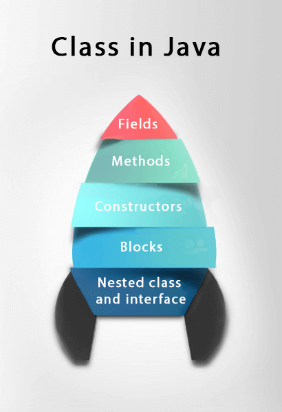

# Java e Orientação a Objetos

- [Java e Orientação a Objetos](#java-e-orientação-a-objetos)
  - [O que é Java?](#o-que-é-java)
  - [Conceitos, Regras e Convenções](#conceitos-regras-e-convenções)
    - [Nomeação](#nomeação)
    - [Sintaxe Básica](#sintaxe-básica)
    - [Identificadores](#identificadores)
    - [Estruturas de Controle](#estruturas-de-controle)
    - [Palavras-chave](#palavras-chave)
    - [Regras de Declaração do Arquivo Fonte](#regras-de-declaração-do-arquivo-fonte)
    - [Pacote e Declarações de Importação](#pacote-e-declarações-de-importação)
  - [Objetos, Classes e Construtores](#objetos-classes-e-construtores)
    - [Objetos](#objetos)
    - [Classe](#classe)
    - [Construtores](#construtores)
  - [Modificadores](#modificadores)
  - [Variáveis](#variáveis)
    - [Data Types](#data-types)
      - [Conversões / Castings](#conversões--castings)
    - [Variáveis Locais](#variáveis-locais)
    - [Variáveis de Instância/Não Estáticas](#variáveis-de-instâncianão-estáticas)
    - [Variáveis de Classe/Estáticas](#variáveis-de-classeestáticas)
    - [Enums](#enums)
  - [Operadores](#operadores)
    - [Aritméticos](#aritméticos)
    - [Atribuição](#atribuição)
    - [Comparação](#comparação)
    - [Lógico](#lógico)
  - [Condicionais e Loops](#condicionais-e-loops)
  - [Arrays](#arrays)
    - [Acessando Elementos](#acessando-elementos)
    - [Alterando um Elemento](#alterando-um-elemento)
    - [Looping](#looping)
    - [Array Multidimensional](#array-multidimensional)

## O que é Java?

| Linguagem      | Plataforma  |
| -------------- | ----------- |
| O.O            | Portável    |
| Bibliotecas    | Fácil       |
| Parece com C++ | Segura      |
| Vários SOs     | Onipresente |


Com o surgimento de diferentes navegadores e sistemas operacionais, nasceu o seguinte incômodo: para escrever um código para um SO, utiliza-se uma linguagem, que por sua vez é compilado por um executável.

Isso significa que ele só funciona neste sistema operacional, com determinadas DLLs na máquina, e assim por diante. O executável e o código fonte ficavam atrelados a uma plataforma específica, um conjunto de sistema operacional, hardware e outros detalhes.

Uma tentativa para resolver este problema foi com um código de fonte único, que serviria como um intermediário que soubesse traduzir ou instruir o sistema operacional acerca dos comandos a serem enviados e recebidos.

Este intermediário foi o **JVM** → **J**ava **V**irtual **M**achine, que não é meramente um interpretador por conta de alguns detalhes internos que vão além da interpretação.

O código, então, seria a linguagem Java, e o código "executável", quando compilado, geraria um formato chamado bytecode Java, de extensão `.class`, lido pela Máquina Virtual Java, que passaria a informação aos sistemas operacionais.

```bytecode
Compiled from "Onibus.java"
class Teste {

    public static void main(java.lang.String);
      Code:
      0: new              #2  // class Onibus
      3: dup
      4: invokespecial    #3 Onibus."<init>":()V
      7: astore_1
      8: aload_1
      9: ldc              #4 // String Jabaquara...
     11: putfield         #5
       // Field Onibus.linha:Ljava/lang/String;
     14: return 
}
```

```java
public class Onibus {
  String nome;
  String linha;
}

class Teste {
  public static void main(String args) {
    Onibus o = new Onibus();
    o.linha = "Jabaquara-Liberdade";
  }
}
```

JRE → Java Runtime Environment. Ambiente de execução. `JRE = JVM + bibliotecas`.

JDK → Java Developer Kit. Ferramentas de desenvolvimento junto com o ambiente de execução. `JDK = JRE + ferramentas de desenvolvimento`.

Sobre compilação e execução:

1. Durante a compilação acontece uma verificação sintática do código fonte.

2. Na compilação e execução podem aparecer erros.

3. A JVM lê e executa o Bytecode.

4. O compilador gera o Bytecode caso não tenha nenhum erro sintático no código fonte.

```
javac Programa.java

java Programa
```

## Conceitos, Regras e Convenções

> Um programa Java pode ser definido como uma coleção de objetos que se comunicam por meio da chamada dos métodos uns dos outros.

É uma linguagem orientada a objetos, ou seja, em Java tudo é um objeto.

**Plataforma Java →**Consiste em duas partes principais – o ambiente de tempo de execução Java (JRE) e o kit de desenvolvimento Java (JDK). O JRE é necessário para executar aplicativos Java, enquanto o JDK é necessário para desenvolver aplicativos Java.

**Package →**  São o mecanismo usado para agrupar classes relacionadas em Java. Eles são usados para organizar melhor o código e evitar conflitos de nome.

**Object →** É uma instância de uma classe, tem estados e comportamentos. A criação de um objeto envolve a alocação de memória para esse objeto.

**Class →**  É a unidade básica de programação em Java. Ela é usada como um modelo para criar objetos, pode ser definida como um template/blueprint que descreve o comportamento/estado que o objeto de seu tipo suporta. Cada classe contém atributos (variáveis) e métodos (funções).

**Methods →** É basicamente um comportamento. É nos métodos onde as lógicas são escritas, os dados são manipulados e todas as ações são executadas. Uma classe pode conter muitos métodos.

**Instance Variables →** Cada objeto tem seu conjunto único de variáveis ​​de instância. O estado de um objeto é criado pelos valores atribuídos a essas variáveis ​​de instância.

**Inherence →** A herança é um recurso em Java que permite que uma classe (chamada de classe filha ou subclass) herde propriedades e comportamentos de outra classe (chamada de classe pai ou superclass). Basicamente, se você precisar criar uma nova classe e já houver uma classe que tenha parte do código de que você precisa, é possível derivar sua nova classe do código já existente. Isso ajuda a economizar tempo e esforço do desenvolvedor na criação de classes.

**Interface →** Pode ser definida como um contrato entre objetos sobre como se comunicarem entre si. Desempenham um papel vital quando se trata do conceito de herança. Define os métodos que uma classe derivada (subclasse) deve usar, mas a _impl_ementação dos métodos depende totalmente da subclasse.

**Polymorphism →** É uma característica que permite que um objeto se comporte de várias maneiras. Isso é realizado usando métodos com o mesmo nome, mas com diferentes parâmetros.


### Nomeação

| Identificador     | Regra                                                                                                                          | Exemplo                             |
| ----------------- | ------------------------------------------------------------------------------------------------------------------------------ | ----------------------------------- |
| Packages          | Lowercase com separação de "." e prefixos de domínio top-level como "com", "edu" e "gov"                                       | `com.apple.quicktime.v2`            |
| Classes           | CamelCase, simples e descritivas. Substantivo                                                                                  | `class ImageSprite;`                |
| Interfaces        | Capitalizado como classes. Adjetivos                                                                                           | `interface Storing;`                |
| Methods           | Mixed case. Verbos                                                                                                             | `getBackground();`                  |
| Variables         | Mnemonic, mixed case. Nunca começar com caracteres especiais. Nomear com um único caractere somente para variáveis temporárias | `int i;`, `float myWidth;`          |
| Constants         | Uppercase com separação de "_"                                                                                                 | `"static final int MIN_WIDTH = 4;"` |
| Program File Name | Deve corresponder exatamente ao nome da classe, exceto nos casos que não há uma classe pública no arquivo                      | `programa.java`                     |

### Sintaxe Básica

Um par de chaves define o escopo de cada classe e as instruções sempre terminam em ponto e vírgula ";".

**Case Sensitivity →** Diferencia maiúsculas de minúsculas, ou seja, **System** != **system**.

**public static void main(String args[]) →** O processamento do programa Java começa a partir do método `main ()`, que é uma parte obrigatória de todo programa Java.

> `main` → função/método que da entrada a uma aplicação.

Comentários podem ser de uma ou várias linhas, de forma semelhante a C, C++ e JavaScript.

```java
public class MyFirstJavaProgram {

   /* This is my first java program.
    * This will print 'Hello World' as the output
    * This is an example of multi-line comments.
    */

   public static void main(String []args) {
      // This is an example of single line comment
      /* This is also an example of single line comment. */
      System.out.println("Hello World"); // Hello Word
   }
}
```

### Identificadores

Todos os componentes Java requerem nomes, esses nomes usados ​​para classes, variáveis ​​e métodos são chamados de identifiers. A preferência é por nomes descritivos e não abreviados. Nomes de um caractere só podem ser usados, mas é de convenção que sejam temporários.

- Todos os identificadores devem começar com uma letra (A a Z ou a a z), caractere de moeda ($) ou um sublinhado (_).
- Após o primeiro caractere, os identificadores podem ter qualquer combinação de caracteres.
- Uma palavra-chave não pode ser usada como identificador.
- Mais importante ainda, os identificadores diferenciam maiúsculas de minúsculas.
- Exemplos de identificadores legais: idade, $ salary, _value, __1_value.
- Exemplos de identificadores ilegais: 123abc, -salary.

### Estruturas de Controle

As estruturas de controle são usadas para controlar o fluxo de um programa. As estruturas mais comuns são if-else, switch-case, while, do-while e for.

### Palavras-chave

Essas palavras reservadas não podem ser usadas como constantes ou variáveis ​​ou quaisquer outros nomes de identificador.

| Keyword      | Descrição                                                                                                                 |
| ------------ | ------------------------------------------------------------------------------------------------------------------------- |
| abstract     |                                                                                                                           |
| assert       | para debugging                                                                                                            |
| boolean      | data type que somente armazena valores true e false                                                                       |
| break        | quebra para fora de um loop ou de um bloco switch                                                                         |
| byte         | data type que armazena números inteiros  de -128 a 127                                                                    |
| case         | marca um bloco de código em declarações switch                                                                            |
| catch        | exceções catches geradas por declarações by                                                                               |
| char         | data type que é usada para armazenar um único caractere                                                                   |
| class        | define uma classe                                                                                                         |
| const        | define uma constante. **fora de uso**, use final                                                                          |
| default      | especifica o bloco de código default em uma declaração switch                                                             |
| do           | usado junto com while para criar um do-while loop                                                                         |
| double       | data type que pode armazenar números inteiros de 1.7e−308 a 1.7e+308                                                      |
| else         | usado em declarações condicionais                                                                                         |
| enum         | declara um tipo enumerado (imutável)                                                                                      |
| exports      | exporta um pacote com um módulo                                                                                           |
| extends      | estende uma classe (indica que aquela classe é herdada de outra)                                                          |
| final        | non-access modifier usado para classes, atributos e métodos, o que os faz imutáveis (impossíveis de herdar e sobrepor)    |
| finally      | usado com exceções, um bloco de código que vai executar não importa se há uma exceção ou não                              |
| float        | data type pode armazenar números inteiros de 3.4e−038 a 3.4e+038                                                          |
| for          | cria um for loop                                                                                                          |
| goto         | fora de uso não tem função                                                                                                |
| if           | cria uma declaração if                                                                                                    |
| _impl_ements | _impl_ementa uma interface                                                                                                |
| import       | usado para importar um pacote, classe ou interface                                                                        |
| instanceof   | checa se um objeto é uma instância de uma classe especifica ou uma interface                                              |
| int          | data type que pode armazenar números inteiros de -2147483648 a 2147483647                                                 |
| interface    | usado para declarar um tipo especial de classe que contem somente métodos abstratos                                       |
| long         | data type que pode armazenar números inteiros de -9223372036854775808 a 9223372036854775808                               |
| module       | declara um módulo                                                                                                         |
| native       | especifica que um método não é _impl_ementado no mesmo arquivo fonte java (mas em outra linguagem)                        |
| new          | cria novos objetos                                                                                                        |
| package      | declara um pacote                                                                                                         |
| private      | access modifier usado para atributos, métodos e construtores, fazendo deles acessíveis somente dentro da classe declarada |
| protected    | access modifier usado para atributos, métodos e construtores, fazendo deles acessíveis no mesmo pacote e subclasses       |
| public       | access modifier usado para atributos, métodos e construtores, fazendo deles acessíveis para qualquer outra classe         |
| requires     | especifica bibliotecas exigidas dentro do módulo                                                                          |
| return       | termina a execução de um método, e pode ser usado para retornar um valor de um método                                     |
| short        | data type que pode armazenar números inteiros de -32768 a 32767                                                           |
| static       | non-access modifier usado por métodos e atributos. Podem ser acessados sem criar o objeto de uma classe                   |
| strictfp     | restringe a precisão e o arredondamento de cálculos de pontos flutuantes                                                  |
| super        | refere para objetos de superclasses                                                                                       |
| switch       | seleciona um de vários blocos de códigos para ser executado                                                               |
| synchronized | non-access modifier, qual especifica que métodos podem somente ser acessadas por um thread por vez                        |
| this         | refere para o objeto atual em um método ou construtor                                                                     |
| throw        | cria um erro customizado                                                                                                  |
| throws       | indica qual exceções podem ser jogadas por um método                                                                      |
| transient    | non-access modifier, qual especifica que um atributo não é parte de um estado persistente de um objeto                    |
| try          | cria uma declaração try...catch                                                                                           |
| var          | declara uma variável                                                                                                      |
| void         | especifica que um método não deve ter um valor retornado                                                                  |
| volatile     | indica que um atributo não é thread-locally, e é sempre lido da "main memory"                                             |
| while        | cria um while loop                                                                                                        |

### Regras de Declaração do Arquivo Fonte

Essas regras são essenciais ao declarar classes, instruções de importação e instruções de pacote em um arquivo de origem.

- Só pode haver uma classe pública por arquivo de origem.
- Um arquivo de origem pode ter várias classes não públicas.
- O nome da classe pública deve ser o nome do arquivo de origem também, que deve ser anexado por `.java` no fim. Por exemplo: o nome da classe é `public class Employee {}` então o arquivo de origem deve ser como `Employee.java`.
- Se a classe for definida dentro de um pacote, a instrução do pacote deve ser a primeira instrução no arquivo de origem.
- Se houver instruções de importação, elas deverão ser escritas entre a instrução do pacote e a declaração da classe. Se não houver instruções de pacote, a instrução de importação deve ser a primeira linha no arquivo de origem.
- As instruções de importação e pacote implicarão em todas as classes presentes no arquivo de origem. Não é possível declarar instruções de importação e / ou pacote diferentes para classes diferentes no arquivo de origem.

### Pacote e Declarações de Importação

É uma forma de categorizar as classes e interfaces, sendo um grupo de classes relacionadas, pense em um pacote como uma pasta em um diretório. Ao desenvolver aplicativos Java, centenas de classes e interfaces serão escritas, portanto, categorizar essas classes é uma obrigação e torna a vida muito mais fácil. São usados para evitar conflitos de nomeação e escrever um código e fácil manutenção.

São divididos em duas categorias:

- Built-in (pacotes Java API)
- User-defined (criados pelo usuário)

Se um nome totalmente qualificado, que inclui o pacote e o nome da classe, for fornecido, o compilador pode localizar facilmente o código-fonte ou as classes. A instrução de importação é uma maneira de fornecer a localização adequada para o compilador encontrar essa classe específica.

```java
import package.name.Class;   // Import a single class
import package.name.*;   // Import the whole package
```

Alguns dos pacotes existentes em Java são:

- `java.lang` → agrupa as classes fundamentais
- `java.io` → classes para funções de entrada e saída são agrupadas neste pacote

```java
import java.io*;
```

Ao criar um pacote, é preciso escolher um nome para o pacote e incluir um package juntamente com esse nome no topo de cada arquivo de origem que contém as classes, interfaces, enumerações e tipos de anotação que você deseja incluir no pacote.

A instrução do pacote deve ser a primeira linha no arquivo de origem. Pode haver apenas uma instrução de pacote em cada arquivo de origem e se aplica a todos os tipos no arquivo.

```java
package mypack;
class MyPackageClass {
  public static void main(String[] args) {
    System.out.println("This is my package!");
  }
}
```

Se uma instrução de pacote não for usada, a classe, as interfaces, as enumerações e os tipos de anotação serão colocados no pacote padrão atual.

Para compilar os programas Java com instruções de pacote, você deve usar a opção -d conforme mostrado abaixo.

```
javac -d Destination_folder file_name.java

C:\Users\Your Name>javac -d . MyPackageClass.java
```

## Objetos, Classes e Construtores

Java é uma linguagem orientada a objetos, por isso possui recursos dos conceitos de Programação Orientada a Objetos, como:

- Polimorfismo
- Herança
- Encapsulamento
- Abstração
- Classes
- Objetos
- Instância
- Método
- Passagem de mensagens

### Objetos

Eles têm estados e comportamentos. Um objeto é uma instância de uma classe, ou seja, a classe é um template/blueprint na qual os objetos são criados. Então, um objeto é a instância (resultado) de uma classe. Sua criação envolve a alocação de memória para esse objeto.

Um exemplo: Um gato tem estados - cor, nome, raça; e também comportamento - miar, comer, espreitar. Ao comparar os objetos de software com objetos reais, pode se observar muitas semelhanças. Eles também possuem um estado e um comportamento - o estado de um objeto de software é armazenado em campos e o comportamento é mostrado por meio de métodos.

Um objeto tem 3 características:

- Estado → representa o dado (valor) de um objeto
- Comportamento → representa o comportamento (funcionalidade) de um objeto como: deposito, pagamento, transferência...
- Identidade → a identidade de um objeto é tipicamente implementado via um ID único. O valor de um ID não é visível para um user externo. No entanto, é usado internamente pelo JVM para identificar cada objeto unicamente


Dessa forma, no desenvolvimento de software, os métodos operam no estado interno de um objeto e a comunicação objeto a objeto é feita por meio de métodos.

### Classe

Uma classe é um template/blueprint a partir do qual objetos são criados. É uma entidade lógica, não pode ser física. Funciona como um grupo de objetos que possuem propriedades em comum.

Uma classe em Java contem:

- Domínio
- Métodos
- Construtores
- Blocos
- Classes aninhadas e interface



```java
class <NomeDaClasse> {
   field;
   method;
}
```

```java
class Student{  
 int id;  
 String name;  
}

class TestStudent2{  
 public static void main(String args[]){  
  Student s1=new Student();  
  s1.id=101;  
  s1.name="Sonoo";  
  System.out.println(s1.id+" "+s1.name);//101 Sonoo
 }  
}  
```

Pode conter qualquer um dos tipos de variáveis:

- Locais → Variáveis ​​definidas dentro de métodos, construtores ou blocos são chamadas de variáveis ​​locais. A variável será declarada e inicializada dentro do método e a variável será destruída quando o método for concluído.
- De instância → Variáveis ​​de instância são variáveis ​​dentro de uma classe, mas fora de qualquer método. Essas variáveis ​​são inicializadas quando a classe é instanciada. Variáveis ​​de instância podem ser acessadas de dentro de qualquer método, construtor ou blocos daquela classe particular.
- De classe → Variáveis ​​de classe são variáveis ​​declaradas dentro de uma classe, fora de qualquer método, com a palavra-chave estática.

Uma classe pode ter vários métodos para acessar o valor de vários tipos de métodos.

### Construtores

Um construtor em Java é um método especial que é usado para inicializar objetos. Ele tem o mesmo nome de sua classe e é sintaticamente semelhante a um método. No entanto, os construtores não têm um tipo de retorno explícito. Pode ser usado para definir valores iniciais para atributos de objetos.

```java
class ClassName {
   ClassName() {
   }
}
```

Cada classe possui um construtor. Se não escrevemos explicitamente um construtor para uma classe, o compilador Java construirá um construtor padrão para esta classe. Cada vez que um novo objeto é criado, pelo menos um construtor será chamado. A regra principal dos construtores é que eles devem ter o mesmo nome da classe. Uma classe pode ter mais de um construtor.


```java
public class Puppy {
   public Puppy() {
   }

   public Puppy(String name) {
      // This constructor has one parameter, name.
   }
}
```

O Java permite 2 tipos de construtores:

- Sem argumento
  - Não aceitam nenhum parâmetro, usando esses construtores, as variáveis ​​de instância de um método serão inicializadas com valores fixos para todos os objetos.

```java
Public class MyClass {
   Int num;
   MyClass() {
      num = 100;
   }
}

public class ConsDemo {
   public static void main(String args[]) {
      MyClass t1 = new MyClass();
      MyClass t2 = new MyClass();
      System.out.println(t1.num + " " + t2.num); // 100 100
   }
}
```

- Parametrizados
  - Aceitam um ou mais parâmetros. Os parâmetros são adicionados a um construtor da mesma forma que são adicionados a um método, basta declará-los dentro dos parênteses após o nome do construtor.

```java
// A simple constructor.
class MyClass {
   int x;
   
   // Following is the constructor
   MyClass(int i ) {
      x = i;
   }
}

public class ConsDemo {
   public static void main(String args[]) {
      MyClass t1 = new MyClass( 10 );
      MyClass t2 = new MyClass( 20 );
      System.out.println(t1.x + " " + t2.x); // 10 20
   }
}
```

## Modificadores

São palavras-chave que você adiciona a essas definições para alterar seus significados.

```java
public class className {
   // ...
}

private boolean myFlag;
static final double weeks = 9.5;
protected static final int BOXWIDTH = 42;

public static void main(String[] arguments) {
   // body of method
}
```

É possível modificar classes, métodos, etc. Existem duas categorias de modificadores:

- **Access Modifiers →** Controla o level de acesso. Padrão, público, protegido, privado.

   - Visível para o pacote, o padrão. Nenhum modificador é necessário.
   - Visível apenas para a classe (particular).
   - Visível para o mundo (público).
   - Visível para o pacote e todas as subclasses (protegidas).

Para classes:

| Modificador | Descrição                                                                                                  |
| ----------- | ---------------------------------------------------------------------------------------------------------- |
| `public`    | a classe é acessível para qualquer outra                                                                   |
| default     | a classe é somente acessível por classes no mesmo pacote. É usado quando um modificador não é especificado |

Para atributos, métodos e construtores:

| Modificador | Descrição                                                                                                   |
|-------------|-------------------------------------------------------------------------------------------------------------|
| `public`    | o código é acessível para qualquer outra                                                                    |
| default     | o código é somente acessível por classes no mesmo pacote. É usado quando um modificador não é especificado. |
| `private`   | o código é somente acessível dentro da classe declarada                                                     |
| `protected` | o código é acessível no mesmo pacote e subclasses                                                           |

- **Non-access Modifiers →** Não controla o level de acesso, mas fornece outras funcionalidades. Final, abstrato, strictfp.
   - O modificador estático para criar métodos e variáveis ​​de classe.
   - O modificador final para finalizar as implementações de classes, métodos e variáveis.
   - O modificador abstrato para criar classes e métodos abstratos.
   - Os modificadores sincronizados e voláteis , que são usados ​​para threads.

Para classes:

| Modificador | Descrição                                                                                                                         |
|-------------|-----------------------------------------------------------------------------------------------------------------------------------|
| `final`     | a classe não pode ser herdada por outras classes                                                                                  |
| `abstract`  | a classe não pode ser usada para criar objetos (para acessar uma classe abstrata, é preciso que ela seja herdada de outra classe) |

Para atributos e métodos:

| Modificador    | Descrição                                                                                                    |
|----------------|--------------------------------------------------------------------------------------------------------------|
| `final`        | Atributos e métodos não podem ser sobrepostos/modificados                                                    |
| `abstract`     | Só pode ser utilizado numa classe abstrata e só pode ser utilizado em métodos. O método não tem um corpo     |
| `static`       | os atributos e métodos pertencem a classe, e não a um objeto                                                 |
| `transient`    | os atributos e métodos são ignorados ao serializar o objeto que os contém                                    |
| `synchronized` | os métodos só podem ser acessados por um thread de cada vez                                                  |
| `volatile`     | o valor de um atributo não é armazenado em cache localmente no thread e é sempre lido da "memória principal" |

## Variáveis

São usadas para armazenar dados. Cada variável em Java possui um tipo específico, que determina o tamanho e o layout da memória da variável; a faixa de valores que podem ser armazenados nessa memória; e o conjunto de operações que podem ser aplicadas à variável. Podem ser do tipo primitivo (int, double, boolean, etc.) ou do tipo de objeto (String, Scanner, etc.). 

Uma variável deve ser declarada antes de ser usada. Para declarar uma variável é sempre necessário começar pelo seu tipo acompanhado do nome. Seu valor pode ser atribuído na mesma linha ou após.

```java
data type variable [= value][, variable [= value]...];
```

Podem ser: locais, de classe (estáticas) ou de instância (não estáticas).

```java
int x;
x = 10;
double y = 20.5;
String name = “Daniel";

int; // resulta em erro
x = 2; // resulta em erro
```

```java
// Declarando múltiplas variáveis de mesmo tipo
int x = 5, y = 6, z = 7;

// Declarando múltiplas variáveis de mesmo tipo e valor
int x, y, z;
x = y = z = 50;
```

### Data Types

Estão divididos em 2 grupos:

- Primitivos → Incluindo `byte`, `short`, `int`, `long`, `float`, `double`, `boolean` e `char`.
- Não-primitivos → Como `String`, `Arrays` e `Classes`.

Os data-types primitivos especificam tamanho e tipo de valor das variáveis, e não possuem nenhum método adicional.

| Data-type | Size    | Descrição                                                                     |
| --------- | ------- | ----------------------------------------------------------------------------- |
| `byte`    | 1 byte  | armazena números inteiros  de -128 a 127                                      |
| `short`   | 2 bytes | pode armazenar números inteiros de -32768 a 32767                             |
| `int`     | 4 bytes | pode armazenar números inteiros de -2147483648 a 2147483647                   |
| `long`    | 8 bytes | pode armazenar números inteiros de -9223372036854775808 a 9223372036854775808 |
| `float`   | 4 bytes | pode armazenar números inteiros de 3.4e−038 a 3.4e+038                        |
| `double`  | 8 bytes | pode armazenar números inteiros de 1.7e−308 a 1.7e+308                        |
| `boolean` | 1 bit   | armazena valores true e false                                                 |
| `char`    | 2 bytes | usada para armazenar um único caractere/letra ou valor ASCII                  |

```java
int idade = 21;
float preco = 17.50f; // precisão de 6/7 decimais
double altura = 1.65d; // precisão até 15 decimais
char inicial = 'O';
boolean testeLogico = true;
long grande = 15000000000L;
```

- Tipos inteiros armazenam números inteiros, positivos ou negativos, sem decimais. Eles são: `byte`, `short`, `int` e `long`.
- Tipos de pontos flutuantes representam números com partes fracionadas, contendo um ou mais decimais. Eles são: `float` e `double`.

Os mais usados são `int` e `double`.

Números flutuantes podem ser um número científico com um "e" para indicar a elevação na décima potência.

```java
float f1 = 35e3f
double d1 = 12E4d
```

- `char` armazena um único caractere, que deve estar entre aspas simples. Alternativamente, um valor ASCII também pode ser usado.
- `String` armazena uma sequência de caracteres (texto). Valores string devem estar entre aspas duplas.

```java
char letra = 'S';
char ascii =  65;

String frase = "programação em java"
```

Os tipos não-primitivos são chamados de tipos de referência porque se referem a objetos. Suas principais diferença para os primitivos é:

- Tipos primitivos são pré-definidos no Java. Tipos não-primitivos são criados pelo programador e não são definidos pelo Java (exceto por `String`).
- Podem ser usados para chamar métodos para performar certas operações, enquanto primitivos não podem.
- Primitivos sempre tem um valor, enquanto não-primitivos podem ser `null`.
- Primitivos começam com letras minúsculas, não-primitivos começam com letras maiúsculas.
- O tamanho dos tipos primitivos depende do data type, enquanto os não-primitivos tem todos os mesmos tamanhos.

Exemplos de tipos não-primitivos são: `String`, `Arrays`, `Interface`, etc.

Data types primitivos armazenam valores, não são referências, ou seja:

```java
int valorInicial = 7;
int valorSecundario = 11;
System.out.println(valorSecundario); // 11

valorSecundario = valorInicial;
System.out.println(valorSecundario); // 7

valorInicial = 13;
System.out.println(valorSecundario); // 7
```

#### Conversões / Castings

Casting é quando se atribui um valor de uma dado primitivo para outro. Em Java, há 2 tipos de casting:

- **Widening Casting (automático) →** converte um tipo menor para um tipo maior.
  - `byte` → `short` → `char` → `int` → `long` → `float` → `double`
- **Narrowing Casting (manual) →** converte um tipo maior para um tipo menor.
  - `double` → `float` → `long` → `int` → `char` → `short` → `byte`

```java
// Widening, automático. tipoMaior = varDoTipoMenor
int inteiro = 9;
double flutuante = inteiro; // automático: int para double
System.out.println(flutuante) // 9.0

// Narrowing, manual. tipoMenor var = (tipoMaior) var
double salario = 1270.50;
int convertido = (int) salario; // manual: double para int
System.out.println(valor) // 1270

char caractere = 66;
System.out.println(caractere); // B
caractere = (char) (caractere + 1);
System.out.println(caractere); // C
```

| De/Para  | `byte` | `short` | `char` | `int`   | `long`  | `float` | `double` |
| -------- | ------ | ------- | ------ | ------- | ------- | ------- | -------- |
| `byte`   | ---    | _impl_. | (char) | _impl_. | _impl_. | _impl_. | _impl_.  |
| `short`  | (byte) | ---     | (char) | _impl_. | _impl_. | _impl_. | _impl_.  |
| `char`   | (byte) | (short) | ---    | _impl_. | _impl_. | _impl_. | _impl_.  |
| `int`    | (byte) | (short) | (char) | ---     | _impl_. | _impl_. | _impl_.  |
| `long`   | (byte) | (short) | (char) | (int)   | ---     | _impl_. | _impl_.  |
| `float`  | (byte) | (short) | (char) | (int)   | (long)  | ---     | _impl_.  |
| `double` | (byte) | (short) | (char) | (int)   | (long)  | (float) | ---      |

### Variáveis Locais

- São declaradas em métodos, construtores ou blocos.
- São criadas quando o método, construtor ou bloco é inserido e a variável será destruída assim que sair do método, construtor ou bloco.
- Os modificadores de acesso não podem ser usados para variáveis locais.
- São visíveis apenas dentro do método declarado, construtor ou bloco.
- São implementadas no nível da pilha internamente.
- Não há valor padrão para variáveis locais, então elas devem ter um valor inicial atribuído antes do primeiro uso.

```java
public class Test {
   public void pupAge() {
      int age = 0;
      age = age + 7;
      System.out.println("Puppy age is : " + age);
   }

   public static void main(String args[]) {
      Test test = new Test();
      test.pupAge(); // Puppy age is: 7 
   }
}
```

### Variáveis de Instância/Não Estáticas

- São declaradas em uma classe, mas fora de um método, construtor ou qualquer bloco.
- Quando um espaço é alocado para um objeto no heap, um slot para cada valor de variável de instância é criado.
- São criadas quando um objeto é criado com o uso da keyword `new` e destruídas quando o objeto é destruído.
- Contêm valores que devem ser referenciados por mais de um método, construtor ou bloco, ou partes essenciais do estado de um objeto que devem estar presentes em toda a classe.
- Podem ser declaradas em nível de classe antes ou depois do uso.
- Modificadores de acesso podem ser fornecidos para variáveis de instância.
- São visíveis para todos os métodos, construtores e bloco da classe. Normalmente, é recomendável tornar essas variáveis privadas (nível de acesso). No entanto, a visibilidade para subclasses pode ser dada para essas variáveis com o uso de modificadores de acesso.
- Têm valores padrão. Para números, o valor padrão é 0, para booleanos é falso e para referências de objetos é nulo. Os valores podem ser atribuídos durante a declaração ou no construtor.
- Podem ser acessadas diretamente chamando o nome da variável dentro da classe. No entanto, nos métodos estáticos (quando as variáveis ​​de instância têm acessibilidade), eles devem ser chamados usando o nome totalmente qualificado.

```java
import java.io.*;
public class Employee {

   // this instance variable is visible for any child class.
   public String name;

   // salary  variable is visible in Employee class only.
   private double salary;

   // The name variable is assigned in the constructor.
   public Employee (String empName) {
      name = empName;
   }

   // The salary variable is assigned a value.
   public void setSalary(double empSal) {
      salary = empSal;
   }

   // This method prints the employee details.
   public void printEmp() {
      System.out.println("name  : " + name );
      System.out.println("salary :" + salary);
   }

   public static void main(String args[]) {
      Employee empOne = new Employee("Ransika");
      empOne.setSalary(1000);
      empOne.printEmp(); // name  : Ransika /// salary :1000.0
   }
}
```

### Variáveis de Classe/Estáticas

- São declaradas com a keyword `static` em uma classe, mas fora de um método, construtor ou bloco.
- Haveria apenas uma cópia de cada variável de classe por classe, independentemente de quantos objetos são criados a partir dela.
- Raramente são usadas além de serem declaradas como constantes. Constantes são variáveis ​​declaradas como públicas / privadas, finais e estáticas. Variáveis ​​constantes nunca mudam de seu valor inicial.
- São armazenadas na memória estática. É raro usar variáveis ​​estáticas que não sejam declaradas finais e usadas como constantes públicas ou privadas.
- São criadas quando o programa é iniciado e destruídas quando o programa é interrompido.
- A visibilidade é semelhante às variáveis ​​de instância. No entanto, a maioria das variáveis ​​estáticas são declaradas públicas, pois devem estar disponíveis para os usuários da classe.
- Os valores padrão são iguais às variáveis ​​de instância. Para números, o valor padrão é 0; para os booleanos, é falso; e para referências de objeto, é nulo. Os valores podem ser atribuídos durante a declaração ou no construtor. Além disso, os valores podem ser atribuídos em blocos inicializadores estáticos especiais.
- Podem ser acessadas chamando com o nome de classe `ClassName.VariableName`.
- Ao declarar variáveis ​​de classe como `public static final`, os nomes de variáveis ​​(constantes) estão todos em maiúsculas. Se as variáveis ​​estáticas não forem públicas e finais, a sintaxe de nomenclatura será a mesma que as variáveis ​​de instância e locais.

```java
import java.io.*;
public class Employee {

   // salary  variable is a private static variable
   private static double salary;

   // DEPARTMENT is a constant
   public static final String DEPARTMENT = "Development ";

   public static void main(String args[]) {
      salary = 1000;
      System.out.println(DEPARTMENT + "average salary:" + salary); // Development average salary:1000
   }
}
```
> Se as variáveis ​​forem acessadas de uma classe externa, a constante deve ser acessada como Employee.DEPARTMENT

### Enums
Restringem uma variável para ter apenas alguns valores predefinidos. Com o uso de enums, é possível reduzir o número de bugs no código.

```java
class FreshJuice {
   enum FreshJuiceSize{ SMALL, MEDIUM, LARGE }
   FreshJuiceSize size;
}

public class FreshJuiceTest {

   public static void main(String args[]) {
      FreshJuice juice = new FreshJuice();
      juice.size = FreshJuice.FreshJuiceSize.MEDIUM ;
      System.out.println("Size: " + juice.size); // Size: MEDIUM
   }
}
```

>  Enums podem ser declarados como próprios ou dentro de uma classe. Métodos, variáveis ​​e construtores também podem ser definidos dentro de enums.

## Operadores

São usados para operações entre variáveis e valores, podem ser: aritméticos, de atribuição, comparativos, lógicos e bitwise.

### Aritméticos

| Operador | Nome          | Descrição                      | Exemplo |
| -------- | ------------- | ------------------------------ | ------- |
| +        | Adição        | Adiciona valores e variáveis   | x + y   |
| -        | Subtração     | Subtrai valores                | x - y   |
| *        | Multiplicação | Multiplica valores             | x * y   |
| /        | Divisão       | Divide um valor por outro      | x / y   |
| %        | Módulos       | Retorna o resto de uma divisão | x % y   |
| ++       | Acréscimo     | Incrementa o valor por 1       | ++x     |
| --       | Decréscimo    | Diminui o valor por 1          | --x     |

O operador `+` também concatena strings e valores.

Operações entre inteiros sempre irão resultar em um valor inteiro. Se a variável for declarada como um tipo de ponto flutuante, seu resultado será arrendondado, é necessário que, pelo menos, um do valores seja um número decimal para devolver o resultado exato.

```java
double divisao = 5 / 2;
System.out.println(divisao); // 2

divisao = 5.0 / 2;
System.out.println(divisao); // 2.5
```


### Atribuição

| Operador | Exemplo | O mesmo que |
| -------- | ------- | ----------- |
| =        | x = 5   | x = 5       |
| +=       | x += 3  | x = x + 3   |
| -=       | x -= 3  | x = x - 3   |
| *=       | x *= 3  | x = x * 3   |
| /=       | x /= 3  | x = x / 3   |
| %=       | x %= 3  | x = x % 3   |
| &=       | x &= 3  | x = x & 3   |
| \|=      | x \|= 3 | x = x \| 3  |
| ^=       | x ^= 3  | x = x ^ 3   |
| >>=      | x >>= 3 | x = x >> 3  |
| <<=      | x <<= 3 | x = x << 3  |

### Comparação

| Operador | Nome                 | O mesmo que |
| -------- | -------------------- | ----------- |
| ==       | Igual a              | x == y      |
| !=       | Diferente de         | x != y      |
| >        | Maior que            | x > y       |
| <        | Menor que            | x < y       |
| >=       | Maior que ou igual a | x >= y      |
| <=       | Menor que ou igual a | x <= y      |

### Lógico

| Operador | Nome       | Descrição                                                        | Exemplo            |
| -------- | ---------- | ---------------------------------------------------------------- | ------------------ |
| &&       | Lógico and | Retorna true se ambas declarações forem verdadeiras              | x < 5 && x < 10    |
| \|\|     | Lógico  or | Retorna true se uma das declarações for verdadeira               | x < 5 \|\| x < 4   |
| !        | Lógico not | Reverte o resultado, retorna false se o resultado for verdadeiro | !(x < 5 && x < 10) |

## Condicionais e Loops

Condicionais são declarações que definem decisões que influenciam se uma declaração vai ou não ser executada, qual será a declaração executada dentre diferentes opções e também fazem o controle de loop.

O Java tem as seguintes declarações condicionais:

- `if` é usado para especificar que um bloco de código deve ser executado se a condição retorna `true`

```java
if (condition) {
   // code
}
```

```java
int x = 20, y = 18;
if (x > y) { // true
   System.out.println("20 é maior que 18")
}
```

- `else` é usado para especificar que um bloco de código deve ser executado se a condição retorna `false`

```java
if (condition) {
   // code
} else {
   // code
}
```

```java
int time = 20;
if (time < 18) { // false
   System.out.println("Bom dia")
} else {
   System.out.println("Bom tarde") // esse será o output
}
```

- `else if` é usado para especificar uma nova condição se a primeira condição retorna `false`

```java
if (condition) {
   // code
} else if (condition) {
   // code
} else {
   // code
}
```

```java
int time = 22;
if (time < 10) { // false
   System.out.println("Bom dia")
} else if (time < 18) { // false
   System.out.println("Bom tarde")
} else {
   System.out.println("Bom noite") // este será o output
}
```

- Short hand `if...else`, conhecido como operador ternário, pois consiste em 3 operadores

```java
variable = (condition) ? expressionTrue : expressionFalse;
```

```java
int time = 20;
String result = (time < 18) ? "Bom dia" : "Boa tarde".
System.out.println(result);
```

- `switch` seleciona um de vários blocos de código para ser executado. Pode substituir o `if...else`
  - A expressão `switch` é avaliada somente uma vez
  - O valor da expressão é comparado com os valores de cada caso
  - Se houver um match, o bloco de código associado será executado
  - `break` e `default` são keywords opcionais
  - Só aceita → `int`, `String` e `Enum`.

```java
switch (expression) {
   case x:
      // code
      break;
   case y:
      // code
      break; // para a execução, "quebra" para fora do bloco
   default: // bloco que será executado se não houver match nos outros casos
      // code
}
```

```java
int day = 4;
switch (day) {
  case 1:
    System.out.println("Monday");
    break;
  case 2:
    System.out.println("Tuesday");
    break;
  case 3:
    System.out.println("Wednesday");
    break;
  case 4:
    System.out.println("Thursday");
    break;
  case 5:
    System.out.println("Friday");
    break;
  case 6:
    System.out.println("Saturday");
    break;
  case 7:
    System.out.println("Sunday");
    break;
}
// Outputs "Thursday" (day 4)
```

- O loop `while` é um bloco de código que itera enquanto uma condição for `true`

```java
while (condition) {
  // code
}
```

```java
int i = 0;
while (i < 5) {
  System.out.println(i);
  i++; // 0 1 2 3 4
}
```

- O loop `do/while` é uma variante do loop `while`. Ele irá executar o bloco de código uma vez, ante de verificar se a condição é verdadeira, então irá repetir enquanto a condição for verdadeira

```java
do {
  // code
}
while (condition);
```

```java
int i = 0;
do {
  System.out.println(i); // 0 1 2 3 4
  i++;
}
while (i < 5);
```

- O loop `for` é usado quando se sabe exatamente quantas vezes se quer iterar um bloco de código
  - 1ª declaração: é executada uam vez antes da execução do bloco de código
  - 2ª declaração: define a condição para a execução
  - 3ª declaração: é executada toda vez após o bloco de código ser executado 

```java
for (statement 1; statement 2; statement 3) {
  // code 
}
```

```java
for (int i = 0; i < 5; i++) {
  System.out.println(i);
}
```

- Nested loops: é possível colocar um loop dentro de outro. O "loop interno" irá ser executado uma vez para cada iteração do "loop externo"

```java
// Outer loop
for (int i = 1; i <= 2; i++) {
  System.out.println("Outer: " + i); // Executes 2 times
  
  // Inner loop
  for (int j = 1; j <= 3; j++) {
    System.out.println(" Inner: " + j); // Executes 6 times (2 * 3)
  }
} 
```

- O loop `for-each` é usado exclusivamente para iterar em um array

```java
for (type variableName : arrayName) {
  // code
}
```

```java
String[] cars = {"Volvo", "BMW", "Ford", "Mazda"};
for (String i : cars) {
  System.out.println(i);
}
```

- As declarações `break` e `continue` são opcionais e podem respectivamente:
  - "quebrar" para fora de um loop
  - pular uma iteração, continuando para a próxima

```java
for (int i = 0; i < 10; i++) {
  if (i == 4) {
    break;
  }
  System.out.println(i);
}
```

```java
int i = 0;
while (i < 10) {
  if (i == 4) {
    i++;
    continue;
  }
  System.out.println(i);
  i++;
}
```

- O loop aprimorado (introduzido no Java 5) é usado principalmente para percorrer a coleção de elementos, incluindo matrizes.
  - Declaração: a variável de bloco recém-declarada é de um tipo compatível com os elementos do array que você está acessando. A variável estará disponível dentro do bloco `for` e seu valor seria o mesmo que o elemento atual do array.
  - Expressão: isso avalia a matriz pela qual você precisa fazer o loop. A expressão pode ser uma variável de matriz ou chamada de método que retorna uma matriz.

```java
for(declaration : expression) {
   // Statements
}
```

```java
public class Test {

   public static void main(String args[]) {
      int [] numbers = {10, 20, 30, 40, 50};

      for(int x : numbers ) {
         System.out.print( x );
         System.out.print(",");
      }
      System.out.print("\n");
      String [] names = {"James", "Larry", "Tom", "Lacy"};

      for( String name : names ) {
         System.out.print( name );
         System.out.print(",");
      }
   }
}
/* OUTPUT
10, 20, 30, 40, 50,
James, Larry, Tom, Lacy,
/*
```

## Arrays

É uma estrutura de dados que armazena uma coleção sequencial de tamanho fixo de elementos do mesmo tipo.

São objetos que armazenam vários valores em uma única variável, ao invés de declarar uma por valor. No entanto, uma matriz em si é um objeto na pilha. Arrays são muito usados exatamente por sua capacidade de conter múltiplos valores em um único espaço de memória, o que melhora performance e funcionalidade.

Em vez de declarar um por um, como: var0, var1, ... e var99, você declara uma variável de matriz, como números e usa var[0], var[1] e ..., var[99] para representar variáveis ​​individuais.

```java
dataType[] arrayRefVar;   // preferred way.
or
dataType arrayRefVar[];  // works but not preferred way.
```

```java
String[] cars;
String[] cars = {"Volvo", "BMW", "Ford", "Mazda"};

int[] myNum;
int[] myNum = {10, 20, 30, 40};
```

A declaração a baixo faz duas coisas:

- Ele cria uma matriz usando novo dataType [arraySize].
- Ele atribui a referência do array recém-criado à variável arrayRefVar.

```java
arrayRefVar = new dataType[arraySize];
```

Declarar uma variável de matriz, criar uma matriz e atribuir a referência da matriz à variável podem ser combinados em uma instrução:

```java
dataType[] arrayRefVar = new dataType[arraySize];
```

Alternativamente:

```java
dataType[] arrayRefVar = {value0, value1, ..., valuek};
```

### Acessando Elementos

Qualquer elemento em um array pode ser acessado se referindo ao seu número de index. Os números de index começam a contar a partir do 0, ou seja, uma lista com 5 elementos segue: `0 1 2 3 4`.

```java
double[] myList = new double[10];
```


```java
String[] cars = {"Volvo", "BMW", "Ford", "Mazda"};
System.out.println(cars[0]);
// Outputs Volvo
```

### Alterando um Elemento

Para alterar o valor de um elemento específico é necessário se referir ao seu número index.

```java
String[] cars = {"Volvo", "BMW", "Ford", "Mazda"};
cars[0] = "Opel";
System.out.println(cars[0]);
// Now outputs Opel instead of Volvo
```

### Looping

```java
String[] cars = {"Volvo", "BMW", "Ford", "Mazda"};
for (int i = 0; i < cars.length; i++) {
  System.out.println(cars[i]);
}
```

```java
String[] cars = {"Volvo", "BMW", "Ford", "Mazda"};
for (String i : cars) {
  System.out.println(i);
}
```

### Array Multidimensional

É um array de arrays. Sua funcionalidade principal é armazenar dados de forma tabular.

```java
int[][] myNumbers = { {1, 2, 3, 4}, {5, 6, 7} };
```

Para acessar é necessário especificar 2 indexes: um para o array, e outro para o elemento dentro daquele array. Como exemplo segue o terceiro elemento (2) do segundo array (1):

```java
int[][] myNumbers = { {1, 2, 3, 4}, {5, 6, 7} };
System.out.println(myNumbers[1][2]); // Outputs 7
```

Looping:

```java
public class Main {
  public static void main(String[] args) {
    int[][] myNumbers = { {1, 2, 3, 4}, {5, 6, 7} };
    for (int i = 0; i < myNumbers.length; ++i) {
      for(int j = 0; j < myNumbers[i].length; ++j) {
        System.out.println(myNumbers[i][j]);
      }
    }
  }
}
```