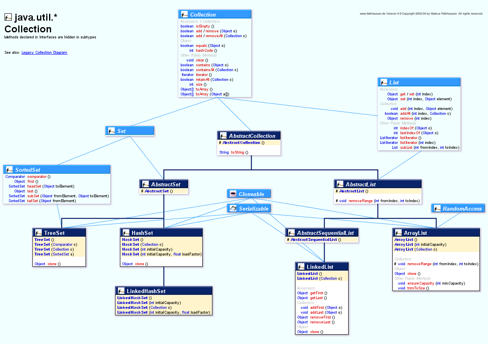
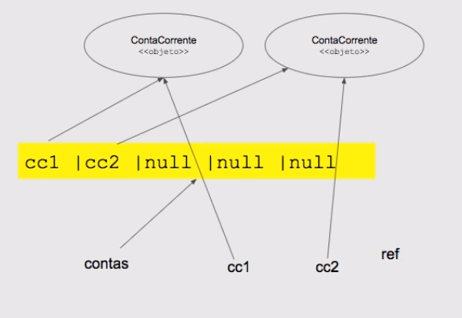
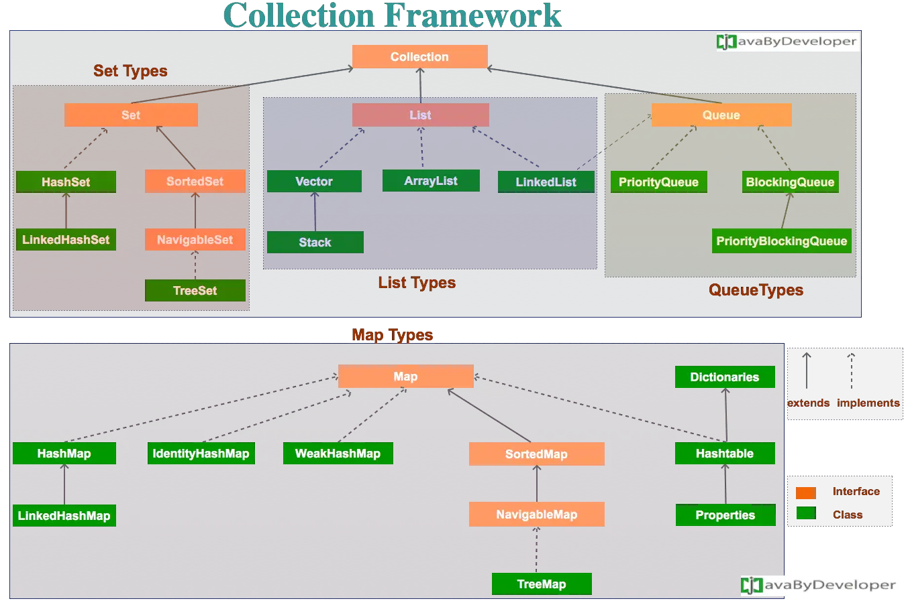
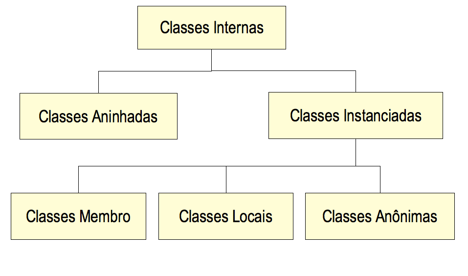

# Pacotes Java

- [Pacotes Java](#pacotes-java)
  - [Criação de Pacotes](#criação-de-pacotes)
    - [Modificadores de Acesso](#modificadores-de-acesso)
  - [Javadoc](#javadoc)
    - [Sintaxe](#sintaxe)
  - [JAR](#jar)
  - [Maven](#maven)
  - [java.lang](#javalang)
  - [String e Imutabilidade](#string-e-imutabilidade)
    - [StringBuilder](#stringbuilder)
  - [Object](#object)
    - [toString()](#tostring)
  - [java.util](#javautil)
  - [Estrutura de dados: Arrays e Listas](#estrutura-de-dados-arrays-e-listas)
    - [Arrays de Referências](#arrays-de-referências)
      - [Casting Implícito e Explícito](#casting-implícito-e-explícito)
    - [ArrayList](#arraylist)
      - [Array para Lista](#array-para-lista)
    - [LinkedList](#linkedlist)
      - [ArrayList vs. LinkedList](#arraylist-vs-linkedlist)
    - [Vector](#vector)
    - [Comparação e Ordenação de Listas](#comparação-e-ordenação-de-listas)
        - [Interface Collection](#interface-collection)
  - [Wrapper](#wrapper)
  - [Classes Internas e Expressões Lambdas](#classes-internas-e-expressões-lambdas)
    - [Classe Aninhada](#classe-aninhada)
    - [Classe Interna Estática](#classe-interna-estática)
    - [Classe Interna de Método](#classe-interna-de-método)
    - [Classe Anônima](#classe-anônima)
    - [Expressões Lambda](#expressões-lambda)


## Criação de Pacotes

Os pacotes no Java são uma forma de categorizar as classes e interfaces, sendo um grupo de classes relacionadas, pense em um pacote como uma pasta em um diretório. A declaração de um pacote deve ser a primeira declaração no código e só pode haver uma, após ela segue, as declarações de importação (se houver) e, por fim, as classes.

Ao criar um pacote, é preciso escolher um nome para o pacote e incluir um `package` juntamente com esse nome no topo de cada arquivo de origem que contém as classes, interfaces, enumerações e tipos de anotação que você deseja incluir no pacote.

O seguimento do padrão das nomeações é o endereço web, porém, ao contrário: domínio → sub-domínio → nome da empresa → nome do projeto → nome das pastas específicas.

```java
package NOME_DO_SITE_AO_CONTRARIO.NOME_DO_PROJETO
```


São usados principalmente para evitar conflitos de nomeação e escrever um código de fácil manutenção.

São divididos em duas categorias:

- Built-in (pacotes Java API)
- User-defined (criados pelo usuário)

Existem duas maneiras de usar arquivos localizados em um pacote dentro de outro:

- Importando ↓

```java
import nomePacote.Arquivo;   // importa somente um único arquivo
import nomePacote.*;   // importa todo o pacote
```

A instrução de importação é uma maneira de fornecer a localização adequada para o compilador encontrar essa classe específica.

- Full Qualified Name FQN ↓

```java
// inclui o pacote e o nome da classe
nomePacote.NomeSimplesClasse
```

Se um nome totalmente qualificado, o que inclui o nome do pacote e o nome da classe, for fornecido, o compilador pode localizar facilmente o código-fonte ou as classes.

### Modificadores de Acesso

4 principais, na ordem de mais restritivo (menos visibilidade/acesso) para menos restritivo (mais visibilidade/acesso):

- `private`
  - visível apenas na classe
- `default` ou `<<package private>>` 
  - visível na classe E em qualquer outro membro do mesmo pacote
- `protected`
  - visível na classe E em qualquer outro membro do mesmo pacote E para qualquer filho
- `public`
  - visível em qualquer pacote

## Javadoc

É um gerador de documentação criado para documentar a API dos programas em Java, a partir do código-fonte. O resultado é uma expressão em HTML.

Apenas os membros com modificador de acesso público são contemplados, os outros são  considerados detalhes da implementação e não podem ser utilizados por outras classes.

### Sintaxe 

```java
/**
 * texto aqui
 * 
 * @tagespecial
 * @author Oliver 
 * @version 0.1
 */
```

Lista completa de anotações ↓

```java
/**
 * @author (usado na classe ou interface)
 * @version (usado na classe ou interface)
 * @param (usado no método e construtor)
 * @return (usado apenas no método)
 * @exception ou @throws (no método ou construtor)
 * @see
 * @since
 * @serial
 * @deprecated
 */
```

As tags do Javadoc existem apenas para padronizar alguns dados fundamentais do código fonte como o autor e a versão.

## JAR

O jeito mais simples de trabalhar com um conjunto de classes é compactá-lo em um arquivo só. O formato de compactação padrão é o ZIP com a extensão do arquivo compactado JAR.

> O arquivo JAR, ou **J**ava **AR**chive, tem um conjunto de classes (e arquivos de configurações) compactado, no estilo de um arquivo zip. O arquivo jar pode ser criado com qualquer compactador zip disponível no mercado, inclusive com o programa jar que vem junto com o JDK.

Qualquer biblioteca ou projeto vai usar JAR(s) para distribuir o código Java.

## Maven

## java.lang

É um pacote que oferece classes fundamentais para o design da linguagem Java. Nela se encontram interfaces, classes, enums, exceções, erros e anotações.

Como não há como criar um código Java sem este pacote, sua importação é automática, dispensando a declaração dela nos projetos. A declaração de importação é possível, mas não é necessário.

As classes mais importantes são `Object`, que é a raz da hierarquia de classe, e `Class`, instância que representa classes em tempo de execução.

Frequentemente é necessário representar um valor primitivo como se fosse um objeto. As classes `Boolean`, `Character`, `Integer`, `Long`, `Float` e `Double` servem para este propósito. Por exemplo, um objeto do tipo `Integer` contem um campo que o tipo é `int`, representando o valor de tal maneira que uma referência a ela pode ser armazenada em uma variável do tipo de referência.

Essas classes também oferecem diversos métodos de conversão entre valores primitivos.

A classe `Void` é uma classe que não permite instância que guarda uma referência para um objeto da Classe representando o tipo `void`.

A classe `Math` oferece funções matemáticas comumente usadas como seno, cosseno e raiz. As classes `String`, `StringBuffer` e `StringBuilder` similarmente oferecem operações comuns em caracteres de string. 

Classes `ClassLoader`, `Process`, `ProcessBuilder`, `Runtime`, `SecurityManager` e `System` oferecem "operações de sistema" que gerenciam o carregamento dinâmico de classes, a criação de processos externos, consultas de ambientes host como horário do dia, e a aplicação de políticas de segurança.

A classe `Throwable` agrupa objetos que podem usar a declaração `throw`. Suas subclasses representam `erros` e `exceptions`.

## String e Imutabilidade

```java
String nome = "Alura"; // object literal

String outro = new String("Alura"); // funciona, mas é má prática
```

A classe `String` representa uma sequência de caracteres. Todos os literais de sequência de caracteres em programas Java, como "abc", são implementados como instâncias desta classe. Strings são constantes; seus valores não podem ser alterados uma vez criados.

Por serem imutáveis, objetos String podem ser compartilhados.

```java
String str = "abc";

// é equivalente a:

char data[] = {'a', 'b', 'c'};
String str = new String(data);
```

```java
System.out.println("abc");
String cde = "cde";
System.out.println("abc" + cde);
String c = "abc".substring(2,3);
String d = cde.substring(1, 2);
```

A classe inclui métodos para examinar caracteres individuais da sequência, comparação entre strings, pesquisar strings, extrair substrings, e para criar cópias da string com caracteres traduzidos para lowercase ou uppercase.

Alguns métodos importantes:

`replace()` → substitui um caractere ou sequência.

```java
String nome = "Oliver";
// é preciso criar outra variável
String outroNome = nome.replace("r","ro");
System.out.println(outroNome); // Olivero
```

`toLowerCase()` → cópia com caracteres traduzidos para lowercase.

```java
String nome = "Oliver";
// é preciso criar outra variável
String outroNome = nome.toLowerCase();
System.out.println(outroNome); // oliver
```

`toUpperCase()` → cópia com caracteres traduzidos para uppercase.

```java
String nome = "Oliver";
// é preciso criar outra variável
String outroNome = nome.toUpperCase();
System.out.println(outroNome); // OLIVER
```

`isEmpty()` → retorna um boolean dizendo se a string está vazia ou não. Espaços contam como conteúdo.

```java
String vaziaComEspaco = " ";
String vazia = vaziaComEspaco.trim();

// com espaço == false, sem espaço == true
System.out.println(vaziaComEspaco.isEmpty()); // false
System.out.println(vazia.isEmpty()); // true
```

`charAt()` → devolve um char na posição indicada.

```java
String nome = "Oliver";
System.out.println(nome.charAt(2)); // i
```

`indexOf()` → devolve um int com o index/posição do char/substring.

```java
String nome = "Oliver";
System.out.println(nome.indexOf("v")); // 3
```

`substring()` → devolve uma substring que se origina da string.

```java
String nome = "Oliver";
System.out.println(nome.substring(1, 4)); // liv
```

`length()` → devolve um int com o tamanho da string.

```java
String nome = "Oliver";
System.out.println(nome.length()); // 6

for (int i = 0; i < nome.length(); i++) {
  System.out.println(nome.charAt(i));
} // O l i v e r
```

`contains()` → devolve um boolean que diz se um char/substring é contido dentro da string.

```java
String nome = "Oliver";
System.out.println(nome.contains("vero")); // false
System.out.println(nome.contains("r")); // true
```

### StringBuilder

`String` é especial por gerar objetos imutáveis. Pensando no design, isso é algo benéfico, mas acaba perdendo pontos em questão de desempenho. O uso de aspas duplas na criação nasce para que o JVM contorne os problemas de desempenho com otimizações.

Um problema enfrentado por essa classe é que qualquer mudança em uma string precisa ser feito ou no objeto original (o que pode não ser o que o programador quer), ou com a criação de mais um para vários novos objetos.

Como um exemplo, essa concatenação:

```java
String texto = "Socorram"; // objeto original
texto = texto.concat("-"); // nova criação/atribuição
texto = texto.concat("me"); // nova criação/atribuição
texto = texto.concat(", "); // nova criação/atribuição
texto = texto.concat("subi "); // nova criação/atribuição
texto = texto.concat("no "); // nova criação/atribuição
texto = texto.concat("ônibus "); // nova criação/atribuição
texto = texto.concat("em "); // nova criação/atribuição
texto = texto.concat("Marrocos"); // nova criação/atribuição
System.out.println(texto); 
```

Para resolver situações como essa foi criada a classe `StringBuilder` que, por ser mutável, usa a mesma referência, sem novas atribuições. Isso ajuda na concatenação e inserção de caracteres numa sequência

```java
StringBuilder builder = new StringBuilder("Socorram"); // objeto original
builder.append("-"); // mesma referência
builder.append("me"); // mesma referência
builder.append(", "); // mesma referência
builder.append("subi "); // mesma referência
builder.append("no "); // mesma referência
builder.append("ônibus "); // mesma referência
builder.append("em "); // mesma referência
builder.append("Marrocos"); // mesma referência
String texto = builder.toString(); // novo objeto
System.out.println(texto);
```

Ambas classes implementam a interface `CharSequence`, ou seja, tem métodos que recebem o tipo. Dessa forma é possível trabalhar de maneira compatível com as duas classes, baseado numa interface comum.

```java
String nome = "ALURA";
CharSequence cs = new StringBuilder("al");

nome = nome.replace("AL", cs);

System.out.println(nome); // alURA
```

## Object

Analisando `System.out.println("Alura")`:

- `System` → classe, java.lang, acesso público.
- `out` → atributo, público, referência, static.
- `println` → método, público, não estático, sobrecarga, não joga exceções do tipo checked.

Todas as classes estendem automaticamente da classe `Object`, ela é basicamente a classe mãe, o topo da hierarquia de herança. Dessa forma, todas as classes criadas já vem com alguns métodos disponíveis por padrão, eles são os métodos genéticos, como `toString`.

Qualquer objeto pode ser referenciado pelo tipo Object, já que ela é a principal.

### toString()

É boa prática sobrescrever o método para dar um significado maior do que a saída padrão desse método. Mas o método `toString` originalmente devolve informações sobre o estado do objeto. É útil para a depuração no desenvolvimento.

## java.util

Contêm uma coleção de frameworks, classes de suporte de inicialização, service loader, propriedades, gerador de número aleatório, análise de strings e escaneamento de classes, codificação e decodificação base64, array bit e diversas classes de utilidade miscelânea.

Esse pacote também contêm legacy collection classes e date and time legacy classes.



## Estrutura de dados: Arrays e Listas

Arrays são estruturas de dados que armazenam uma coleção sequencial de tamanho fixo de elementos do mesmo tipo. Sua inicializando sempre é dada com o valor padrão para aquele data type (int = 0, ref = null, etc) e sua contagem começa da posição 0.

Sintaxes ↓

```java
dataType[] arrayRefVar;

double[] peso;
```

```java
dataType arrayRefVar = {value1, value2, value3...};

String[] nomes = {"Max", "Sam", "Alex"};
```

```java
dataType[] arrayRefVar = new dataType[arraySize];

int[] contagem = new int[10];
```
Os elementos são acessados através de seu número de index, ou seja, sua posição. É muito comum usar looping para trabalhar com arrays.

```java
for (int i = 0; i < arrayRefVar.length; i++) {
  // code
}
```

Ordenação de arrays:

```java
import java.util.Arrays;

public class TesteSortArrays {
  public static void main(String[] args) {
    int[] numeros = new int[]{43, 15, 64, 22, 89};

    Arrays.sort(numeros); //método utilitário sort

    System.out.println(Arrays.toString(numeros)); //método utilitário toString

    //Saida : [15, 22, 43, 64, 89]
    }
}
```

### Arrays de Referências

Um array de referências é um array que não guarda o objeto, mas a referência de onde ele se encontra.

```java
dataType[] arrayRefVar = new dataType[arraySize];

arrayRefVar[i] = objetVar;
```

```java
ContaCorrente[] contas = new ContaCorrente[5];

ContaCorrente cc1 = new ContaCorrente(231, 1205);
contas[0] = cc1;

ContaCorrente cc2 = new ContaCorrente(231, 1206);
contas[1] = cc2;

ContaCorrente ref;
```



É possível também criar um array com tipo mais genérico para que se possa guardar mais de um tipo de referência ou valor, sendo um array do tipo `Object` o único que pode guardar uma referência ou valor de qualquer tipo.

Mas para referenciar o array de tipo mais genérico usando uma referência de tipo específico é necessário definir um type cast para que o Java entenda esse isso é possível, que não vai gerar erro.

O mesmo é necessário caso `Object` ou outra referência genérica for usada, mas essas referências não possuírem um método que está sendo chamado.

```java
Conta[] contas = new Conta[5]; 

ContaPoupanca ref = (ContaPoupanca) contas[1];
```

```java
Object[] contas = new Object[5];

System.out.println( ((Conta) contas[1]).getNumero() );
```

#### Casting Implícito e Explícito

Trabalhar com cast implícito costuma ser a norma. Ele aparece e é possível nas declarações onde é o mesmo tipo ou cabe um tipo dentro de outro. Dessa forma o compilador não exige um cast explícito.

```java
int numero = 3;
double valor = numero; // cast implícito
```

```java
int numero = 3;
double valor = (double) numero; //cast explícito
```

Com o mesmo exemplo, o contrario não funciona, pois um tipo não cabe dentro do outro.

```java
double valor = 3.56;
int numero = (int) valor; //cast explicito é exigido pelo compilador
// Nesse caso o compilador joga todo valor fracional fora e guarda apenas o valor inteiro
```

Nas referências, o mesmo princípio se aplica. Se o cast sempre funciona não é necessário deixá-lo explícito.

```java
ContaCorrente cc1 = new ContaCorrente(22, 33);
Conta conta = cc1; //cast implícito 
```

```java
ContaCorrente cc1 = new ContaCorrente(22, 33);
Conta conta = (Conta) cc1; //cast explícito, mas desnecessário 
```

Mas o cast explícito nem sempre funciona. Ele só funciona se for possível, há casos em que o compilador sabe que um cast é impossível e aí nem compila, nem com type cast.

```java
Cliente cliente = new Cliente();
Conta conta = (Conta) cliente; //impossível, não compila
```

Como o `cliente` não estende a classe `Conta` ou implementa uma interface do tipo `Conta`, é impossível esse cast funcionar, pois uma referência do tipo `Conta` jamais pode apontar para um objeto do tipo `Cliente`.

### ArrayList

É uma lista, listas são coleções sequenciais (trabalham com índice) e aceitam elementos duplicados.

É um array dinâmico. Diferente de `Array`, que nasce e morre com o tamanho ao qual foi declarado, `ArrayList` permite que itens sejam adicionados e removidos quando se quiser.

A sintaxe também é diferente:

```java
import java.util.ArrayList;

ArrayList<dataType> refVar = new ArrayList<dataType>();

// forma genérica, mas não indicada

ArrayList refVar = new ArrayList();
```

```java
import java.util.ArrayList;

ArrayList<String> clients = new ArrayList<String>();

// forma genérica, mas não indicada

ArrayList clients = new ArrayList();
```

É uma classe que contem um `Array` comum dentro da mesma. Quando um elemento é adicionado, é colocado dentro deste array. Se este array não for grande o suficiente, um novo e maior array é criado para substituir o antigo (este sendo removido). O limite é a memória JVM.

Um `ArrayList` cria objetos, não é necessário informar seu tipo, mas pode ocorrer exceções de cast de classe, sendo que o primitivos devem ser especificados com a sua classe wrapper equivalente: `Integer`, `Boolean`, `Character`, `Double`, etc.

O tipo é informado dentro do que é chamado de "generics". Os generics são considerados boa prática por antecipar problemas de casts no momento de compilação, evitar casts excessivos e tornar o código mais legível, já que fica explícito o tipo dos elementos.

Seus métodos principais são: 

`add()` → adiciona um elemento.

```java
clients.add("Trevor");
```

`get()` → acessa um item pelo seu index.

```java
clients.get(0);
```

`set()` → modifica o elemento pelo seu index.

```java
clients.set(0, "Abel");
```

`remove()` → remove pelo seu index.

```java
clients.remove(0);
```

`clear()` → remove todos os elementos de um `ArrayList`.

```java
clients.clear();
```

`size()` → retorna quantos elementos um `ArrayList` possui.

```java
clients.size();
```

Para iterar dentro de um `ArrayList` com um loop `for`, é necessário usar o método `size()`.

```java
import java.util.ArrayList;

public class Main {
  public static void main(String[] args) {
    ArrayList<String> clients = new ArrayList<String>();
    clients.add("Alberto");
    clients.add("Monica");
    clients.add("Charles");
    clients.add("Ana");
    for (int i = 0; i < clients.size(); i++) {
      System.out.println(clients.get(i));
    }
  }
}
```

É possível também usar o `for-each` para iterações.

```java
import java.util.ArrayList;

public class Main {
  public static void main(String[] args) {
    ArrayList<String> clients = new ArrayList<String>();
    clients.add("Alberto");
    clients.add("Monica");
    clients.add("Charles");
    clients.add("Ana");
    for (String i : clients) {
      System.out.println(i);
    }
  }
}
```

Além desses, no `java.util` há a classe `Collections`, a qual inclui o método `sort()` que pode ordenar listas alfabeticamente ou numericamente.

```java
import java.util.ArrayList;
import java.util.Collections;

public class Main {
  public static void main(String[] args) {
    ArrayList<String> clients = new ArrayList<String>();
    clients.add("Alberto");
    clients.add("Monica");
    clients.add("Charles");
    clients.add("Ana");
    Collections.sort(clients);
    for (String i : clients) {
      System.out.println(i);
    }
  }
}
```

É possível definir uma capacidade inicial usando o construtor que sobrecarrega o `ArrayList` e passa um parâmetro e capacidade.

```java
ArrayList lista = new ArrayList(26); //capacidade inicial
```

Também é possível criar uma lista a partir de outra:

```java
ArrayList lista = new ArrayList(26); //capacidade inicial
lista.add("RJ");
lista.add("SP");
//outros estados
ArrayList nova = new ArrayList(lista); //criando baseado na primeira lista
```

#### Array para Lista

Dentro do pacote `java.util` existe a classe `java.util.Arrays` que possui vários métodos estáticos auxiliares para se trabalhar com arrays. Um destes métodos pode, de forma simples, transformar um `Array` em uma lista:

```java
List<dataType> refName = Arrays.asList(refArray);
```

```java
public class ArrayToArrayList {

  public static void main(String[] args) {
    List<String> argumentos = Arrays.asList(args);
  }
}
```

### LinkedList

É quase idêntica ao `ArrayList`, porém, armazena itens em um "container". A lista tem um link para o primeiro container e cada container tem um link para o próximo container na lista. Isso é nomeado de lista duplamente encadeada.


Para adicionar um item o elemento é colocado em um novo container e este container é linkado para os outros da lista.

```java
import java.util.LinkedList;

public class Main {
  public static void main(String[] args) {
    LinkedList<String> clients = new LinkedList<String>();
    clients.add("Alberto");
    clients.add("Monica");
    clients.add("Charles");
    clients.add("Ana");
    System.out.println(clients);
  }
}
```

A sua maior diferença está nos métodos, sendo que `ArrayList` é mais eficiente em casos que se quer acessar itens aleatórios na lista, enquanto `LinkedList` oferece diversos métodos eficientes para operações mais específicas.

| Método          | Descrição                           |
| --------------- | ----------------------------------- |
| `addFirst()`    | adiciona um item no início da lista |
| `addLast()`     | adiciona um item no final da lista  |
| `removeFirst()` | remove um item do início da lista   |
| `removeLast()`  | remove um item do final da lista    |
| `getFirst()`    | retorna o primeiro item da lista    |
| `getLast()`     | retorna o último item da lista      |


#### ArrayList vs. LinkedList

Ambos são coleções que podem conter múltiplos objetos de um mesmo tipo. A classe `LinkedList` tem todos os mesmo métodos que `ArrayList`, isto porque ambos implementam a interface `list`.

Porém, mesmo que possam ser usadas da mesma, são construídas de formas distintas.

É recomendado usar `ArrayList` para armazenar e acessar dados, já `LinkedList` é mais recomendada para manipulação de dados.

Ao remover/manipular um item, o `ArrayList` passa por uma reestruturação muito mais custosa, enquanto o `LinkedList` só altera os pointers dos itens anterior e posterior.

Já iterações são mais trabalhosas no `LinkedList` pela necessidade de sempre começar com o primeiro item da lista, mesmo que se queira acessar um item muito mais a frente da lista. Essa falta de acesso direto dificulta as iterações.

### Vector

É quase igual a um `ArrayList`. É um estrutura de dados que implementa um array dinâmico,contêm componentes que podem ser acessados por um index inteiro, cresce e diminui com base na necessidade de acomodar os elementos que são adicionados e removidos após a criação do `Vector`.

Todo vetor tenta otimizar manutenção de capacidade mantendo uma capacidade e uma capacidade incrementada. A capacidade é sempre pelo menos tão grande quanto o tamanho do vetor; é usualmente maior porquê a medida em que os componentes são adicionados, o armazenamento do vetor cresce em pedaços do tamanho da capacidade incrementada.

```java
// Constructs an empty vector so that its internal data array has size 10 and its standard capacity increment is zero
Vector()

// Constructs an empty vector with the specified initial capacity and with its capacity increment equal to zero.
Vector(int initialCapacity)

// Constructs an empty vector with the specified initial capacity and capacity increment.
Vector(int initialCapacity, int capacityIncrement)
```

Seu grande diferencial é que ele é thread-safe, ou seja, quando há threads concorrentes, ele garanti que somente um será executado, enquanto  outro fica no escalonador do processador, apenas aguardando seu momento para ser executado.

Essa é uma forma de evitar que os threads entrem em race condition, ele faz uma exclusão mútua para se certificar que determinado recurso somente possa ser utilizado por um thread por vez.

Isso torna o `Vector` sincronizado. Se uma implementação thread-safe não é necessária, é recomendado o uso de `ArrayList` sobre `Vector`, isso pois essa segurança dele vem acima as custas do desempenho.

### Comparação e Ordenação de Listas

2 interfaces podem ser usadas para ordenar listas, `Comparator` do pacote `java.util.Comparator`, que precisa de importação, e `Comparable` do pacote `java.lang.Comparable`, que não precisa de importação.

```java
import java.util.Comparator;

public class className implements Comparator<Object> {}
```

```java
public class className implements Comparable<Object> {}
```

Os métodos dessas classes comparam os elementos e podem retornam o seguinte:

```
if x > y, returns a positive int number
if x < y, returns a negative int number
if x == y, returns 0
```

Os métodos que podem ser utilizados para cada interface:

`compareTo()` ↓

```java
@Override
public int compareTo(Object ref) {
  return intValue;
}
```

```java
@Override
public int compareTo(Conta outra) {
  return Double.compare(this.saldo, outra.saldo);
}
```

Quando ele é usado define uma ordem natural, ou seja, a regra de ordem definida dentro dele é o que vai valer como padrão de ordenação (quando pede a organização, mas não se chama uma regra definida pelo `Comparator`) e pode ser executado de 2 formas:

```java
import java.util.List;

listName.sort(null);
```

```java
import java.util.Collections;

Collections.sort(listName); 
```

`Collections` ainda tem outros métodos de organização como: `reverse()` e `shuffle()`.

`compare()` ↓

```java
import java.util.Comparator;

@Override
public int compare(Object ref) {
  return intValue;
}
```

```java
import java.util.Comparator;

public class ComparadorNumeroDeContas implements Comparator<Conta> {

  @Override
  public int compare(Conta c1, Conta c2) {

    return Integer.compare(c1.getNumero(), c2.getNumero());
  }
}
```

`compareTo()` String ↓

```java
public int compareTo(String string2);
```

```java
import java.util.Comparator;

public class ComparadorDeStrings implements Comparator<Conta> {

  @Override
  public int compare(String nome, String outroNome) {

    String nome = "Ana";
    String outroNome = "Patrick";

    return nome.compareTo(outroNome);
  }

}
```

##### Interface Collection



## Wrapper

São classes que oferecem uma maneira de usar tipos primitivos como objetos, elas contém funcionalidades e encapsulam a variável de tipo primitivo

| Tipos de Dados Primitivos | Wrapper Classes |
| ------------------------- | --------------- |
| byte                      | Byte            |
| short                     | Short           |
| int                       | Integer         |
| long                      | Long            |
| float                     | Float           |
| double                    | Double          |
| boolean                   | Boolean         |
| char                      | Character       |

Elas são necessárias para se usar quando se trabalha com lista, já que listas armazenam apenas objetos, ou seja, tipos primitivos não podem ser usados.

Essas conversões explícitas ou implícitas se chamam Autoboxing (primitivo → objeto) e Unboxing (objeto → primitivo). 

Além disso, por serem objetos há alguns métodos que podem ser usados por elas. Como exemplo, métodos para pegar seus valores e para converte-las em string.

```java
public class Main {
  public static void main(String[] args) {
    Integer myInt = 5;
    Double myDouble = 5.99;
    Character myChar = 'A';
    System.out.println(myInt.intValue());
    System.out.println(myDouble.doubleValue());
    System.out.println(myChar.charValue());
  }
}
```

```java
public class Main {
  public static void main(String[] args) {
    Integer myInt = 100;
    String myString = myInt.toString();
    System.out.println(myString.length());
  }
}
```

## Classes Internas e Expressões Lambdas



São classes que são definidas dentro de outra classe. Sendo que elas tem um relacionamento especial com sua classe externa (classe onde ela está definida), em relação as outras classes.

Elas podem acessar os membros privados da classe externa, isso porque implicitamente a classe interna tem uma instância da classe externa.

A classe interna pode ter tudo que qualquer classe possa ter, como: variáveis de instância, métodos, blocos de inicialização, herança, implementação, etc.

### Classe Aninhada

São todas as classes que estão dentro de outra classe:

```java
class ClasseExterna {
    // código...
    class ClasseAninhada {
      // código ...
    }
}
```

É utilizado para manipular dados de processamento interno, mas é limitada pela classe que precisa dela. Geralmente se usa esse tipo quando ambas classes estão intimamente ligadas.

A classe aninha terá acesso aos dados primitivos declarados pela classe que a chamou.

O ponto positivo é que esse tipo de recurso aumento o encapsulamento, cria um código mais legível e melhora a manutenção do código.

Como a classe aninhada tem um escopo, ela está limitada pelas regras do escopo. Por exemplo, uma variável de membro pode ser acessada apenas por uma instância da classe (um objeto). O mesmo é verdade para uma classe aninhada. 

```java
public class Manager extends Employee {  

  private DirectReports directReports; 

  public Manager() {
    this.directReports = new DirectReports();  
  }

  // código...  

  private class DirectReports {  . . .  } 
}
```

### Classe Interna Estática

Ela não tem acesso aos membros da instância da classe encapsulada, somente os membros estáticos, tem a mesma visibilidade de uma classe externa.

```java
public class Calculadora {

  public static class Soma{
    int a = 1;
    int b = 2;
  }
}
```

Neste exemplo a classe soma tem dois atributos inteiros, a e b:

- a sempre será 1
- b sempre será 2

Por serem estáticos... não se alterarão.

### Classe Interna de Método

É uma classe declarada dentro de um método, ele só pode ser instanciada dentro do método, ou seja, ela tem como escopo o do método na qual foi definida. 

Ela também não pode ser declarada como estática em hipótese alguma, os únicos modificadores que podem ser atribuídos a ela são: final e abstract.

```java
protected  void Calcular(){

  class Calculo{
    private int soma;

    public void setSoma(int soma) {
      this.soma = soma;
    }

    public int getSoma() {
      return soma;
    }
  }
}
```

A classe apenas poderá ser acessada por outras classes deste método.

### Classe Anônima

É toda classe que não é declarada explicitamente, mas esta sendo chamada no código. Representa o comportamento de uma classe ou de uma interface.

```java
protected  void Calcular(){
  int a,b;
  Calculo calculo = new Calculo;
  calculo.somar({
public void somei(){

}
});// parece o click listener

}
```

Ou seja, classes anônimas são classes internas que funciona como uma subclasse do tipo do objeto, não de onde esta sendo referenciado.

O Java cria, por baixo dos panos, uma classe que corresponde a ela.

Simplificando, cria a classe como um objeto, implementa se for necessário, passa o construtor e define sua funcionalidade:

```java
Object<generics> comp = new Object<generics>() {

  // code block

};
```

```java
Comparator<Conta> comp = new Comparator<Conta>() {

  @Override
  public int compare(Conta c1, Conta c2) {
    return Integer.compare(c1.getNumero(), c2.getNumero());
  }

};
```

As funções anônimas são usadas para facilitar a criação de um `Function Object`, ou seja, um objeto que encapsula somente uma função ou método.

### Expressões Lambda

É um pequeno bloco de código que recebe parâmetros e retorna um valor. São similares a métodos, mas não precisam de um nome e podem ser implementados direto no corpo de um método.

```java
parameter -> expression
```

Simplificando, é uma função sem declaração, ou seja, não é necessário colocar um nome, um tipo de retorno e o modificador de acesso. A ideia é que o método seja declarado no mesmo lugar em que será usado.

```java
(parameter1, parameter2) -> expression
```

Expressões são limitadas. Elas devem imediatamente retornar um valor, e não podem conter variáveis, atribuições ou declarações como `if` ou `for`. Para realizar operações mais complexas, um bloco de código pode ser usado dentro de {chaves}.

Se a expressão lambda precisa retornar um valor, então o bloco de código deve ter uma declaração `return`.

```java
(parameter1, parameter2) -> { code block }
```

```
(int a, int b) -> {  return a + b; }
() -> System.out.println("Hello World");
(String s) -> { System.out.println(s); }
() -> 42
() -> { return 3.1415 };
a -> a > 10
```

```java
  lista.sort( (Conta c1, Conta c2) -> { // expressão lambda
    return Integer.compare(c1.getNumero(), c2.getNumero());
  }
);
```

Normalmente é utilizado como parâmetros para uma função:

```java
import java.util.ArrayList;

public class Main {
  public static void main(String[] args) {
    ArrayList<Integer> numbers = new ArrayList<Integer>();
    numbers.add(5);
    numbers.add(9);
    numbers.add(8);
    numbers.add(1);
    numbers.forEach( (n) -> { System.out.println(n); } );
  }
}
```

Expressões lambda podem ser armazenadas em variáveis se o tipo da variável for uma interface que contem somente um método. A expressão deve ter o mesmo número de parâmetros e o mesmo tipo de retorno que o método.

```java
import java.util.ArrayList;
import java.util.function.Consumer;

public class Main {
  public static void main(String[] args) {
    ArrayList<Integer> numbers = new ArrayList<Integer>();
    numbers.add(5);
    numbers.add(9);
    numbers.add(8);
    numbers.add(1);
    Consumer<Integer> method = (n) -> { System.out.println(n); };
    numbers.forEach( method );
  }
}
```

Para usar em um método, o método deve ter um parâmetro com uma interface de método-singular como seu tipo; chamar o método desta interface irá executar a expressão.

```java
interface StringFunction {
  String run(String str);
}

public class Main {
  public static void main(String[] args) {
    StringFunction exclaim = (s) -> s + "!";
    StringFunction ask = (s) -> s + "?";
    printFormatted("Hello", exclaim);
    printFormatted("Hello", ask);
  }
  public static void printFormatted(String str, StringFunction format) {
    String result = format.run(str);
    System.out.println(result);
  }
}
```