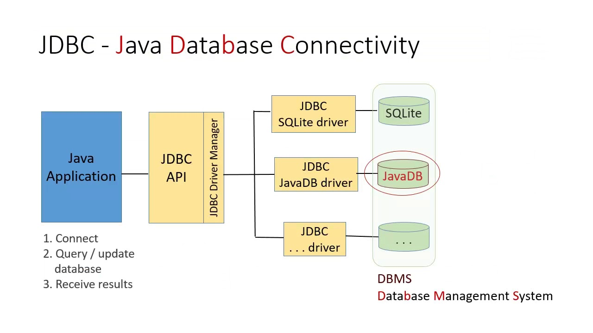

# Java e JDBC: trabalhando com um banco de dados

- [Java e JDBC: trabalhando com um banco de dados](#java-e-jdbc-trabalhando-com-um-banco-de-dados)
  - [Contextualizando](#contextualizando)
    - [Componentes](#componentes)
    - [Tipos de Drivers](#tipos-de-drivers)
    - [Simplificando o Uso](#simplificando-o-uso)
  - [Padrão Factory](#padrão-factory)
  - [Executando Comandos SQL no Java](#executando-comandos-sql-no-java)
  - [Evitando SQL Injection](#evitando-sql-injection)
  - [Controle de Transação](#controle-de-transação)
  - [Escalabilidade com Pool de Conexões](#escalabilidade-com-pool-de-conexões)
  - [Camada de Persistência com DAO](#camada-de-persistência-com-dao)
  - [Evitando Queries N + 1](#evitando-queries-n--1)
  - [Aplicações Desktop](#aplicações-desktop)

## Contextualizando

É uma API que possibilita que uma que uma aplicação construída em Java consiga acessar um banco de dados configurado local ou remotamente. É composta pelos pacotes `java.sql` e `javax.sql,` ambos incluídos no JavaSE.

Por meio das classes e interfaces fornecidas pelos memos, é possível desenvolver softwares que acessem qualquer fonte de dados - desde bancos relacionais até planilhas.



### Componentes

É composta por 2 componentes centrais. Primeiramente, os pacotes que contêm as classes e interfaces que padronizam a comunicação da aplicação Java com uma base de dados.

Em seguida estão os drivers, os verdadeiros responsáveis pela conexão e interação com um banco específico. Um driver JDBC é uma classe que implementa a interface `java.sql.Driver`. Muitos drivers são totalmente desenvolvidos com o uso de Java, o que colabora para serem carregados de maneira dinâmica.

Eles também podem ser escritos de forma nativa, acessando outras bibliotecas ou outros drivers de sistema que permitem acesso a uma base de dados determinada.

A classe `Driver` define um conjunto básico de operações para a manipulação do driver adequado para a conexão com um banco. Além disso, ela também é responsável por realizar a conexão inicial.

### Tipos de Drivers

Todos devem dar suporte mínimo às funcionalidades especificadas no padrão **ANSI2 SQL-92**. Através do driver, a aplicação Java acessa as implementações de classes e interfaces que vão permitir a execução dos comandos SQL em uma base de dados.

Atualmente sua arquitetura possui 4 tipos de drivers diferentes:

- Tipo 1
    - A JDBC-ODBC possibilita o acesso a drivers do tipo ODBC, um padrão já consolidado para o acesso a bases de dados.

- Tipo 2
    - Neste tipo de driver é implementado o protocolo do proprietário do banco de dados.
    - Ele transforma as chamadas JDBC em chamadas do banco com o uso da API proprietária.

- Tipo 3
    - Este tipo de driver faz a conversão das chamadas JDBC em outras chamadas do banco de dados, que são direcionadas para uma camada intermediária de software, ou middleware.
    - Assim, a chamada será convertida para o protocolo do banco.

- Tipo 4
    - São escritos puramente em Java e implementam o protocolo proprietário do banco de dados.
    - No geral, têm desempenho superior, já que acessam diretamente o SGBD, sistema gerenciador de banco de dados.


### Simplificando o Uso

Cmo uma receita, se segue estes passos:

- Definir a classe que implementa o driver JDBC;

- Definir a classe que implementa o driver JDBC
  - Basicamente uma cadeia de caracteres com informações para conectar.
  - Importante mencionar que a maneira de definir esta string varia entre bancos diferentes.

- Fornecer nome de usuário e senha para conectar no banco de dados.

```java
// Informações para conexão com o banco de dados 
String stringconexao = "jdbc:postgresql://localhost:5432/meuBD";
String usuario = "postgres";
String senha = "postgre";

try {
    // Carregando o driver do banco de dados.
    Class.forName("org.postgresql.Driver");

    // Criando a conexão com o banco de dados.
    Connection con = DriverManager.getConnection(stringconexao,usuario,senha);
}
catch (Exception ex) {
    throw new RuntimeException(ex.getMessage());
}
```

Após realizar a conexão com o banco de dados chega o momento de executar as operações de consulta, inserção, atualização e deleção (apagamento) de informações.

Existem um conjunto de classes e interfaces já preparados para isso. São elas:

- `Connection`
  - Representa uma sessão junto ao banco de dados desejado.

- `Statement`
  - Tem como objetivo a execução do comando SQL. Há também a `PreparedStatement`, que pré-compila o comando e armazena o SQL em um objeto.

- `ResultSet`
  - Esta interface tem por objetivo armazenar o retorno de uma consulta realizada no banco de dados. 
  - As informações das tabelas são recuperadas na sequência e podem ser iteradas em loops para a manipulação.

```java
// Criando uma conexão com o banco de dados 
Connection connect = getConnection();

// Criando um objeto que irá conter os comandos SQL
Statement stmt = connect.CreateStatement();

// String com o comando SQL a ser executado no banco
String sql = "SELECT * FROM alunos";

// Como o objetivo é a realização de consulta ao banco e dados, vamos pegar,
// o retorno e inicializar um objeto ResultSet, próprio para tratar o retornos de consultas
ResultSet rs = stmt.executeQuery(sql);

// Percorrendo o objeto e exibindo o resultado
while(rs.next()) {
    System.out.println("#" + rs.getInt("id") + " # " + rs.getString("nome"));
}

// Fechando os objetos
rs.close();
stmt.close();

// Encerrando a conexão
connect.close();
```

```java
// Criando uma conexão com o banco de dados
Connection connect = getConnection();

// String com o comando SQL a ser executado no banco
String sql = "INSERT INTO alunos VALUES (?,?,?)";

// Criando um objeto que irá conter os comandos SQL
PrepareStatement ps = connect.prepareStatement(sql);
ps.setLong(1, 2);
ps.setString(2,"James T. Kirk");
ps.setString(3,"mat03");

// Executando o comando na base de dados
int resultado = ps.executeUpdate(sql);
if (resultado == 1) {
    System.out.println("Dados inseridos com sucesso!");
}

// Fechando o objeto
ps.close()
// Encerrando a conexão
connect.close()
```

No fim, se pode definir os seguintes passos para usar o JDBC:

- Realizar o carregamento do driver do banco.

- Criar a conexão com o banco.

- Preparar o comando a ser executado no banco.

- Executar o comando.
  - `executeQuery` para consultas e `executeUpdate` para manipulação de dados.

- Tratar o resultado. 
  - Quando for o retorno de uma consulta (ResultSet), iterar o objeto. 
  - Se for o retorno de `insert`, `update` ou `delete`, avaliar o valor retornado.

## Padrão Factory

## Executando Comandos SQL no Java

## Evitando SQL Injection

## Controle de Transação

## Escalabilidade com Pool de Conexões

## Camada de Persistência com DAO

## Evitando Queries N + 1

## Aplicações Desktop