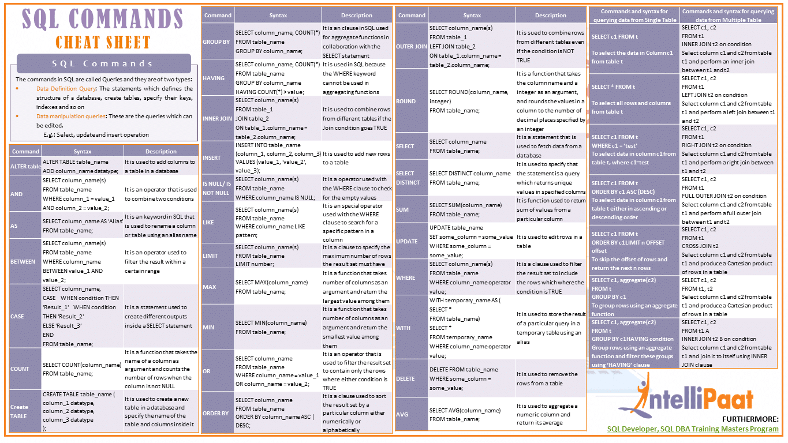

# SQL

- [SQL](#sql)
  - [Contextualizando SQL](#contextualizando-sql)
  - [Contextualizando MySQL](#contextualizando-mysql)
  - [Contextualizando Banco de Dados](#contextualizando-banco-de-dados)
  - [Conceitos de Banco de Dados](#conceitos-de-banco-de-dados)
    - [Abstração de Dados](#abstração-de-dados)
    - [Projeto de Banco de Dados](#projeto-de-banco-de-dados)
    - [Tipos de Bancos de Dados](#tipos-de-bancos-de-dados)
  - [Linguagem SQL](#linguagem-sql)
      - [Diferentes Tipos de Joins](#diferentes-tipos-de-joins)
    - [Organização SQL](#organização-sql)
    - [Operadores](#operadores)
      - [Relacionais](#relacionais)
      - [Lógicos](#lógicos)
      - [Wildcards](#wildcards)
      - [Aritméticos](#aritméticos)
      - [De Atribuição Composta](#de-atribuição-composta)
    - [Apelidos Para Campos Selecionados](#apelidos-para-campos-selecionados)
    - [Concatenação e Distinção](#concatenação-e-distinção)
    - [Ordenando Os Resultados](#ordenando-os-resultados)
    - [Expressão CASE](#expressão-case)
    - [Stored Procedures](#stored-procedures)
    - [Algumas Boas Práticas](#algumas-boas-práticas)
        - [Cheat Sheet](#cheat-sheet)
  - [Database](#database)
    - [Create, Drop e Backup (DB)](#create-drop-e-backup-db)
    - [Create, Drop e Alter (Table)](#create-drop-e-alter-table)
    - [Constrains](#constrains)
      - [Auto Increment](#auto-increment)
    - [Tipos de Dados](#tipos-de-dados)
    - [Views](#views)
    - [Injections](#injections)
    - [Funções Mais Comuns do MySQL](#funções-mais-comuns-do-mysql)


## Contextualizando SQL

SQL é uma linguagem de programação usada por quase todos os bancos de dados relacionais para consultar, manipular e definir dados e fornecer controle de acesso. O SQL foi desenvolvido pela primeira vez na IBM nos anos 1970, com a Oracle como principal contribuinte, o que levou à implementação do padrão SQL ANSI. 

Embora o SQL ainda seja amplamente usado hoje em dia, novas linguagens de programação estão começando a aparecer.

Criada com o intuito de padronizar a maneira como os registros são consultados nos bancos de dados relacionais. Atualmente vai além das consultas: cria, altera, estrutura e manipula banco  de dados, além da maneira como banco de dados interage com segurança, entre outras funcionalidades.

**Suas vantagens:**

- Aprendizado ↓

Ao ter o conhecimento da linguagem, é simples se adaptar entre diferentes bancos, como exemplo: 

O profissional com conhecimento sobre o SQL da Oracle conseguirá manipular facilmente o MySQL ou SQL Server da Microsoft. Por mais que existam diferenças - principalmente na parte de funções - a adaptação do profissional não é uma questão complicada.

- Portabilidade ↓

É mais simples migrar sistemas. Lembrando que quanto mais for utilizado o SQL Standard definido pelo ANSI, mais fácil será essa portabilidade no futuro. Então, é útil evitar as funções específicas do banco de dados e permitir que o programa realize essa tarefa.

- Longevidade ↓

É a garantia de que os relatórios ou processos utilizando o SQL irão funcionar por um longo período, já que estarão sempre adaptados ao padrão ANSI. Ou seja, ao efetuar um upgrade de banco de dados o sistema não ficará fora de serviço.

- Comunicação ↓

O fato da maioria utilizar SQL permite a facilidade de comunicação entre os sistemas. Como, por exemplo, processos de ETL, (extract, transform and load), ou de integração entre sistemas que ficam mais simples de serem desenvolvidos, já que ambos utilizam o SQL padrão.

- Liberdade de Escolha ↓

Por existir um padrão de linguagem, se a empresa for optar pelo uso de um banco de dados relacional não ficará presa à linguagem de comunicação, por exemplo, já que são bem semelhantes. Ao tomar essa decisão, a corporação irá utilizar outros critérios de escolha, como performance, hardware, custo, entre outros.

**Suas desvantagens:**

- Privação de Criatividade ↓

O SQL possui limitações que podem não atender às novas demandas no mercado na linguagem SQL, principalmente com o surgimento das redes sociais e dos enormes volumes de dados, o chamado big data. Ou seja, há uma carência nas coletas de dados que estão trafegando na internet.

Para tal, estão surgindo outros bancos que usam padrões diferentes dos bancos de dados relacionais, o chamado NoSQL. Estes atendem de forma mais eficiente as demandas de tabelas de big data, como no caso das redes sociais.

- Falta de Estruturação ↓

A linguagem não possui comandos condicionais como as demais linguagens de programação.

Para conseguir suprir essa carência da estruturação, os bancos de dados relacionais da Oracle, SQL e MySQL criaram suas linguagens próprias internas que realizam esse conjunto de estruturação usando a linguagem SQL, mas que acaba se afastando um pouco do padrão ANSI.

**O padrão ANSI possui 3 grupos de comandos:**

- DDLs (Data Definition Language) ↓

São a parte da linguagem SQL que permite a manipulação das estruturas do banco de dados. Como, por exemplo, criar um banco, tabelas, índices, apagar as tabelas e alterar a política de crescimento de índice. Ou seja, os comandos que envolvem a estrutura do banco de dados relacionais são os comandos do tipo DDL.

- DML (Data Manipulation Language) ↓

Visa gerenciar os dados: incluindo, alterando e excluindo informações nas estruturas do banco, como as tabelas. Além disso, realizam as consultas, buscam as informações das estruturas e exibem para o usuário.

- DCL (Data Control Language ) ↓

Permite administrar o banco de dados como, por exemplo, o controle de acesso, o gerenciamento do usuário, gerenciar o que cada usuário(a) pode ou não visualizar, gerenciar o banco ao nível de estrutura (como a política de crescimento, como e onde será armazenado no disco), administrar os processos, saber quantos processos estão sendo executados, controle de log e assim por diante.

## Contextualizando MySQL

Criado no projeto MySQL, é um banco de dados relacional e compatível com a linguagem SQL. Apresentado como open-source, foi comprado pela Oracle e hoje é distribuído em duas formas: open-source, sob os termos da licença GNU (GNU's Not Unix!), e sob a licença padrão comercial do MySQL.

Quando o MySQL foi vendido, a comunidade open source criou outro banco de dados, o MariaDB, que se tornou o sucessor em código aberto do MySQL.

- Servidor ↓

É robusto até certo ponto, já que deriva de características de multiacesso, integridade de dados, efetua o relacionamento entre tabelas, trabalha a concorrência quando vários usuários tentam acessar o mesmo dado na mesma tabela, realiza o controle de transações, entre outros processos.

- Portabilidade ↓

Pode ser transacionado entre diversos sistemas. Isso significa que é possível desenvolver o banco de dados MySQL em Windows e posteriormente utilizar no Linux ou Unix, sendo assim, interplataforma.

Além disso, o banco MySQL provém várias APIs que permitem acessar os dados do MySQL usando .Net, Java, Python, PHP, JavaScript e JQuery, por exemplo. Isto é, as linguagens de programação que são mais usadas no mercado possuem APIs nativas para acesso ao MySQL.

- Multithread ↓

É usado uma programação de threads utilizando diretamente o Kernel do sistema operacional, permitindo aumentar a velocidade de transações, além de facilitar a integração da ferramenta com hardwares, possibilitando a escalabilidade da performance.

Isto quer dizer que, caso tenha um MySQL usando um servidor com determinado número de CPUs, é possível acrescentar mais CPUs que o banco de dados se adapta usando o máximo do hardware disponível.

- Armazenamento ↓

Atua com diversas formas de armazenamento que se adaptam às características das suas necessidades. Por exemplo, algumas formas priorizam a velocidade, enquanto outras o alto volume de armazenamento, tudo dependendo do objetivo pelo qual é utilizado.

- Velocidade e Desempenho ↓

É considerado um dos bancos mais rápidos do mercado, sobretudo quando são utilizadas funcionalidades ligadas à internet. Como exemplo, sites de e-commerce e de aplicações de internet, já que as nuvens da Amazon, do Google e da Microsoft (Azure) disponibilizam instâncias de MySQL com uma alta escalabilidade.


- Segurança ↓

Possui internamente diversos mecanismos de segurança, o que o torna bastante seguro para o mercado. Além disso, permite a segregação dos dados por usuários de acesso, isto é, a pessoa possui acesso somente ao que lhe for permitido.

- Capacidade ↓

Também permite o armazenamento de uma quantidade enorme de dados, tornando a sua capacidade alta, a depender das formas de armazenamento. Se for escolhida uma forma que prioriza o volume de dados, há um limite hoje de até 65 mil terabytes de dados armazenados.

Claro, recuperar e manipular esse volume de informação pode ser um pouco difícil e depender de muito hardware. A maioria das aplicações corporativas não precisam desse tamanho todo de armazenamento para trabalharem.

- Aplicabilidade ↓

O MySQL não se aplica somente a utilidades de internet - apesar de ser preferido por desenvolvedores web -, mas também aplicações de desktop ou corporativas, essas chamadas de On Premises, nas quais o banco de dados é instalado no próprio servidor da empresa. 

Esses bancos possuem o que chamamos ODBCs (Open Database Connectivity, comum em bancos baseados em Windows) ou JDBCs (Java Database Connectivity, comum em bancos baseados em Java), que permitem realizar acessos rápidos ao banco de dados MySQL em aplicações desktop.

- Logs ↓

No MySQL há um forte gerenciamento de log, que registra tudo o que é feito no banco. Isso é um ponto interessante quando é necessário realizar uma recuperação de dados ou se for preciso fazer o que é chamado réplica de servidores, técnica bastante usada quando se tem um servidor chamado master e outro slave, existindo uma sincronização de dados entre eles.

## Contextualizando Banco de Dados

Um banco de dados é um armazenamento de informações, **um repositório que armazena dados que podem ser consultados**, ou seja, é possível em um ambiente ou diretório específico e visualizar um ou mais arquivos  que representam o banco de dados. 

Isso faz com que a entidade maior seja o próprio banco de dados.

Dentro dele há diversas entidades, estruturas que organizam como os dados são armazenados. Uma das principais entidades é a **tabela**, podendo conter várias no mesmo banco de dados.

Uma tabela é constituída de 2 componentes: **campos** (colunas) e **registros** (linhas); diferente de, por exemplo, uma tabela no excel, no momento de criação da mesma é preciso já estabelecer as **definições** do que ela abrangerá.

Algumas dessas definições são a quantidade e categoria de cada campo. Como exemplo de categoria se pode ser: textual, numérico, lógico ou binário.

Os valores de um mesmo campo não podem ser de grupos diferentes, ou seja, se o campo foi estabelecido como numérico, só pode armazenar números. Caso fuja da categoria, incluindo por exemplo um texto, o banco de dados retorna erro.

Os registros possuem número infinito, isto é, quantidade ilimitada por padrão - a depender do espaço em disco disponível para o banco de dados expandir. 

Inclusive, ao gerar um banco de dados se pode determinar políticas de crescimento ou o limite máximo que ele pode ampliar.

Ainda referente a tabela, outro conceito importante é a **chave primária (primary key)**. No momento de criar uma tabela, não obrigatoriamente, se pode estabelecer uma chave primária, isso significa que os valores de um campo específico não podem se repetir em um registro.

Já se for uma chave primária composta, o que não pode repetir é a combinação entre os campos. Portando, **chave primária são os valores de campos ou combinação entre campos — chave primária composta — que não podem se repetir nos registros da tabela.**

Além disso, como é possível em um banco de dados se ter várias tabelas, cada uma possuindo um fragmento da informação armazenada, também é possível estabelecer uma relação entre elas através da **chave estrangeira (foreign key)**.

Isso faz com o que a informação tenha integridade, visto que essa isso impede que existam buracos entre tabelas relacionadas.

Outro ponto importante é que as tabelas podem ter **índices** -  estes permitindo encontrar informações dentro das mesmas de maneira mais rápida.

Quando há uma chave estrangeira, automaticamente o banco de dados cria índices nos campos que se inter-relacionam.

Simplificando, no banco de dados há diversas tabelas, composta por campos (colunas) e registros (linhas), essas tabelas possuem chaves estrangeiras, primárias e podem conter índices.

**Esquema (Schemas)** é o conjunto de tabelas que representam o mesmo assunto. As tabelas de esquemas diferentes podem se relacionar, essa transformação é apenas uma forma de agrupar as tabelas por tema, sendo mais utilizado no sentido de organização.

O banco de dados possui também a chamada **View (visão)**, um agrupamento de tabelas. Ao fazer uma consulta ela pode retornar informações de uma ou mais tabelas. Após conseguir unir duas ou mais tabelas e gerar um resultado para essa consulta, se pode transformar-lá em uma view.

Isso significa que a view possui um comportamento similar a tabela, mas que por trás dela já há uma consulta estabelecida com as regras de negócio para agrupar as informações solicitadas.

Internamente, o banco de dados possui **procedures**, e dentro deste se pode ter funções. Eles são cálculos montados com campos que podem ser usadas dentro de um comando de consulta.

Os sistemas costumam possuir um catálogo próprio de funções, mas também é possível criá-las.

Por último, existem os **triggers**. Este é um aviso programado caso algo ocorra no banco de dados ou tabela. Por exemplo, um aviso caso alguém realize alguma alteração ou delete informações nas tabelas.

Este aviso poder ser uma função, um procedure ou um único comando SQL, que será executado quando a condição da trigger for satisfeita.

Enfim, o banco de dados possui todos esses componentes: tabelas, views, procedures e funções.

## Conceitos de Banco de Dados

Segundo Korth, um banco de dados: 

> é uma coleção de dados inter-relacionados, representando informações sobre um domínio específico. 

Ou seja, é um repositório que armazena de forma agrupada informações relacionadas, facilitando consulta, criação e manipulação dos dados.

Já um sistema de gerenciamento de banco de dados (SGBD) é um software que possui recursos capazes de manipular as informações do banco de dados e interagir com o usuário.

Por fim, o conceito de um sistema de banco de dados é que ele é como o conjunto de quatro componentes básicos: dados, hardware, software e usuários. Date conceituou que: 

> um sistema de bancos de dados pode ser considerado como uma sala de arquivos eletrônica

Os objetivos de um sistema de banco de dados são o de isolar o usuário dos detalhes internos do banco de dados (promover a abstração de dados) e promover a independência dos dados em relação às aplicações, ou seja, tornar independente da aplicação, a estratégia de acesso e a forma de armazenamento.


### Abstração de Dados

O sistema de banco de dados deve garantir uma visão totalmente abstrata do banco de dados para o usuário, ou seja, para o usuário do banco de dados pouco importa qual unidade de armazenamento está sendo usada para guardar seus dados, contanto que os mesmos estejam disponíveis no momento necessário.

Há diferentes interpretações de como se divide esta abstração, uma delas é:


Ela se dá em 3 níveis:

- Nível de visão do usuário ↓
  - As partes do banco de dados que o usuário tem acesso de acordo com a necessidade individual de cada usuário ou grupo de usuários;

- Nível conceitual ↓
  - Define quais os dados que estão armazenados e qual o relacionamento entre eles;

- Nível físico ↓
  - É o nível mais baixo de abstração, em que define efetivamente de que maneira os dados estão armazenados.

Outro modo de ver esta mesma interpretação é como uma hierarquia de modelos de dados que se divide em três níveis de acordo com a capacidade de abstração do modelo: Conceitual, Lógico e Físico.

Segundo Silberschatz, sua classificação segue:

- Nível físico ↓ 
  - Nível de abstração mais baixo, descreve como os dados são armazenados.

- Nível lógico ↓ 
  - O próximo nível de abstração, descreve quais dados estão armazenados no banco de dados e quais relações existem entre eles.

- Nível de visão ↓ 
  - A abstração mais alta, descreve apenas parte do banco de dados.


- Esquemas ↓
  - Esquema físico
    - Descreve o projeto de banco de dados no nível físico.

  - Esquema lógico
    - Descreve o projeto de banco de dados no nível lógico.

- Modelo de dados ↓
  - Modelo relacional
  - Modelo entidade-relacionamento
  - Modelo de dados baseado em objetos.
  - Modelo de dados semiestruturado.

- Arquitetura ↓
  - Duas camadas
    - Cliente (usuário e aplicação) + Servidor (sistema de banco de dados)

  - Três camadas
    - Cliente (usuário e cliente de aplicação) + Servidor (servidor de aplicação + sistema de banco de dados)

Existe uma outra hierarquia, a da Arquitetura 3 esquemas, onde também se tem três níveis: Externo, Conceitual e Físico.

Segundo Navathe as hierarquias seguem como:

- Modelo de dados: uma coleção de conceitos que podem ser utilizados para descrever a estrutura do banco de dados.
  - Conceitual ou de alto nível 
    - oferecem conceitos próximos de como os usuários percebem os dados. (e.g.: modelo ER)
  
  - Representativos ou de implementação
    - Oferecem conceitos que podem ser facilmente entendidos pelos usuários finais, mas que não estão muito longe do modo como os dados são organizados e armazenadas. 
    - Modelos de dados representativos ocultam muitos detalhes do armazenamento de dados em disco, mas podem ser implementados diretamente em um sistema de computador. (e.g.: modelo de dados relacional, rede ou hierárquico)
  
  - Físicos ou de baixo nível 
    - Oferecem conceitos que descrevem os detalhes de como os dados são armazenados no computador, em geral, em discos magnéticos.

- Arquitetura três esquemas
  - Níveis
    - Níveis: externo, conceitual, interno

    - Esquemas: Visão externa, esquema conceitual, esquema interno

    - Mapeamentos: externo/conceitual e conceitual/interno

    - Independência de dados: lógica (mudança no esquema conceitual) e física (mudança no esquema interno).

### Projeto de Banco de Dados

Todo bom sistema de banco de dados deve apresentar um projeto, este visa a organização das informações e utilização de técnicas para que o futuro sistema obtenha boa performance e também facilite infinitamente as manutenções que venham a acontecer.

O projeto se divide em 2 fases, sendo elas uma referência para um sistema de banco de dados ainda não implementado, ou seja, que ainda não existe, um novo projeto. Para os casos em que o banco de dados já existe, mas é um sistema legado, por exemplo, ou um sistema muito antigo sem documentação, o processo de projeto de banco de dados se dará através da utilização de uma técnica chamada de Engenharia Reversa.

- Modelagem Conceitual ↓

É a descrição do Banco de Dados independente ao Sistema de Gerenciamento de Dados, ou seja, define quais os dados que aparecerão no BD, mas sem se importar com a implementação que se dará ao BD. Desta forma, há uma abstração em nível de SGBD.

Uma das técnicas mais utilizadas dentre os profissionais da área é a abordagem entidade-relacionamento (ER), onde o modelo é representado graficamente através do diagrama entidade-relacionamento (DER).


O modelo acima, entre outras coisas, nos traz informações sobre Alunos e Turmas. Para cada Aluno, será armazenado seu número de matrícula, seu nome e endereço, enquanto para cada turma, teremos a informação de seu código, a sala utilizada e o período.

- Projeto Lógico ↓

Descreve o BD no nível do SGBD, ou seja, depende do tipo particular de SGBD que será usado. Não pode ser confundido com o Software que será usado. O tipo de SGBD que o modelo lógico trata é se o mesmo é relacional, orientado a objetos, hierárquico, etc.

### Tipos de Bancos de Dados

Há vários tipos de bancos de dados, sendo que o melhor banco de dados para uma organização específica depende de como a organização pretende usar os dados.


- **BD Relacionais ↓**

Se tornaram dominantes na década de 1980. 

Os itens são organizados como um conjunto de tabelas com colunas e linhas. A tecnologia de banco de dados relacional fornece a maneira mais eficiente e flexível de acessar informações estruturadas.


- **BD Orientado a Objetos ↓**

As informações são representadas na forma de objetos, como na programação orientada a objetos.


- **BD Distribuídos ↓**

Consiste em dois ou mais arquivos localizados em sites diferentes. O banco de dados pode ser armazenado em vários computadores, localizados no mesmo local físico ou espalhados por diferentes redes.


- **Data Warehouse ↓**

Um repositório central de dados é um tipo de banco de dados projetado especificamente para consultas e análises rápidas.


- **BD NoSQL ↓**

Um NoSQL, ou banco de dados não relacional, permite que dados não estruturados e semiestruturados sejam armazenados e manipulados (em contraste com um banco de dados relacional, que define como todos os dados inseridos no banco de dados devem ser compostos). 


Os bancos de dados NoSQL se tornaram populares à medida que os aplicativos web se tornaram mais comuns e mais complexos.


- **BD Gráficos ↓**

Armazena dados em termos de entidades e os relacionamentos entre entidades.


- **BD OLTP ↓**

É um banco de dados rápido e analítico projetado para um grande número de transações realizadas por vários usuários.


Esses são apenas alguns dos vários tipos de bancos de dados em uso atualmente. Há também outros bancos de dados menos comuns que são adaptados para funções científicas, financeiras ou outras muito específicas. 

Além dos diferentes tipos de banco de dados, as mudanças nas abordagens de desenvolvimento de tecnologia e os avanços dramáticos, como a nuvem e a automação, estão impulsionando os bancos de dados em direções totalmente novas. Alguns dos mais recentes bancos de dados incluem:

- **BD em Nuvem ↓**

É uma coleção de dados, estruturados ou não estruturados, que residem em uma plataforma de computação em nuvem privada, pública ou híbrida. Existem dois tipos de modelos de banco de dados em nuvem: tradicional e banco de dados como serviço (DBaaS). 

Com o DBaaS, as tarefas administrativas e a manutenção são executadas por um provedor de serviços.

- **BD Multimodelo ↓**

Combinam diferentes tipos de modelos de banco de dados em um back-end único e integrado. Isso significa que eles podem acomodar vários tipos de dados.

- **BD Autônomos ↓**

Os bancos de dados independentes mais novos e inovadores (também conhecidos como bancos de dados autônomos) são baseados em nuvem e usam machine learning para automatizar o ajuste de banco de dados, segurança, backups, atualizações e outras tarefas de gerenciamento de rotina tradicionalmente executadas por administradores de banco de dados.

- **BD de Documentos/JSON ↓**

Projetado para armazenamento, recuperação e gerenciamento de informações orientadas a documentos, os bancos de dados de documentos são uma maneira moderna de armazenar dados no formato JSON, em vez de linhas e colunas.

## Linguagem SQL

A maioria das ações dentro de uma base de dados são executadas por declarações SQL. Sua forma mais básica consistem em: comando/palavra_chave + o nome da tabela.

```sql
COMMAND * COMMAND table_name

KEYWORD * KEYWORD object_name
```

```sql
SELECT * FROM city
```

Comentários seguem a seguinte sintaxe:

```sql
-- isso é um comentário
```

As keywords não são case-sensitive, ou seja, `SELECT == select`. O ponto e vírgula é padrão para finalizar declarações e separa-las em bases que permitem a execução de mais de uma declaração por vez em uma chamada para o server.

```sql
SELECT * FROM costumers;

SELECT * FROM managers;
```

| Keyword         | Description                                                                 | Example                                                                                                                                     |
| --------------- | --------------------------------------------------------------------------- | ------------------------------------------------------------------------------------------------------------------------------------------- |
| ADD             | Add new records to a table.                                                 | `INSERT INTO Employees (FirstName, LastName) VALUES ('John', 'Doe');`                                                                       |
| ALTER TABLE     | Modify an existing table structure.                                         | `ALTER TABLE Customers ADD Email VARCHAR(255);`                                                                                             |
| AND             | Combine multiple conditions using logical AND.                              | `SELECT * FROM Orders WHERE Country = 'USA' AND Region = 'West';`                                                                           |
| AS              | Alias for column or table names in queries.                                 | `SELECT City AS Location FROM Customers;`                                                                                                   |
| AVG             | Calculate the average of numeric values.                                    | `SELECT AVG(Salary) FROM Employees;`                                                                                                        |
| BETWEEN         | Select values within a specified range.                                     | `SELECT * FROM Orders WHERE OrderDate BETWEEN '2023-01-01' AND '2023-12-31';`                                                               |
| COUNT           | Calculate the number of rows in a result set.                               | `SELECT COUNT(*) FROM Orders;`                                                                                                              |
| CONSTRAINTS     | Define rules and relationships for data integrity.                          | `CREATE TABLE Orders (OrderID INT PRIMARY KEY, CustomerID INT, OrderDate DATE, FOREIGN KEY (CustomerID) REFERENCES Customers(CustomerID));` |
| CREATE DATABASE | Create a new database.                                                      | `CREATE DATABASE MyDatabase;`                                                                                                               |
| CREATE TABLE    | Define a new database table.                                                | ```sql CREATE TABLE Employees (EmployeeID INT, LastName VARCHAR(255), FirstName VARCHAR(255));```                                           |
| DELETE          | Remove rows from a table.                                                   | `DELETE FROM Customers WHERE CustomerID = 5;`                                                                                               |
| DISTINCT        | Return unique values from a column.                                         | `SELECT DISTINCT Category FROM Products;`                                                                                                   |
| DROP TABLE      | Delete a table and all its data.                                            | `DROP TABLE Orders;`                                                                                                                        |
| FROM            | Specify the table or tables to query.                                       | `SELECT * FROM Orders;`                                                                                                                     |
| FULL OUTER JOIN | Return all rows when there is a match in either table.                      | `SELECT * FROM Customers FULL OUTER JOIN Orders ON Customers.CustomerID = Orders.CustomerID;`                                               |
| GROUP BY        | Group rows based on common column values.                                   | `SELECT Region, COUNT(*) FROM Orders GROUP BY Region;`                                                                                      |
| HAVING          | Filter groups based on a condition.                                         | `SELECT Region, COUNT(*) FROM Orders GROUP BY Region HAVING COUNT(*) > 10;`                                                                 |
| IN              | Filter rows based on a list of values.                                      | `SELECT * FROM Products WHERE Category IN ('Electronics', 'Appliances');`                                                                   |
| INDEX           | Improve query performance by creating an index.                             | `CREATE INDEX idx_LastName ON Employees(LastName);`                                                                                         |
| INNER JOIN      | Return only matching rows from both tables.                                 | `SELECT * FROM Customers INNER JOIN Orders ON Customers.CustomerID = Orders.CustomerID;`                                                    |
| INSERT INTO     | Add new records to a table.                                                 | `INSERT INTO Employees (FirstName, LastName) VALUES ('John', 'Doe');`                                                                       |
| IS NULL         | Filter rows with NULL values.                                               | `SELECT * FROM Employees WHERE SupervisorID IS NULL;`                                                                                       |
| JOIN            | Combine rows from multiple tables.                                          | `SELECT * FROM Customers JOIN Orders ON Customers.CustomerID = Orders.CustomerID;`                                                          |
| LEFT JOIN       | Return all rows from the left table and matching rows from the right table. | `SELECT * FROM Customers LEFT JOIN Orders ON Customers.CustomerID = Orders.CustomerID;`                                                     |
| LIKE            | Filter rows based on a pattern.                                             | `SELECT * FROM Customers WHERE ContactName LIKE 'John%';`                                                                                   |
| MAX             | Find the maximum value in a column.                                         | `SELECT MAX(Price) FROM Products;`                                                                                                          |
| MIN             | Find the minimum value in a column.                                         | `SELECT MIN(Price) FROM Products;`                                                                                                          |
| NOT             | Negate a condition.                                                         | `SELECT * FROM Products WHERE NOT Discontinued;`                                                                                            |
| NOT NULL        | Filter rows without NULL values.                                            | `SELECT * FROM Customers WHERE Email IS NOT NULL;`                                                                                          |
| ORDER BY        | Sort the result set by one or more columns.                                 | `SELECT * FROM Employees ORDER BY LastName;`                                                                                                |
| OR              | Combine multiple conditions using logical OR.                               | `SELECT * FROM Orders WHERE Country = 'USA' OR Country = 'Canada';`                                                                         |
| SELECT          | Retrieve data from a database.                                              | `SELECT * FROM Customers;`                                                                                                                  |
| UNION           | Combine the result sets of two or more SELECT statements.                   | `SELECT City FROM Customers WHERE Country = 'USA' UNION SELECT City FROM Customers WHERE Country = 'Canada';`                               |
| UPDATE          | Modify existing records in a table.                                         | `UPDATE Products SET Price = 20 WHERE ProductID = 1;`                                                                                       |
| USE             | Select a specific database to work with.                                    | `USE MyDatabase;`                                                                                                                           |
| VIEW            | Create a virtual table based on a query.                                    | `CREATE VIEW HighValueCustomers AS SELECT * FROM Customers WHERE TotalPurchases > 1000;`                                                    |
| WHERE           | Filter rows based on a specified condition.                                 | `SELECT * FROM Products WHERE Price > 50;`                                                                                                  |


#### Diferentes Tipos de Joins

- `INNER JOIN`: 
  - Retorna registros que tenham valores compatíveis em ambas as tabelas


```sql
SELECT ProductID, ProductName, CategoryName
FROM Products
INNER JOIN Categories ON Products.CategoryID = Categories.CategoryID;
```

- `LEFT (OUTER) JOIN`: 
  - Retorna todos os registros da tabela a esquerda, e os registros compatíveis da tabela a direita


```sql
SELECT column_name(s)
FROM table1
LEFT JOIN table2
ON table1.column_name = table2.column_name;
```

```sql
SELECT Customers.CustomerName, Orders.OrderID
FROM Customers
LEFT JOIN Orders ON Customers.CustomerID = Orders.CustomerID
ORDER BY Customers.CustomerName;
```

- `RIGHT (OUTER) JOIN`: 
  - Retorna todos os registros da tabela a direita, e os registros compatíveis da tabela a esquerda


```sql
SELECT column_name(s)
FROM table1
RIGHT JOIN table2
ON table1.column_name = table2.column_name;
```

```sql
SELECT Orders.OrderID, Employees.LastName, Employees.FirstName
FROM Orders
RIGHT JOIN Employees ON Orders.EmployeeID = Employees.EmployeeID
ORDER BY Orders.OrderID;
```

- `FULL (OUTER) JOIN`: 
  - Retorna todos os registros quando há um compatível, seja em qualquer uma das tabelas


```sql
SELECT column_name(s)
FROM table1
FULL OUTER JOIN table2
ON table1.column_name = table2.column_name
WHERE condition;
```

```sql
SELECT Customers.CustomerName, Orders.OrderID
FROM Customers
FULL OUTER JOIN Orders ON Customers.CustomerID=Orders.CustomerID
ORDER BY Customers.CustomerName;
```

- `SELF JOIN`:
  - É um join regular, mas a tabela se junta a si mesma

```sql
SELECT column_name(s)
FROM table1 T1, table1 T2 -- T1 and T2 are aliases for the same table
WHERE condition;
```

```sql
SELECT A.CustomerName AS CustomerName1, B.CustomerName AS CustomerName2, A.City
FROM Customers A, Customers B
WHERE A.CustomerID <> B.CustomerID
AND A.City = B.City
ORDER BY A.City;
```

### Organização SQL


A linguagem é organizada em subconjuntos, cada um com propósitos próprios bem definidos:

- **DQL Linguagem de Consulta de Dados**
  - Define o comando utilizado para consultar os dados armazenados no banco
    - `SELECT`

```sql
SELECT nome, valor FROM produto -- consulta todos os registros dentro da tabela produto
```

> algumas colocam o `SELECT` como integrante do grupo DML, já que a sua função nesse grupo seria de recuperação de dados

- **DDL Linguagem de Definição de Dados**
  - Define os comandos utilizados para a criação de tabelas, views, índices, assim como as atualizações dessas estruturas e suas remoções
    - `CREATE`
    - `ALTER`
    - `DROP`

```sql
CREATE TABLE produto -- criação da tabela de nome produto
```

- **DML Linguagem de Manipulação de Dados**
  - Define os comandos utilizados para a manipulação de dados no banco
    - `INSERT`
    - `UPDATE`
    - `DELETE`

```sql
INSERT INTO produto (nome, valor) VALUES ('computador','3500')
-- inserção de valores na tabela produto
```

- **DCL Linguagem de Controle de Dados**
  - Define os comandos utilizados para controlar o acesso aos dados do banco, adicionando e removendo permissões de acesso
    - `GRANT`
    - `REVOKE`

```sql
GRANT CREATE TABLE to usuario -- concede privilégio de criar tabela a um usuário
```

- **DTL Linguagem de Transação de Dados**
  - Define os comandos utilizados para gerenciar as transações executadas no banco de dados, como iniciar uma transação, confirmar e desfazer
    - `BEGIN`
    - `COMMIT`
    - `ROLLBACK`

```sql
BEGIN TRAN -- inicia uma transação
```

### Operadores

Os operadores principais são: relacionais (de comparação), lógicos (condicionais) e aritméticos.

#### Relacionais

São sinais com função comparativa entre valores, estruturas e controles.

| Operator | Description              | Example                      |
| -------- | ------------------------ | ---------------------------- |
| =        | Equal to                 | `WHERE Age = 30`             |
| <> or != | Not equal to             | `WHERE Status <> 'Inactive'` |
| <        | Less than                | `WHERE Price < 100`          |
| !<       | Not less than            | `WHERE Price !< 100`         |
| <=       | Less than or equal to    | `WHERE Quantity <= 10`       |
| >        | Greater than             | `WHERE Salary > 50000`       |
| !>       | Not greater than         | `WHERE Salary !> 50000`      |
| >=       | Greater than or equal to | `WHERE Rating >= 4.5`        |

Não é possível usar operadores relacionais para verificar registros com valores nulos, para estes casos é necessário usar os operadores lógicos específicos.

#### Lógicos

Operadores com função de validar condições ou testar sua legitimidade. Retorna valores que podem ser `TRUE`, `FALSE` ou `UNKNOWN`.

| Operator    | Description                    | Example                                           |
| ----------- | ------------------------------ | ------------------------------------------------- |
| BETWEEN     | Between a range of values      | `WHERE Age BETWEEN 20 AND 40`                     |
| LIKE        | Search for a specified pattern | `WHERE Name LIKE 'John%'`                         |
| IN          | Match any value in a list      | `WHERE Category IN ('Electronics', 'Appliances')` |
| IS NULL     | Check for NULL values          | `WHERE Notes IS NULL`                             |
| IS NOT NULL | Check for non-NULL values      | `WHERE Email IS NOT NULL`                         |
| AND         | Logical AND                    | `WHERE Age >= 18 AND Gender = 'Male'`             |
| OR          | Logical OR                     | `WHERE Country = 'USA' OR Country = 'Canada'`     |
| NOT         | Negates a condition            | `WHERE NOT Status = 'Inactive'`                   |

#### Wildcards

Caracteres wildcards são usados para substituir um ou mais caracteres em uma string. Eles são usados junto ao operador lógico `LIKE`.

| Wildcard    | Description                                                                        | Example                                                     |
| ----------- | ---------------------------------------------------------------------------------- | ----------------------------------------------------------- |
| %           | Matches any sequence of characters (including zero characters).                    | `SELECT * FROM Customers WHERE ContactName LIKE 'S%';`      |
| _           | Matches any single character (underscore is a placeholder for a single character). | `SELECT * FROM Products WHERE ProductName LIKE '_pple';`    |
| [charlist]  | Matches any single character in the specified list.*                               | `SELECT * FROM Employees WHERE FirstName LIKE '[JM]ohn';`   |
| [^charlist] | Matches any single character not in the specified list.*                           | `SELECT * FROM Products WHERE ProductCode LIKE '[^A-C]%';`  |
| -           | Represents any single character within the specified range.*                       | `SELECT * FROM Customers WHERE CustomerName LIKE '[a-f]%';` |

* Not supported in PostgreSQL and MySQL databases.

#### Aritméticos

Para operações matemáticas ou dados numéricos.

Regras de procedência: multiplicação(*) e divisão(/) tem prioridade sobre adição(+) e subtração(-). Operadores de mesma prioridade são executados da esquerda para a direita.

Parênteses podem ser usados para forçar a prioridade dos cálculos e tornar o entendimento das fórmulas mais claro.

| Operator | Description         | Example                                                   |
| -------- | ------------------- | --------------------------------------------------------- |
| +        | Addition            | `SELECT Price + Tax AS Total FROM Products;`              |
| -        | Subtraction         | `SELECT Salary - Deductions AS NetSalary FROM Employees;` |
| *        | Multiplication      | `SELECT Quantity * Price AS TotalPrice FROM Orders;`      |
| /        | Division            | `SELECT Revenue / UnitsSold AS PricePerUnit FROM Sales;`  |
| %        | Modulus (Remainder) | `SELECT 17 % 5 AS Remainder;`                             |

#### De Atribuição Composta

Operadores que fazem uma operação na variável e, então, atribuem o resultado em cima do valor antigo.

| Operator | Description            | Example                                                            |
| -------- | ---------------------- | ------------------------------------------------------------------ |
| +=       | Add and assign         | `UPDATE Inventory SET Quantity += 10 WHERE ProductID = 5;`         |
| -=       | Subtract and assign    | `UPDATE Account SET Balance -= 500 WHERE AccountNumber = '12345';` |
| *=       | Multiply and assign    | `UPDATE Orders SET Total *= 1.1 WHERE OrderDate >= '2023-01-01';`  |
| /=       | Divide and assign      | `UPDATE Sales SET Revenue /= 2 WHERE Month = 'January';`           |
| %=       | Modulus and assign     | `UPDATE Employees SET VacationDays %= 3 WHERE EmployeeID = 101;`   |
| &=       | Bitwise AND and assign | `UPDATE Permissions SET Flags &= 8 WHERE RoleID = 3;`              |
| \|=      | Bitwise OR and assign  | `UPDATE UserPermissions SET Permissions \|= 16 WHERE UserID = 10;` |
| ^=       | Bitwise XOR and assign | `UPDATE Settings SET Options ^= 64 WHERE Category = 'Security';`   |
| <<=      | Left shift and assign  | `UPDATE Counters SET Value <<= 1 WHERE CounterName = 'PageViews';` |
| >>=      | Right shift and assign | `UPDATE Inventory SET Quantity >>= 2 WHERE ProductID = 7;`         |

### Apelidos Para Campos Selecionados

Tem como objetivo facilitar o entendimento das informações exibidas nos resultados das pesquisas.

Existem 4 formas de atribuir apelidos aos campos selecionados:

```sql
SELECT nome_campo AS apelido FROM nome_tabela;
```

O uso de `AS` é opcional, e tem como objetivo melhorar o entendimento das seleções efetuadas.

```sql
SELECT nome_campo apelido FROM nome_tabela;
```

A utilização de aspas duplas(" ") é necessária quando o apelido sa ser atribuído contem espaços em branco. 

```sql
SELECT nome_campo AS "apelido" FROM nome_tabela;
```

```sql
SELECT nome_campo "apelido" FROM nome_tabela;
```

### Concatenação e Distinção

O comando de concatenar consiste em unificar as informações de 2 campos distintos da tabela, exibindo-os como apenas em só campo. Também podem ser utilizadas strings que não sejam informações existentes nas tabelas.

```sql
SELECT especie || serie, num_nota FROM caixa;
```

```sql
SELECT "Emitido em:" || "dtemissao:" || " com vencimento em:" || dt_venc FROM prest
```

Já o comando `distinct` consistem em exibir as informações da tabela utilizada de maneira distinta, ou seja, cada informação do campo será exibida apenas uma vez, não importando quantas outras vezes essa informação esteja presente em outros registros da tabela.

```sql
SELECT DISTINCT cod_clinte FROM contas
```

### Ordenando Os Resultados

Os resultados da listagem de registros podem ser ordenados de acordo com um campo selecionado, seja por ordem crescente, `order by`, ou decrescente, `order by desc`.

```sql
SELECT * FROM alunos
ORDER BY matricula;
```

```sql
SELECT * FROM alunos
ORDER BY alunos DESC;
```

É possível também ordenar as informações por mais de um campo, tanto em ordem crescente quanto decrescente.

```sql
SELECT * FROM alunos
ORDER BY matricula, turma, idade;
```

```sql
SELECT * FROM alunos
ORDER BY matricula, turma, idade DESC;
```

### Expressão CASE

Quase como uma declaração `if-then-else`, a expressão `CASE` retorna um valor quanto a primeira condição for satisfeita, ou seja, quando uma condição for verdadeira, a execução será parada e irá retornar o resultado especificado.

Se nenhuma condição for verdadeira, o valor dentro da cláusula `ELSE` vai ser retornado.

Se não há `ELSE` e nenhuma condição for satisfeita, o retorno será `NULL`.

```sql
CASE
    WHEN condition1 THEN result1
    WHEN condition2 THEN result2
    WHEN conditionN THEN resultN
    ELSE result
END;
```

```sql
SELECT OrderID, Quantity,
CASE
    WHEN Quantity > 30 THEN 'The quantity is greater than 30'
    WHEN Quantity = 30 THEN 'The quantity is 30'
    ELSE 'The quantity is under 30'
END AS QuantityText
FROM OrderDetails;
```

```sql
SELECT CustomerName, City, Country
FROM Customers
ORDER BY
(CASE
    WHEN City IS NULL THEN Country
    ELSE City
END);
```

### Stored Procedures

São códigos SQL preparados que podem ser salvos para serem reusados diversas vezes.

```sql
-- criação
CREATE PROCEDURE procedure_name
AS
sql_statement
GO;

-- execução
EXEC procedure_name;
```

```sql
-- criação
CREATE PROCEDURE SelectAllCustomers
AS
SELECT * FROM Customers
GO;

-- execução
EXEC SelectAllCustomers;
```

É possível também passar parâmetros para um stored procedure, para que dessa maneira ele possa agir de acordo com os valores dos parâmetros repassados.

```sql
-- criação
CREATE PROCEDURE SelectAllCustomers @City nvarchar(30)
AS
SELECT * FROM Customers WHERE City = @City
GO;

-- execução
EXEC SelectAllCustomers @City = 'London';
```

```sql
-- criação
CREATE PROCEDURE SelectAllCustomers @City nvarchar(30), @PostalCode nvarchar(10)
AS
SELECT * FROM Customers WHERE City = @City AND PostalCode = @PostalCode
GO;

-- execução
EXEC SelectAllCustomers @City = 'London', @PostalCode = 'WA1 1DP';
```

### Algumas Boas Práticas

- Uppercase e Lowercase

Por não ser case-sensitive, é possível usar tantos suas keywords/reserved words e nomeação em ambos formatos. Não há um grande consenso em qual formato é o melhor para cada um, depende muito do programador e da empresa.

```sql
-- *** PREFER *** 
select * from table_name;
-- or
SELECT * FROM TABLE_NAME;
-- or
SELECT * FROM table_name;
```

O que é unanime entre todos: usar sempre a mesma regra em todo banco, ou seja, não misturar formatos ou ficar mudando a forma de se escrever de uma linha para outra.

```sql
-- *** AVOID ***
SELECT * from table_NAME;
-- or (same database)
SELECT * FROM table_name;
select * from another_table;
```

- Snake-case

É considerado boa prática evitar espaços em nomes de objetos, tabelas, funções, etc. A alternativa é usar underscore como a separação das palavras.

Isso melhora a leitura e não há o risco de que o nome seja alterado quando armazenado - o que pode acontecer como camelCase em alguns casos.

```sql
CREATE TABLE nome_da_tabela;
-- *** OVER ***
CREATE TABLE nome da tabela;
-- or
CREATE TABLE nomeDaTabela;
```

Além de espaços, também é aconselhável evitar o uso de aspas e colchetes em nomes. Muito para prevenir erros, melhorar leitura e facilitar a manutenção do código.

```sql
-- *** AVOID ***
CREATE TABLE "nome";
-- or
CREATE TABLE [nome];
```

- Nomeação

Evitar o uso de palavras reservadas e repetições de nomes entre tabela e campo. O código pode não parecer errado, mas há um chance considerável de causar erros em execução ou após armazenamento e confusão de qual objeto está sendo chamado.

```sql
-- *** AVOID ***
SELECT * FROM user;
-- or
CREATE TABLE customer (
  id INT,
  customer VARCHAR(100)
);
```

- Indentação e Linhas

Para melhor a leitura do código é recomendado escrever um comando por linha da declaração, escrever múltiplas condições em linhas separadas e indentar subcomandos e múltiplas condições.

```sql
-- *** PREFER ***
SELECT
id,
first_name,
last_name
FROM employee e
INNER JOIN department d ON e.dept_id = d.id
INNER JOIN location l
  ON d.loc_id = l.id
  AND d.loc_type = l.loc_type;
```

```sql
-- *** PREFER ***
SELECT
id,
first_name,
last_name
FROM employee
WHERE start_date > (
  SELECT AVG(start_date)
  FROM employee
  WHERE active_status = 2
);
```

##### Cheat Sheet




## Database

### Create, Drop e Backup (DB)

As declarações `CREATE`, `DROP` e `BACKUP`, respectivamente, criam um novo banco de dados, deletam um banco de dados existente e fazem o backup de um banco de dados existente.

```sql
CREATE DATABASE database_name;
```

```sql
DROP DATABASE database_name;
```

```sql
BACKUP DATABASE database_name
TO DISK = 'filepath';
```

A declaração `WITH DIFFERENTIAL` garante que, ao invés de um backup do banco de dados completo, seja feito um backup só das mudanças desde do último backup completo.

```sql
BACKUP DATABASE database_name
TO DISK = 'filepath'
WITH DIFFERENTIAL;
```

### Create, Drop e Alter (Table)

As declarações `CREATE`, `DROP` e `ALTER`, respectivamente, criam uma nova tabela, deletam uma tabela existente e alteram as colunas — criando, deletando e modificando — de uma tabela existente.

```sql
CREATE TABLE table_name (
    column1 datatype,
    column2 datatype,
    column3 datatype,
   ....
);
```

Também é possível criar uma cópia de uma tabela existente com `CREATE TABLE`.

A nova tabela terá as mesmas definições de colunas. Todas as colunas ou colunas especificas podem ser selecionadas.

Criando uma tabela desta forma, ela vai ser preenchida com os valores existentes da tabela de que é cópia.

```sql
CREATE TABLE new_table_name AS
    SELECT column1, column2,...
    FROM existing_table_name
    WHERE ....;
```

```sql
DROP TABLE table_name;
```

A declaração `TRUNCATE` pode ser usada para deletar todos os dados dentro de uma tabela, mas sem deletar a tabela em si.

```sql
TRUNCATE TABLE table_name;
```

```sql
ALTER TABLE table_name
ADD column_name datatype;
```

```sql
ALTER TABLE table_name
DROP COLUMN column_name;
```

```sql
ALTER TABLE table_name
RENAME COLUMN old_name to new_name;
```

```sql
ALTER TABLE table_name
MODIFY COLUMN column_name datatype;
```

`ALTER` também é usado para adicionar ou deletar restrições (constraints) de uma tabela existente.

### Constrains

São usadas para especificar regras para os dados de uma tabela. Podem ser especificados quando a tabela é criada, ou alterando uma tabela existente.

```sql
ALTER TABLE table_name
MODIFY COLUMN column_name datatype;
```

| Constraint     | Descrição                                                                             |
| -------------- | ------------------------------------------------------------------------------------- |
| `NOT NULL`     | Define que a coluna não pode ter valores nulos                                        |
| `UNIQUE`       | Garante que todos os valores dessa coluna sejam diferentes/únicos                     |
| `PRIMARY KEY`  | Combinação de `NOT NULL` e `UNIQUE`. Identifica de forma única da linha em uma tabela |
| `FOREIGN KEY`  | Previne ações que destruiriam links entre tabelas                                     |
| `CHECK`        | Garante que todos os valores da coluna satisfaçam uma condição específica             |
| `DEFAULT`      | Define um valor padrão para a coluna se um valor não for especificado                 |
| `CREATE INDEX` | Usado para criar e devolver dados do banco de dados de forma rápida                   |

```sql
-- CREATE --
CREATE TABLE Orders (
  OrderID int NOT NULL,
  OrderNumber int NOT NULL,
  PersonID int,
  PRIMARY KEY (OrderID),
  FOREIGN KEY (PersonID) REFERENCES Persons(PersonID)
);
```

```sql
-- CREATE --
CREATE TABLE Orders (
  OrderID int NOT NULL,
  OrderNumber int NOT NULL,
  PersonID int,
  PRIMARY KEY (OrderID),
  CONSTRAINT FK_PersonOrder FOREIGN KEY (PersonID)
  REFERENCES Persons(PersonID)
);
-- ALTER --
ALTER TABLE Orders
ADD CONSTRAINT FK_PersonOrder
FOREIGN KEY (PersonID) REFERENCES Persons(PersonID);
```

```sql
-- CREATE --
CREATE TABLE Persons (
  ID int NOT NULL,
  LastName varchar(255) NOT NULL,
  FirstName varchar(255),
  Age int,
  CHECK (Age>=18)
);

-- ALTER --
ALTER TABLE Persons
ADD CHECK (Age>=18);
```

```sql
-- CREATE --
CREATE TABLE Persons (
  ID int NOT NULL,
  LastName varchar(255) NOT NULL,
  FirstName varchar(255),
  Age int,
  City varchar(255),
  CONSTRAINT CHK_Person CHECK (Age>=18 AND City='Sandnes')
);

-- ALTER --
ALTER TABLE Persons
ADD CONSTRAINT CHK_PersonAge CHECK (Age>=18 AND City='Sandnes');

-- DROP --
ALTER TABLE Persons
DROP CHECK CHK_PersonAge;
```

```sql
CREATE INDEX index_name
ON table_name (column1, column2, ...);

CREATE UNIQUE INDEX index_name
ON table_name (column1, column2, ...);
```

```sql
ALTER TABLE table_name
DROP INDEX index_name;
```

#### Auto Increment

Essa keyword define que o campo executará um auto-incremento, ou seja, toda nova linha inserida receberá um valor automaticamente. Por padrão este valor é 1, e também incrementa 1 para cada novo valor inserido.

```sql
CREATE TABLE Persons (
  Personid int NOT NULL AUTO_INCREMENT,
  LastName varchar(255) NOT NULL,
  FirstName varchar(255),
  Age int,
  PRIMARY KEY (Personid)
);
```

Para alterar a sequência, começando com outro valor:

```sql
ALTER TABLE Persons AUTO_INCREMENT=100;
```

### Tipos de Dados

Os tipos de dados variam de acordo com o banco de dados utilizado, mas a grande maioria se divide em grupos de tipos numéricos, de texto/string, data e hora, entre outros.

Como exemplo, estes são os principais tipos de dados usados no MySQL:

- **Numérico**

  - `FLOAT(p)`
    - Precisão simples (4 bytes)
    - Valor _p_ determina se data type resultante deve ser `float` ou `double`. Se _p_ for de 0 a 24, será `float`, e se for de 25 a 53, será `double`
  
  - `DOUBLE(size, d)`
    - Precisão dupla (8 bytes)
    - `size` especifica número total de dígitos e `d` especifica número de dígitos após o ponto decimal

  - `DECIMAL(size, d)` ou `DEC(size, d)`
    - `size` especifica número total de dígitos e `d` especifica número de dígitos após o ponto decimal
    - Até 65 dígitos em `size`, padrão sendo 10
    - Até 30 dígitos em `d`, padrão sendo 0

  - `TINYINT(size)`
    - Signed: de -128 a 127
    - Unsigned: de 0 a 255
    - `size` especifica o largura máximo do display (que é 255)

  - `SMALLINT(size)`
    - Signed: de -32768 a 32767
    - Unsigned: de 0 a 65535
    - `size` especifica o largura máximo do display (que é 255)
  
  - `INT(size)` ou `INTEGER(size)`
    - Signed: de -2147483648 a 2147483647
    - Unsigned: de 0 a 4294967295
    - `size` especifica o largura máximo do display (que é 255)

  - `BIT(size)`
    - O número de bits por valor é especificado em `size`
    - Até 64 dígitos em `size`, padrão sendo 1

Atributos que podem ser usados nos campos de tipo numérico ↓

`SIGNED` ou `UNSIGNED` - Permite ou não o uso de sinal. O uso da propriedade unsigned faz com que o conjunto de valores válidos aumente.

`ZEROFILL` - Prenche com zeros os espaços. Exemplo: `INT(4)`, sendo armazenado `5`, ficará gravado como `0005`.

Erros de `OUT OF RANGE` ocorrem quando os valores estouram os limites de cada tipo.

- **STRING**

  - `CHAR(size)`
    - Cadeia de caracteres com valor fixo
    - `size` define o comprimento da coluna de 0 a 255 em caracteres, padrão sendo 1
    - `CHAR(4)`: "aa" - "  aa"

  - `VARCHAR(size)`
    - Cadeia de caracteres com valor variável
    - `size` define o comprimento máximo da coluna de 0 a 65535 em caracteres
    - `VARCHAR(4)`: "aa" - "aa"

  - `BINARY(size)`
    - Cadeia de caracteres com valor fixo, expressos em binário
    - `size` define o comprimento máximo da coluna de 0 a 255 em bytes, padrão sendo 1

  - `VARBINARY(size)`
    - Cadeia de caracteres com valor variável, expressos em binário
    - `size` define o comprimento máximo da coluna de 0 a 65535 em bytes

  - `BLOB(size)`
    - Binário longo
    - Possui 4 variações que se diferenciam por tamanho possível de armazenamento de bytes
    - São eles: `TINYBLOB`, `BLOB`, `MEDIUMBLOB` e `LONGBLOB`

  - `TEXT(size)`
    - Texto longo
    - Possui 4 variações que se diferenciam por tamanho possível de armazenamento de caracteres
    - São eles: `TINYTEXT`, `TEXT`, `MEDIUMTEXT` e `LONGTEXT`

  - `ENUM(val1, val2, val3...)`
    - Permite armazenar uma lista de valores pré-definidos
    - Pode armazenar até 65535 valores em uma lista
    - A ordem da lista é definida de acordo com sua inserção
    - Se um valor for inserido, mas não está definido na lista, um valor em branco será inserido na tabela
    - São eles: `TINYBLOB`, `BLOB`, `MEDIUMBLOB` e `LONGBLOB`

Atributos que podem ser usados nos campos de tipo string ↓

`SET` e `COLLATE` - Qual o tipo de conjunto de caracteres que serão suportados.

- **Date e Hora**

  - `DATE`
    - yyyy-mm-dd
    - de 1000-01-01 a 9999-12-31
  - `DATETIME(fsp)`
    - yyyy-mm-dd hh:mm:ss
    - de 1000-01-01 00:00:00 a 9999-12-31 23:59:59
    - Propriedades `DEFAULT` e `ON UPDATE` definem inicialização e updates automáticos de acordo com a data e horário atual, respectivamente
  - `TIME(fsp)`
    - hh:mm:ss
    - de -838:59:59 a 839:59:59
  - `TIMESTAMP(fsp)`
    - hh:mm:ss
    - de 1970:01:01 00:00:01 UTC a 2029-01-19 UTC
  - `YEAR`
    - de 1901 a 2155, e 0000

### Views

É uma tabela baseada no conjunto de resultados de uma declaração SQL. Os campos da view são campos de uma ou mais tabelas existentes dentro do banco de dados.

Em uma view é possível adicionar declarações e funções para apresentar dados como se viessem todos de uma tabela única.

```sql
CREATE VIEW view_name AS
SELECT column1, column2, ...
FROM table_name
WHERE condition;
```

A view sempre apresenta dados atualizados. O banco de dados recria a vew toda vez que o usuário a consulta.

```sql
CREATE VIEW [Brazil Customers] AS
SELECT CustomerName, ContactName
FROM Customers
WHERE Country = 'Brazil';
```

```sql
SELECT * FROM [Brazil Customers];
```
### Injections

SQL injection é  uma técnica de code injection que pode destruir um banco de dados, sendo uma das técnicas de web hacking mais comuns. Consiste em inserir códigos maliciosos em uma declaração SQL via web page input.

Geralmente ocorre quando se pede ao usuário um input, como nome, mas o usuário insere uma declaração SQL que vai rodar sem seu conhecimento dentro da base de dados.

```
txtUserId = getRequestString("UserId");
txtSQL = "SELECT * FROM Users WHERE UserId = " + txtUserId;
```

O código acima é frágil e está a merce de ataques. Seu objetivo original é selecionar um usuário de acordo com o seu id, mas se não há nada que previna que o usuário insira um input "errado", um code injection pode ser facilmente usado.

**1=1 sempre é True ↓**

Se o usuário inserir algo como "105 OR 1=1" irá gerar está declaração:

```sql
SELECT * FROM Users WHERE UserId = 105 OR 1=1;
```

Essa declaração é válida e listará todos os usuários, isso porquê `OR 1=1` sempre retorna `TRUE`.

**""="" sempre é True ↓**

```
uName = getRequestString("username");
uPass = getRequestString("userpassword");

sql = 'SELECT * FROM Users WHERE Name ="' + uName + '" AND Pass ="' + uPass + '"'
```

O código acima é um exemplo de um login básico. Se não há nada que impeça o input malicioso, é possível conseguir o acesso de todos os nomes de usuários e senhas simplesmente inserindo `" OR ""=""` nos campos de login e senha:

```
User Name: " or ""=""

Password: " or ""=""
```

Isso irá gerar está declaração:

```sql
SELECT * FROM Users WHERE Name ="" or ""="" AND Pass ="" or ""=""
```

Essa declaração é válida e listará todos os usuários, isso porquê `OR ""=""` sempre retorna `TRUE`.

**Batched SQL Statements ↓**

Muitos bancos de dados aceitam lotes de declarações SQL, estes são grupos de 2 ou mais declarações SQL, separadas por ponto e vírgula.

```sql
txtUserId = getRequestString("UserId");
txtSQL = "SELECT * FROM Users WHERE UserId = " + txtUserId;
```

Neste caso é só o usuário adicionar ";" seguido de uma declaração maliciosa para causar danos ao banco de dados. Algo como:

```
User id: 105; DROP TABLE Suppliers
```

Isso irá gerar está declaração, que vai deletar a tabela `Suppliers` (caso ela exista com este nome):

```sql
SELECT * FROM Users WHERE UserId = 105; DROP TABLE Suppliers;
```

Para evitar que estas técnicas possam ser usadas para prejudicar o banco de dados, é preciso usar parâmetros para proteger o input dos ataques.

Os parâmetros são valores que podem ser adicionados as consultas SQL no tempo de execução, de forma controlada.

Eles são representados pelo marcador `@`. É feita a verificação de cada parâmetro para garantir que seja usado de forma correta para sua coluna e seja tratado literalmente, não como parte do SQL que deve ser executado.

### Funções Mais Comuns do MySQL

**String**

| Function         | Description                                  |
| ---------------- | -------------------------------------------- |
| `CONCAT()`       | Concatenate two or more strings              |
| `LENGTH()`       | Return the length of a string                |
| `LOWER()`        | Convert a string to lowercase                |
| `UPPER()`        | Convert a string to uppercase                |
| `SUBSTRING()`    | Return a substring                           |
| `REPLACE()`      | Replace occurrences of a specified string    |
| `TRIM()`         | Remove leading and trailing spaces           |
| `LEFT()`         | Return the leftmost characters of a string   |
| `RIGHT()`        | Return the rightmost characters of a string  |
| `REVERSE()`      | Reverse the characters in a string           |
| `LOCATE()`       | Find the position of a substring in a string |
| `CONCAT_WS()`    | Concatenate with separator                   |
| `INSERT()`       | Insert a substring at a specified position   |
| `ASCII()`        | Return the ASCII value of a character        |
| `CHAR()`         | Return the character for each ASCII value    |
| `CHAR_LENGTH()`  | Return the number of characters in a string  |
| `BIT_LENGTH()`   | Return the length of a string in bits        |
| `OCTET_LENGTH()` | Return the length of a string in bytes       |
| `HEX()`          | Return a hexadecimal value of a string       |

**String (avançado)**

| Function            | Description                                                                                                                                  |
| ------------------- | -------------------------------------------------------------------------------------------------------------------------------------------- |
| `REGEXP`            | Performs a pattern match using regular expressions                                                                                           |
| `REGEXP_REPLACE()`  | Performs a search-and-replace using regular expressions                                                                                      |
| `SUBSTRING_INDEX()` | Returns a substring from a string before a specified number of occurrences of a delimiter                                                    |
| `FIND_IN_SET()`     | Returns the position of a string within a list of strings                                                                                    |
| `CONV()`            | Converts numbers between different number bases                                                                                              |
| `EXPORT_SET()`      | Returns a string such that for every bit set in the value bits argument, you get an on string and for every unset bit, you get an off string |


**Numéricas**

| Function             | Description                                      |
| -------------------- | ------------------------------------------------ |
| `ABS()`              | Return the absolute value                        |
| `CEIL()`/`CEILING()` | Round up to the nearest integer                  |
| `FLOOR()`            | Round down to the nearest integer                |
| `ROUND()`            | Round to a specified number of decimal places    |
| `SIGN()`             | Return the sign of a number                      |
| `MOD()`              | Return the remainder of a division               |
| `POWER()`            | Raise a number to a specified power              |
| `SQRT()`             | Return the square root                           |
| `RAND()`             | Return a random number                           |
| `TRUNCATE()`         | Truncate to a specified number of decimal places |

**Data e Horário**

| Function          | Description                                       |
| ----------------- | ------------------------------------------------- |
| `NOW()`           | Return the current date and time                  |
| `CURDATE()`       | Return the current date                           |
| `CURTIME()`       | Return the current time                           |
| `DATE()`          | Extract the date part                             |
| `TIME()`          | Extract the time part                             |
| `YEAR()`          | Extract the year                                  |
| `MONTH()`         | Extract the month                                 |
| `DAY()`           | Extract the day                                   |
| `HOUR()`          | Extract the hour                                  |
| `MINUTE()`        | Extract the minute                                |
| `SECOND()`        | Extract the second                                |
| `TIMESTAMP()`     | Return a Unix timestamp                           |
| `DATEDIFF()`      | Return the difference between two dates           |
| `DATE_ADD()`      | Add a specified time value to a date              |
| `DATE_SUB()`      | Subtract a specified time value from a date       |
| `TIMESTAMPDIFF()` | Return the time difference between two timestamps |

**Agregação**

| Function         | Description                                             |
| ---------------- | ------------------------------------------------------- |
| `GROUP_CONCAT()` | Concatenates values within a group into a single string |
| `BIT_AND()`      | Performs a bitwise AND operation on a set of values     |
| `BIT_OR()`       | Performs a bitwise OR operation on a set of values      |
| `BIT_XOR()`      | Performs a bitwise XOR operation on a set of values     |
| `STDDEV()`       | Returns the population standard deviation               |
| `STDDEV_POP()`   | Returns the population standard deviation               |
| `STDDEV_SAMP()`  | Returns the sample standard deviation                   |
| `VAR_POP()`      | Returns the population variance                         |
| `VAR_SAMP()`     | Returns the sample variance                             |
| `VARIANCE()`     | Returns the population variance                         |

**Controle de Flow**

| Function     | Description                                                 |
| ------------ | ----------------------------------------------------------- |
| `CASE`       | Enables if-then-else type logic within SQL queries          |
| `IF()`       | Returns a value based on a condition                        |
| `IFNULL()`   | Returns a specified value if the expression is NULL         |
| `NULLIF()`   | Returns NULL if the two arguments are equal                 |
| `COALESCE()` | Returns the first non-null value from a list of expressions |
