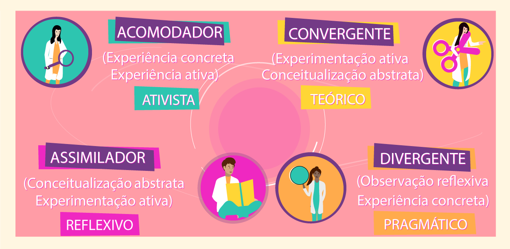

# Técnicas para autodesenvolvimento

- [Técnicas para autodesenvolvimento](#técnicas-para-autodesenvolvimento) - [Pontos Essenciais](#pontos-essenciais) - [Planejando: passo a passo](#planejando-passo-a-passo)

## Aula 1: Aprendizagem como estilo de vida

### Lifelong learning

Com uma sociedade modernizada que está sempre em mudança, é necessário se manter atualizado. Quem não estuda perde espaço.

O que se sabe agora pode não ser relevante daqui ha alguns anos, ou pode precisar de muitas informações novas que ainda nem estão disponíveis.

Acompanhar notícias e a movimentação da área escolhida é essencial. Se deve aprender a estudar de forma eficiente e se adaptar as mudanças e inovações constantes.

### Razões para aprender

**Autoconhecimento** é imprescindível. Ter a noção do que se sabe e não sabe, entender quais são os melhores formatos de aprendizado para si, etc.

Conhecer e compreender seu propósito. Por que aprender isso? Onde e como usar?

Priorizar o que é mais relevante.

Uma razão bem definida faz toda a diferença:

- Propósito/Missão
- Curiosidade
- Paixão
- Necessidade
- Projeto

### Profundidade x Abrangência

Tradicionalmente o trabalhador adquiria conhecimento em um perfil T: um momento de conhecimento aprofundado seguido de competências gerais.

Atualmente é necessário seguir um perfil de conhecimento M: um grupo de conhecimentos aprofundados intercalados com competências gerais

### Ikigai

### Estilos de aprendizagem

Pessoas aprendem de formas e em tempos diferentes.

4 estilos:

- Acomodar: aprende com o que o outro tem a dizer.
- Divergente: aprende debatendo ideias. Utiliza da intuição e imaginação.
- Convergente: aprendem resolvendo problemas.
- Assimilador: aprendem analisando e observando.

---

## Talento ou disciplina?

### Zona de aprendizagem

É a zona fora do conforto, algo que se expande passando pelo processo de entusiasmo e estresse.

### Disciplina

Disciplina é questão de hábito e prática.

- Disposição: gatilho, momento que desencadeia a ação.
- Rotina: ação sendo repetida.
- Recompensa: resultado que motiva a continuar o ciclo.

### Elimine barreiras

Ralos de atenção: barreiras (físicas, emocionais, sociais) que dificultam a aprendizagem.

| Obstáculos             | Possíveis Soluções                                                          |
| ---------------------- | --------------------------------------------------------------------------- |
| falta de tempo         | priorização e gerenciamento                                                 |
| distrações na internet | eliminar distrações                                                         |
| overthinking           | organização, anotações e planejamento                                       |
| interrupções           | comunicar a necessidade de um tempo sem interações para poder se concentrar |
| medo de mudanças       | lembrar que aprender é prática e consistência                               |
| ansiedade              | praticar exercícios, realizar ações que te relaxem                          |
| falta de celebração    | recompense suas realizações                                                 |

### Hábitos para serem criados

- Aprender de fontes (confiáveis e de qualidade) diversas
- Despertar curiosidade
- Networking, manter boas relações com a comunidade
- Feedback, ir atrás daquilo que você não sabe que não sabe
- Encontre um mentor
- Combinar teoria e prática

---

## Desvendando o cérebro

### Mindset

| Fixo                                                       | De Crescimento                                         |
| ---------------------------------------------------------- | ------------------------------------------------------ |
| acreditar que a quantidade de inteligência é algo limitado | acreditar que a quantidade de inteligência é ilimitada |
| acreditar que se é bom em apenas algumas coisas            | acreditar ser bom em qualquer coisa que tentar         |
| não se sentir bem com grandes desafios                     | adora grandes desafios                                 |
| pensar que feedback é crítica                              | pensar que feedback é ajuda para crescer               |
| preferir fazer coisas que já sabe                          | gostar de aprender coisas que não sabe                 |

O ambiente é a comunidade influenciam as formas de pensar

### Modos: Focado x Difuso

Focado: momento de concentração em uma só tarefa, pensamento lógico que se baseia no que já se conhece.

- Concentração
- Repetição de padrões
- Planejado
- Problemas conhecidos

Difuso: momento de difusão onde a ideia "viaja" entre outras, não há um foco ou prioridade, é como um software funcionando no background.

- Visão ampliada
- Conexões inconscientes
- Aleatório
- Novas soluções

### Formatos de aprendizagem

O melhor é misturar métodos para aprender da forma mais eficiente

- Auditivo: aquele que aprende ouvindo, como com podcasts, aulas gravadas, audio books, etc.
- Visual: aquele que aprende visualizando, como com gráficos, vídeo aulas, mapas mentais, etc.
- Leitura/Escrita: aquele que aprende com material escrito, como com livros, artigos, resumos, blogs, etc
- Cinestésico: aquele que aprende se movimentando e na prática, como com eventos, on the job, caminhando, etc

### Prática distribuída x cramming

Cramming: estudar tudo de uma vez um dia antes do que é necessário para decorar o conteúdo

Prática distribuída: distribuir os estudos em uma linha do tempo, tornando algo rotineiro e que permita revisões para a memorização eficiente do conteúdo

### Memória de longo prazo

Aprendizagem é o processo de adquirir informação para memória de longo prazo, juntar diferentes blocos de conhecimento e saber aplicá-los

Seguindo esta linha:

- Tempo para sedimentar conhecimento
- Integrar diferentes conhecimentos
- Construir aprendizagem
- Ideias e impactos

Desconstruir uma habilidade em sub-habilidades, pequenas partes a serem aprendidas

Chunks = Blocos

- Pequenos grupos de informação
- Informação com mesmo significado
- Uma macro-ideia
- Fácil de lembrar
- Fácil absorção

Como funciona um bloco na prática? Assim: palavras → frases → parágrafos → textos

Como gravar esses blocos?

- Focar na hora de estudar
- Conhecer o contexto da utilização
- Assimilar com outros blocos de conhecimento
- Saber aplicar sozinho

Aplicar em diferentes situações e revisar por diferentes métodos faz com que o cérebro saiba acessar o conhecimento por diferentes caminhos

---

## O poder das metas

### Definindo a meta

Para se efetivar a aprendizagem é necessário mediar razões e objetivos, definir metas.

- Por que aprender?
- Onde usar?
- Quando finalizar?

### Método SMART

S - Specific (especifica)
M - Measurable (mensurável)
A - Achievable (atingível)
R - Relevant (relevante)
T - Timely (tempo determinado)

Como mensurar o aprendizado?

- Satisfação com o processo?
- O conhecimento está sendo adquirido, lembrado?
- Está sabendo aplicar?
- Resultados visíveis?

---

## Rotina de aprendizagem

Procrastinação é a grande inimiga da produção, uma boa rotina produtiva apoiada por consistência e disciplina é a melhor forma de combate-la.

Para iniciar uma rotina produtiva são necessários alguns pontos:

1. Metas claras
   a. O que aprender? Como, Quando e Onde aplicar?
2. Um processo de aprendizagem bem estruturado
   b. Rotina semanal com horários de produção e pausa.
3. Bons hábitos
   c. Qual hábito ajuda a alcançar as metas? Disposição, rotina e recompensa.
4. Eliminar distrações
   d. Cuidados e estratégias a serem tomadas contra distrações.
5. Exercitar mente e corpo
   e. Atividades que estimulem o corpo e a mente de forma saudável.

### Gestão de tempo e espaço

Tempo:

- Organizar uma agenda semanal.
- Definir (e respeitar) o tempo decidido para cada tarefa.
- Definir os melhores dias e horários.

Espaço:

Entender quais são os "espaços" (situações e ambientes) onde se tem melhor aprendizado e produção. Se organizar em volta das necessidades para maior eficiência.

Ralos de atenção:

Preparar o ambiente antes de começar a tarefa e eliminar as possíveis distrações. Procurar técnicas de concentração que funcionem para você.

### Ferramentas

| Ferramentas   | Funcionalidades                                                                    |
| ------------- | ---------------------------------------------------------------------------------- |
| Google Alerts | alertas sobre eventos e lançamentos do conteúdo de interesse                       |
| LinkedIn      | ótima plataforma para se encontrar conteúdos de qualidade e trocar experiências    |
| Podcasts      | uma forma de se manter atualizado sobre o assunto de interesse                     |
| Pocket        | app que armazena conteúdos multimedia para fácil acesso                            |
| Pinterest     | bom para se encontrar gráficos, imagens, mapas mentais, etc                        |
| Resumos       | ótima forma de estudar, manter o conteúdo fresco na memória                        |
| Mapas Mentais | ótima forma visual de se separar ideias em pequenos blocos, bom para estruturá-las |

---

#### Pontos Essenciais

- Consistência
  - Estudar um pouco todos os dias, mesmo que seja algo simples e rápido. Aprendizado deve ser parte da rotina, só aprende quem prática e se mantêm informado no conteúdo.
- Planejamento
  - Preparar um calendário de estudos. É necessário gerenciar o tempo para os estudos, reservar dia e horário, organizar conteúdo e espaço.
  - É se planejando que se consegue manter a consistência.
- Cursos
  - Quando aprender por conta própria não estiver funcionando bem, realize cursos. A ajuda de um professor/tutor pode fazer toda a diferença em seu aprendizado.
  - Não precisa ser curso muito longos e elaborados, workshops, aulas dinâmicas e curtas também já ajudam muito.
- Colaboração
  - Estudar com amigos e colegas.
  - A comunidade é uma peça fundamental no aprendizado, a troca de saberes e dúvidas, o compartilhamento de recursos e experiências, a comunicação entre pessoas que estão na área, tudo isso influencia para um bom desenvolvimento.

#### Planejando: passo a passo

- [ ] Definir objetivos
  - Definir o que se quer de forma objetiva, com metas. Separar em conteúdos e deles em tarefas.
- [ ] Analisar sua rotina
  - Compreender o seu dia-a-dia para poder então organizar um momento para os estudos.
- [ ] Traçar uma trilha
  - Pesquisar e desenvolver uma trajetória para os estudos. Seguir uma trilha que faça sentido com o contexto do que se estuda e seu objetivo final.
- [ ] Formar hábitos
  - A criação de novos hábitos em sua rotina pode ajudar imensamente. Seja o hábito de estudar, ler, se exercitar ou até realizer algo que ajude a desestressar depois de dias exaustivos.
- [ ] Começar
  - Planejar é ótimo, porém só funcionará realmente se for posto em prática. O mais importante quando for estudar é isso, estudar!
