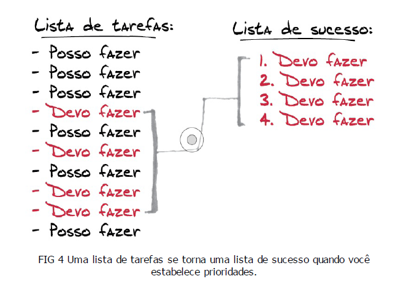

# Foco: trazendo mais resultados para o dia a dia

- [Foco: trazendo mais resultados para o dia a dia](#foco-trazendo-mais-resultados-para-o-dia-a-dia)
  - [A ilusão de ser multitarefa](#a-ilusão-de-ser-multitarefa)
    - [O inimigo invisível](#o-inimigo-invisível)
    - [Foco](#foco)
    - [Multitarefa](#multitarefa)
  - [Crenças](#crenças)
    - [Sucesso e disciplina](#sucesso-e-disciplina)
    - [O que está por trás do momento Eureka?](#o-que-está-por-trás-do-momento-eureka)
    - [Reflexão e ação com foco](#reflexão-e-ação-com-foco)

## A ilusão de ser multitarefa

### O inimigo invisível

Princípio de Pareto (também conhecido como regra do 80/20, lei dos poucos vitais ou princípio de escassez do fator) → "80% dos efeitos vem dos 20% das causas"

A intenção não é ignorar a maioria, mas sim aprender a priorizar. Ao criar listas de tarefas, não jogar todos os objetivos dentro sem uma hierarquia, é preciso entender que nem tudo posso ser realizado na mesma linha do tempo. Separá-las em "devo fazer" e "posso fazer" - ou qualquer outra classificação de urgência - ajudará a manter o foco nas atividades desejadas.

Grandes resultados proveem de menos ações do que geralmente se supõem. A ideia aqui é priorizar para não estagnar a frente de muitas opções.

### Foco

Qual é o meu foco?

É importante sempre pensar em que tarefa focar no momento, o que é simples e trará resultados. Planejar em volta do foco e o manter dentro de uma período de tempo. É se realizando uma tarefa de cada vez que se completa a lista.

Aprender a dizer não, negociar pensando no que é melhor para ambas as partes e que não irá comprometer seus objetivos - sem esquecer o respeito e educação, claro.

Sempre foque na maior prioridade, assim caminhando do topo da hierarquia até a base. (mas não esquecendo de questionar e avaliar a lista, sempre mantê-la atualizada)

### Multitarefa

Primeiramente: Multitarefa &#8800; Multidisciplinar.

É importante desenvolver suas habilidades com formação multidisciplinar, muitas competências são de necessidade compartilhada entre áreas, ou podem ser enriquecedoras de forma pessoal.

Porém, o ato de dividir o foco do momento entre tarefas pode induzir ao erro, não é algo eficiente nem efetivo. É comum (e sem qualquer problema) realizar tarefas de menor complexidade ou mesmo tempo - como caminhar e assobiar - mas quanto mais complexo, maior é a necessidade de um foco concentrado.

*“Fazer muita coisa ao mesmo tempo é meramente a oportunidade de estragar mais de uma coisa ao mesmo tempo.”* - Steve Uzzell.

Distrações e perturbações fazem parte da rotina, é normal. O importante é elimina-las de melhor forma possíveis, organizando o espaço, planejando ou comunicando suas necessidades.

É de melhor prática alternar tarefas o menos possível, pois essas mudanças entre uma tarefa e outra também quebrem o foco, que leva tempo para se concentrar de novo.

---

## Crenças

### Sucesso e disciplina

Quantas crenças (premissas) acreditamos ao longo da vida?

Internalizamos e criamos tantos mitos ao longo da vida, muito atrapalham nosso desenvolvimento. Questionar, analisar, estudar e compreender o que é verdade ou não pode influenciar muito nossa perspectiva de mundo - e melhor nossos hábitos.

Sucesso não é algo sistemático, não tem a mesma cara para diferentes pessoas. O seu significado de sucesso pode não ser o mesmo de um colega. É importante medir e adaptar suas expectativas e ações de acordo com quem você é e o que almeja, o que te satisfará.

Mas como funciona na prática?

Deve se trabalhar com a disciplina que já tem, aprender a guia-la por seus objetivos e desenvolver hábitos que sejam coerentes e benéficos para si. Estruturar uma lista com cada tarefa separada por prioridade.

Deve também focar em construir um hábito por vez. Mudanças são difíceis por si só, acumular muitas delas tornará toda a jornada mais complicada e menor prazerosa, uma combinação perigosa.

Dar a cada hábito o tempo suficiente para se formar. Ter paciência, compreensão e empatia consigo mesmo nessa jornada.

### O que está por trás do momento Eureka?

O cérebro possui dois sistemas mentais semi-independentes: sistema descendente e sistema ascendente.

Sistema descendente:

- Capacidade computacional
- Trabalha constantemente
- Funciona de forma silenciosa, no background

Sistema ascendente:

- Multitarefa
- Analisa tudo que está em nosso campo de percepção no momento

As ações habituais que são feitos no automático são construídas com o tempo, e viram uma forma do cérebro economizar energia.

Esforços cognitivos exigem energia do cérebro, que estará trabalhando de forma mais focada.

- Memórias
- Atenção
- Percepção
- Raciocínio
- Criatividade

As tarefas mentais são divididas entres eses dois sistemas para balancear da melhor forma possível entre esforço e resultado.

### Reflexão e ação com foco

O maior perigo quando se vai atrás de foco é o exagero, executar muitas tarefas ao invés de dividi-las em um período de tempo, indo rumo ao esgotamento.

Não há como manter o foco se a mente não tem energia, se não há descanso. Refletir sobre as prioridades, analisar o tempo necessário para concluir os objetivos e espaços de acordo é um ótimo começo.

Mas, também existe a necessidade de se relaxar a mente e o corpo, de desestressar. Praticar uma atividade que gosta, separar um momento para esquecer os problemas, se recompensar por bons resultados é tão importante quanto o foco, pois um não se manterá sem o outro.

Não deva nada: quando se comprometer com outra pessoa, o melhor é cumprir o mais rápido possível para que não seja algo que se arraste e atrapalhe outras coisas.

Refletir sobre o dia e tomar decisões de acordo, adaptando, mas se mantendo responsável é a chave para uma rotina mais produtiva.