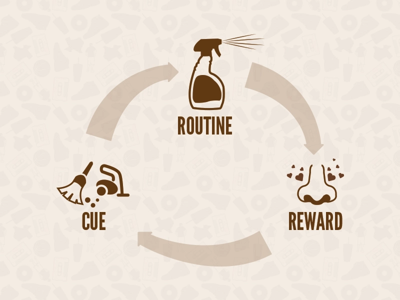
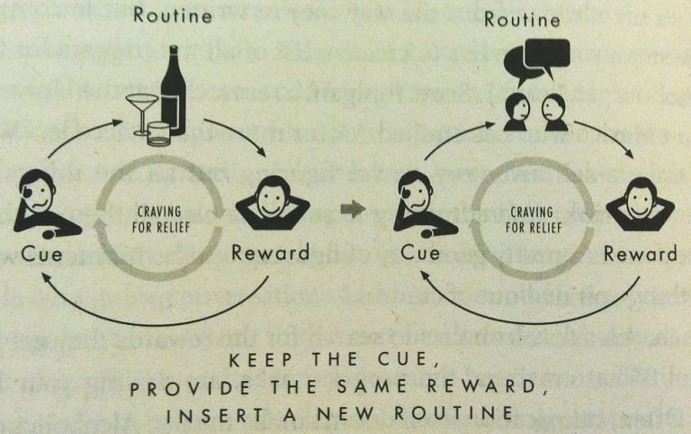
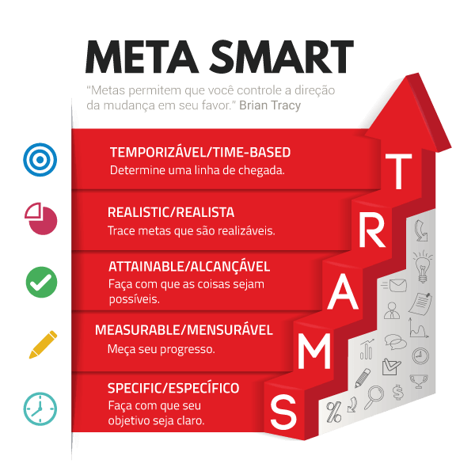
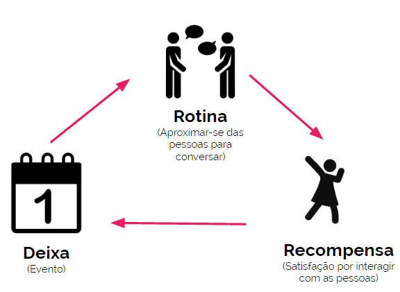
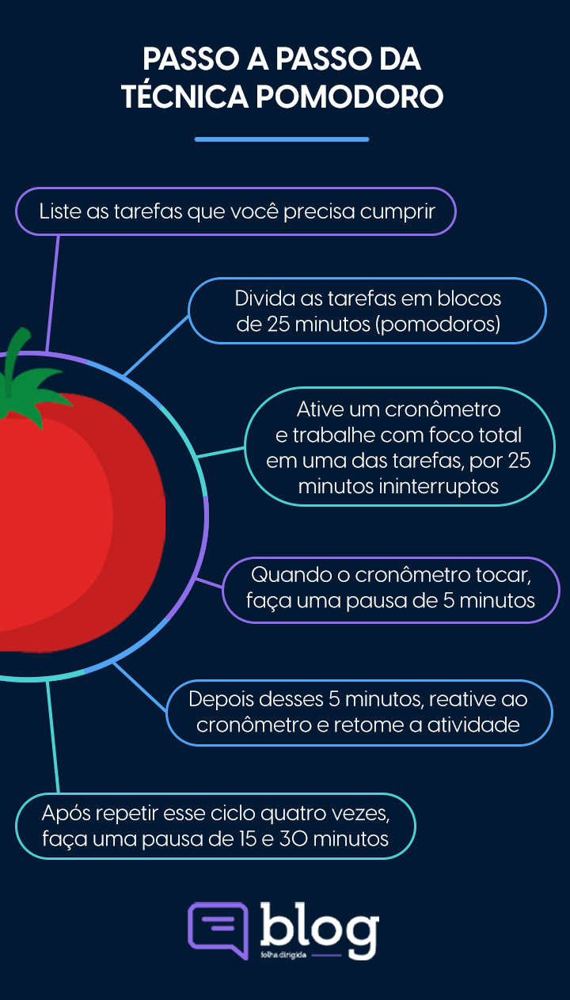
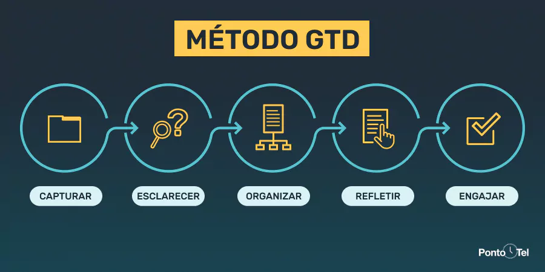

# Hábitos: da produtividade às metas pessoais

- [Hábitos: da produtividade às metas pessoais](#hábitos-da-produtividade-às-metas-pessoais)
  - [Reconhecendo seus hábitos](#reconhecendo-seus-hábitos)
    - [Objetivos e metas](#objetivos-e-metas)
    - [Hábitos](#hábitos)
    - [O loop do hábito](#o-loop-do-hábito)
    - [Método SMART](#método-smart)
  - [Hábitos-chave](#hábitos-chave)
    - [Mudança de hábito](#mudança-de-hábito)
    - [Quanto tempo demora para construir um novo hábito?](#quanto-tempo-demora-para-construir-um-novo-hábito)
    - [Por que é tão difícil manter bons hábitos?](#por-que-é-tão-difícil-manter-bons-hábitos)
    - [Hábitos chaves](#hábitos-chaves)
  - [Dê adeus ao velhos hábitos](#dê-adeus-ao-velhos-hábitos)
    - [O que está por trás da procrastinação](#o-que-está-por-trás-da-procrastinação)
    - [Características da procrastinação](#características-da-procrastinação)
    - [Combater a procrastinação](#combater-a-procrastinação)
    - [Recompensas](#recompensas)
    - [Exemplos de recompensa](#exemplos-de-recompensa)
  - [Autodisciplina](#autodisciplina)
    - [Como desenvolver a autodisciplina](#como-desenvolver-a-autodisciplina)
    - [Organização](#organização)
    - [Cada coisa no seu lugar](#cada-coisa-no-seu-lugar)
    - [Autoconfiança](#autoconfiança)
  - [Produtividade](#produtividade)
    - [Ganhe produtividade com a Técnica Pomodoro](#ganhe-produtividade-com-a-técnica-pomodoro)
    - [Gerencie interrupções com a Técnica Pomodoro](#gerencie-interrupções-com-a-técnica-pomodoro)
    - [GTD: Getting Things Done](#gtd-getting-things-done)

## Reconhecendo seus hábitos

### Objetivos e metas

Definir objetivos (o que se quer fazer) e dividi-los em metas para alcançar (como a quantidade, tempo, forma, etc).

Objetivo: o que quero alcançar.

Metas: ações realizadas para alcançar um objetivo maior.

O registro dos objetivos e metas ajudam no seu planejamento e acompanhamento - é mais fácil alcançar aquilo que é tangível e compreendido.

Pode ser feito o uso de agendas ou aplicativos para fazer este registro - o melhor é algo de fácil acesso que não será facilmente esquecido/ignorado.

### Hábitos

Hábitos são comportamentos e rotinas - bons ou ruins - que realizamos de forma habitual ou sempre em determinadas situações.

Hábitos se formam com frequência, se tornam ações que são realizadas no "automático", que não exigem tanta atenção quanto ações incomuns ou novas.

Isso se dá pela necessidade do cérebro de poupar energia, para ser mais eficiente, torna o que é conhecido algo automático.

Mas como hábitos se formam? Simples, é algo que se separa em 3 fases:

- Gatilho/Deixa
  - O que começa o hábito, que estimula a ação.
- Rotina
  - As ações que formam o hábito, ele em si.
- Recompensa
  - Resultado gerado pelo hábito que pode trazer prazer.

### O loop do hábito

Quanto maior a quantidade de repetições, menor a necessidade de atenção, assim se entre no piloto automático.

O que é algo bom, por cumprir o objetivo de economizar energia, também contribui para a dificuldade da mudança de rotina.

Entender a estrutura de como um hábito funciona não só ajuda na construção de um novo, como também na quebra de um hábito ruim.

Reconhecer o gatilho, alternar para o hábito desejado e manter ou até mesmo aumentar a recompensa é uma forma de "hackear" o cérebro para um comportamento mais benéfico.

Para um novo hábito é necessário introduzir um gatilho, realizar a ação desejada e gerar uma recompensa que mantenha o desejo para repetição.

### Método SMART

Separar objetivos em metas de forma que:

- Seja específico.
- Tenha registro do progresso.
- Seja alcançável.
- Seja realista no contexto pessoal.
- Tenha prazo para conclusão.

---

## Hábitos-chave

### Mudança de hábito

É comum acreditar no mito que em 21 dias hábitos novos podem se sementar e serem formados.

Porém, 21 dias não é um número mágico, um prazo definido com certeza.

21 dias seria o tempo **mínimo** para formação de um hábito. O prazo em que pode ou começa a se sementar.

É uma observação, uma teoria.

### Quanto tempo demora para construir um novo hábito?

De acordo com um estudo realizado pela pesquisado de psicologia da saúde Phillipa Lally, o tempo médio para formação de um hábito é de 66 dias.

O comportamento - vontade, motivação - ambiente, situação e a individualidade afetam o tempo determinado, oscilando entre mais ou menos dias.

Um novo hábito pode ser incorporado entre 18 dias e 8 meses.

Construir novos hábitos não é uma questão de absolutismo, haverão dias ruins e exceções, mas isso não impossibilita sua formação.

Só é preciso cuidado para que exceção não se torne regra.

### Por que é tão difícil manter bons hábitos?

Para formar hábitos é melhor começar pequeno. Pequenas ações são mais fáceis de se tornarem repetições.

Com o tempo, pode-se progredir e aumentar a complexidade dos hábitos.

Crie um loop para manter e formar os hábitos desejados.

### Hábitos chaves

É importante perceber quais são seus hábito chaves - os que afetam outras partes da sua rotina.

Como exemplo, o comportamento do sono, que pode afetar humor, energia e raciocínio.

Formar e manter hábitos chave saudáveis é de suma importância para lidar com os outros objetivos e manter uma boa qualidade de vida.

Hábitos chaves que podem facilitar a vida:

- Boa rotina de sono.
- Boa alimentação.
- Organização e planejamento.
- Eliminar o perfeccionismo.
- Diminuir as desculpas.
- Cuidar das finanças.
- Manter bons relacionamentos.
- Separar momentos para distrações e relaxamento.

---

## Dê adeus ao velhos hábitos

### O que está por trás da procrastinação

Planejamento x Procrastinação

Procrastinar é o que nos impede de fazer algo importante/urgente em detrimento de uma distração.

Planejar seus objetivos pode ser o começo, uma das maneira de se combater a procrastinação.

Organizar algo e eliminar distrações entram eum um boa planejamento anti-procrastinação.

### Características da procrastinação

- Falta de planejamento.
- Falta de motivação.
- Cair em tentações/distrações.
- Não priorizar as tarefas.

### Combater a procrastinação

Para combater a procrastinação é necessário organização e planejamento, hierarquizar tarefas para evitar ficar atrapalhado ou sobrecarregado.

Eliminar distrações, introduzir pausas e recompensas, alternar ambientes.

Procurar ferramentas para auxiliar no controle e concentração.

Listas é uma ferramenta poderosa para ganhar tempo, focar e evitar a procrastinação, Para ver mais sobre listas veja as anotações sobre foco.

Registrar ideias. Priorizar tarefas mais trabalhosas, que precisaram de mais energia.

Neutralizar o pensamento destrutivo, não é preciso começar sendo super positivo, mas pensar sobre si mesmo de forma neutra já é um grande passo = "se eles podem, eu também posso."

### Recompensas

É preciso lembrar do estímulo e não abandonar suas recompensas.

Não adianta realizar as tarefas e pular as recompensas, com o tempo, a ideia de realiza-las vai perder o sentido.

Se recompense pelo período de tempo que seja mais proveitoso para você, com algo que seja do mesmo nível do desafio, isso pode ser semanal, quinzenal ou por cada tarefa cumprida.

Alternar entre recompensas pode manter a novidade das ações.

### Exemplos de recompensa

- Ver um filme/série.
- Praticar um esporte.
- Jogar um video game.
- Ler um livro novo.
- Comprar um mimo.
- Comer sua comida favorita.
- Descansar.
- Sair com os amigos.
- Ir a uma festa/show.

---

## Autodisciplina

### Como desenvolver a autodisciplina

Disciplina → **Foco + Motivação**

"Disciplina é a capacidade de se manter focado nas tarefas necessárias para concretização de uma meta sem se desviar e sem perder a motivação."

É necessário autoconhecimento, fazer uma análise sobre seus objetivos, motivações, foco, necessidades e quais estratégias funcionam para você.

- Por quê?
- Para quê?
- Como?
- Onde?
- Qual forma é a mais eficiente?
- O que é mais benéfico/prazeroso?
- O que funciona melhor?
- Ainda é condizente com o que almejo?
- Faz sentido no meu contexto?
- O que planejo fazer?

Sempre questionando e procurando entender o que faz sentido para você, lembrando que as respostas não só variam de pessoa para pessoa, como também de tempos em tempos e situação.

### Organização

Esquecimento pode ser causado por:

- Distrações.
- Stress.
- Ansiedade.
- Imprevistos.

Uma forma de evitar esquecimentos é de anotar, planejar e organizar de ante mão.

- Criar listas.
- Separar um momento de pré-organização antes da atividade.
- Organizar o ambiente.
- Planejar as tarefas.
- Anotar as informações necessárias.

O uso de aplicativos - como Notion, Evernote, Trello - pode auxiliar na organização do dia a dia.

### Cada coisa no seu lugar

Um ambiente bem arrumado e organizado é essencial.

Cada coisa no seu lugar permite que se encontre com mais facilidade, não esqueça com tanta frequência, nem acabe comprando algo desnecessariamente por não achar o que já se tem, assim poupando tempo, dinheiro e espaço.

Ter mais coisas causa mais desordem, pede por uma maior organização.

### Autoconfiança

Sentir segurança na sua área, nos bons hábitos e comportamentos. 

Procurar manter uma boa comunicação e relações proveitosas.

Focar em uma tarefa de cade vez, sem se esquecer das pausas para descansar e repor energias.

O importante é praticar o equilíbrio entre vida pessoal e profissional, entre personalidade e necessidades.

---

## Produtividade

### Ganhe produtividade com a Técnica Pomodoro

A Técnica Pomodoro consiste em intercalar o trabalho entre blocos de foco e pausas.

A técnica sugere períodos de foco de 25 minutos, separados por pausas breves de até 5 minutos. Após 4 ciclos se ganha uma pausa longa de 20 a 30 minutos.

Então se recomeça o ciclo.

Essa técnica pode:

- Aumentar a concentração.
- Aumentar a produtividade.
- Diminuir as interrupções.
- Aprender a estimar melhor o tempo para cada tarefa.
- Aliviar a ansiedade.

O tempo pode ser ajustado para a necessidade de cada um. É só preciso lembrar que o foco está entre o intercalo de foco e pausa.

Pode-se aumentar os tempos de concentração e pausa, trabalhar em uma tarefa até sentir o foco diminuir e então se dar um tempo de pausa, etc.

O importante é achar o modo que funciona melhor para si.

### Gerencie interrupções com a Técnica Pomodoro

Lembrar de uma tarefa que precisa fazer quando esta focando em outra é uma situação de interrupção interna.

A troca de tarefas não é ideal, irá cortar o foco e atrapalhar a técnica, porém se não fizer no momento, pode levar ao esquecimento da tarefa.

Para isso há uma solução simples: Anotar e delegar para um próximo momento.

(A não ser que seja algo urgente)

Quando são situações do ambiente - colegas, notificações, ligações, etc - são consideradas interrupções externas.

O que se pode fazer:

- Organizar o espaço.
- Limitar ou eliminar distrações.
- Comunicar seus objetivos e necessidades.
- Melhorar estimativas.

Não esquecer a flexibilidade, lidar com cada situação no contexto necessário.

### GTD: Getting Things Done

"A arte de fazer acontecer"

Passo 1: Coletar

- Anotar tudo.
- Criar listas.

Passo 2: Processar

- Analisar as tarefas.
- Priorizar no contexto.

Passo 3: Organizar

- Alocar tempo e dia para cada tarefa.

Passo 4: Revisão

- Manter a lista atualizada.

Passo 5: Execução

- Fazer as tarefas.