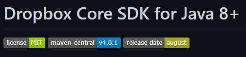

# Git & Github

Ambos são ferramentas que facilitam o gerenciamento do código fonte de uma aplicação, sistema, produto, etc.

## Git

É um sistema de controle de versão distribuído. Todos os arquivos, assim como seus históricos, ficam em um repositório que, por meio do Git, é distribuído, todo mundo tem uma cópia inteira do mesmo, não apenas o "servidor principal".

[Autenticação por token](https://www.alura.com.br/artigos/nova-exigencia-do-git-de-autenticacao-por-token-o-que-e-o-que-devo-fazer)

## Github

É uma plataforma para gerenciar o código e criar um ambiente de colaboração entre devs, utilizando o Git como sistema de controle.

Ele facilita o uso do Git, escondendo algumas particularidades mais complicadas do setup. Seu sistema wev permite a alteração dos arquivos por lá mesmo, porém, não é indicado, já que não terá um editor.

Muitas IDEs tem extensões e interatividades para ambos Git e Github que facilitam seu uso no dia-a-dia.

### Readme.md

Arquivo com extensão md (markdown) que contém as **informações** necessárias para entender o **objetivo** e **status** de seu projeto.

O markdown é uma linguagem de marcação de texto, assim como o HTML, só que mais simples.

Usado para manter uma documentação sobre o projeto → descrição, status, objetivos, para o que serve, como contribuir, como usar, padrões do projeto, etc.

```md
# título
> status: 
para rodar: `npm instal`
```

- Título e Imagem de capa;
- Badges;
- Índice;
- Descrição do Projeto;
- Status do Projeto;
- Funcionalidades e Demonstração da Aplicação;
- Acesso ao Projeto;
- Tecnologias utilizadas;
- Pessoas Contribuidores;
- Pessoas Desenvolvedoras do Projeto;
- Licença.



## Comandos

[Iniciando um repo com Git](https://www.alura.com.br/artigos/iniciando-repositorio-git)

`git` → linha de comando, usado principalmente para controle de versões.

`config` → este é o primeiro comando a ser executado após instalar o Git. Ele possibilita configurar seu nome e endereço de email que ficará vinculado às alterações.

`init` → inicia ou cria um repositório.

```
git config --global user.name "Nome do usuário" → configura usuário
git config --global user.email "seu@email.com" → configura email
git init → cria repo
```

`add` → prepara o conteúdo para o próximo commit.

`status` → permite visualizar o estado do repositório.

```
git add 'file.ext' || '.' -> adiciona arquivos e modificações
git status -> apresenta se o projeto está atualizado e se há mudanças para comitar 
-m -> adicionar mensagens/comentários
```

`diff` → log que compara as versões, mostra as alterações.

`commit` → um dos componentes para controlar a versão do projeto. Cria e altera arquivos dentro do projeto

* `push` → “empurra” o commit (manda/publica).
* `pull` → “puxa” o commit (recebe/atualiza).

É de boa prática sempre resumir o que está sendo feito em cada commit para que seja mais fácil de saber em que versão cada mudança foi feita.

```
git commit 'file.ext' || '.' -> cria e altera arquivos dentro do projeto
"commit ." adiciona todas as alterações
git push -> “empurra” o commit (manda/public)
git pull -> “puxa” o commit (recebe/atualiza)
git restore --source 'código hash' 'nome do arquivo' || '.' -> restaura para a versão escolhida
```

`clone` → seleciona um repositório git existente e cria um clone ou cópia dele em um repositório local ou remoto. Essa cópia é um repositório git completo, com seu próprio histórico, gerenciamento de arquivos e ambiente isolado, da mesma maneira que o original.

Por conveniência, a clonagem cria uma conexão remota apontando para o repositório original.

```
git clone -> clona repositórios no local escolhido
git clone <repositorio> <meu-projeto-clone> -> clona o repositório para uma pasta específica
git clone -branch new_feature <repositorio> -> clona o repositório a partir de uma branch específica, diferente da original
```

`log` → usado para verificar o histórico de alterações, as mensagens de commits, o nome do autor daquele commit e outras informações sobre o projeto.

Os commits possuem hashs que os identificam de uma forma única, não existem dois commits com o mesmo hash. Com o `git log` podemos ver o hash e várias outras informações do commit.

```
git log -> histórico das mudanças do projeto
git log --oneline -> histórico das mudanças do projeto resumidos na mensagem dada no commit, uma em cada linha
git log -p -> histórico mais completo, incluso alterações do commit
git log --author="user_name" -> pesquisa info do autor do commit
git log --since=1.month.ago --until=1.day.ago -> pesquisa info por data
git log --pretty="format:%h %s" -> formata a visualização das info do commit
```

`branch` → ramificações do projeto, usado para manter versões diferentes do projeto.

Main é o nome mais usado para a ramificação principal, onde fica o código que já foi testado/aprovado, as outras branches servem para fazer alterações necessárias ao código sem modificar o main.

```
git checkout -b 'branch-name' -> cria uma branch nova
git switch 'branch-name' -> muda em qual branch se está mexendo
git branch -> mostra as branches e qual está selecionada
```

`merge` → cria um novo commit na branch selecionada que inclui todas as mudanças feitas em outra branch desde o fork ou desde o último merge.

`rebase` → move o momento do fork da branch selecionada afrente da outra branch, fazendo com que pareça que tenha feito o fork recentemente e adicionado suas mudanças.

```
git merge main -> adiciona todas as alterações na branch main

git rebase main -> adiciona as alterações a frente da main, como um fork recente
```