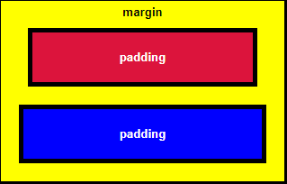
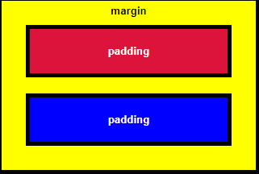
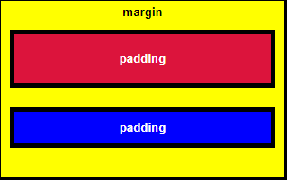
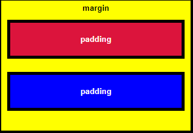
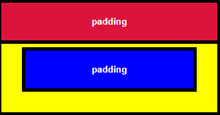
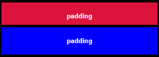
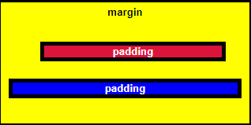
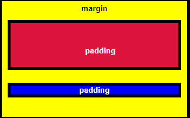
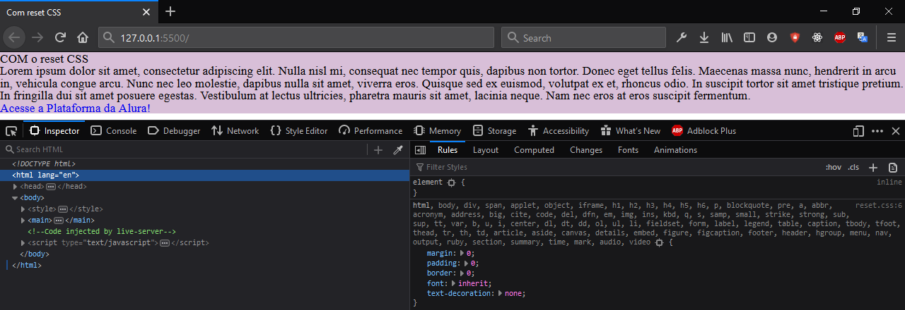

# Começando com HTML5 e CSS3

- [Começando com HTML5 e CSS3](#começando-com-html5-e-css3)
  - [HTML](#html)
    - [Sintaxe e estrutura](#sintaxe-e-estrutura)
      - [Tags descritivas](#tags-descritivas)
      - [Tags de formatação](#tags-de-formatação)
      - [Nesting](#nesting)
    - [ID, Class e Data-Attributes](#id-class-e-data-attributes)
    - [Texto](#texto)
    - [Mídia](#mídia)
    - [Interagindo com o usuário](#interagindo-com-o-usuário)
      - [Input](#input)
        - [Checkbox e Radio](#checkbox-e-radio)
      - [Button](#button)
    - [Links](#links)
    - [Tabelas](#tabelas)
  - [CSS](#css)
    - [Sintaxe e estrutura](#sintaxe-e-estrutura-1)
    - [Sistema de herança e ordem de prioridade](#sistema-de-herança-e-ordem-de-prioridade)
    - [Unidades: absolutas vs. relativas](#unidades-absolutas-vs-relativas)
    - [Espaçamento](#espaçamento)
      - [Margens negativas](#margens-negativas)
      - [Valores diferentes para cada lado](#valores-diferentes-para-cada-lado)
      - [Clockwise notion](#clockwise-notion)
    - [Fontes](#fontes)
    - [Cores](#cores)
      - [Gradiente](#gradiente)
    - [Background](#background)
    - [Height e Width](#height-e-width)
    - [Display](#display)
    - [Variáveis](#variáveis)
    - [Melhorando compatibilidade](#melhorando-compatibilidade)
    - [Reset](#reset)
      - [Como utilizar?](#como-utilizar)
    - [Normalize css](#normalize-css)

## HTML

Linguagem de marcação que funciona como a estrutura, o esqueleto, para construção mais básica de uma página web. É marcada pelo uso de **TAGs** que são instruções especiais a serem interpretadas pelo navegador. É uma linguagem estática, geralmente acompanhada do CSS, para estilização e animações, e JavaScript, para dinamismo e interações com o usuário.

### Sintaxe e estrutura

As tags seguem o formato: nome do elemento entre os sinais de comparação maior que e menor que `< >`. A maioria dos elementos possui um par, tag de abertura e fechamento, porém, há alguns que abrem e fecham em uma tag só.

```html
<nome-da-tag> <!-- abertura --> </nome-da-tag>
<!-- fechamento -->
<nome-da-tag />
<!-- self-closing -->
```

Um arquivo HTML propriamente formatado segue a seguinte estrutura: `<!DOCTYPE html>` → `<html> <head>` → conteúdo meta (o que o browser vê) → `</head> <body>` → conteúdo da página (o que o usuário vê) → `</body> </html>`

```html
<!-- diz ao navegador que o arquivo está em formato html e está usando a sua versão mais recente -->
<!DOCTYPE html>
<html>
  <!-- conteúdo para o browser, metadata -->
  <head>
    <!-- characters set, dicionário, conjunto de caracteres -->
    <meta charset="UTF-8" />
    <!-- diz ao navegador qual é o idioma da página -->
    <meta lang="pt-br" />
    <style>
      /* css dentro do html */
    </style>
    <!-- link para o arquivo css  -->
    <link type="stylesheet" href="style.css" />
  </head>
  <!-- conteúdo para o usuário -->
  <body>
    <!-- <h1> <p>  <input> etc -->
    <script src="script.js">
      // js scripting dentro do html ou link para o arquivo js
    </script>
  </body>
</html>
```

Comentários são maneiras de organizar o código, documentar dentro do arquivo e ajudar a si mesmo e outros desenvolvedores a entender a sua funcionalidade. Também pode ser usado para "desativar" uma linha ou bloco de código sem deleta-lo.

```html
<!-- comentário -->
```

Junto aos elementos vem os atributos, que em sua maioria recebem algum valor. Os atributos são inseridos dentro da tag de abertura e podem definir funcionalidades, estilos, formatos, visibilidade, entre outros comportamentos.

```html
<!-- elemento input -->
<input />
<!-- atributo type com valor "color" -->
<input type="color" />
<!-- atributo disable que não recebe valor -->
<input disabled />
```

#### Tags descritivas

O HTML5 introduziu mais tags descritivas, elas podem ser usadas para deixar o código mais fácil de ler, melhorar a performance do SEO e a acessibilidade.

```html
<main><!-- contém o conteúdo principal da página/código --></main>
<header>
  <!-- container para conteúdo introdutório ou um grupo de links de navegação -->
</header>
<nav><!-- define um grupo de links de navegação --></nav>
<section><!-- define uma seção em um documento --></section>
<div><!-- divisão de conteúdo --></div>
<fieldset><!-- agrupa os elementos de um form --></fieldset>
<article><!-- específica um conteúdo independente/auto-contido --></article>
<footer><!-- define o rodapé de um documento ou section --></footer>
<!-- entre outros -->
```

#### Tags de formatação

Define a formatação de um conteúdo ou outro elemento. Alguns exemplos são:

```html
<abbr> <!-- abreviações ou acrônimos --> </abbr>
<address><!-- informação de contato --></address>
<blockquote><!-- seção de uma citação de outra fonte --></blockquote>
<code> <!-- pedaço de código --> </code>
<progress><!-- progresso de uma tarefa --></progress>
<q> <!-- citação curta --> </q>
<!-- entre outras -->
```

#### Nesting

Prática comum usada para dividir conteúdo em seções e subseções com o `<div>`. Essa tag funciona como um container para agrupar elementos, organizar o código e deixa-lo mais legível, também é comumente usado para definir o layout.

`<div>` é um elemento meta, agrupa outros elementos relacionados entre si e funciona da mesma forma que `<section>` ou até dividindo blocos de código dentro da `<section>`.

```html
<div>
  
  <a href="www.thingscatslove" />
</div>
```

### ID, Class e Data-Attributes

Classes e Ids são atributos usados no HTML para identificar um elemento e facilmente estiliza-lo com CSS ou seleciona-lo e modificar seu comportamento com o JavaScript.

```html
<h2 id="cat-photo-app" class="photo-border photo-width"></h2>
```

Múltiplas classes podem ser adicionadas em um atributo `class`, sendo separadas com um espaço. Classes também podem identificar mais de um elemento sem gerar erros.

Um `id`, por outro lado, deve ser único. Não dê o mesmo id para mais de um elemento. Porque o id tem prioridade sobre a classe, se ambos forem aplicados ao mesmo elemento e tiverem comportamentos conflitantes, o comportamento aplicado pelo id irá prevalecer.

`ìd` é referenciado com a `#` hashtag e `class` com o `.` ponto.

```html
#cat-photo-app { property: value; } .photo-border { property: value; }
```

O `data-attribute` é utilizado para guardar dados privados personalizados para a página ou aplicativo; dá a capacidade de incorporar dados personalizados para qualquer elemento HTML. Os dados guardados podem ser manipulados através do CSS, para estilizar o elemento, e JavaScript, para criar uma experiência de usuário mais engajada.

Não deve ser atribuído em dados visíveis, pois tecnologias de acessibilidade podem não identificar seus valores. Dados personalizados com o prefixo `data-` serão completamente ignorados por agentes de usuário.

Sua estrutura é dividida em:

- Primeira parte é o identificador deste dado, que consiste em `data-` + o nome de sua escolha que melhor identifica o tipo de dado a ser atribuído
- Segunda parte é o valor atribuído à este dado, o valor deve sempre estar entre aspas "" e dessa maneira é lido como `string`

```html
<h1>Lista de tintas:</h1>
<ul id="lista">
  <li
    data-cor="laranja"
    data-tipo="tinta-exterior"
    onclick="mudaCores(this)"
    class="item"
  >
    Tinta laranja
  </li>
  <li
    data-cor="branco"
    data-tipo="tinta-interior"
    onclick="mudaCores(this)"
    class="item"
  >
    Tinta branca
  </li>
  <li
    data-cor="rosa"
    data-tipo="tinta-exterior"
    onclick="mudaCores(this)"
    class="item"
  >
    Tinta rosa
  </li>
</ul>

<script>
  function mudaCores(elementos) {
    var cores = elementos.getAttribute("data-cor");
    var tipoElemento = elementos.getAttribute("data-tipo");
  }
</script>
```

O prefixo `data-` não é obrigatório para definir um `data-attribute`, pode-se alterar o código para a seguinte forma:

```html
<h1>Lista de tintas:</h1>
<ul id="lista">
  <li
    cor="laranja"
    tipo="tinta-exterior"
    onclick="mudaCores(this)"
    class="item"
  >
    Tinta laranja
  </li>
  <li cor="branco" tipo="tinta-interior" onclick="mudaCores(this)" class="item">
    Tinta branca
  </li>
  <li cor="rosa" tipo="tinta-exterior" onclick="mudaCores(this)" class="item">
    Tinta rosa
  </li>
</ul>

<script>
  function mudaCores(elementos) {
    var cores = elementos.getAttribute("cor");
    var tipoElemento = elementos.getAttribute("tipo");
  }
</script>
```

### Texto

| Tag               | Descrição                                               |
| ----------------- | ------------------------------------------------------- |
| `<h1>` ... `<h6>` | define títulos                                          |
| `<p>`             | define um parágrafo                                     |
| `<br>`            | insere um line-break                                    |
| `<hr>`            | define uma mudança de temática do conteúdo              |
| `<ul>`            | define uma lista não ordenada                           |
| `<ol>`            | define uma lista ordenada                               |
| `<li>`            | define um item de uma lista                             |
| `<dl>`            | define uma lista descritiva                             |
| `<dt>`            | define um termo/nome na lista descritiva                |
| `<dd>`            | define a descrição de um termo/nome na lista descritiva |

```html
<h1>TÍTULO 1</h1>
<p>Parágrafo</p>
<br />
<p>Parágrafo dois <strong>negrito</strong></p>
<hr />
<h2>TÍTULO 2</h2>
<p>Parágrafo três <em>itálico</em></p>
```

```html
<!-- lista não ordenada -->
<ul>
  <li>item</li>
  <li>item</li>
  <li>item</li>
</ul>
<!-- lista ordenada -->
<ol>
  <li>item 1</li>
  <li>item 2</li>
  <li>item 3</li>
</ol>
```

```html
<dl>
  <dt>Café</dt>
  <dd>Drink quente</dd>
  <dt>Refri</dt>
  <dd>Drink gelado</dd>
</dl>
```

### Mídia

Elementos que inserem mídia na página, como: imagens, áudios, vídeos.

| Tag            | Descrição                                                                        |
| -------------- | -------------------------------------------------------------------------------- |
| ``        | define uma imagem                                                                |
| `<map>`        | define um image map, uma imagem com áreas clicáveis                              |
| `<area>`       | define a área dentro de um image map                                             |
| `<canvas>`     | usado para desenhar e animar por scripting                                       |
| `<figcaption>` | define a legenda para um elemento `<figure>`                                     |
| `<figure>`     | específica um conteúdo auto-suficiente                                           |
| `<picture>`    | define um container para múltiplas fontes de imagem                              |
| `<svg>`        | define um container para SVG                                                     |
| `<audio>`      | define um conteúdo de áudio                                                      |
| `<source>`     | define múltiplas fontes para elementos de mídia, `<video>` `<audio>` `<picture>` |
| `<track>`      | define tracks de texto para elementos de mídia, `<video>` `<audio>`              |
| `<video>`      | define um vídeo ou filme                                                         |

```html
<figure>
  
  <figcaption>this looks bad</figcaption>
</figure>
```

### Interagindo com o usuário

O HTML é usado para estruturar a parte visual da interação com o usuário. Os elementos tem comportamentos pré-definidos, mas grande parte de sua funcionalidade é gerada por um script.

É possível criar uma interação real somente com o HTML puro, como um formulário que envia dados, porém, são ações muito limitadas.

```html
<form action="/url-para-onde-será-enviado-os-dados">
  <input />
</form>
```

| Tag          | Descrição                                                         |
| ------------ | ----------------------------------------------------------------- |
| `<form>`     | formulário                                                        |
| `<input>`    | controle de entrada                                               |
| `<textarea>` | área de entrada de texto                                          |
| `<button>`   | botão clicável                                                    |
| `<select>`   | drop-down lista                                                   |
| `<option>`   | opções em uma lista drop-down                                     |
| `<label>`    | etiqueta para um elemento `<input>`                               |
| `<legend>`   | legenda para um elemento `<fieldset>`                             |
| `<datalist>` | específica uma lista de opções pré-definidas para controles input |
| `<output>`   | define o resultado de um cálculo                                  |

#### Input

Especifica uma área onde o usuário pode inserir dados, seu formato e os dados que pode receber variam de acordo com o valor do atributo que recebe de `type=`. A tag `<input />` é self-closing.

Alguns dos seus formatos são:

- texto
- email
- senha
- data
- cor
- arquivo

`placeholder` é um atributo que mostra um texto na área do input antes que o usuário insira qualquer dado, geralmente usada para sinalizar o tipo/formato de dado desejado.

O atributo `required` especifica que um input deve ser preenchido para que então seja possível enviá-lo.

```html
<input type="email" name="user-email" placeholder="insira seu email" required />
```

##### Checkbox e Radio

`checkbox` cria uma caixa de marcação que permite a seleção de uma ou mais opções, já o `radio` cria um botão de escolha que permite apenas a seleção de uma opção.

Ambos são um tipo de input que seguem as regras:

- Nest dentro do seu próprio elemento `<label>`
- Relação definida entre `<label>` e `<input>` usando atributos `for` e `id` com o mesmo valor
- Todos os inputs do mesmo grupo devem ter o atributo `name` com o mesmo valor

```html
<form>
  <label for="indoor">
    <input id="indoor" type="radio" name="indoor-outdoor" />Indoor
  </label>
  <label for="outdoor">
    <input id="outdoor" type="radio" name="indoor-outdoor" />Outdoor
  </label>
</form>
```

```html
<input id="loving" type="checkbox" name="personality" />
<label for="loving"> Loving </label>
<input id="quiet" type="checkbox" name="personality" />
<label for="quiet"> Quiet </label>
<input id="grumpy" type="checkbox" name="personality" />
<label for="grumpy"> Grumpy </label>
```

Os dados reportados de cada um tem origem nos dados do atributos `value` de cada opção. Quando um formulário com uma opção selecionada é enviado, recebe o dado da forma: `name = value`; `indoor-outdoor=indoor`.

Se o valor for omitido do input, o formulário envia com o valor padrão: `on`. Neste cenário, o retorno é: `name = on`; `indoor-outdoor=on`, o que não é uma informação útil.

#### Button

Define um botão clicável, seu comportamento padrão é de envio, mas também pode ter seu tipo defino como reset.

Diferente de `<input>` do tipo `button`, o elemento `<button>` pode receber texto e formatação, entre outras coisas.

```html
<button type="submit">Enviar</button>
```

### Links

| Tag      | Descrição                                     |
| -------- | --------------------------------------------- |
| `<a>`    | hyperlink                                     |
| `<link>` | relação entre o documento e uma fonte externa |
| `<nav>`  | link de navegação                             |

```html
<!-- link para um conteúdo externo -->
<a href="https://www.freecodecamp.org">this links to freecodecamp.org</a>
<!-- link interno para mover dentro da página -->
<a href="#contacts-header">Contacts</a>
...
<h2 id="contacts-header">Contacts</h2>
<!-- link "morto" -->
<a href="#" />
```

### Tabelas

Cria tabelas na página.

| Tag         | Descrição                      |
| ----------- | ------------------------------ |
| `<table>`   | define uma tabela              |
| `<caption>` | define a legenda               |
| `<th>`      | define a célula cabeçalho      |
| `<tr>`      | define uma linha               |
| `<td>`      | define uma célula              |
| `<thead>`   | agrupa o conteúdo do cabeçalho |
| `<tbody>`   | agrupa o conteúdo do corpo     |
| `<tfoot>`   | agrupa o conteúdo do rodapé    |

```html
<table>
  <tr>
    <th>Mês</th>
    <th>Despesas</th>
  </tr>
  <tr>
    <td>Janeiro</td>
    <td>R$100</td>
  </tr>
  <tr>
    <td>Fevereiro</td>
    <td>R$80</td>
  </tr>
</table>
```

---

## CSS

Usado para a estilização, layout e animação das páginas e dos elementos HTML. Pode ser usado de forma limitada dentro do HTML com o elemento `<style>` ou em um arquivo externo próprio linkado ao documento pelo elemento `<link>`.

```html
<!-- inline style, estilização de um único elemento -->
<h1 style="color: blue;">PhotoApp</h1>
<!-- estilização limitada dentro do html -->
<style>
  h2 {
    color: blue;
  }
</style>
<!-- conexão para um arquivo css externo -->
<link type="stylesheet" href="style.css" />
```

### Sintaxe e estrutura

Segue a estrutura: seletor → propriedade → valor.

```css
selector {
  property: value;
}
```

Um seletor pode ser o elemento, um atributo, classe, id ou data-attribute. Um seletor pode receber mais de uma propriedade - todas terminadas com ponto e vírgula ";" - e algumas propriedades podem receber mais de um valor.

A mesma estilização pode ser aplicada para seletores diferentes em um só bloco se forem chamados juntos, sendo cada um separado por vírgula. Elementos dentro de outro podem ser selecionados por nesting, indo do seletor mais abrangente para o mais específico, sendo separados por espaço.

```css
/* elementos diferentes em bloco só */
seletor1,
seletor2 {
  /* seleciona ambos */
  property: value;
}
/* nesting */
ul li i {
  /* seleciona somente o i da lista */
  property: value;
}
```

Pseudo-seletores são usados para selecionar elementos em um estado/comportamento específico, como uma ação do usuário ou posição. É identificado após o uso de dois pontos ":".

```css
/* seleciona o quando o mouse estiver em cima do elemento a*/
a:hover {
  color: black;
}
```

Comentários são adicionados com a seguinte sintaxe:

```css
/* ISSO É UM COMENTÁRIO */
```

Para que a estilização seja parecida no desktop e mobile, é necessário adicionar a tag `meta` com um atributo `content` especial no HTML.

```html
<meta name="viewport" content="width=device-width, initial-scale=1.0" />
```

### Sistema de herança e ordem de prioridade

Se o seletor for um elemento com outros aninhados dentro dele, o estilo aplicado nele irá ser herdado pelos outros. Chamamos ele de "pai" e outros elementos de "filhos".

```css
body {
  background-color: black;
  color: green;
}
/* todo o fundo será preto e o h1 terá a fonte de cor verde
...........................
<body>
	<h1>
		Hello World
	</h1>
</body>
*/
```

Ás vezes, um elemento receberá múltiplos estilos conflitantes, especificamente quando herdado de outro. O CSS segue uma regra de prioridade que definirá qual o estilo escolhido.

Ele lê de cima para baixo, o que significa que, quando lida com seletores de mesma prioridade, escolherá o que for mais recente, o mais abaixo sobre o acima.

```css
.pink-text {
  color: pink;
}

.cyan-text {
  color: cyan;
}
/* o h1 será ciano
......................
<h1 class="cyan-text pink-text">
*/
```

Falando de herança, um elemento filho herdará o estilo do pai, a não ser que tenha seu próprio seletor com um estilo contrário, não importa a posição (top/bottom).

```css
/* o h1 será ciano mesmo que esteja acima e dentro do body */
h1 {
  color: cyan;
}
/* todo texto será rosa dentro do body*/
body {
  color: pink;
}
```

Seletores seguirão a prioridade:

```css
#id {
  color: red;
}
.class {
  color: blue;
}
[type="value"] {
  color: pink;
}
elemento {
  color: green;
}
```

Estilos dentro do HTML anulam qualquer declaração no CSS. Por último, a anulação derradeira, a palavra-chave `!important` irá anular qualquer outro estilo conflitante, não importa a posição, seletor ou arquivo.

```css
color: steelblue !important;
```

> !important → [inline style → style element → css selectors] → id → class → attributes → tag → inherence → bottom → top

### Unidades: absolutas vs. relativas

O CSS tem uma plenitude de unidades de medida disponíveis para uso.

As unidades absolutas, como **mm** (milímetros) e **px** (pixels), estão ligadas a unidades físicas. Elas aproximam-se da medida real em uma tela, mas há algumas diferenças dependendo da resolução da tela.

| Unidade | Descrição                       |
| ------- | ------------------------------- |
| `cm`    | centímetros                     |
| `mm`    | milímetros                      |
| `in`    | polegadas (1in = 96px = 2.54cm) |
| `px`\*  | pixels (1px = 1/96th de 1in)    |
| `pt`    | pontos (1pt = 1/72 de 1in)      |
| `pc`    | paica (1pc = 12pt)              |

- Pixels (px) são relativos ao dispositivo de visualização. Para dispositivos de baixa resolução, 1px é um pixel (ponto) da tela. Para impressoras e telas de alta resolução, 1px implica vários pixels do dispositivo.

> A relação entre as unidades absolutas é: 1in = 2,54cm = 25,4mm = 72pt = 6pc

As unidades relativas são relativas a outra unidade de valor, como **em** que é baseado no tamanho da fonte de um elemento. Se **em** é usado para definir o tamanho da própria fonte, é relativo ao tamanho da fonte do elemento pai.

| Unidade | Relativo a/ao                                       |
| ------- | --------------------------------------------------- |
| `em`    | tamanho da fonte do elemento (2em = 2 \* font-size) |
| `ex`    | x-altura da fonte atual (raramente usado)           |
| `ch`    | largura do "0" zero                                 |
| `rem`   | tamanho da fonte do elemento root                   |
| `vw`    | 1% da largura do viewport\*                         |
| `vh`    | 1% da altura do viewport\*                          |
| `vmin`  | 1% da menor dimensão do viewport\*                  |
| `vmax`  | 1% da maior dimensão do viewport\*                  |
| `%`     | elemento pai                                        |

- Viewport = tamanho da janela do browser; se for 50cm de largura, 1vw = 0.5cm.

Em geral:

|              | Recomendado               | Uso ocasional | Não recomendado    |
| ------------ | ------------------------- | ------------- | ------------------ |
| **Tela**     | em, px, %                 | ex            | pt, cm, mm, in, pc |
| **Impresso** | em, cm, mm, in, pt, pc, % | px, ex        |                    |

### Espaçamento

Todos os elementos HTML são essencialmente pequenos retângulos, 3 propriedades controlam o espaço que envolvem cada elemento:

* `margin`
  * Controla o espaço entre a borda do elemento e os elementos envolta.

  * A caixa azul e a caixa vermelha estão aninhadas dentro da caixa amarela. A caixa vermelha tem uma margem maior que a azul, o que a faz parecer menor.
  * Se a margem da caixa azul aumentasse, a distância entre sua borda e os elementos envolta também aumentariam.


* `padding`
  * Controla o espaço entre o conteúdo do elemento e sua borda.

  * A caixa vermelha tem mais preenchimento que a azul, se o preenchimento da azul aumentasse, a distância entre o texto e a borda também aumentaria.


* `border`
  * Age como a barreira entre o conteúdo e os elementos/espaço envolta.

```css
.box {
    border-style: solid;
    border-color: black;
    border-width: 5px;
    text-align: center;
  }

  .yellow-box {
    background-color: yellow;
    padding: 10px;
  }

  .red-box {
    background-color: crimson;
    color: #fff;
    padding: 20px;
    margin: 20px;
  }

  .blue-box {
    background-color: blue;
    color: #fff;
    padding: 20px;
    margin: 20px;
  }
```

#### Margens negativas

Porque a `margin` controla o espaço entre a borda e espaço envolta, se receber um valor negativo, sua borda irá aumentar.

```css
  .red-box {
    background-color: crimson;
    color: #fff;
    padding: 20px;
    margin: -15px;
  }

  .blue-box {
    background-color: blue;
    color: #fff;
    padding: 20px;
    margin: 20px;
  }
```



```css
  .blue-box {
    background-color: blue;
    color: #fff;
    padding: 20px;
    margin: -15px;
  }
```



#### Valores diferentes para cada lado

Se há a necessidade de definir valores diferentes de `margin` e `padding` para cada lado, o CSS disponibiliza o controle de todos os 4 lados de forma individual:

```css
.red-box {
    background-color: crimson;
    color: #fff;
    margin-top: 40px;
    margin-right: 20px;
    margin-bottom: 20px;
    margin-left: 40px;
  }
```


```css
.red-box {
    background-color: crimson;
    color: #fff;
    padding-top: 40px;
    padding-right: 20px;
    padding-bottom: 20px;
    padding-left: 40px;
  }
```




#### Clockwise notion

Ao invés de especificar cada lado com uma propriedade individual, `margin` e `padding` podem ser usados para definir todos os lados em uma só linha, seguindo a lógica do sentido horário: top, right, bottom, left.

```css
div {
/* 4 valores, top, right, bottom, left */
padding: 40px 20px 30px 10px;
/* 3 valores, top, right/left, bottom */
padding: 40px 30px 20px;
/* 2 valores, top/bottom, right/left */
margin: 40px 10px;
/* 1 valores, define igual para todos */
margin: 40px;
}
```

### Fontes

```css
/* tamanho */
h1 {
  font-size: 30px;
}
/* família */
h2 {
  font-family: sans-serif;
}
/* estilo */
p {
  font-style: italic;
}
```

Em adição as fontes comuns encontradas na maioria dos sistemas operacionais, outras fontes, customizadas, não padronizadas, podem ser usadas. Uma das maiores bibliotecas grátis de fontes web é o **Google Fonts**.

```css
/* <link href="https://fonts.googleapis.com/css?family=Lobster" rel="stylesheet" type="text/css"> 
-----------------------
*/
/* font-family: FAMILY_NAME, GENERIC_NAME; */
p {
  font-family: Helvetica, sans-serif;
}
```

O nome da família da fonte é case-sensitive, o que faz o uso das aspas necessário se o nome for composto, como "Open Sans", nomes genéricos não são case-sensitive, eles não precisam de aspas por serem palavras-chave no CSS. Um sistema de degradação pode ser usado para determinar qual fonte usar se a outra não estiver disponível.

### Cores

O CSS permite a customização da cor do elemento, sua fonte e espaçamento. `color` define a cor da fonte, `background-color` a cor do fundo de um elemento, entre outras propriedades de cor.

As cores podem ser definidas de 4 formas: **nome**, **rgba**, **hex** e **hsla**.

Nome: CSS/HTML possuem 140 nomes de cores pré-definidos.

```css
.text {
  /* color: name; */
  color: steelblue;
}
```

RGBA: **(red, green, blue, alpha)**; valores de 0 a 255. 0 sendo nada da cor e 255 sendo 100%. **Alpha** é a opacidade e vai de 0.0 (totalmente transparente) a 1.0 (totalmente opaco).

```css
.text {
  /* color: rgba(red, green, blue, alpha); */
  color: RGBA(70, 130, 180, 1);
```

HSLA: **(hue, saturation, lightness, alpha)**; Hue - de 0 a 360, 0 = vermelho, 120 = verde, 240 = azul. Saturation é um valor em porcentagem, 0% é tom de cinza, 100% a cores. Lightness também é porcentagem, 0% = preto, 100% = branco, 50% = neutro. **Alpha** é a opacidade e vai de 0.0 (totalmente transparente) a 1.0 (totalmente opaco).

```css
.text {
/* color: hsla(hue, saturation, lightness, alpha); */
  color: hsla(207, 44%, 49%);
}
```

O **Alpha** é opcional, sendo 1.0 o valor padrão, ambos rgb() e hsl() podem ser usados sem alpha.

HEX: #RRGGBB, onde RR (red), GG (green) E BB (blue). Os valores são definidos entre (e incluindo) 00 e FF. Transparência pode ser adicionada, só é preciso especificar com 2 dígitos adicionais.

`0, 1, 2, 3, 4, 5, 6, 7, 8, 9, A, B, C, D, E, F` - 00 sendo 0% e FF sendo 100%.

```css
.text {
/* color: #000000; */
  color: #4682b4;
}
```

#### Gradiente

Quando uma cor faz a transição para outra, A função `linear-gradient()` permite o controle da transição e suas cores e opacidade em uma linha criando um elemento de image, que usualmente é pareado com a propriedade `background`. 

A função é muito flexível: **gradientDirection** é a direção da linha usada para transição; **color1** e **color2** são os argumentos de cor, que definem as cores usadas na própria transição. **color-stops** controlam o posicionamento das cores e **opacity** controla a opacidade do elemento, usando 0/0% e 1.0/100%.

```css
.box {
/*background: linear-gradient(gradientDirection, color1, color2, ...); */
background: linear-gradient(90deg, rgb(255, 0, 0) 0%, rgb(0, 255, 0), rgb(0, 0, 255));
opacity: 0.5; /* 50% */
}
```

### Background

O fundo de um elemento, pode ser definido como: imagem, cor ou gradiente.

```css
div {
/* propriedade geral que define mais de um aspecto do fundo */
background: url("../imgs/under_construction.jpeg") no-repeat fixed center;
/* cor de fundo */
background-color: cadetblue;
/* imagem de fundo */
background-image: url();
/* posição */
background-position: center;
/* repetição */
background-repeat: no-repeat;
/* tamanho */
background-size: cover;
/* fixação */
background-attachment: fixed;
}
```

### Height e Width

`width` define a largura de um elemento.

```css
.larger-image {
    width: 500px;
  }
```

`height` define a altura de um elemento.

```css
.larger-image {
    height: 500px;
  }
```

### Display

```css
display: none; /* desabilita a exibição do elemento, sem afetar o layout. todos os elementos filhos também tem sua exibição desabilitada. o documento é renderizado como se o elemento não existisse */

display: inline; /* elementos em linha, como <span>. propriedades height e width não tem efeito nele */

display: block; /* elementos em bloco, como <p>. começa em uma nova linha, toma toda a largura */

display: list-item; /* gera uma caixa de bloqueio paro o conteúdo e uma caixa embutida de item de lista separada */

display: inline-block; /* gera uma caixa de elemento de bloco que fluirá como se fosse uma única caixa embutida. o elemento em si se comportará como inline, porém pode receber valores de height e width */

display: flex; /* elemento se comporta como um elemento de bloco e apresenta seu conteúdo de acordo com o modelo flexbox */

display: inline-flex; /* elemento se comporta como um elemento embutido e apresenta seu conteúdo de acordo com o modelo flexbox */

display: grid; /* elemento de comporta como um elemento de bloco e apresenta seu conteúdo de acordo com o modelo de grade */

display: inline-grid; /* elemento se comporta como um elemento embutido e apresenta seu conteúdo de acordo com o modelo de grade */

display: contents; /* faz a caixa desaparecer, tornam os elementos filhos do próximo elemento acima do DOM */
```

### Variáveis

Uma variável no CSS é uma propriedade customizada que guarda um valor que pode ser usado depois como o valor e outra propriedade, evita repetições desnecessárias e facilita a mudança de múltiplos valores de uma vez só. sua sintaxe é:

```css
root {
  --variavel: value;
}
```

Agora essa variável pode ser referenciada em outro lugar para definir o valor de uma propriedade.

```css
.box {
  background-color: var(--variavel);
}
```

Um valor fallback pode ser definido para que o browser use se a variável for inválida.

```css
.box {
  background-color: var(--variavel, blue);
}
```

Esse valor fallback não é usado para melhorar compatibilidade entre navegadores. É usado para que o navegador tenha algo para mostrar se a variável não for encontrada.

A variável está disponível para uso no seletor que foi criada e todos os seus descendentes, por meio do sistema de herança. Por este motivo, é comum que elas sejam definidas no elemento `:root`.

`:root` é um seletor pseudo-classe que se liga ao elemento `root` do documento. Quando declaradas dentro do `:root`, as variáveis ficam disponíveis globalmente, ou seja, podem ser usadas por qualquer outro seletor.

```css
:root {
	--box-color: cyan;
}
```

O valor definido na variável no `:root` será o valor dela em toda página, a não ser que tenha seu valor mudado a redeclarando dentro de outro seletor.

```css
.red-box {
	--box-color: red;
}
```

### Melhorando compatibilidade

Quando trabalhando com CSS, é muito provável bater de frente com problemas de compatibilidade em algum momento, É por isso que é importante prover browser fallbacks para evitar falhas potenciais.

Quando o navegador lê o CSS da página, ele ignora qualquer propriedade e valor que não reconhece ou suporta.

```css
  .red-box {
    background: red;
    background: var(--red-color);
    height: 200px;
    width: 200px;
  }
```

Prover um browser fallback é tão fácil quanto prover outro valor ou propriedade com suporte geral imediatamente antes da declaração que pode causar problemas. Desse modo, o navegador que não tem suporte terá o que usar, enquanto o que tem suporte interpretará a declaração que vem logo após. 

### Reset

Cada navegador tem uma apresentação/estilo padrão e esse comportamento individualizado pode gerar conflitos de layout diante de projetos web. Isto era um problema enfrentado por programadores front-end, apesar de ser uma técnica simples, chegar em consenso sobre como “forçar” todos os navegadores a terem o mesmo comportamento, não foi fácil.

Em 2007, Eric Meyer levantou a discussão de como lidar com essas inconsistências dos navegadores e gerou um grande debate. Essas inconsistências que os navegadores apresentam no momento de exibir ou renderizar elementos, podem ser sutis ou mais grosseiras, como por exemplo, medidas diferentes para a margem superior e inferior em títulos ou a altura da linha padrão, o que poderá afetar profundamente as alturas dos elementos e alinhamentos.

**Com Reset:**



**Sem Reset:**


Como pode se observar, foram resetadas pré formatações que retornavam um estilo básico, como nas tags `h1`, `a`, `body`, etc. A técnica é uma forma de suavizar estas diferenças e padronizar a estilização, sobrepondo a formatação original dos navegadores com uma folha de estilo. Assim, o reset.css se tornou um arquivo quase que obrigatório em cada projeto web que tem por aí.

Para mitigarmos as formatações originais entre diferentes navegadores, precisamos selecionar todas as tags e adicionar sobre elas os resets, como `margin`, `padding`, `border`, etc. Cada um pode criar o seu próprio reset css a partir da necessidade do seu projeto ou pode também utilizar algum reset pronto… um dos mais utilizados e conhecidos foi desenvolvido pelo [Eric Meyer](https://meyerweb.com/eric/tools/css/reset/).

```css
/* http://meyerweb.com/eric/tools/css/reset/ 
   v2.0 | 20110126
   License: none (public domain)
*/

html, body, div, span, applet, object, iframe,
h1, h2, h3, h4, h5, h6, p, blockquote, pre,
a, abbr, acronym, address, big, cite, code,
del, dfn, em, img, ins, kbd, q, s, samp,
small, strike, strong, sub, sup, tt, var,
b, u, i, center,
dl, dt, dd, ol, ul, li,
fieldset, form, label, legend,
table, caption, tbody, tfoot, thead, tr, th, td,
article, aside, canvas, details, embed, 
figure, figcaption, footer, header, hgroup, 
menu, nav, output, ruby, section, summary,
time, mark, audio, video {
    margin: 0;
    padding: 0;
    border: 0;
    font-size: 100%;
    font: inherit;
    vertical-align: baseline;
}
/* HTML5 display-role reset for older browsers */
article, aside, details, figcaption, figure, 
footer, header, hgroup, menu, nav, section {
    display: block;
}
body {
    line-height: 1;
}
ol, ul {
    list-style: none;
}
blockquote, q {
    quotes: none;
}
blockquote:before, blockquote:after,
q:before, q:after {
    content: '';
    content: none;
}
table {
    border-collapse: collapse;
    border-spacing: 0;
}
```

Veja que ele divide as tags em grupos que devem receber valores genéricos, como `margin: 0, border: 0, padding: 0`, e outras que precisam de valores mais específicos, como:

```css
ol, ul {
    list-style: none;
}
```

Em que ele retira o estilo padrão da tag que utiliza círculos nos destaques dos itens de lista não ordenada. há formas simplificadas também, como o uso de **seletores universais**:

```css
*, 
*:after,
*:before {
    margin: 0;
    padding: 0;
    box-sizing: border-box;
    text-decoration: none;
}
body{
    font-size: 100%;
    list-style-type: none;
}
```

#### Como utilizar?

No arquivo HTML do projeto, dentro da tag `<head>`, se utiliza a tag `<link>`, para chamar o arquivo de css externo onde estará o reset.

```html
<link rel="stylesheet" href="reset.css">
```

Assim, a aparência do seu arquivo será alterada “resetando” as tags com as propriedade com as quais construiu o arquivo reset. Com ele adicionado ao projeto, os demais estilos do layout podem ser aplicados sem prejuízo. 

> É de melhor prática adiciona-lo no inicio do projeto, para evitar dor de cabeça por ter um layout que seja criado na referência de uma formatação não padronizada.

### Normalize css

Ideia semelhante ao reset, mas possui algumas diferenças importantes na hora de usar. O principal objetivo do normalize é deixar consistente a estilização padrão entre os navegadores: algumas estilizações padrões dos navegadores que são úteis para o desenvolvimento de páginas são mantidas, alguns bugs comuns entre os navegadores são corrigidos, algumas melhorias de usabilidade e também todo o código do mesmo é comentado e com uma documentação sobre as modificações.

Diferenças:

- O reset limpa **todos** os padrões dos navegadores, é uma forma agressiva de “limpeza”, enquanto o normalize mantém padrões que são úteis
- Normalize corrige alguns bugs que existem nas estilizações padrões dos navegadores
- Normalize é modular, o código todo é separado por seções específicas, então você pode procurar por mudanças de forma mais direta
- Normalize tem uma documentação detalhada sobre o uso e justificativas das mudanças feitas por ele

É inserido no HTML da mesma forma que o reset.