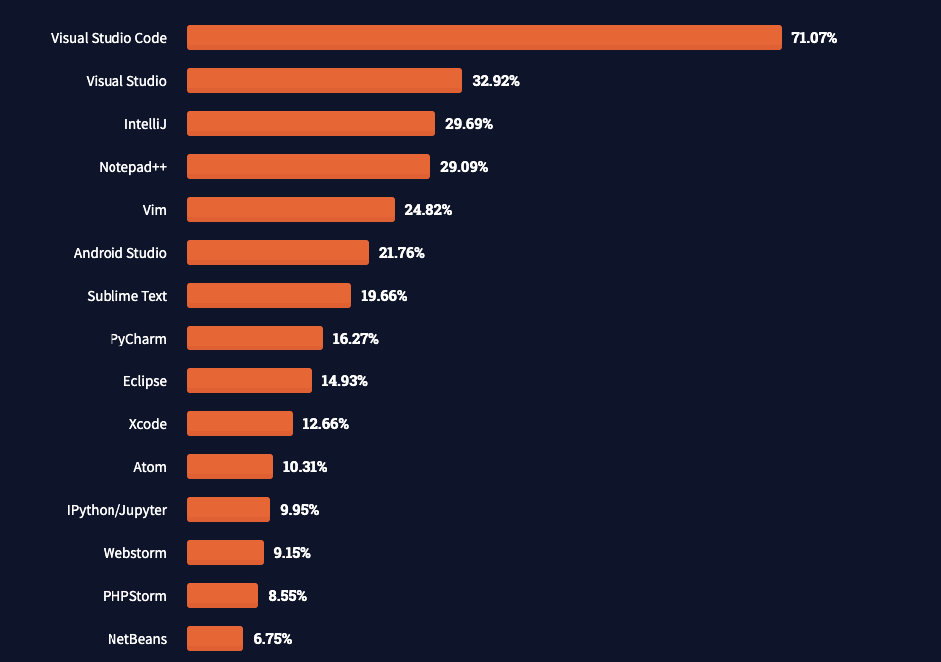
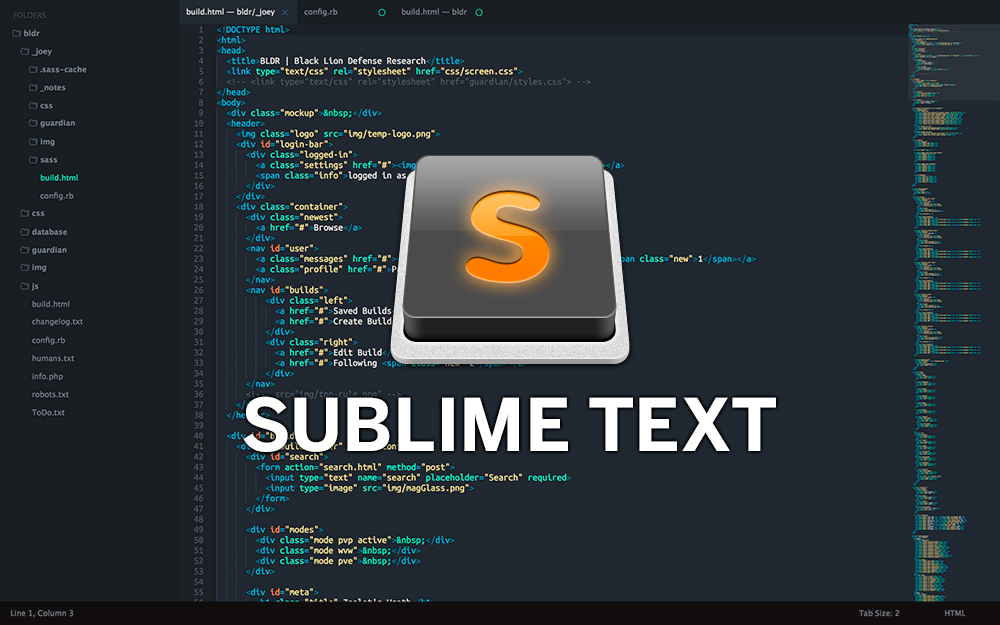
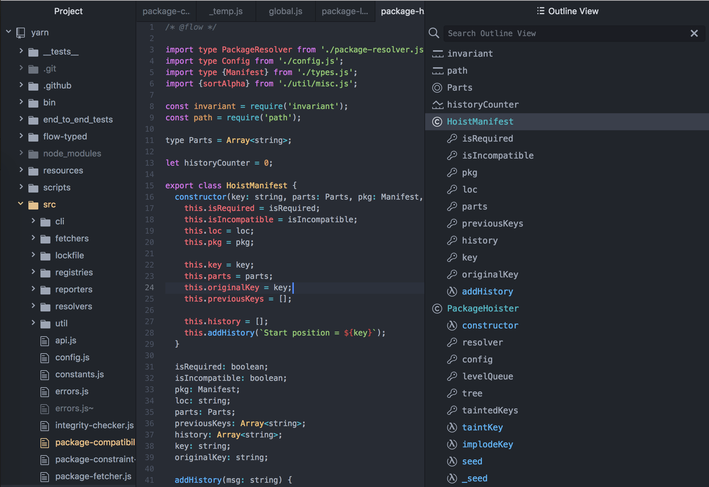
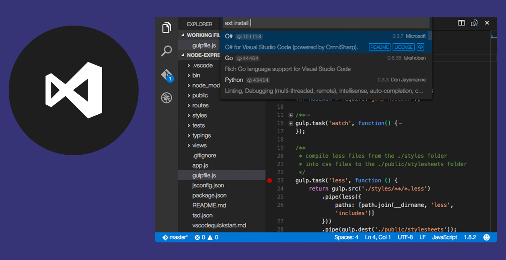

# IDE (Integrated Development Environment)

- [IDE (Integrated Development Environment)](#ide-integrated-development-environment)
  - [Editor de código vs. IDE](#editor-de-código-vs-ide)
  - [Os mais usados](#os-mais-usados)
  - [Por que usar um editor?](#por-que-usar-um-editor)
    - [Realce de código](#realce-de-código)
    - [Ambiente inteligente](#ambiente-inteligente)
    - [Trabalhar em projetos](#trabalhar-em-projetos)
      - [E muito mais](#e-muito-mais)
  - [Exemplos de IDEs](#exemplos-de-ides)
    - [Sublime Text](#sublime-text)
    - [Atom](#atom)
    - [VS Code](#vs-code)

O ambiente de desenvolvimento integrado é uma ferramenta utilizada para editar códigos, acessar o terminal, executar scripts, debugar e compilar em um único ambiente.

Repleto de funcionalidades, as IDEs incluem ferramentas de preenchimento de código, plugins, compartilhamento, registro, alerta de erros e muitas extensões que facilitam a vida do desenvolvedor. Atualmente existem diversas opções no mercado, alguns construídas em volta de linguagens específicas, outras com suporte para muitas e alguns editores de código que se comportam como IDEs.

## Editor de código vs. IDE

os editores de código podem ser editores de texto simples, como o **Notepad++** ou **VIM**, mas que não aprimoram o processo de edição de código. Alguns possuem funcionalidades integradas, plugins e terminais acoplados que podem facilitar o desenvolvimento.

Resumindo, são editores de texto com recursos integrados e funcionalidades especializadas voltados paro o processo de edição de códigos.

Já um IDE é um conjunto de ferramentas de desenvolvimento de software projetado para simplificar a codificação. Possui um editor de códigos, um depurador, compilador e outros recursos necessários, tudo em uma única ferramenta.

Assim como os editores, há várias opções de IDEs no mercado, algumas delas são: **Visual Studio** e **VS Code**, **Android Studio**, **Eclipse**, **PyCharm**, **Atom**, **IntelliJ IDEA**, entre outros.

## Os mais usados

Segundo o Stack Overflow, os ambientes mais utilizados por desenvolvedores são:

Existe um editor ou IDE melhor? 

A escolha e preferência depende muito da linguagem utilizada, da área de atuação e gostos pessoais.

## Por que usar um editor?

### Realce de código

Primeira mudança visual. Ao especificar a linguagem que está sendo usada para codar, o editor irá realçar com diferentes cores as palavras-chaves, variáveis, funções, números, textos, entre outras coisas.

Os editores ainda costumam fornecer diversos temas de cores, deixando a paleta por escolha de preferência do usuário.

### Ambiente inteligente

Pode fazer o reconhecimento de erros no código, seja por sintaxe ou outra coisa que não se pode fazer especificamente em uma linguagem.

Os erros ficam sublinhados, além de poderem ser alertados de outras formas, como mensagens no terminal ou ícones de erro.

### Trabalhar em projetos

Se a necessidade for de desenvolver um projeto maior, com diversas pastas e arquivos para organização, o editor é capaz de abrir e navegar por uma pasta, esta sendo o seu projeto.

Deste modo, poderá transitar facilmente entre pastas e arquivos dentro do projeto, localizar e substituir termos no projeto inteiro, criar, mover e excluir arquivos, entre outras funcionalidades.

#### E muito mais

- Autocomplete de termos do código
- Extensões
- Atalhos de teclado
- Integrações
- ...

## Exemplos de IDEs

### Sublime Text

É um editor pago que fornece texto gratuito. Desenvolvido na linguagem **C++**, pode ser utilizado em dispositivos móveis e em computadores nos sistemas operacionais: Windows, Linux e Mac OS.

Possui uma interface simples e suporta o desenvolvimento de:

- HTML e CSS
- Javascript
- PHP
- Python
- Ruby
- Entre outros

É um editor leve com alto desempenho. Sua simplicidade não o torna favorito para projetos mais complexos, além da versão gratuita solicitar a compra da licença (de $99 dólares) de forma frequente por pop-ups.

### Atom

É um editor totalmente gratuito, desenvolvido pelo GitHub. Pode ser utilizado no sistemas operacionais: Linux, Windows e Mac OS.

Possui suporte para as mesmas linguagens que o **Sublime Text** e muitas outras, tem recursos inteligentes como o autocomplete e packages.

Se diferencia pela integração nativa e completa com o Git e GitHub, possuindo uma interface intuitiva.

Pode ter mais funcionalidades que o **Sublime**, porém pode exigir um maior consumo de memória e processamento do computador.

### VS Code

É um editor gratuito desenvolvido pela Microsoft. Pode ser utilizado nos sistemas operacionais: Windows, Linux e Mac OS.

Como o **Atom** e o **Sublime Text**, suporta várias linguagens. Conta com a ferramente IntelliSense para auxiliar durante a escrita do código e uma vasta biblioteca de extensões que é atualizada frequentemente.

Também possui integração nativa com o GitHub e permite o trabalho remoto colaborativo.

Apresenta como grande diferencial o suporte paro o terminal dentro dele, substituindo a necessidade de abrir o "Powershell" ou "Command Prompt" para ativar scripts, e a função "debugger" que percorre linha por linha do código e facilita na busca de erros.

Como o **Atom**, é mais pesado do que o **Sublime**, além de que, por apresentar mais funcionalidades, exibe uma maior gama de opções na interface e se torna mais complexo de usar.