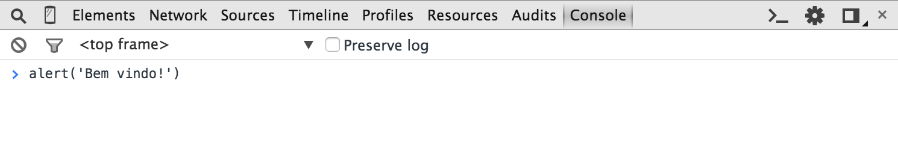
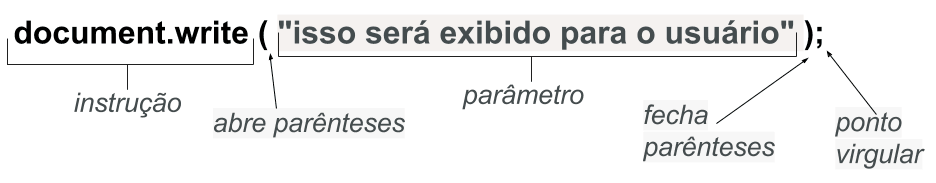
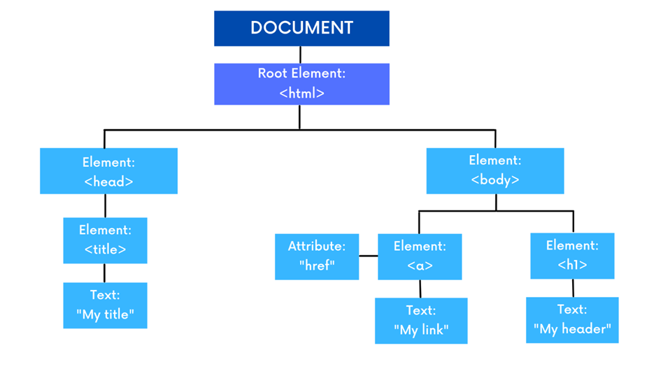

# Lógica de programação com JavaScript e HTML

- [Lógica de programação com JavaScript e HTML](#lógica-de-programação-com-javascript-e-html)
  - [Primeiros passos](#primeiros-passos)
      - [Convenções (boas práticas)](#convenções-boas-práticas)
  - [Começando com o HTML](#começando-com-o-html)
    - [Sintaxe básica](#sintaxe-básica)
      - [Estrutura do documento](#estrutura-do-documento)
    - [Interações com o usuário](#interações-com-o-usuário)
      - [Input](#input)
        - [Atributo type](#atributo-type)
        - [Outros atributos](#outros-atributos)
    - [Button](#button)
        - [Atributos](#atributos)
    - [Data-attributes](#data-attributes)
  - [Começando com o JavaScript](#começando-com-o-javascript)
      - [Console do navegador](#console-do-navegador)
    - [Sintaxe básica](#sintaxe-básica-1)
    - [Variáveis](#variáveis)
    - [Operadores principais](#operadores-principais)
    - [Tipos de dados](#tipos-de-dados)
    - [Arrays](#arrays)
      - [Declarando e acessando](#declarando-e-acessando)
      - [Métodos](#métodos)
    - [Objetos](#objetos)
      - [Acessando e editando](#acessando-e-editando)
      - [This](#this)
      - [Não declare strings, numbers e booleans como objects](#não-declare-strings-numbers-e-booleans-como-objects)
  - [DOM](#dom)
      - [Métodos para selecionar elementos](#métodos-para-selecionar-elementos)
      - [Métodos e propriedades para alterar elementos](#métodos-e-propriedades-para-alterar-elementos)
      - [Adicionando e excluindo elementos](#adicionando-e-excluindo-elementos)
    - [Funções e os eventos do DOM](#funções-e-os-eventos-do-dom)
      - [Tipos de funções](#tipos-de-funções)
      - [Eventos](#eventos)
    - [Hoisting](#hoisting)
  - [Manipulações](#manipulações)
    - [Strings](#strings)
    - [Números](#números)
    - [Concatenações](#concatenações)
  - [Condicionais](#condicionais)
  - [Loops](#loops)
    - [For](#for)
      - [Escopo do loop](#escopo-do-loop)
    - [For in](#for-in)
    - [For of](#for-of)
    - [While](#while)
    - [Do while](#do-while)
    - [Break e continue](#break-e-continue)
  - [Bibliotecas / APIs / Frameworks](#bibliotecas--apis--frameworks)
  - [Var, Let e Const (no JS)](#var-let-e-const-no-js)
    - [Var](#var)
    - [Let](#let)
    - [Const](#const)

## Primeiros passos

Para que o computador e navegador saibam qual a linguagem do arquivo, para que possa executar, ler e escrever de forma eficiente e correta, é preciso informar por meio da sua extensão.

| Tipo de arquivo                  | Extensão |
| -------------------------------- | -------- |
| Hypertext Markup Language (HTML) | .html    |
| Cascading Style Sheets (CSS)     | .css     |
| JavaScript (JS)                  | .js      |
| JavaScript Object Notation (JS)  | .json    |
| PHP                              | .php     |
| Java                             | .java    |
| Python                           | .py      |
| Markdown                         | .md      |
| Arquivo de Texto Simple          | .txt     |

#### Convenções (boas práticas)

O mundo da programação é cheio de convenções, nomear arquivos não é exceção. Nada impede que o programador nomeie da forma que quiser, todavia, será visto como algo fora das boas práticas e também há a possibilidade de que alguns sistemas, bancos de dados e outros softwares não aceitem o arquivo ou retorne erros.

A regra é clara:

- Somente letras minúsculas
  - index.html (bom)
  - INDEX.html (ruim)
- Sem espaços, estes sendo substituídos por hífen "-" ou underline "\_"
  - primeiro arquivo.txt (ruim)
  - primeiro_arquivo.txt (bom)
  - primeiro-arquivo.txt (bom)
- Sem caracteres especiais
  - texto\*dois.txt (ruim)
  - texto/dois.txt (ruim)
- Sem acentos
  - pagina.js (bom)
  - página.js (ruim)
- Evitar nomes muito longos
  - isso_e_curto.html (bom)
  - isso_nao_para_de_crescer_vc_nem_consegue_ler_direito.html (péssimo)

[Artigo Alura: convenções de nomenclatura em linguagens](https://www.alura.com.br/artigos/convencoes-nomenclatura-camel-pascal-kebab-snake-case)

## Começando com o HTML

Linguagem de marcação que funciona como a estrutura, o esqueleto, para construção mais básica de uma página web. É marcada pelo uso de **TAGs** que são instruções especiais a serem interpretadas pelo navegador.

### Sintaxe básica

Toda a TAG começa com `<` e termina com `>`. Por exemplo: `<h1>`, `<a>` e `<br>`. TAGs podem ou nem ter fechamento, muitas vezes para delimitar conteúdo. Todas as TAGs de fechamento acompanham o "/", como: `</h1>` e `</a>`.

```html
<tag-abertura atributo="valor"> conteúdo </tag-fechamento>

<h1 class="meu-titulo">Sintaxe</h1>
```

Algumas TAGs são self-closing, ou seja, não possuem par (abertura + fechamento). Como: ``, `<input type="number" />` e `<meta>`.

Não é case-sensitive, ou seja, TAGs podem ser escritas tanto em maiúsculo quanto minúsculo e ainda irá funcionar, porém, é de melhor prática que sejam todas em minúsculo. `XY = xy`.

```html
<h2>Funciona, mas é má prática</h2>
<h1>Funciona e é boa prática</h1>
```

Para registros, explicações e outros textos dentro da linguagem que não queremos que sejam executados, basta transforma-los em comentários.

```html
<!-- isso é um comentário -->
```

Por ser uma linguagem estática as modificações na página devem ser feitas diretamente no documento, não há dinamismo. Não é possível, por exemplo, capturar dados de um usuário ou exibir um contador com a passagem do tempo. Para acrescentar esse dinamismo, e começar a programar, é necessário o uso de outras linguagens.

#### Estrutura do documento

```html
<!DOCTYPE html>
<!-- diz ao navegador qual tipo de arquivo está sendo executado -->
<html lang="pt">
  <!-- tag html delimita o conteúdo do documento, atributo lang especifica o idioma do conteúdo -->
  <head>
    <!-- delimita o conteúdo meta do documento, o que é relevante para o navegador, servidor e desenvolvedores -->
    <meta charset="UTF-8" />
    <meta http-equiv="X-UA-Compatible" content="IE=edge" />
    <meta name="viewport" content="width=device-width, initial-scale=1.0" />
    <title>Documento</title>
    <!-- título da página -->
    <link rel="stylesheet" href="style.css" />
    <!-- linka o arquivo de estilos da página -->
    <!-- <style></style> pode ser usado para delimitar códigos de estilo dentro do html -->
    <!-- <link> pode ser usado para conectar com outros arquivos, bases, etc -->
  </head>
  <body>
    <!-- delimita o conteúdo que é visível na página -->
  </body>
  <script src=""></script>
  <!-- linka o arquivo para funcionalidades da página ou delimita o código dentro do html -->
</html>
```

### Interações com o usuário

Para interagir diretamente com o usuário o HTML oferece 2 tags: o `input`, onde o usuário pode inserir dados, e o `button`, que serve como gatilho para enviar estes dados à algum lugar.

```html
<fieldset>
  <legend>O seu gato é um gato de dentro de casa ou de rua?</legend>
  <label for="casa">
    <input id="casa" value="casa" type="radio" name="casa-rua" />Casa
  </label>
  <label for="rua">
    <input id="rua" value="rua" type="radio" name="casa-rua" />Rua
  </label>
  <button type="submit">Enviar</button>
</fieldset>
```

#### Input

Especifica uma área onde o usuário pode inserir dados, seu formato e os dados que pode receber variam de acordo com o valor do atributo que recebe de `type=`. A tag `<input />` é self-closing.

`placeholder` é um atributo que mostra um texto na área do input antes que o usuário insira qualquer dado, geralmente usada para sinalizar o tipo/formato de dado desejado.

O atributo `required` especifica que um input deve ser preenchido para que então seja possível enviá-lo.

```html
<input type="email" name="user-email" placeholder="insira seu email" required />
```

##### Atributo type

| Valor            | Descrição                                                                                                                                                              |
| ---------------- | ---------------------------------------------------------------------------------------------------------------------------------------------------------------------- |
| `text` (padrão)  | Campo de texto com uma só linha; quebras de linha são automaticamente removidas                                                                                        |
| `button`         | Botão clicável sem comportamento padrão                                                                                                                                |
| `checkbox`       | Caixa de marcação; deve ser acompanhado do atributo `value` para definir o valor do item                                                                               |
| `color`          | Color picker                                                                                                                                                           |
| `date`           | Controle para inserir uma data (ano, mês e dia, sem horário)                                                                                                           |
| `datetime`       | Controle para inserir uma data e horário (hora, minuto, segundo e fração de segundo) baseado no fuso horário UTC                                                       |
| `datetime-local` | Controle para inserir uma data e horário (hora, minuto, segundo e fração de segundo) sem fuso horário                                                                  |
| `email`          | Campo para inserir um endereço de email                                                                                                                                |
| `file`           | Controle que permite ao usuário selecionar um arquivo; o atributo `accept` define os formatos que o controle pode selecionar                                           |
| `hidden`         | Um input que não é exibido, mas o valor é enviado ao servidor                                                                                                          |
| `image`          | Botão gráfico; deve ser acompanhado de `src` para definir a fonte da imagem                                                                                            |
| `month`          | Controle para definir mês e ano, sem fuso horário                                                                                                                      |
| `number`         | Controle para inserir um número de ponto flutuante                                                                                                                     |
| `password`       | Campo de texto com uma linha só cujo valor é obscurecido                                                                                                               |
| `radio`          | Botão de escolha; deve ser acompanhado do atributo `value` para definir o valor do item. Botões com o mesmo atributo `name` são agrupados e só um pode ser selecionado |
| `range`          | Controle para inserir um número em um range, como um slider                                                                                                            |
| `search`         | Campo de texto com uma só linha para digitar termos de busca                                                                                                           |
| `submit`         | Botão de enviar                                                                                                                                                        |
| `tel`            | Campo para inserir um número de telefone                                                                                                                               |
| `time`           | Controle para inserir horário sem fuso horário                                                                                                                         |
| `url`            | Campo de texto para inserir um link                                                                                                                                    |
| `week`           | Controle para inserir uma data consistindo de ano da semana e número da semana sem fuso horário                                                                        |

##### Outros atributos

| Atributos        | Valor                               | Descrição                                                                                                         |
| ---------------- | ----------------------------------- | ----------------------------------------------------------------------------------------------------------------- | --- |
| `accept`         | `audio/*`, `image/png`, `.pdf`      | Quais tipos de arquivo o servidor aceita (somente `type=file`)                                                    |
| `alt`            | texto                               | Texto alternativo para imagens (somente `type=image`)                                                             |
| `autocomplete`   | `on` ou `off`                       | Se o valor do controle pode ser completado automaticamente pelo navegador                                         |
| `autofocus`      | autofocus                           | Se o elemento deve ter foco automaticamente quando a página carrega                                               |
| `checked`        | checked                             | Se o elemento deve estar pré-selecionado (somente `type=checkbox`, `type=radio`)                                  |
| `disable`        | disabled                            | Indica que o controle não está disponível para interação                                                          |     |
| `form`           | _form-id_                           | O elemento `form` ao qual o elemento `input` está associado                                                       |     |
| `formaction`     | _URL_                               | URL de um programa que processa a informação enviada pelo elemento (somente `type=submit`, `type=image`)          |
| `formenctype`    |                                     | Especifica o tipo de conteúdo que deve ser usado para enviar o formulário para o servidor                         |
| `formmethod`     | `get`, `post`                       | Especifica o método HTTP que o navegador deve usar para enviar o formulário (somente `type=submit`, `type=image`) |
| `formnovalidate` | formnovalidate                      | Especifica que o formulário não deve ser validado quando enviado                                                  |
| `formtarget`     | `_blank`, `_self`, `parent`, `_top` | É um nome ou palavra-chave indicando onde mostrar a resposta recebida após a submissão do formulário              |
| `height`         | _pixels_                            | Define a altura da imagem (somente `type=image`)                                                                  |
| `list`           | `datalist_id`                       | Identifica uma lista de opções pré-definidas de sugestões para o usuário                                          |
| `max`            | número, data                        | Valor/data máximo para o item                                                                                     |
| `maxlength`      | número                              | Especifica o número máximo de caracteres                                                                          |
| `min`            | número, data                        | Valor/data mínimo para o item                                                                                     |
| `minlength`      | número                              | Especifica o número mínimo de caracteres                                                                          |
| `multiple`       | multiple                            | Indica se o usuário pode inserir mais de um valor (somente `type=email`, `type=file`)                             |
| `name`           | texto                               | nome do controle                                                                                                  |
| `pattern`        | _regexp_                            | Expressão regular usada para validar o valor do controle                                                          |
| `placeholder`    | texto                               | Dica para o usuário do que ele pode inserir no controle                                                           |
| `readonly`       | readonly                            | Indica que o usuário não pode modificar o valor do controle                                                       |
| `required`       | required                            | especifica que o usuário deve preencher o campo com um valor antes de enviar o formulário                         |
| `size`           | número                              | Tamanho inicial do controle                                                                                       |
| `src`            | URL                                 | Especifica uma URL para a localização de uma imagem a ser exibida no botão gráfico (somente `type=image`)         |
| `step`           | número, `any`                       | limitar os incrementos em que valores numéricos ou datas podem ser alterados                                      |
| `value`          | texto                               | Valor inicial do controle                                                                                         |
| `width`          | _pixels_                            | define a largura da imagem (somente `type=image`)                                                                 |

### Button

Define um botão clicável. Dentro do elemento pode ser inserido texto (e outras TAGs como: `i`, `b`, `strong`,`br`, `ìmg`, etc). Isso não é possível com um botão criado com o elemento `input`.

```html
<button type="submit">Envie este formulário</button>
```

O comportamento padrão do botão com `type=submit`, sem qualquer outro atributo, é de enviar os dados para o local especificado no valor do `action`.

##### Atributos

| Atributos        | Valor                               | Descrição                                                                                            |
| ---------------- | ----------------------------------- | ---------------------------------------------------------------------------------------------------- |
| `autofocus`      | autofocus                           | Se o elemento deve ter foco automaticamente quando a página carrega                                  |
| `disable`        | disabled                            | Indica que o botão não está disponível para interação                                                |
| `form`           | _form-id_                           | O elemento `form` ao qual o elemento `button` está associado                                         |
| `formaction`     | _URL_                               | URL para onde a informação será enviada (somente `type=submit)`                                      |
| `formenctype`    |                                     | Especifica o tipo de conteúdo que deve ser usado para enviar o formulário para o servidor            |
| `formmethod`     | `get`, `post`                       | Especifica o método HTTP que o navegador deve usar para enviar o formulário (somente `type=submit`)  |
| `formnovalidate` | formnovalidate                      | Especifica que o formulário não deve ser validado quando enviado                                     |
| `formtarget`     | `_blank`, `_self`, `parent`, `_top` | É um nome ou palavra-chave indicando onde mostrar a resposta recebida após a submissão do formulário |
| `name`           | texto                               | nome do controle                                                                                     |
| `value`          | texto                               | Valor inicial do controle                                                                            |

### Data-attributes

É utilizado para guardar dados privados personalizados para a página ou aplicativo; dá a capacidade de incorporar dados personalizados para qualquer elemento HTML. Os dados guardados podem ser manipulados através do CSS, para estilizar o elemento, e JavaScript, para criar uma experiência de usuário mais engajada.

Não deve ser atribuído em dados visíveis, pois tecnologias de acessibilidade podem não identificar seus valores. Dados personalizados com o prefixo `data-` serão completamente ignorados por agentes de usuário.

Sua estrutura é dividida em:

- Primeira parte é o identificador deste dado, que consiste em `data-` + o nome de sua escolha que melhor identifica o tipo de dado a ser atribuído
- Segunda parte é o valor atribuído à este dado, o valor deve sempre estar entre aspas "" e dessa maneira é lido como `string`

```html
<h1>Lista de tintas:</h1>
<ul id="lista">
  <li
    data-cor="laranja"
    data-tipo="tinta-exterior"
    onclick="mudaCores(this)"
    class="item"
  >
    Tinta laranja
  </li>
  <li
    data-cor="branco"
    data-tipo="tinta-interior"
    onclick="mudaCores(this)"
    class="item"
  >
    Tinta branca
  </li>
  <li
    data-cor="rosa"
    data-tipo="tinta-exterior"
    onclick="mudaCores(this)"
    class="item"
  >
    Tinta rosa
  </li>
</ul>

<script>
  function mudaCores(elementos) {
    var cores = elementos.getAttribute("data-cor");
    var tipoElemento = elementos.getAttribute("data-tipo");
  }
</script>
```

O prefixo `data-` não é obrigatório para definir um `data-attribute`, pode-se alterar o código para a seguinte forma:

```html
<h1>Lista de tintas:</h1>
<ul id="lista">
  <li
    cor="laranja"
    tipo="tinta-exterior"
    onclick="mudaCores(this)"
    class="item"
  >
    Tinta laranja
  </li>
  <li cor="branco" tipo="tinta-interior" onclick="mudaCores(this)" class="item">
    Tinta branca
  </li>
  <li cor="rosa" tipo="tinta-exterior" onclick="mudaCores(this)" class="item">
    Tinta rosa
  </li>
</ul>

<script>
  function mudaCores(elementos) {
    var cores = elementos.getAttribute("cor");
    var tipoElemento = elementos.getAttribute("tipo");
  }
</script>
```

## Começando com o JavaScript

Linguagem de programação (de scripting) que adiciona funcionalidade e comportamentos. Permite ao programador o controle de uma ou mais aplicações de terceiros, pode controlar alguns comportamentos dos navegadores através de trechos de código que são enviados na página HTML.

Outra característica comum nas linguagens de scripting é que normalmente elas são linguagens interpretadas, ou seja, não dependem de compilação para serem executadas. o JavaScript é interpretado e executado conforme é lido pelo navegador, linha a linha, assim como o HTML. Por este motivo, o programador deve ter cuidado ao escrever o código para que siga uma ordem coerente.

Também possui grande tolerância a erros, uma vez que conversões automáticas são realizadas durante operações, mas nem sempre essas conversões resultam em algo esperado, o que pode ser fonte de muitos bugs.

O script do programador é enviado com o HTML para o navegador, sendo ele envolvido dentro da tag `<script></script>` como código ou caminho de um arquivo externo. Pode ser declarada tanto no inicio quanto final no código, porém, é de melhor prática declara-lo no final, o que auxilia no melhor processamento da página, ocasiona uma melhor performance.

```html
<script type="text/javascript" src="script.js"></script>
</body>
</html>
```

É convenção da linguagem nomear variáveis em camelCase → primeiraSegunda.

#### Console do navegador

Existem várias formas de executar códigos JavaScript em uma página. Uma delas é executar códigos no console do navegador. Para usa-lo é só acessar a ferramenta de “developer tools” inspecionando o site, seja pelo mouse (clique direto + inspecionar elemento) ou por atalhos (f12, ctrl + shift + i, ctrl + shift + c).



É comum querermos dar uma olhada no valor de alguma variável ou resultado de alguma operação durante a execução do código. Quando estiver com o console aberto, não é necessário chamar console.log(nomeDaVariável); podemos chamar o nome da variável diretamente que ela será impressa no console.

O mesmo também pode apresentar avisos sobre erros e pode sar usado para analisar e modificar o código na execução sem modificar o arquivo fonte.

### Sintaxe básica

A linguagem lê linha por linha e segue o formato: de cima para baixo, da esquerda para a direita. Cada linha recebe 1 comando terminado em ";", porém, é possível omitir o ponto e vírgula no final de cada declaração. A omissão funciona no JavaScript devido ao mecanismo chamado **_automatic semicolon insertion_** (asi).

Comentários são definidos com `//`.

É case-sensitive, ou seja, compreende a mesma palavra como diferente se for apresentada com maiúsculo e minúsculo. `XY != xy != Xy != xY`.

```js
var a = 6;
alert("total: " + c);
var b = 5;
var c = a + b;  // ordem incorreta

------------------------------

var a = 6;
var b = 5;
var c = a + b;
ALERT"total: " + c; // ordem correta, mas sintaxe incorreta

------------------------------

var a = 6;
var b = 5;
var c = a + b;
alert("total: " + c); // ordem e sintaxe corretas
```

Valores do tipo string (texto) precisam ser rodeadas de aspas simples `''` ou duplas `""`. Valores números ou de outros tipos podem ser inserido sem aspas.

```js
alert("Isto sim é um programa");
```



### Variáveis

Armazena valores para uso posterior, é chamado pela palavra reservada `var` e usa o operador de atribuição `=` para receber valores.

Declarar um variável sempre resulta em **undefined**, até que seja “chamada” (usada) em outra parte do código e receba uma atribuição. Pode ser alterada se for declarada de novo com outro valor e/ou usando operações básicas com sintaxe compactada.

```js
> var idade = 20; // undefined
> idade = idade + 1 // 21

> idade
21
```

```js
> var idade = 10; // undefined
> idade += 10; // idade vale 20
> idade -= 5; // idade vale 15
> idade /= 3; // idade vale 5
> idade *= 10; // idade vale 50
```

### Operadores principais

Podemos somar, multiplicar, dividir e realizar comparações como em qualquer outra linguagem.

**Importante**

- = → Atribui valores

  - `x = 21 // x vale 21`
  - `y = '21' // y vale 21`

- == → Igual a algo. Devolve valores boolean

  - `x == y // 21 é igual a 21, retorna true`

- === → Igual em valor e tipo de valor. Devolve boolean
  - `x === y // número 21 é igual a texto 21, retorna false`

| Operador Aritmético | Descrição                  | Exemplo  |
| ------------------- | -------------------------- | -------- |
| +                   | Adição                     | `a + b`  |
| -                   | Subtração                  | `a - b`  |
| \*                  | Multiplicação              | `a * b`  |
| \*\*                | Exponenciação              | `a ** b` |
| /                   | Divisão                    | `a / b`  |
| %                   | Modulus (resto da divisão) | `a % b`  |
| ++                  | Incrementar                | `++a`    |
| --                  | Diminuir                   | `--a`    |

```js
> 13 + 21
34
> 10 - 4
6

> 14 * 3
42
> 25 / 5
5

> 23 % 2
1
```

As operações aritméticas seguem as regras de precedência da matemática para decidir o que é resolvido primeiro. Os parênteses tomam precedência sobre qualquer operador.

| Operador de Atribuição | Descrição                  | Exemplo   | O mesmo que: |
| ---------------------- | -------------------------- | --------- | ------------ |
| =                      | atribui valor              | `x = y`   | `x = y`      |
| +=                     | adiciona e atribui valor   | `x += y`  | `x = x + y`  |
| -=                     | subtrai e atribui valor    | `x -= y`  | `x = x - y`  |
| \*=                    | multiplica e atribui valor | `x *= y`  | `x = x * y`  |
| /=                     | divide e atribui valor     | `x /= y`  | `x = x / y`  |
| %=                     | modulus e atribui valor    | `x %= y`  | `x = x % y`  |
| \*\*=                  | eleva e atribui valor      | `x **= y` | `x = x ** y` |

| Operador de Comparação | Descrição                   | Exemplo                                      |
| ---------------------- | --------------------------- | -------------------------------------------- |
| ==                     | igual a                     | `n == m`                                     |
| ===                    | igual em valor e tipo a     | `n === m`                                    |
| !=                     | diferente a                 | `n != m`                                     |
| !==                    | diferente em valor e tipo a | `n !== m`                                    |
| >                      | maior que                   | `n > m`                                      |
| <                      | menor que                   | `n < m`                                      |
| >=                     | maior que ou igual a        | `n >= m`                                     |
| <=                     | menor que ou igual          | `n <= m`                                     |
| ?                      | operador ternário           | `n ? 'valor-para-true' : 'valor-para-false'` |

```js
x = 24;
y = "24" > x == y;
true > x === y;
false;

const idade = 26;
const bebida = idade >= 21 ? "Cerveja" : "Suco"; // 21 ? true : false
console.log(bebida); // "Cerveja"
```

### Tipos de dados

| Tipo      | O que é                                                                                  | Exemplo                                               |
| --------- | ---------------------------------------------------------------------------------------- | ----------------------------------------------------- |
| String    | texto, acompanhado de de aspas simples `''` ou duplas `""`                               | `nome = "what r u, a cop?"` `idade = "700"`           |
| Number    | números, usados principalmente para executar operações, não são acompanhados de de aspas | `x = 64` `y = 7.5`                                    |
| Null      | valor vazio                                                                              | `vazio = null`                                        |
| Boolean   | verdadeiro ou falso                                                                      | `gamer = true` `exp = false`                          |
| Objet     | contem vários valores, veem em pares de **nome:valor** separados por vírgula             | `pessoa = {primeiroNome:"José", segundoNome:"Silva"}` |
| Array     | lista de valores/elementos, acompanhado de [ ]                                           | `vazio = null`                                        |
| Date      | objeto de data                                                                           | `data = new Date("2022-03-25")`                       |
| Undefined | valor não definido/atribuído                                                             | `var x`                                               |
| NaN       | não é um número                                                                          | `var resultado = 10-"curso"; // retorna NaN`          |

Os tipos de dados do JavaScript são dinâmicos, ou seja, uma variável pode receber valores de tipos diferentes.

```js
let x; // agora x é undefined
x = 5; // agora x é um Number
x = "Jonas"; // agora x é uma String
```

### Arrays

Variável que guarda mais de um valor. É uma estrutura de dados que serve para guardar e organizar elementos em um mesmo espaço de memória. Esses elementos podem ser acessados por um tipo de indicação, que chamamos de índice - [0][1][2]...

No JavaScript, os arrays se comportam como uma lista de itens, sendo que esta lista começa a contar a partir do índice zero.

```js
var cores = ["Azul", "Vermelho", "Preto", "Roxo", "Branco", "Cinza"];
```

Cada item é um elemento, cada elemento possui e é acessado por um índice, cada índice pode ter um item que possui mais de um elemento, ou seja, um array pode ter outro array como item.

Um array pode ter seus itens acessados, modificados, deletados e novos acrescentados à vontade.

#### Declarando e acessando

Cada item da lista é separado por vírgula e ocupa uma posição do array iniciando no índice zero. Essa forma é chamada de **método literal de array**.

Podemos acessar um elemento de um array usando o nome da variável seguido de colchetes e seu índice → `nomeVar[0]`

```js
var listaDeFrutas = ["Maçã", "Uva", "Banana", "Abacaxi", "Morango"];

var primeiroItem = listaDeFrutas[0]; // Maçã
var terceiroItem = listaDeFrutas[2]; // Banana
var quintoItem = listaDeFrutas[4]; // Morango
```

Outra forma de acessar os elementos de um array é iterando dentro dele, ou seja, percorrendo todos os seus itens através de laços de repetição como: `while`, `for` e `forEach`

#### Métodos

`indexOf()` → retorna o índice da primeira ocorrência do valor especificado. Recebe o item como parâmetro.

- Retorna sempre um número
- Retorna -1 se o valor não for encontrado
- Começa pelo índice especificado e procura da esquerda para a direita
- Por padrão, a procura começa no primeiro elemento e e termina no último

```js
array.indexOf(item, start); // sintaxe, item - obrigatório, start - opcional

var listaDeFrutas = ["Maçã", "Uva", "Banana", "Abacaxi", "Morango"];
var procura = indexOf("Abacaxi", 4); // -1
var procura = indexOf("Abacaxi"); // 3
```

`push()` → adiciona um item ao final do array. Recebe o(s) novo(s) item(s) como parâmetro.

- Adiciona n itens para o final do array
- Modifica o tamanho do array
- Retorna um número, o novo tamanho do array

```js
array.push(item1, item2... itemN) // sintaxe

listaDeFrutas.push('Goiaba', 'Carambola'); // ['Maçã', 'Uva', 'Banana', 'Abacaxi', 'Morango', 'Goiaba', 'Carambola']
```

`unshift` → adiciona um item ao início do array. Recebe o(s) novo(s) item(s) como parâmetro.

- Adiciona n items ao início do array
- Modifica o tamanho do array
- Retorna um número, o novo tamanho do array

```js
array.unshift(item1, item2... itemN) // sintaxe

listaDeFrutas('Tomate', 'Laranja'); // ['Tomate', 'Laranja', 'Maçã', 'Uva', 'Banana', 'Abacaxi', 'Morango', 'Goiaba', 'Carambola']
```

`pop` → remove o último item do array.

- Modifica o array original
- Retorna o elemento removido

```js
array.pop(); // sintaxe

listaDeFrutas.pop(); // 'Carambola'
// ['Tomate', 'Laranja', 'Maçã', 'Uva', 'Banana', 'Abacaxi', 'Morango', 'Goiaba']
```

`shift` → remove o primeiro item do array.

- Modifica o array original
- Retorna o elemento removido

```js
array.pop(); // sintaxe

listaDeFrutas.pop(); // 'Tomate'
// ['Laranja', 'Maçã', 'Uva', 'Banana', 'Abacaxi', 'Morango', 'Goiaba']
```

`splice` → remove items de uma posição a outra e retorna um novo array com os itens removidos. Recebe como parâmetros opcionais a posição inicial e final.

- Retorna os itens especificados como um novo array
- Seleciona de um começo especificado até (não incluso) um final especificado
- Não modifica o array original

```js
array.slice(start, end);

listeDeFrutas.slice(1, 4); // ['Maçã', 'Uva', 'Banana']
```

### Objetos

Podem ser definidos como uma coleção de dados. Para criar objetos no JavaScript é preciso utilizar as chaves {}, dentro delas são inseridos pares de propriedade e valor separados por vírgula.

Assim como em um livro físico, os pares se dão seguindo o exemplo `propriedade: valor` → `titulo: Senhor dos Anéis`.

A maioria dos livros tem as mesmas propriedades, mas os valores das propriedades diferem de um livro para o outro. É possível inserir dados dos tipos: `string` , `number`, `array`, `object` e até mesmo declarar funções.

```js
var livro = {
  titulo: "Crush",
  autor: "Richard Siken",
  genero: "Poesia",
  editora: "Yale University Press",
  preco: 31.5,
};
```

#### Acessando e editando

É possível acessar a propriedade de um objeto usando **dot notation** ou **array notation**. Ambos inicializam com o nome do objeto para o acesso, seguido de: **ponto** para a notação de ponto e **colchetes** para a notação de array, seguido do item que se quer acessar - pode ser o nome da propriedade, item de um array, ou uma chamada para um método do objeto.

```js
livro.autor; // 'Richard Siken'
livro["autor"]; // 'Richard Siken'
```

**Dot notation** é preferível sobre **array notation** por ser mais sucinto e fácil de ler, porém, há casos onde é necessário usar os colchetes. Por exemplo, se o nome de uma propriedade de um objeto esta em uma variável, não se pode usar o **dot notation** para acessa-lo, mas se pode acessar com o **array notation**.

```js
var livros = [
  {
    titulo: "Crush",
    autor: "Richard Siken",
    genero: "Poesia",
    editora: "Yale University Press",
    preco: 31.5,
  },
  {
    titulo: "2012",
    autor: "Anne Holt",
    genero: "Romance policial",
    editora: "Fundamento",
    preco: 29.9,
  },
  {
    titulo: "White is for Witching",
    autor: "Helen Oyeyemi",
    genero: "Horror gótico",
    editora: "Picador",
    preco: 50.97,
  },
];

livros[2].genero = "Mistério"; // altera o valor da propriedade genero do 3 item da lista de objetos
livros[2].genero; // 'Mistério'

livros[0].estoque = "7 unidades"; // insere nova propriedade e valor no primeiro item da lista de objetos
livros[0].estoque; // '7 unidades'

delete livros[1].autor; // deleta a propriedade autor do 2 item da lista de objetos
livros[1].autor; // undefined

delete livros[1]; // deleta o 2 item da lista de objetos
console.log(livros[1]); // undefined
```

#### This

A keyword `this` em uma função declarada se refere ao "dono" da função.

```js
var livro = {
  titulo: 'White is for Witching',
  autor: 'Helen Oyeyemi',
  genero: 'Horror gótico',
  editora: 'Picador',
  preco: 50.97,
  fullName : function() {
    return this.titulo + " de " + this.autor;
}
```

Nesse exemplo, `this` se refere ao objeto **livro**, ou seja `this.titulo` significa a propriedade `titulo` de `this`/`livro`.

Ao que o `this` se refere depende de como é usado:

|                                                                                         |
| --------------------------------------------------------------------------------------- |
| Em um método de objeto, `this` se refere ao **object**                                  |
| Sozinho, `this` se refere ao **global object**                                          |
| Em uma função, `this` se refere ao **global object**                                    |
| Em uma função, em modo restrito, `this` é **undefined**                                 |
| Em um evento, `this` se refere ao **element** que recebe o evento                       |
| Métodos como `call()`, `apply()`, e `bind()` podem referir `this` a qualquer **object** |

`this` **não é uma variável, é uma keyword; seu valor não pode ser alterado.**

#### Não declare strings, numbers e booleans como objects

Quando uma variável é declarada com a keyword `new`, a variável é criada como um objeto. Evite criar objetos `string`, `number` e `boolean`, eles complicam o código e diminuem a velocidade da execução.

```js
x = new String(); // Declares x como um objeto String
y = new Number(); // Declares y como um objeto Number
z = new Boolean(); // Declares z como um objeto Boolean
```

---

## DOM

Para permitir alterações na página, ao carregar o HTML, os navegadores carregam em memória uma estrutura de dados que representa cada uma das nossas tags no JavaScript. Essa estrutura é chamada de DOM (**D**ocument **O**bject **M**odel) e pode ser acessada através da variável global `document`.

O termo “documento” é frequentemente utilizado em referência à nossa página, documento e página são sinônimos. Ao alterar os elementos da página, o navegador sincroniza as mudanças e altera a aplicação em tempo real.



Em código:

```html
<!DOCTYPE html>
<html>
  <head>
    <title>My title</title>
  </head>
  <body>
    <a href="My link"></a>
    <h1>My header</h1>
  </body>
</html>
```

O DOM modifica dinamicamente a estrutura do HTML, sem precisar atualiza-lo, pode:

- Adicionar/modificar/remover tags, textos, imagens e qualquer outro elemento no HTML
- Alterar estilos CSS da página
- Criar novos eventos
- Modificar/receber/mandar valores

#### Métodos para selecionar elementos

```js
// seleciona um elemento pelo seu ID
document.getElementById(#id)
// seleciona um elemento pelo nome da sua CLASSE
document.getElementByClassName(.class)
// seleciona um elemento pelo nome da TAG
document.getElementByTagName(name)
// seleciona um elemento por id, classe ou nome
document.querySelector("name")
// seleciona um ou mais elementos por id, classe ou nome
document.querySelectorAll("name[attr=val]")
// cria um elemento no HTML
document.createElement("type")
// escuta um evento de um elemento HTML ou objeto DOM
document.addEventListener("event", function, useCapture)
```

```js
// seleciona um elemento pelo seu ID
document.getElementById(#formulario)
// seleciona um elemento pelo nome da sua CLASSE
document.getElementByClassName(.numeroTelefone)
// seleciona um elemento pelo nome da TAG
document.getElementByTagName(input)
// seleciona um elemento por id, classe ou nome
document.querySelector("#icon-btn")
// seleciona um ou mais elementos por id, classe ou nome
document.querySelectorAll("input[value=tel]")
```

#### Métodos e propriedades para alterar elementos

```js
// obtém ou altera qualquer elemento no html, inclusive tags
element.innerHTML;
// permite inserir textos no html
element.innerText;
// altera o valor de um elemento
element.attribute;
// altera o valor de um atributo de um elemento
element.setAttribute("atributo", "valor");
```

#### Adicionando e excluindo elementos

```js
// escreve no fluxo de saída
document.write();
// adiciona um elemento
document.appendChild();
// remove um elemento
document.removeChild();
// substitui um elemento
document.replaceChild();
// cria um elemento
document.createElement();
```

### Funções e os eventos do DOM

Apesar de ser interessante a possibilidade de alterar o documento todo por meio do JavaScript, é muito comum que as alterações sejam feitas quando o usuário executa alguma ação, como mudar o conteúdo de um botão ao clicar nele e não quando a página carrega, porém, por padrão, qualquer código no script é executado assim que o navegador o lê.

Para guardar um código que será executado somente quando ocorre um evento, como um de click, é necessário criar uma **função** e guardo-lo dentro dela. Após criada, o código nela só será executado quando a função for chamada, para isso, só é preciso utilizar seu nome seguido de parênteses `funcao()`.

Para que a função seja chamada quando um evento acontece, é preciso:

→ selecionar o elemento → definir o evento → declarar a função que será executada

```js
function enviarArquivo() {
  button.push;
} // cria uma função sem parâmetros que envia o arquivo

enviarArquivo(); // chama a função
```

Há 3 maneiras de chamar uma função quando o evento é executado:

```js
document.querySelector("#botaoEnviar").onclick = function enviarArquivo() {
  button.push;
};

//
var botao = document.querySelector("#botaoEnviar");
botao.onclick = enviarArquivo; // guarda função, +() executa automaticamente

//
<button onclick="enviarArquivo" id="botaoEnviar">
  Enviar
</button>;
```

Uma função pode ser chamada dentro de outra, ela também pode receber parâmetros. Se houver parâmetros, é necessário definir sua funcionalidade dentro da função e definir o seu valor toda vez que a função for chamada.

```js
function pulaLinha() {
  document.write("<br><br>");
}

function escreveMensagem(mensagem) {
  document.write(mensagem);
  pulaLinha();
}

function escreveTitulo(titulo) {
  document.write("<h3>" + titulo + "</h3>");
}

escreveTitulo("<h3>Porcentagem de acertos na prova</h3>");

var prova = {
  questoes: 50,
  acertos: 15,
  peso: 100,
};

var calculo = (prova.acertos / prova.questoes) * prova.peso;

escreveMensagem("Eu acertei: " + calculo + "% da prova");
```

Funções também atribuem valores a variáveis ao retornar dados, para isso, é necessário o uso da keyword `return` dentro da função seguido do que se deseja retornar. O JavaScript processa/executa a função, pega o valor e o retorna para a variável que, quando o recebe, guarda na memória.

```js
function calculaIMC(peso, altura) {
  var imc = peso / (altura * altura);
  console.log("O IMC é: " + Math.round(imc));
  return imc;
}

var meuIMC = calculaIMC(77.2, 1.65);
var seuIMC = calculaIMC(90, 1.71);
```

#### Tipos de funções

```js
// DECLARADA / NOMEADA
function exemplo() {
  // pode ser chamada, executada várias vezes
  console.log("");
}

// ANÔNIMA
element.addEventListener("click", function () {
  // só é executada nesse único momento
  console.log("");
});

// ARROW
element.addEventListener("click", () => {
  // função anônima, só é executada nesse único momento
  console.log("");
});
```

A diferença da função anônima para a declarada é que a declara pode ser chamada mais vezes por ter um nome. Uma função anônima só pode ser executada uma única vez, quando um gatilho for disparado.

#### Eventos

Existem diversos eventos que podem ser utilizados em elementos para que a interação do usuário dispare alguma função, entre eles temos:

```js
> elemento.oninput // quando um elemento input tem seu valor modificado
> elemento.onclick // quando ocorre um click com o mouse
> elemento.ondblclick // quando ocorre click duplo com o mouse
> elemento.onmousemove // quando o mouse é movido em cima do elemento
> elemento.onmousedown // quando aperta o botão do mouse
> elemento.onmouseup // quando solta o botão do mouse (útil com os dois acima para gerenciar drag'n'drop)
> elemento.onkeypress // quando pressionar e soltar uma tecla
> elemento.onkeydown // quando pressionar uma tecla
> elemento.onkeyup // quando soltar uma tecla
> elemento.onblur // quando um elemento perde foco
> elemento.onfocus // quando um elemento ganha foco
> elemento.onchange // quando um input, select ou textarea tem seu valor alterado
> elemento.onload // quando a página é carregada
> elemento.onunload // quando a página é fechada
> elemento.onsubmit // disparado antes de submeter o formulário (útil para realizar validações)
```

Existem também uma série de outros eventos mais avançados, como os que permitem a criação de interações para drag-and-drop, e até mesmo a criação de eventos customizados.

[DOM Event Object](https://www.w3schools.com/jsref/dom_obj_event.asp)

### Hoisting

Uma função pode ser chamada antes mesmo de ter sido declarada.

Hoisting permite a execução de funções antes das suas declarações. Na prática, inicialmente as declarações de funções são colocadas na memória durante a fase de compilação e, mesmo assim, permanecem no mesmo lugar que estão digitadas. A razão pela qual o código funciona é que os mecanismos JavaScript movem a função para o início do escopo.

```js
console.log(soma(2, 5)); // 7
function soma(a, b) {
  return a + b;
}

/*=
function soma(a,b){
    return a + b
}
console.log(soma(2,5))
*/
```

A utilização de hoisting em `var` não é indicada, pois a variável criada é elevada para o escopo, mas sem o seu valor, assim retornando o valor `undefined`. O comportamento é parecido também ao usar var dentro de uma `function`.

```js
console.log(alura) // undefined
var alura = ‘cursos’;
```

Hoisting também não é indicado utilizando `let`, pois acontece outro tipo de comportamento não desejado. É reconhecido que o let existe, porém, não se consegue acessar sua declaração. Esse comportamento de Hoisting com `let` é o mesmo ao utilizar `const`.

````js
console.log(alura)
let alura = ‘cursos’;
// script.js:1 Uncaught ReferenceError: Cannot access 'alura' before initialization```
````

---

## Manipulações

### Strings

Uma variável que armazena uma string faz muito mais que isso, pode, por exemplo, retornar seu tamanho ou transformar seu valor.

```js
> var nome = "Oliver";
> nome.replace("v", "w");
Oliwer
```

String é imutável, ou seja, se a variável for impressa após chamar a função replace, o valor continuará sendo o original. Para obter uma string modificada é necessário que ela seja declarada novamente recebendo o retorno de cada função que a manipula.

```js
var nome = "Oliver";

// substitui a parte "v" por "w"
nome.replace("v", "w");
console.log(nome);
Oliver; // imprime Oliver, não mudou

nome = nome.replace("v", "w");
console.log(nome);
Oliwer; // imprime Oliwer, mudou
```

Strings podem ser convertidas para numbers.

```js
var textoInteiro = "10";
typeof textoInteiro; // "string"
var inteiro = parseInt(textoInteiro);
typeof inteiro; // "number"

var textoFloat = "10.22";
typeof textoFloat; // "string"
var float = parseFloat(textoFloat);
typeof float; // "number"
```

### Números

Number, assim como string, é imutável. O exemplo altera o número de casas decimais com a função `toFixed` e retornará uma string, mas primeiro tem que receber o retorno:

```js
var milNumber = 1000;
var milString = milNumber.toFixed(2); // recebe o retorno da função
console.log(milString); // imprime a string "1000.00"
```

### Concatenações

É possível concatenar tipos diferentes de valores e o JavaScript se encarregará de realizar a conversão entre os tipos, podendo resultar em algo não esperado.

```js
// string + string
var s1 = "Caelum";
var s2 = "Inovação";
console.log(s1 + s2); // imprime CaelumInovação

// string + number
var num1 = 2;
var num2 = 3;
var nome = "Caelum";

// O que ele imprimirá?

// Exemplo 1:
console.log(num1 + nome + num2); // imprime 2Caelum3

// Exemplo 2:
console.log(num1 + num2 + nome); // imprime 5Caelum

// Exemplo 3:
console.log(nome + num1 + num2); // imprime Caelum23

// Exemplo 4:
console.log(nome + (num1 + num2)); // imprime Caelum5

// Exemplo 5:
console.log(nome + num1 * num2); // imprime Caelum6
// A multiplicação tem precedência

var numString = "21";
var numInt = 11;
console.log(numString + numInt); // imprime 2111, conversão implícita do number para string
```

---

## Condicionais

Expressões condicionais são usadas para executar diferentes ações com base em diferentes condições. No JavaScript há 4 declarações condicionais:

- `if` é usado para especificar o bloco de código que será executado caso uma condição seja verdadeira
- `else` é usado para especificar o bloco de código que será executado caso a mesma condição seja falsa
- `else if` é usado para especificar o bloco de código que será executado caso a primeira condição seja falsa, mas essa mesma seja verdadeira
- `switch` é usado para especificar vários blocos alternativos de código que serão executados dependendo da condição de cada um

```js
if (condição) {
  // bloco de código que será executado se a condição retornar true
} elif (condição2) {
  // bloco de código que será executado caso a primeira condição retorne false, mas essa retorne true
} else {
  // bloco de código que será executado caso todas as outras condições retornem false
}
```

- Uma declaração `if` pode ser usada sozinha, sem `else` ou `else if`
- Uma declaração `else` sempre acompanha um `if`, não pode ser usado sozinho ou acompanhar um `else if` sem `if`
- Uma declaração `else if` sempre acompanha um `if`, não pode ser usado sozinho e pode ser usado junto de um `else`, mas sempre ao lado do `if`

```js
switch (expressão) {
  case x:
    // bloco de código
    break; // necessário para "quebrar" a execução para fora do bloco do switch
  case y:
    // bloco de código
    break;
  default: // pode ser usado como primeiro caso, mas deve receber um break
  // bloco de código
  // o último caso não precisa de break, pois a execução do switch para no final de qualquer modo
}
```

- A expressão `switch` é avalizada uma vez
- O valor da expressão é comparado com os valores de cada caso
- Se há um match, o bloco de código associado ao caso será executado
- Se não há match, o bloco de código do caso padrão será executado
- Se o `break` for omitido, o próximo caso será executado mesmo que não dê match
- Se múltiplos casos derem match, só o primero será executado
- Se o caso padrão for omitido, o programa continuará para a próxima declaração após o `switch`

```js
let x = "0"; // string
switch (x) {
  case 0: // number
    texto = "Off";
    break;
  case 1:
    texto = "On";
    break;
  default: // esse será o caso executado, pois "0" !== 0
    texto = "Nenhum valor encontrado";
}
```

- Casos `switch` usam comparações estritas (===), ou seja, comparações de valor e tipo de dado. O valor deve ser do mesmo tipo para que haja match.

```js
0 == "0"; // true
0 === "0"; // false
0 != "0"; // false
0 !== "0"; // true
```

## Loops

Loops podem executar um bloco de código por um número x de vezes. Um loop é muito útil quando se quer executar um bloco de código de novo e de novo, com valores diferentes cada vez.

Geralmente, este é o caso quando se trabalha com arrays:

```js
for (let i = 0; i < carros.length; i++) {
  texto += carros[i] + "<br>";
}
```

O JavaScript suporta 5 tipos diferentes de loop:

- `for` percorre por um bloco de código um número x de vezes
- `for/in` percorre pelas propriedades de um objeto
- `for/of` percorre pelos valores de um objeto iterável
- `while` percorre por um bloco de código enquanto uma condição for verdadeira
- `do/while` também percorre por um bloco de código enquanto uma condição for verdadeira

### For

A declaração `for` percorre por um bloco de código um número x de vezes:

```js
for (expressão 1; expressão 2; expressão 3) {
  // bloco de código que será executado

  for (let i = 0; i < 5; i++) {
  texto += "O número é " + i + "<br>";
}
```

- **Expressão 1** será executada uma vez antes da execução do bloco de código
  - Normalmente inicializa a variável que será usado no loop
  - É opcional, pode ser omitido. Por exemplo, caso a variável seja declarada antes do loop
  - várias variáveis podem ser inicializadas (separadas por vírgula)

```js
// Opção 1
for (let i = 0, len = carros.length, texto = ""; i < len; i++) {
  texto += carros[i] + "<br>";
}

// Opção 2
let i = 2;
let len = carros.length;
let texto = "";
for (; i < len; i++) {
  texto += carros[i] + "<br>";
}
```

- **Expressão 2** define a condição para a execução do bloco de código

  - Normalmente é usado para avaliar a condição da variável inicial
  - É opcional, porém, é necessário adicionar um `break` dentro do loop para que não seja infinito e crash
  - Se retornar `true`, o loop começará de novo. Se retornar `false`, o loop terminará

- **Expressão 3** é executado toda vez após a execução do bloco de código
  - Normalmente incrementa o valor da variável inicial
  - É opcional, pode ser omitido. Por exemplo, caso os valores sejam incrementados dentro do loop
  - Pode fazer de tudo, como: incrementar negativamente (--), incrementar positivamente (i = i + 15), etc

```js
let i = 0;
let len = carros.length;
let texto = "";
for (; i < len; ) {
  texto += carros[i] + "<br>";
  i++;
}
```

#### Escopo do loop

Usando `var`, a variável declarada no loop redeclara a variável fora do loop.

```js
var i = 5;

for (var i = 0; i < 10; i++) {
  // algum código
}

// aqui i é 10
```

Usando `let`, a variável declarada no loop não é redeclarada fora do loop; quando `let` é usado para declarar a variável em um loop, a variável será somente visível dentro do loop.

```js
let i = 5;

for (let i = 0; i < 10; i++) {
  // algum código
}

// aqui i é 5
```

### For in

A declaração `for in` percorre pelas propriedades de um objeto:

```js
for (key in object) {
  // bloco de código que será executado
}

const pessoa = { fnome: "John", lnome: "Doe", idade: 25 };

let texto = "";
for (let x in pessoa) {
  // o loop for in itera sobre o objeto pessoa
  texto += pessoa[x]; // cada iteração retorna uma key (x), a key é usada para acessar o valor da key
  // o valor da key é pessoa[x]
}
```

A declaração `for in` também pode ser usada para percorrer sobre as propriedades de um array:

```js
for (variavel in array) {
  // bloco de código
}

const numeros = [45, 4, 9, 16, 25];

let txt = "";
for (let x in numeros) {
  txt += numeros[x];
}
```

Não use `for in` em um array se a order do índice é importante. A ordem é dependente da implementação, os valores acessado podem não ser na ordem esperada. É melhor usar um `for` loop, `for of` loop ou um `Array.forEach()` quando a ordem é importante.

```js
const numeros = [45, 4, 9, 16, 25];

let txt = "";
numeros.forEach(minhaFuncao); // chama a função uma vez por cada elemento do array

function minhaFuncao(value, index, array) {
  txt += value;
}
```

### For of

A declaração `for of` percorre pelos valores de um objeto iterável. Deixa percorrer sobre uma estrutura de dados iterável como: Arrays, Strings, Maps, NodeLists, e outras:

```js
for (variavel of iteravel) {
  // bloco de código que será executado
}
```

**Variável** - Para cada iteração o valor da próxima propriedade é atribuído para a variável. Pode ser declarada com: `var`, `let` ou `const`.

**Iterável** - Um objeto tem propriedades iteráveis.

```js
// ARRAY
const carros = ["BMW", "Volvo", "Mini"];

let txt = "";
for (let x of carros) {
  txt += x;
}

// STRING
let linguagem, = "JavaScript";

let txt = "";
for (let x of linguagem,) {
txt += x;
}
```

### While

A declaração `while` percorre por um bloco de código enquanto uma condição for verdadeira:

```js
while (condicao) {
  // bloco de código que será executado
}

while (i < 10) {
  // irá executar enquanto i for menor que 10
  texto += "O número é " + i;
  i++;
}
```

### Do while

O loop `do while` é uma variação do loop `while`. Esse loop irá executar o bloco de código uma vez, antes de se checar se a condição é verdadeira, então irá repetir enquanto a condição retornar `true`.

```js
do {
  // bloco de código que será executado
} while (condicao);

do {
  texto += "O número é " + i;
  i++;
} while (i < 10);
```

### Break e continue

A declaração `break` "pula para fora" do loop, seguindo para a próxima declaração após o loop:

```js
for (let i = 0; i < 10; i++) {
  if (i === 3) {
    break;
  } // para o loop quando i for 3
  texto += "O número é " + i + "<br>";
}
```

A declaração `continue` "pula sobre" uma iteração do loop, seguindo para a próxima iteração no loop:

```js
for (let i = 0; i < 10; i++) {
  if (i === 3) {
    continue;
  } // pula para a próxima iteração quando i for 3
  texto += "O número é " + i + "<br>";
}
```

---

## Bibliotecas / APIs / Frameworks

| Ferramente                              | Descrição                                                                                                                                                                                                                                          |
| --------------------------------------- | -------------------------------------------------------------------------------------------------------------------------------------------------------------------------------------------------------------------------------------------------- |
| API (Application Programming Interface) | São mecanismos que permitem a comunicação (cliente - servidor) entre dois componentes de software por meio de um conjunto de definições e protocolos. Existem quatro formas de funcionamento: APIs SOAP, APIs RPC, APIs WebSocket e APIs REST.     |
| Bibliotecas                             | Coleção de subprogramas com diversas finalidades para redução do uso de código no desenvolvimento de software. Permite o compartilhamento e a alteração de código e dados de forma modular.                                                        |
| Frameworks                              | Estrutura que envolve um conjunto de bibliotecas ou componentes usados para criar uma base onde a aplicação será construída. Proporciona reusabilidade e conexões de linhas de código e provê funcionalidades que se adequa a diversas aplicações. |

## Var, Let e Const (no JS)

As declarações `var`, `let` e `const` são todas responsáveis por armazenar dados em um espaço de memória, suas diferenças principais estão no escopo e comportamento de hoisting.

Escopo define onde as variáveis poderão ser utilizadas, ou seja, quais blocos de código podem usar e acessar elas. Se divide em 2: escopo global e escope de função/local.

### Var

Quando uma declaração `var` é feita fora de uma função recebe o escopo global. Isso significa que qualquer `var` que seja declarada fora de um bloco de função pode ser utilizada na janela inteira.

Ela só tem escopo local quando declarada dentro de uma função. Isso significa que só estará disponível e poderá ser acessada de dentro daquela função.

```js
var greeter = "hey hi";

function newFunction() {
  var hello = "hello";
}
```

Aqui, `greeter` tem um escopo global, pois existe fora de uma função, enquanto `hello` tem escopo local. Por isso, não se pode acessar a variável `hello` fora de uma função:

```js
var greeter = "hey hi";

function newFunction() {
  var hello = "hello";
}

console.log(hello); // erro: hello não está definido
console.log(greeter); // "hey hi"
```

Variáveis de `var` podem ser declaradas de novo e atualizadas/receber novos dados. Isso significa que ações como estas não irão gerar erros:

```js
var greeter = "hey hi";
var greeter = "say Hello instead";
/* ou */
var greeter = "hey hi";
greeter = "say Hello instead";
```

`var` sofre hoisting, ou seja, o JavaScript "joga" a variável para o topo do escopo, as inicializando antes de sua declaração e definindo com um valor `undefined`.

```js
/* O que está codado */
console.log(greeter);
var greeter = "say hello";
/* Como o JS interpreta */
var greeter;
console.log(greeter); // greeter is undefined
greeter = "say hello";
```

### Let

`let` tem escopo de bloco, ou seja, tudo que é declarado com `let` só estará disponível dentro do bloco de código que onde foi declarado.

```js
let greeting = "say Hi";
let times = 4;

if (times > 3) {
  let hello = "say Hello instead";
  console.log(hello); // dirá "say Hello instead"
}
console.log(hello); // hello não está definido
```

`let` pode ser atualizado/receber novos valores, mas não pode ser redeclarado. Como `var`, pode ser atualizada dentro de seu escopo, porém, diferente de `var`, não pode ser declarado novamente neste mesmo escopo.

```js
/* Atualização pode */
let greeting = "say Hi";
greeting = "say Hello instead";
/* Redeclaração não */
let greeting = "say Hi";
let greeting = "say Hello instead"; // erro: identificador 'greeting' já foi declarado
```

Porém, se for definida em escopos diferentes, não irá gerar erro:

```js
let greeting = "say Hi";
if (true) {
  let greeting = "say Hello instead";
  console.log(greeting); // retornará "say Hello instead"
}
console.log(greeting); // retornará "say Hi"
```

O erro não ocorre por serem tratadas como variáveis diferentes, já que estão em escopos diferentes.

Como `var`, também sofrem com o hoisting para o topo, mas, diferente do anterior, não é inicializado, gerando um erro de referência.

### Const

Declarações com `const` mantêm valores constantes. Compartilham alguns comportamentos com `let`.

Tem escopo de bloco, ou seja, como `let`, somente podem ser acessadas dentro do bloco onde foram declaradas.

`const` não pode ser atualizado nem redeclarado. Isso significa que seu valor se mantém o mesmo dentro do escopo. Tornando algo assim impossível:

```js
const greeting = "say Hi";
greeting = "say Hello instead"; // erro: atribuição a uma variável constante.
/* Ou */
const greeting = "say Hi";
const greeting = "say Hello instead"; // erro: identificador 'greeting' já foi declarado
```

Dessa forma, cada declaração com `const` deve ser inicializada (receber uma atribuição) no momento da declaração.

Entretanto, um objeto declarado com `const` não pode ser atualizado, mas suas propriedades podem:

```js
/* Possível */
const greeting = {
  message: "say Hi",
  times: 4,
};
greeting.message = "say Hello instead";
/* Erro */
greeting = {
  words: "Hello",
  number: "five",
}; // erro:  atribuição a uma variável constante.
```

Assim como `var` e `let`, sofrem com o hoisting para o topo do escopo, mas não são inicializadas.
